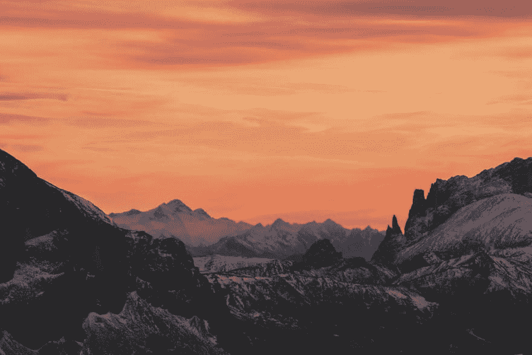
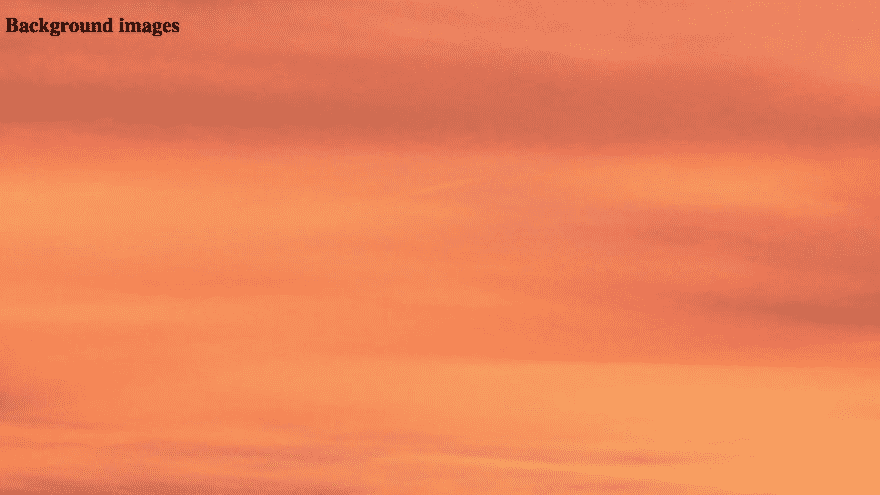
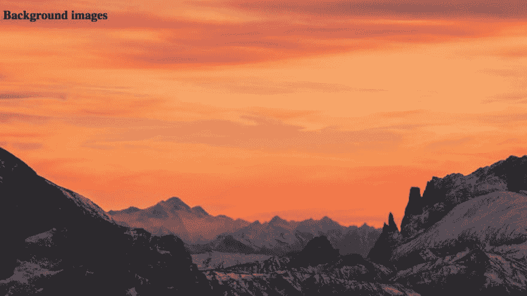
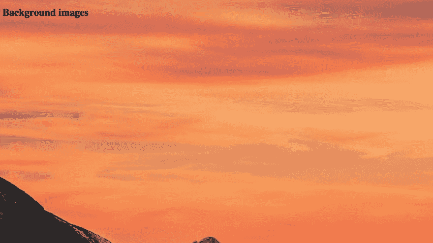
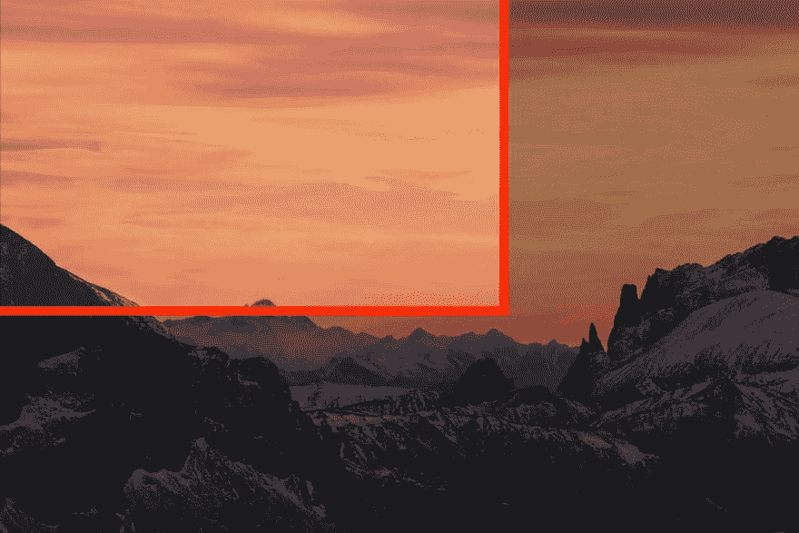
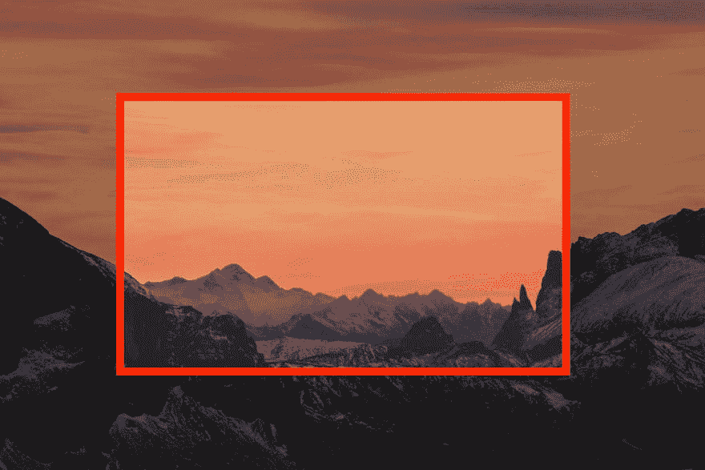
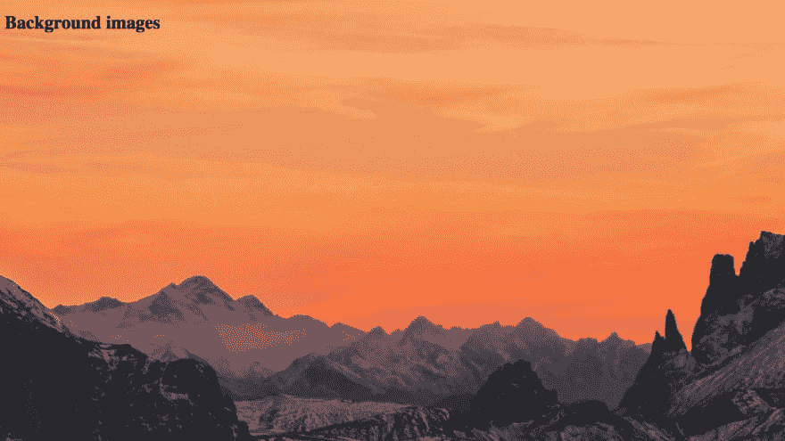
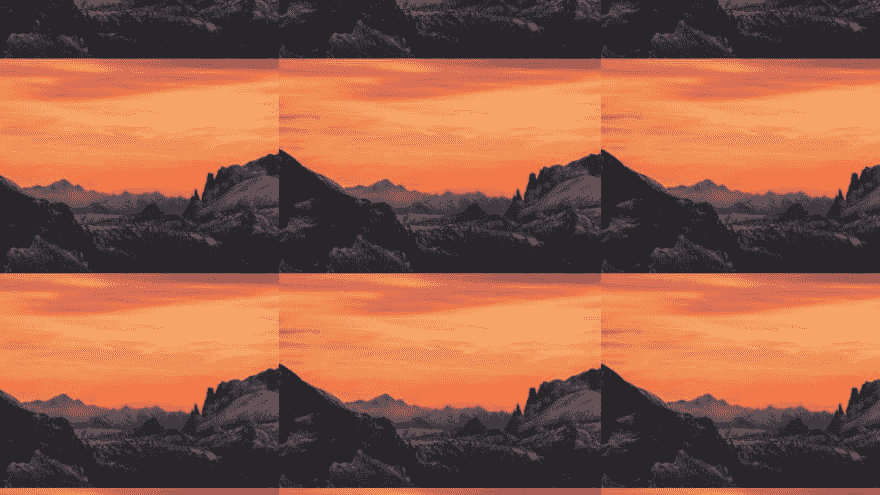
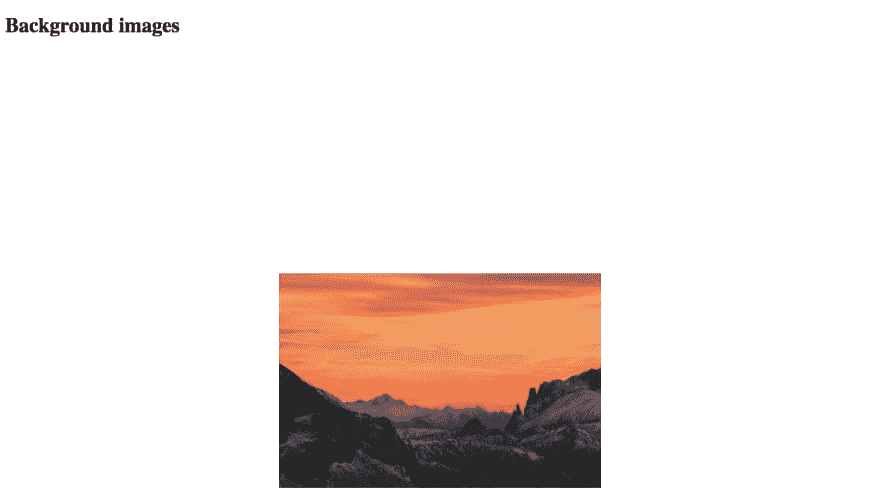
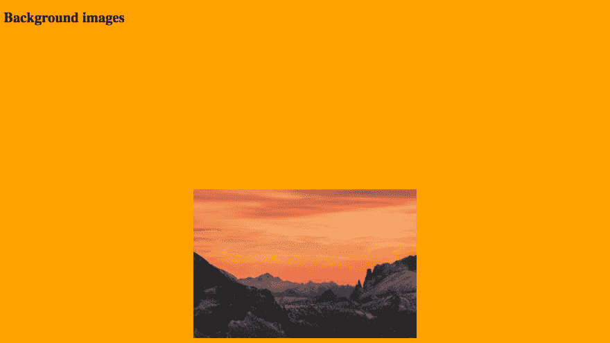

# 使用 CSS 的背景图像操作

> 原文:[https://dev . to/code the web/background-image-manipulation-using-CSS-akg](https://dev.to/codetheweb/background-image-manipulation-using-css-akg)

[T2】](https://res.cloudinary.com/practicaldev/image/fetch/s--eKEmjCMq--/c_limit%2Cf_auto%2Cfl_progressive%2Cq_auto%2Cw_880/https://codetheweb.blog/assets/img/posts/css-advanced-background-images/cover.jpg)

## 入门

我认为最好是边做边学，所以我强烈建议在我的所有教程中遵循。按照下面的步骤，首先创建一个新的项目文件夹，其中包含`index.html`和`style.css`文件。将以下代码添加到您的`index.html` :

```
<!DOCTYPE html>
<html>
    <head>
        <title>CSS advanced background images DEMO</title>
        <link rel="stylesheet" href="style.css">
    </head>
    <body>
        <h1>Background images</h1>
    </body>
</html> 
```

<svg width="20px" height="20px" viewBox="0 0 24 24" class="highlight-action crayons-icon highlight-action--fullscreen-on"><title>Enter fullscreen mode</title></svg> <svg width="20px" height="20px" viewBox="0 0 24 24" class="highlight-action crayons-icon highlight-action--fullscreen-off"><title>Exit fullscreen mode</title></svg>

我将在本文的演示中使用的图片如下: [](https://res.cloudinary.com/practicaldev/image/fetch/s--eKEmjCMq--/c_limit%2Cf_auto%2Cfl_progressive%2Cq_auto%2Cw_880/https://codetheweb.blog/assets/img/posts/css-advanced-background-images/cover.jpg)

并在您的`style.css`文件中的`body`元素中添加一个`background-image`:

```
body {
    height: 150vh;
    background-image: url('https://codetheweb.blog/assets/img/posts/css-advanced-background-images/mountains.jpg');
} 
```

<svg width="20px" height="20px" viewBox="0 0 24 24" class="highlight-action crayons-icon highlight-action--fullscreen-on"><title>Enter fullscreen mode</title></svg> <svg width="20px" height="20px" viewBox="0 0 24 24" class="highlight-action crayons-icon highlight-action--fullscreen-off"><title>Exit fullscreen mode</title></svg>

如果你不知道如何使用`background-image`属性，[先检查这里](https://codetheweb.blog/2017/11/15/basic-css-properties/#the-background-image-property) -我会在这里等你回来！

设置`body`高度的原因是为了让我们可以在页面上滚动——稍后你会在教程中看到为什么这是相关的。`150vh`基本上是指[为视口高度](https://codetheweb.blog/newsletter)的 150%。

当您在浏览器中打开 HTML 文件时，它应该是这样的:

[T2】](https://res.cloudinary.com/practicaldev/image/fetch/s--a5LXRXxG--/c_limit%2Cf_auto%2Cfl_progressive%2Cq_auto%2Cw_880/https://codetheweb.blog/assets/img/posts/css-advanced-background-images/base-code.png)

如果你的看起来是正确的，让我们继续！

## 背景-图像相关属性

除了`background-image`属性，还有许多属性可以修改`background-image`如何被*显示*:

*   `background-size`
*   `background-position`
*   `background-repeat`
*   `background-size`

在本文中，我将逐一介绍每一个…让我们开始吧！

## 背景-尺寸

还记得我们最初的形象吗？ [](https://res.cloudinary.com/practicaldev/image/fetch/s--eKEmjCMq--/c_limit%2Cf_auto%2Cfl_progressive%2Cq_auto%2Cw_880/https://codetheweb.blog/assets/img/posts/css-advanced-background-images/cover.jpg) 然而在我们的页面上，却是超级放大的天空！ [](https://res.cloudinary.com/practicaldev/image/fetch/s--a5LXRXxG--/c_limit%2Cf_auto%2Cfl_progressive%2Cq_auto%2Cw_880/https://codetheweb.blog/assets/img/posts/css-advanced-background-images/base-code.png) 这是因为默认情况下，`background-image`被设置为图像的实际尺寸(`4272px`由`2848px`)

我们来解决这个问题吧！

`background-size`属性可以设置为`cover`、`contain`或任何单位值(如`1500px`)。

`background-size: cover`设置图像大小，使其覆盖整个元素(在本例中为`body`)。

`background-size: contain`确保所有的`background-image`都显示在元素中。

在这种情况下，我们将希望使用`cover` -这样我们可以看到图像的大部分，但它将覆盖整个屏幕！来试试吧:

```
body {
    height: 150vh;
    background-image: url('https://codetheweb.blog/assets/img/posts/css-advanced-background-images/mountains.jpg');
    background-size: cover; /* Add this line */
} 
```

<svg width="20px" height="20px" viewBox="0 0 24 24" class="highlight-action crayons-icon highlight-action--fullscreen-on"><title>Enter fullscreen mode</title></svg> <svg width="20px" height="20px" viewBox="0 0 24 24" class="highlight-action crayons-icon highlight-action--fullscreen-off"><title>Exit fullscreen mode</title></svg>

结果: [](https://res.cloudinary.com/practicaldev/image/fetch/s--l8x_EOck--/c_limit%2Cf_auto%2Cfl_progressive%2Cq_auto%2Cw_880/https://codetheweb.blog/assets/img/posts/css-advanced-background-images/bg-size-cover.png) 如果你向下滚动，你可以看到更多的图像——这是因为它覆盖了`body`元素(它是视窗高度的 150%)，而不是实际的屏幕。

您也可以将`background-size`设置为一个实际值——将您的 CSS 更改为:

```
body {
    height: 150vh;
    background-image: url('https://codetheweb.blog/assets/img/posts/css-advanced-background-images/mountains.jpg');
    background-size: 2000px; /* Change this line from cover */
} 
```

<svg width="20px" height="20px" viewBox="0 0 24 24" class="highlight-action crayons-icon highlight-action--fullscreen-on"><title>Enter fullscreen mode</title></svg> <svg width="20px" height="20px" viewBox="0 0 24 24" class="highlight-action crayons-icon highlight-action--fullscreen-off"><title>Exit fullscreen mode</title></svg>

结果: [](https://res.cloudinary.com/practicaldev/image/fetch/s--hSgCjE6f--/c_limit%2Cf_auto%2Cfl_progressive%2Cq_auto%2Cw_880/https://codetheweb.blog/assets/img/posts/css-advanced-background-images/bg-size-2000px.png) 再次向下滚动，你会看到更多的图像。

## 背景-附件:固定

`background-attachment: fixed;`用于在向下滚动时使图像停留在同一位置。它有点像 [`position: fixed`](https://codetheweb.blog/2017/11/21/css-position-property/#position-fixed) 但为背景图片。让我们试一试，看看它能做什么:

```
body {
    height: 150vh;
    background-image: url('https://codetheweb.blog/assets/img/posts/css-advanced-background-images/mountains.jpg');
    background-size: 2000px;
    background-attachment: fixed; /* Add this line */
} 
```

<svg width="20px" height="20px" viewBox="0 0 24 24" class="highlight-action crayons-icon highlight-action--fullscreen-on"><title>Enter fullscreen mode</title></svg> <svg width="20px" height="20px" viewBox="0 0 24 24" class="highlight-action crayons-icon highlight-action--fullscreen-off"><title>Exit fullscreen mode</title></svg>

现在当你向下滚动页面时，`background-image`不会随之移动: [](https://res.cloudinary.com/practicaldev/image/fetch/s--HQu7DAuY--/c_limit%2Cf_auto%2Cfl_progressive%2Cq_66%2Cw_880/https://codetheweb.blog/assets/img/posts/css-advanced-background-images/bg-attachment-fixed.gif)

> **重要提示:**在继续之前，删除`background-attachment: fixed`行，以便我们可以关注其他属性。您的 CSS 应该如下所示:
> 
> ```
> body {
> height: 150vh;
> background-image: url('https://codetheweb.blog/assets/img/posts/css-advanced-background-images/mountains.jpg');
> background-size: 2000px;
> } 
> ```

## 背景-位置

正如你所看到的，没有显示整个图像，但是显示的是哪一部分呢？【T2

如果我们想显示图像的中心呢？[T2】](https://res.cloudinary.com/practicaldev/image/fetch/s--tbW9GT8C--/c_limit%2Cf_auto%2Cfl_progressive%2Cq_auto%2Cw_880/https://codetheweb.blog/assets/img/posts/css-advanced-background-images/center-center-highlight.jpg)

这就是我们可以使用`background-position`属性的地方:

```
body {
    height: 150vh;
    background-image: url('https://codetheweb.blog/assets/img/posts/css-advanced-background-images/mountains.jpg');
    background-size: 2000px;
    background-position-x: center; /* Add this line */
    background-position-y: center; /* Add this line */
} 
```

<svg width="20px" height="20px" viewBox="0 0 24 24" class="highlight-action crayons-icon highlight-action--fullscreen-on"><title>Enter fullscreen mode</title></svg> <svg width="20px" height="20px" viewBox="0 0 24 24" class="highlight-action crayons-icon highlight-action--fullscreen-off"><title>Exit fullscreen mode</title></svg>

结果: [](https://res.cloudinary.com/practicaldev/image/fetch/s--ydWOkJWe--/c_limit%2Cf_auto%2Cfl_progressive%2Cq_auto%2Cw_880/https://codetheweb.blog/assets/img/posts/css-advanced-background-images/position-center-center.png)

`background-position-x`和`background-position-y`用于水平(`x`)和垂直(`y`)定位图像。

`background-position-x`的可接受值为:

*   `left`
*   `center`
*   `right`

对于`background-position-y`:

*   `top`
*   `center`
*   `bottom`

另外，两者都接受数值如`200px`。它们从右上角开始计算。例如，`500px`的一个`background-position-x`将是从左边开始的`500px`，而`300px`的一个`background-position-y`将是从上面开始的`300px`。

目前，让我们把两者都留为`center`……(尽管如果你想的话，你可以随便玩玩😉)

## 背景-重复

你知道那些瓷砖背景吗？通常这看起来很丑，但是可以很好地处理重复的纹理。在这篇文章中，我们将使用我们的挂载图像，因此平铺更加明显。让我们看看平铺图像时会发生什么:

```
body {
    height: 150vh;
    background-image: url('https://codetheweb.blog/assets/img/posts/css-advanced-background-images/mountains.jpg');
    background-size: 500px; /* Change this line from 2000px, so that we can see it tiling */
    background-position-x: center;
    background-position-y: center;
} 
```

<svg width="20px" height="20px" viewBox="0 0 24 24" class="highlight-action crayons-icon highlight-action--fullscreen-on"><title>Enter fullscreen mode</title></svg> <svg width="20px" height="20px" viewBox="0 0 24 24" class="highlight-action crayons-icon highlight-action--fullscreen-off"><title>Exit fullscreen mode</title></svg>

结果: [](https://res.cloudinary.com/practicaldev/image/fetch/s--cKa9P_AY--/c_limit%2Cf_auto%2Cfl_progressive%2Cq_auto%2Cw_880/https://codetheweb.blog/assets/img/posts/css-advanced-background-images/tiled.png)

等等，什么？但这是敲竹杠！我们连`background-repeat`都没用！

这是因为默认情况下背景已经打开`background-repeat`。之前没有发生的唯一原因是因为我们的图像太大了，不需要平铺。

`background-repeat`属性有两个主要值:`repeat`和`no-repeat`。就这么简单！

默认情况下`background-repeat`被设置为`repeat`，所以你通常不需要使用它。但是，如果要关闭平铺呢？让我们来试试:

```
body {
    height: 150vh;
    background-image: url('https://codetheweb.blog/assets/img/posts/css-advanced-background-images/mountains.jpg');
    background-size: 500px;
    background-position-x: center;
    background-position-y: center;
    background-repeat: no-repeat; /* Add this line */
} 
```

<svg width="20px" height="20px" viewBox="0 0 24 24" class="highlight-action crayons-icon highlight-action--fullscreen-on"><title>Enter fullscreen mode</title></svg> <svg width="20px" height="20px" viewBox="0 0 24 24" class="highlight-action crayons-icon highlight-action--fullscreen-off"><title>Exit fullscreen mode</title></svg>

结果: [](https://res.cloudinary.com/practicaldev/image/fetch/s--6XKjtAqD--/c_limit%2Cf_auto%2Cfl_progressive%2Cq_auto%2Cw_880/https://codetheweb.blog/assets/img/posts/css-advanced-background-images/no-repeat.png) (图像之所以在屏幕下方附近是因为身高 150%，记得吗？)

我们走吧！CSS 中的`background-repeat`属性就是这样工作的！

## 多个背景

你会注意到，现在我们的图像周围是丑陋的白色。比如说，如果我们想把它做成橙色呢？信不信由你，你实际上可以在 CSS 中指定多个背景！

第一个背景将被放在屏幕上，其他背景将被叠加在上面。

所以，我们来试试吧！记住，`background-color: orange`排在第一位，因为我们希望它*在*下面。图片:

```
body {
    height: 150vh;
    background-color: orange; /* Add this line */
    background-image: url('https://codetheweb.blog/assets/img/posts/css-advanced-background-images/mountains.jpg');
    background-size: 500px;
    background-position-x: center;
    background-position-y: center;
    background-repeat: no-repeat; /* Add this line */
} 
```

<svg width="20px" height="20px" viewBox="0 0 24 24" class="highlight-action crayons-icon highlight-action--fullscreen-on"><title>Enter fullscreen mode</title></svg> <svg width="20px" height="20px" viewBox="0 0 24 24" class="highlight-action crayons-icon highlight-action--fullscreen-off"><title>Exit fullscreen mode</title></svg>

结果: [](https://res.cloudinary.com/practicaldev/image/fetch/s--M-ok_6UY--/c_limit%2Cf_auto%2Cfl_progressive%2Cq_auto%2Cw_880/https://codetheweb.blog/assets/img/posts/css-advanced-background-images/color-and-img.png)

## 结论

好了，我们走吧！你刚刚学了一些可以用背景图片做的很酷的东西，这些属性经常会派上用场。如果你有任何反馈或需要任何帮助，请在评论中联系我。

另外，如果你喜欢这篇文章，我希望你能分享它或者注册简讯。写一个博客需要很多时间和精力(25，000 字，还在计算中)，如果你写了一个(或者两个都写了)我会非常感激。)的那些东西。

玩得开心点，下次再见，我会谈到 CSS 中不同类型的单元以及它们的作用——比你想象的要多得多！

> ### 想要更多这样的帖子？[注册我的简讯](https://codetheweb.blog/newsletter/)。
> 
> 我一直在努力学习这些教程，但是到目前为止还没有赚到任何钱，所以如果你注册的话，我会非常感激；)

这篇文章最初发表在 [Code The Web](https://codetheweb.blog) 上，这是一个有趣且易于理解的博客，帮助你学习 Web 开发🚀
学:[HTML](https://codetheweb.blog/learn/html/)|[CSS](https://codetheweb.blog/learn/css/)|[JavaScript](https://codetheweb.blog/learn/javascript/)