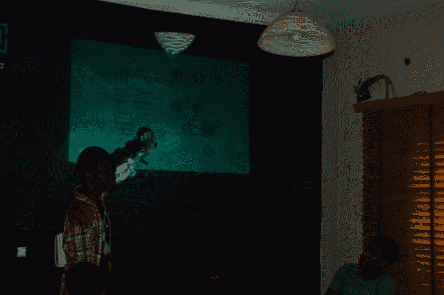
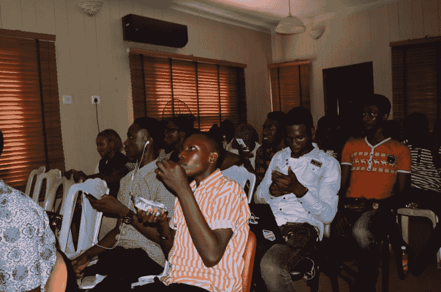
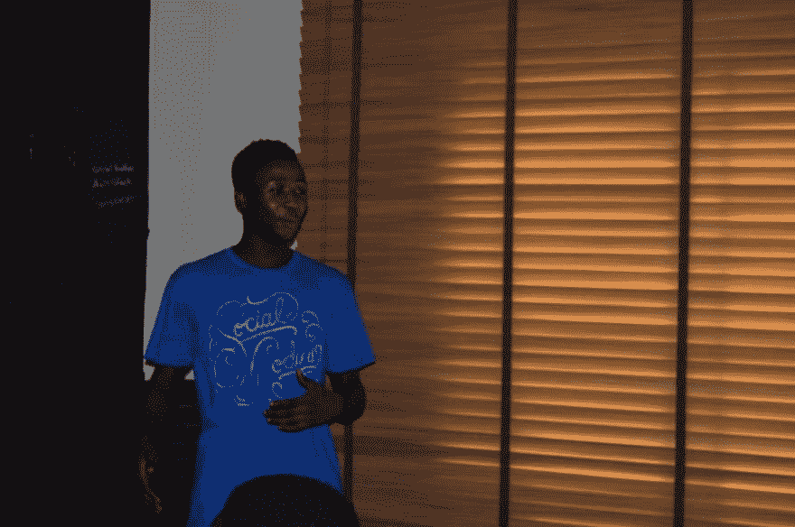
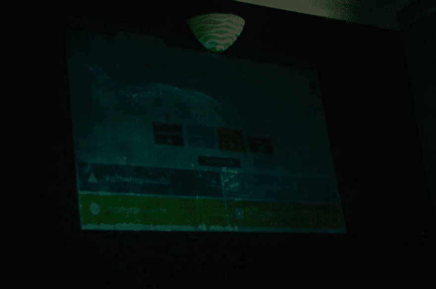
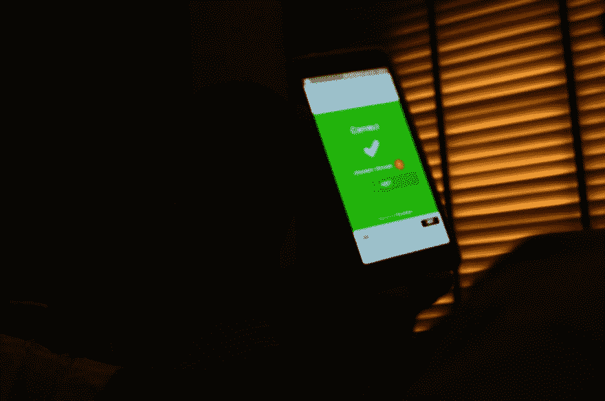
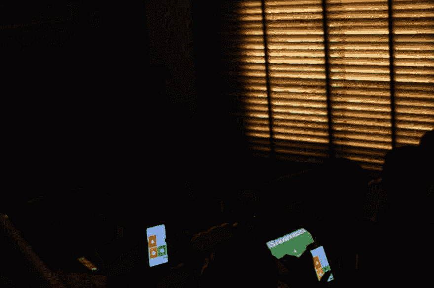
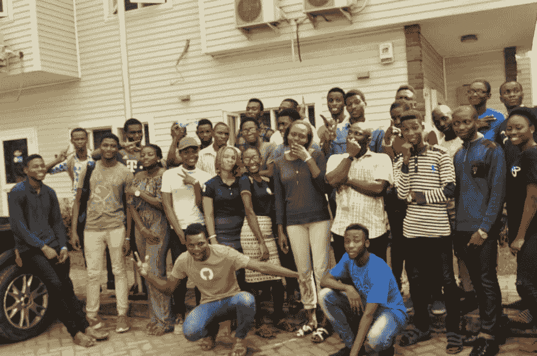
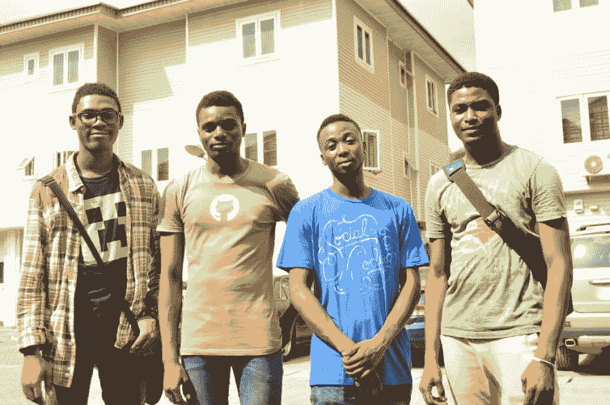

# 积极的校园大使计划如何唤醒了我们学校的技术社区。

> 原文:[https://dev . to/coder _ bl vck/how-ingress-campus-ambassadors-program-wakeed-the-tech-community-in-my-school-4b 65](https://dev.to/coder_blvck/how-ingressive-campus-ambassadors-program-awoke-the-tech-community-in-my-school-4b65)

大家好，

所以我决定最终说出我的故事！！！

<figure> 

<figcaption>我知道没错！！！！</figcaption>

</figure>

因此，在 2017 年的最后几个月，我和我的一些伙伴取得了一项重大成就，我们被 [Ingressive](http://ingressive.co) 选为他们的校园大使之一。这是他们在尼日利亚建立科技生态系统的许多项目的一部分。

那么我们就去看看这个活动是在哪里，如何成功进行的。

不用麻烦了，我不会给你讲我的生活故事让你厌烦，我宁愿开门见山。

[T2】](https://res.cloudinary.com/practicaldev/image/fetch/s--7YIIv6FX--/c_limit%2Cf_auto%2Cfl_progressive%2Cq_auto%2Cw_880/https://cdn-images-1.medium.com/max/225/1%2Ayg3adJVhxdgTCvUG13uFeA.jpeg)

活动安排在上午 10 点，所以我早上 7 点就离开家去了会场，这么早起床并不容易，但我必须为社区做这件事。我过去把椅子拿到会场，还有其他电子设备。由于整个准备工作，我们迟到了一个小时。

上午 11 点整，安德拉公司的软件工程师 Rasheed 为我们做了开场演讲。他带我们去了“Git 是什么？？?"。

<figure> 

<figcaption>拉希德正在准备他的演讲</figcaption>

</figure>

他向与会者讲授了 git 的基础知识以及版本控制软件的工作原理。

<figure> 

<figcaption>拉希德在开庭。</figcaption>

</figure>

在他的会议结束时，观众对 git 的强大功能以及他们如何使用它来加快工作流程感到惊讶。

> 接下来在演讲台上的是 Akinjide Bankole，他也是一名来自安德拉的软件工程师，我想我们那天很幸运有安德拉人！！

这个人参加了一个关于使用 git 推、提交和拉的研讨会。

他吸引观众使用 g it，在他们的机器上安装 git 和所有基本命令。

在会议结束时，他给所有回答他问题的人发了巧克力。

在两次演讲后，我们休息了一会儿，第七项(菜单，菜单)开始了。

<figure> 

<figcaption>这家伙让他们恼火 oo！！</figcaption>

</figure>

休息过后，(尽量让这篇文章简短)，我 [( **谢德拉克·阿金塔约**](https://twitter.com/sheddy_nathan) )带着他们在 [GitHub](https://medium.com/u/8df3bf3c40ae) 上踏上了一段激动人心的开源之旅。

> 你不必是一个软件开发人员/工程师来为开源做贡献>开源是一种新的调味汁——阿德瓦勒·阿巴蒂·♠。

<figure> 

<figcaption>谢德拉克在开庭(芒不辣！！).</figcaption>

</figure>

在我的会议之后，听众能够理解为开源做贡献的重要性。

我们去了有趣的地方，玩了 **KAHOOT！**我们有两组问题，我们从每组中选出前两名，并给他们奖品和贴纸！。

[T2】](https://res.cloudinary.com/practicaldev/image/fetch/s--0rLzTf5J--/c_limit%2Cf_auto%2Cfl_progressive%2Cq_auto%2Cw_880/https://cdn-images-1.medium.com/max/1024/1%2AR6z4TmY1qYGNkB7fUaqi0A.jpeg)

[T2】](https://res.cloudinary.com/practicaldev/image/fetch/s--UXh1jiPY--/c_limit%2Cf_auto%2Cfl_progressive%2Cq_auto%2Cw_880/https://cdn-images-1.medium.com/max/1024/1%2AHKsLvFVSUT8d19ERkvMxog.jpeg)

<figure> 

<figcaption>卡霍特被直播了！。</figcaption>

</figure>

最后，每个人都玩得很开心，所以在 Kahoot 会议之后，我们以合影结束了活动。查看它们:

[T2】](https://res.cloudinary.com/practicaldev/image/fetch/s--PI_p1Bqd--/c_limit%2Cf_auto%2Cfl_progressive%2Cq_auto%2Cw_880/https://cdn-images-1.medium.com/max/1024/1%2AdYijm7Q26R7XfADhvO4k4w.jpeg)

[T2】](https://res.cloudinary.com/practicaldev/image/fetch/s---lTx-XVA--/c_limit%2Cf_auto%2Cfl_progressive%2Cq_auto%2Cw_880/https://cdn-images-1.medium.com/max/1024/1%2AOlzm-238qJxTOjFkLYJs9g.jpeg)

我只想代表尼日利亚拉各斯亚巴理工学院的所有校园大使对你们的支持表示衷心的感谢。

我还想感谢塞贡·奥卢米德、T2、拉希德、阿金吉德·班科尔以及所有参与并为这次活动的成功付出一切的人。

更多这样的活动将会到来！

要获取您的照片，请单击下面的链接

进入生态系统:从 Git 到 Github。

* * *