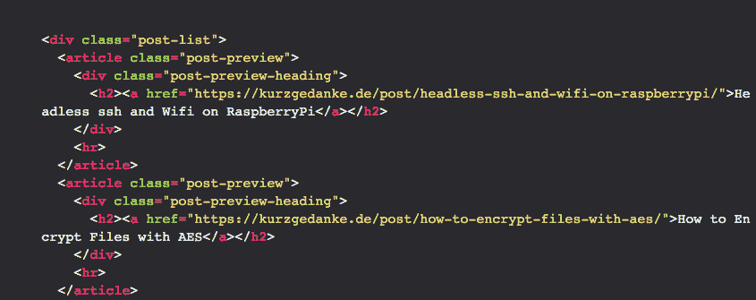

# 初学者:主要使用纯 Python 的 Web 抓取

> 原文:[https://dev . to/kurzgedanke/beginner-web-scraping-in-morely-pure-python-6d 0](https://dev.to/kurzgedanke/beginner-web-scraping-in-mostly-pure-python-6d0)

[T2】](https://res.cloudinary.com/practicaldev/image/fetch/s--oX9e1Z8V--/c_limit%2Cf_auto%2Cfl_progressive%2Cq_auto%2Cw_880/https://thepracticaldev.s3.amazonaws.com/i/6j22l3ifl2b2t82o80ya.png)

我喜欢网络抓取，尤其是在开始学习如何编码的时候。这是相当容易的，你可以学到很多关于如何处理数据，你会得到立竿见影的效果！

但是我看到很多教程变得过于复杂，而且主要集中在一个叫做 Beautiful Soup 的框架上。这是一个奇妙而强大的框架，但是大多数时候——尤其是对于初学者来说——它完全超出了极限。老实说，我们不想索引一个完整的网站，大多数时候我们只是想下载图片或要求几个值。

用一个神奇的词`Regular Expressions`就可以轻松做到这一点。

> 好吧，好吧，我听到你说“什么？正则表达式容易吗？WTF？”
> 
> 是的，你没有错，正则表达式没那么容易。就我个人而言，我发现学习正则表达式比学习只有一个用例的任意框架要容易得多。

### 什么是正则表达式？

正则表达式的概念出现在 20 世纪 50 年代。在理论计算机科学中，它是定义搜索模式的一系列字符。([维基百科](https://en.wikipedia.org/wiki/Regular_expression))

那么，正则表达式是什么样子的呢？

想象我们有一个字符串:

`Hi, I'm KurzGedanke and www.kurzgedanke.de is my website.`

现在，我们希望获得特定域名的网站。我们可以假设每个输入看起来都像`www.websiteName.tdl`。

与正则表达式相匹配的一个解决方案可能是这样的:

```
www\.(.*)\.([a-zA-Z]*)\s 
```

*   `www`正如您可能会怀疑的，这与`www`完全匹配
*   `\.`匹配`www`后的`.`。因为 dot 在 RegEx 中有一个函数，所以我们需要用`\`对它进行转义。
*   `(.*)``.`匹配任何单个字符。不管是 T2 还是拉环，它都会与之相配。除了换行符。使用星号我们可以匹配表达式前面的零个或多个字符。在这种情况下是零个或多个任意单个字符。括号`()`将匹配放在一个容易访问的组中。
*   `\.`此点与顶级域名前的点匹配。
*   `([a-zA-Z]*)`这里我们有顶级域名，它再次与`()`放在一个组中。`[]`用于匹配单个字符。在这种情况下，字符在低位`a`到低位`z`或大写`A`到大写`Z`之间。为了获得多个字符，使用了`*`。【<sup>这个</sup>很搞笑，是个经典错误。我没有完全考虑清楚。一个 URL 当然可以包含一个破折号`-`，我错过了。
*   `\s`匹配空白。在这种情况下，它用于结束正则表达式。

> 老实说，我认为有更聪明的方法来做到这一点，但我发现这种方法很容易看到发生了什么，不会被 50 个字符长的正则表达式字符串淹没。

为了学习正则表达式，我使用了这样一个交互式教程:[regexone.com](https://www.regexone.com)。这不是唯一的一个，你可以看看是否有适合你的。

另一个很好的建议是像 regex101.com 这样的网站。您可以在其中粘贴文本并直接编写您的正则表达式，同时您可以实时看到哪些部分是匹配的..我每次写正则表达式的时候都会用到它。

### 让我们写一些 python 吧

我们可以利用这些知识来废弃网站。和...老实说...我将依赖一个名为 [Requests: HTTP for Humas](http://docs.python-requests.org/en/master/) 的模块。但是这个模块很容易处理，而且是 python 化的——有时候我觉得它比 python 本身更 python 化。

我们的目标是废弃我的网站，并获得我的登陆页面的每篇文章的标题，以及它的链接。

HTML 的简化版本如下所示:

```
<div class="post-list">
  <article class="post-preview">
    <div class="post-preview-heading">
      <h2><a href="https://kurzgedanke.de/post/headless-ssh-and-wifi-on-raspberrypi/">Headless ssh and Wifi on RaspberryPi</a></h2>
    </div>
    <hr>
  </article>
  <article class="post-preview">
    <div class="post-preview-heading">
      <h2><a href="https://kurzgedanke.de/post/how-to-encrypt-files-with-aes/">How to Encrypt Files with AES</a></h2>
    </div>
    <hr>
  </article>
  <article class="post-preview">
    <div class="post-preview-heading">
      <h2><a href="https://kurzgedanke.de/post/problems-with-flask-and-pycharm/">Problems with Flask and PyCharm</a></h2>
    </div>
    <hr>
  </article>
  <article class="post-preview">
    <div class="post-preview-heading">
      <h2><a href="https://kurzgedanke.de/post/decentraland-hot-to-mine-on-a-mac/">Decentraland | How to Mine on a Mac</a></h2>
    </div>
    <hr>
  </article>
  <article class="post-preview">
    <div class="post-preview-heading">
      <h2><a href="https://kurzgedanke.de/post/welcome/">Welcome</a></h2>
    </div>
    <hr>
  </article>
</div> 
```

那么，我们在这个 HTML 中寻找什么呢？让我们看看，我们需要所有帖子的标题和 url。我们有几篇关于课堂的文章。下面我们有一个`h2`标题在一个叫做`post-preview-heading`的`div`里面。`h2`包含一个组装链接的`a href`。可能是好去！每个`h2`都有相同的结构，幸运的是，这是整面唯一一个有这种结构的`h2`。所以我们可以假设，像上面一样，每个输入看起来完全像这样:

```
<h2><a href="linkToPostTitle">postTitle</a></h2> 
```

在其他网站上，`h2`或`a href`会有一个专门的类或 id

```
<h2 class="post-preview-title-header"></h2> 
```

这甚至更好，因为我们将有一个持久的模式，可用于匹配。

现在让我们编写正则表达式来搜索。

```
<h2><a href=\"https:\/\/kurzgedanke\.de\/post\/ 
```

这只是代表了`<h2><a href="https://kurzgedanke.de/post/`字符串。同样，反斜杠以及`double quotes`必须被转义。

> 注意:在 python 代码中使用单引号时，可以省略双引号的转义。但是转义双引号总是安全的选择。

现在剩下的:

```
<h2><a href="https:\/\/kurzgedanke\.de\/post\/(.*)\/">(.*)<\/a><\/h2> 
```

*   `(.*)`选择从`post/`到`/">`的所有内容，并放入一个组中。
*   2.`(.*)`匹配文章标题
*   `<\/a><\/h2>`关闭`</a>`标签和`</h2>`标签。

现在我们已经写了正则表达式，让我们来看看 python 代码。

```
import re
import requests

r = requests.get('https://kurzgedanke.de/')

regex = r'<h2><a href="https:\/\/kurzgedanke\.de\/post\/(.*)\/">(.*)<\/a><\/h2>'
titleURL = re.findall(regex, r.text)

for urlAndTitle in titleURL:
    print(f'Title:\t {urlAndTitle[1]}')
    print(f'URL:\t https://kurzgedanke.de/post/{urlAndTitle[0]}/')
    print('-------------------------------') 
```

*   `import re`从标准库中导入正则表达式模块
*   `import requests`从 [Kenneth Reitz](https://www.kennethreitz.org) 导入请求模块。
*   `r = requests.get('https://kurzgedanke.de/')`向 *kurzgedanke.de* 发出 HTTP 请求，并将数据保存在 requests 对象中。
*   `regex = r'...'`用正则表达式声明一个变量作为值。`r'...'`告诉 python 这个字符串是正则表达式。
*   `titleURL = re.findall(regex, r.text)`我们使用 regex 模块，通过使用我们的 regex 变量和包含我们的 http 请求的 html 的`r.text`来查找所有匹配。找到所有东西后，这将是一个分配给`titleURL`的所有匹配的列表。
*   `for urlAndTitle in titleURL:`我们可以很容易地遍历列表，用数组符号访问不同的匹配，因为我们用`()`在正则表达式中将它们分组。

当您运行该脚本时，它应该是这样的:

```
Title:   Headless ssh and Wifi on RaspberryPi
URL:     https://kurzgedanke.de/post/headless-ssh-and-wifi-on-raspberrypi/
-------------------------------
Title:   How to Encrypt Files with AES
URL:     https://kurzgedanke.de/post/how-to-encrypt-files-with-aes/
-------------------------------
Title:   Problems with Flask and PyCharm
URL:     https://kurzgedanke.de/post/problems-with-flask-and-pycharm/
-------------------------------
Title:   Decentraland | How to Mine on a Mac
URL:     https://kurzgedanke.de/post/decentraland-hot-to-mine-on-a-mac/
-------------------------------
Title:   Welcome
URL:     https://kurzgedanke.de/post/welcome/
------------------------------- 
```

我希望你觉得这篇小文章很有用，并学到了一些东西。

如果您有任何问题或意见，请留下评论，在 twitter 上联系我或写邮件。

你也可以在 [kurzgedanke.de](https://kurzgedanke.de/post/web-scraping-in-mostly-pure-python/) 上阅读这篇文章。