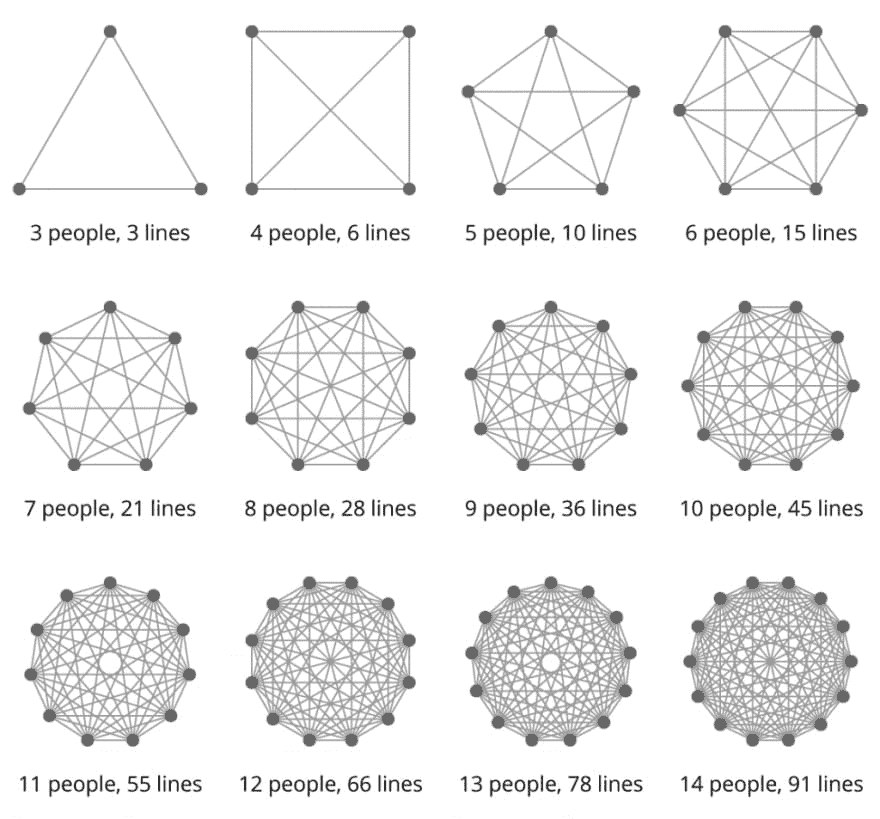

# 微服务 101

> 原文:[https://dev.to/ashenmaster/microservices-101-a4a](https://dev.to/ashenmaster/microservices-101-a4a)

[T2】](https://res.cloudinary.com/practicaldev/image/fetch/s--vtPUG-F_--/c_limit%2Cf_auto%2Cfl_progressive%2Cq_auto%2Cw_880/https://images.unsplash.com/photo-1468591617258-18dbe3bd69f1%3Fixlib%3Drb-0.3.5%26q%3D80%26fm%3Djpg%26crop%3Dentropy%26cs%3Dtinysrgb%26w%3D1080%26fit%3Dmax%26s%3Df725bf36a60ad264b0d16503e49d6c9d)

正如我所承诺的，这是关于微服务及其优缺点的第一篇文章。

首先，让我们定义一些在关于微服务的讨论中经常出现的关键术语。

独石:不是经典科幻电影中的巨型柱子，而是独石应用。这是指应用程序的所有功能都在一个进程中。它通常保存在一个单独的回购中，但是随着 monorepos 的日益流行，这种实施方法变得越来越少。我将在下面讨论独石的一些优点。

[T2】](https://res.cloudinary.com/practicaldev/image/fetch/s--5HcCwUuf--/c_limit%2Cf_auto%2Cfl_progressive%2Cq_66%2Cw_880/http://www.chrisgray.tech/conteimg/2017/11/PastDismalKookaburra-size_restricted.gif)

**微服务**:当一个 app 的功能被分解成多个彼此独立运行的进程。通常在不同的回购中实现，尽管 monorepos 与 monolith 应用程序一样，正在以此改变景观。

因此，随着定义的分解，让我们深入了解不同架构类型的一些优势。

## 巨石

在某些情况下，整体架构实际上比微服务有很多优势。monolith 的主要用例是 MVP 产品，这是因为它易于部署，也易于设置开发环境。这意味着您的开发团队可以更快地达到速度，并更快地开始生产。监控应用程序也更容易，因此，调试应用程序的任何问题都容易得多。

这并不是说没有缺点。随着时间的推移和你的应用程序的增长，你可能会发现你的团队规模变得越来越大，一旦这种情况开始发生，有效地维护结构和沟通渠道就变得更具挑战性，见下图，看看随着你的团队规模的扩大，产生了多少更多的沟通渠道。

[T2】](https://res.cloudinary.com/practicaldev/image/fetch/s--IsUJFejb--/c_limit%2Cf_auto%2Cfl_progressive%2Cq_auto%2Cw_880/http://www.chrisgray.tech/conteimg/2017/11/lines-of-communication-stackoverflow-1024x953.png)

随着应用程序的大小和功能的增加，部署变得更加困难，最终，即使很小的代码更改也有可能变得难以管理。扩展还会增加成本和复杂性，因为您需要扩展整个应用程序，而不仅仅是获得高需求的一小部分功能。

## 微服务

现在谈谈微服务。一旦你开始看到上面列出的单片系统的一些缺点，那么是时候考虑转向微服务架构了。微服务的一些优势详述如下。

由于每项功能都被分解成一个单独的过程，这意味着您可以拥有更小的整体范围。这意味着每一个功能单元都可以独立地、彼此隔离地设计、构建、测试和部署。这样做的最终结果是，您的构建周期应该能够加快，并且可以更频繁地部署特性。

您还可以更轻松地扩展功能，从而降低运行成本，而不是不管使用情况如何都一次性扩展所有功能，您可以将其设置为仅扩展应用中面临更高使用需求的部分。此外，由于采用了分离式架构，您的应用程序可以拥有更高的可靠性，如果一项服务出现故障，应用程序可以绕过它继续运行，而不会完全停机。

微服务不是没有缺点，因为分布式架构，它可以在许多不同的方面变得更加复杂，不仅仅是开发。调试和监控将变得更加复杂，因为您需要在堆栈中引入日志聚合工具，甚至跟踪数据请求的去向都可能导致失败。由于不断的 API 调用和服务之间的通信，它还可能遭受性能下降。

## 搬家的理由

因此，考虑到上述情况，您为什么应该从整体架构转向微服务架构呢？首先，因为它很有趣，当然会有很多挑战，但是开发的一半乐趣就是克服这些挑战。也就是说，这不应该仅仅是技术上的决定，有很多合理的商业理由来迁移您的架构。

首先，你的团队会小得多，正如你从上面的图表中看到的，当你有一个大的团队时，你潜在的沟通渠道的数量会成倍增加，一个小的团队有助于大大简化任何沟通。较小的团队也将更加专业和高效，因为他们只需要担心自己职能部门内的代码，而不是应用程序内的每个功能。

拥有一个更小的团队也可以让团队围绕业务特征而不是能力来组织。通过围绕功能而不是业务能力进行组织，您可以避免孤立的结构，在这种结构中，代码被“扔过墙”到下一个部门，而没有考虑它将如何影响整个团队。这也意味着团队可以拥有整个生命周期，从发现对客户的好处到代码的最终发布，而不会成为其他功能团队的问题。

其次，新团队成员的入职将变得更快，因为他们将再次只需要担心如何运行他们的单个功能，而不是整个代码库。

最后，你的发布将会更小更频繁。作为 CI/CD 文化的一部分，您应该尽可能频繁地发布尽可能少的代码。这使您能够逐步改进应用程序，并真正交付客户价值，而不是大规模发布最终用户实际上不想要的功能。

## 结论

有很多理由使用微服务，也有很多理由使用整体服务。正如我上面提到的，为你的 MVP 使用 monolith 是非常好的，事实上，我会推荐它，你的设置会更快，最初，你的开发会更顺利，但是一旦你开始遇到上面概述的问题，一定要考虑切换到微服务。

*Lines of communication image 由 Justin Niessner 在堆栈溢出上提供*

*2001:太空漫游 gif 在合理使用下使用，所有权利属于内容创作者*