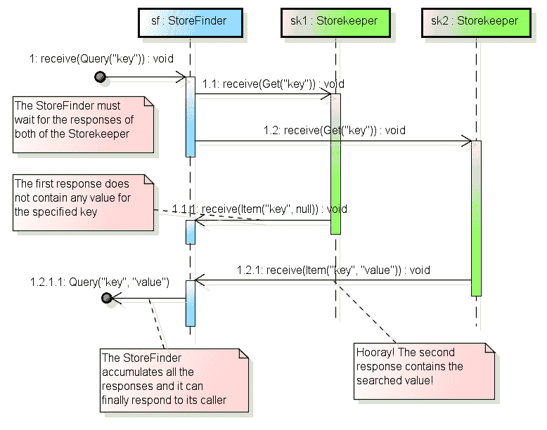
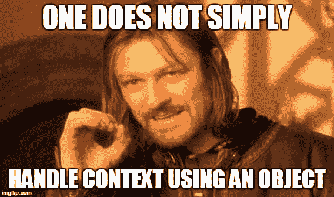

# 一个值得奥斯卡奖的配角

> 原文:[https://dev . to/riccardo _ cardin/a-cameo-the-worth-an-Oscar-944](https://dev.to/riccardo_cardin/a-cameo-that-is-worth-an-oscar-944)

*原贴于:[大泥球](http://rcardin.github.io/)T3】*

在我的开发生涯中，我很少能找到如此适合我的问题的预打包解决方案。设计模式是问题和解决方案的抽象。所以，他们经常需要对特定问题进行某种定制。当我在开发我的 Actorbase 规范的具体实例时，我遇到了 T2 的浮雕图案。它启发了我如何有效利用演员的方法和视野。让我们看看如何和为什么。

## 问题:捕捉上下文

杰米·艾伦在他简短但值得一读的书 [Effective Akka](http://shop.oreilly.com/product/0636920028789.do) 中，用下面的话开始了关于演员模式的章节:

> 异步编程中最困难的任务之一是试图捕获上下文，以便在任务完成时可以准确地表示任务开始时的世界状态。

这正是我们要努力解决的问题。

参与者通常对长期异步流程进行建模，在这种流程中，未来的响应对应于之前发送的一条或多条消息。同时，执行者的执行环境可能会改变。对于参与者，其上下文由参与者本身拥有的所有可变变量表示。一个值得注意的例子是`sender`变量，它存储一个参与者正在处理的当前消息的发送者。

### actor base 中的上下文处理

我们来举个具体的例子。在 Actorbase 中，有两种类型的参与者:`StoreFinder`和`Storekeeper`。类型`StoreFinder`的每个 Actor 代表一个*分布式映射*或者一个*集合*，但是它并不物理地存储键值对。这些信息由`Storekeeper` Actors 存储。因此，每个`StoreFinder`拥有一组分布式的键值对，这意味着拥有一组`Storekeeper`角色来存储信息。

`StoreFinder`可以向其`Storekeeper`发送多种类型的消息，这些消息表示对存储数据的 CRUD 操作。这里的问题是，如果一个`StoreFinder`拥有*n*T3】，为了*找到*哪个值对应于一个*键*(如果有的话)，它必须向每个`Storekeeper`发送 *n* 个`Get("key")`类型的消息。一旦所有的`Storekeeper`都回答了查询消息，`StoreFinder`就可以用请求的*值*来回答它的调用者。

下面的序列图描述了上面的场景。

[T2】](https://res.cloudinary.com/practicaldev/image/fetch/s--Nz8-rBbg--/c_limit%2Cf_auto%2Cfl_progressive%2Cq_auto%2Cw_880/http://rcardin.github.io/assets/2017-11-16/sequence_diagram_sf_sk.png)

`Storekeeper`Actor 的回答数量和他们响应的主体代表了`StoreFinder` Actor 的执行上下文。

## 演员的上下文处理

因此，我们需要确定一个具体的方法来处理参与者的执行上下文。问题是，在发送消息和收到相对响应之间，一个参与者要处理许多其他消息。

### 天真解

我并不无知，我在 Actorbase 中描述的第一个解决方案如下。

```
class StoreFinder(val name: String) extends Actor {
  def receive: Receive = nonEmptyTable(StoreFinderState(Map()))  
  def nonEmptyTable(state: StoreFinderState): Receive = {
    // Query messages from externl actors
    case Query(key, u) =>
      // Route a Get message to each Storekeeper
      broadcastRouter.route(Get(key, u), self)
      context.become(nonEmptyTable(state.addQuery(key, u, sender())))
    // Some other stuff...
    // Responses from Storekeeper
    case res: Item =>
      context.become(nonEmptyTable(state.copy(queries = item(res, state.queries))))   
  }
  // Handling a response from a Storekeeper. Have they all answer? Is there at least
  // a Storekeeper that answer with a value? How can a StoreFinder store the original 
  // sender?
  private def item(response: Item,
                   queries: Map[Long, QueryReq]): Map[Long, QueryReq] = {
    val   Item(key, opt, id) = response
    val QueryReq(actor, responses) = queries(id)
    val newResponses = opt :: responses
    if (newResponses.length == NumberOfPartitions) {
      // Some code to create the message
      actor ! QueryAck(key, item, id)
      queries - id
    } else {
      queries + (id -> QueryReq(actor, newResponses))
    }
  }
}
// I need a class to maintain the execution context
case class StoreFinderState(queries: Map[Long, QueryReq]) {
  def addQuery(key: String, id: Long, sender: ActorRef): StoreFinderState = {
    // Such a complex data structure!
    copy(queries = queries + (id -> QueryReq(sender, List[Option[(Array[Byte], Long)]]())))
  }
  // Similar code for other CRUD operations
}
sealed case class QueryReq(sender: ActorRef, responses: List[Option[(Array[Byte], Long)]]) 
```

<svg width="20px" height="20px" viewBox="0 0 24 24" class="highlight-action crayons-icon highlight-action--fullscreen-on"><title>Enter fullscreen mode</title></svg> <svg width="20px" height="20px" viewBox="0 0 24 24" class="highlight-action crayons-icon highlight-action--fullscreen-off"><title>Exit fullscreen mode</title></svg>

许多代码只处理一堆消息，不是吗？如您所见，为了处理执行上下文，我定义了一个专用的类，`StoreFinderState`。对于由类型为`Long`的 *UUID* 标识的每个`Query`消息，该类存储以下信息:

*   原始发件人
*   来自`Storekeeper`参与者对该消息的响应列表
*   `Storekeeper`回答的值

可以想象，这个上下文的处理过程并不简单，因为单个`StoreFinder`必须处理所有没有从所有相关`Storekeeper`收到最终响应的消息。

相信我，我们可以做得更好。

[T2】](https://res.cloudinary.com/practicaldev/image/fetch/s--vf6mzLtB--/c_limit%2Cf_auto%2Cfl_progressive%2Cq_auto%2Cw_880/https://i.imgflip.com/1zweev.jpg)

### 询问未来

达成更优雅和简洁的解决方案的第一次尝试可能是使用 *Ask 模式*和`Future`。

> 这是设计参与者的一个很好的方法，因为它们不会阻塞等待响应，允许它们并发处理更多的消息，从而提高应用程序的性能。

使用 Ask 模式，处理`Query`消息及其响应的代码将减少到如下。

```
case Query(key, u) =>
  val futureQueryAck: Future[QueryAck] = for {
    responses <- Future.sequence(routees map (ask(_, Get(key, u))).mapTo[Item])
  } yield {
    QueryAck(/* Some code to create the QueryAck message from responses */)
  }
  futureQueryAck map (sender ! _) 
```

<svg width="20px" height="20px" viewBox="0 0 24 24" class="highlight-action crayons-icon highlight-action--fullscreen-on"><title>Enter fullscreen mode</title></svg> <svg width="20px" height="20px" viewBox="0 0 24 24" class="highlight-action crayons-icon highlight-action--fullscreen-off"><title>Exit fullscreen mode</title></svg>

哇哦！与前面的代码相比，这段代码相当简洁。此外，使用`Future`和一个相当声明性的语法，我们可以很容易地达到我们需要的异步执行的正确等级。

> 然而，有几件事是不理想的。首先，它使用期货来请求其他参与者的响应，这为在幕后发送的每个消息创建了一个新的`PromiseActorRef`。这是对资源的浪费。

烦人。

> 此外，这段代码中有一个明显的竞争条件——您能看到吗？我们在对来自`futureQueryAck`的结果的映射操作中引用了“发送者”,当将来完成时，它可能不是同一个`ActorRef`,因为此时`StoreFinder` ActorRef 可能正在处理来自不同发送者的另一条消息！

更讨厌！

### 多余的图案

这里的问题是，我们试图获取从多个来源检索数据的线程外操作的结果，并将其返回给向`StoreFinder`发送原始请求的人。但是，在上述未来完成时，参与者可能已经开始处理其邮箱中的其他消息。

诀窍是在专用的内部角色中捕获请求的执行上下文。让我们看看我们的代码会变成什么样。

```
case Query(key, u) => {
  // Capturing the original sender
  val originalSender = sender
  // Handling the execution in a dedicated actor
  context.actorOf(Props(new Actor() {

    // The list of responses from Storekeepers
    var responses: List[Option[(Array[Byte], Long)]] = Nil

    def receive = {
      case Item(key, opt, u) =>
        responses = opt :: responses
        if (responses.length == partitions) {
          // Some code that creates the QueryAck message
          originalSender ! QueryAck(key, item, u)
          context.stop(self)
        }
    }
  }))
} 
```

<svg width="20px" height="20px" viewBox="0 0 24 24" class="highlight-action crayons-icon highlight-action--fullscreen-on"><title>Enter fullscreen mode</title></svg> <svg width="20px" height="20px" viewBox="0 0 24 24" class="highlight-action crayons-icon highlight-action--fullscreen-off"><title>Exit fullscreen mode</title></svg>

好多了。我们已经将对`StoreFinder`的单个请求的上下文捕获为专用参与者的上下文。演员`StoreFinder`的原始发送者被常量`originalSender`捕获，并使用*闭包*与匿名演员共享。

很简单，不是吗？这个简单的技巧被称为*额外模式*。然而，我们正在寻找一个*客串*在我们的电影。

### 终于呈现出浮雕图案

当匿名参与者内部的代码非常小且琐碎时，额外的模式非常有用。否则就用不属于其职责范围的细节污染了主要演员(一人为众，演员创作)。

> 它也类似于 lambdas，因为使用匿名实例在 JVM 上的堆栈跟踪中提供的信息更少，更难与调试工具一起使用，并且更容易关闭状态。

幸运的是，解决方案非常简单。我们可以将角色的匿名实现移到它自己的类型定义中。

> 这导致一种类型仅用于演员之间的简单交互，类似于电影中的客串角色。

这样做，代码最终变成如下所示。

```
class StoreFinder(val name: String) extends Actor {
  override def receive: Receive = {
    // Omissis...
    case Query(key, u) =>
      val originalSender = sender()
      val handler = context.actorOf(Props(new QueryResponseHandler(originalSender, NumberOfPartitions)))
      broadcastRouter.route(Get(key, u), handler)
  }
  // Omissis...
}

// The actor playing the Cameo role
class QueryResponseHandler(originalSender: ActorRef, partitions: Int) {

  var responses: List[Option[(Array[Byte], Long)]] = Nil

  override def receive: Receive = LoggingReceive {
    case Item(key, opt, u) =>
      responses = opt :: responses
      if (responses.length == partitions) {
        // Some code to make up a QueryAck message
        originalSender ! QueryAck(key, item, u)
        context.stop(self)
      }
  }
} 
```

<svg width="20px" height="20px" viewBox="0 0 24 24" class="highlight-action crayons-icon highlight-action--fullscreen-on"><title>Enter fullscreen mode</title></svg> <svg width="20px" height="20px" viewBox="0 0 24 24" class="highlight-action crayons-icon highlight-action--fullscreen-off"><title>Exit fullscreen mode</title></svg>

干净多了，真令人满意。

[T2】](https://res.cloudinary.com/practicaldev/image/fetch/s--QXvFo0zS--/c_limit%2Cf_auto%2Cfl_progressive%2Cq_auto%2Cw_880/https://i.imgflip.com/1zv67w.jpg)

注意，`StoreFinder`中的路由器告诉被路由者回答处理查询消息的参与者`broadcastRouter.route(Get(key, u), handler)`。此外，记得在将引用传递给内部参与者之前，在主参与者的局部变量中捕获`sender`。

> 请确保您遵循该模式，因为传递发送者`ActorRef`而不首先捕获它将会使您的处理程序面临我们之前看到的发送者`ActorRef`改变的相同问题。

## 结论

到目前为止一切顺利。当我们谈到 Akka Actors 时，我们开始声明上下文处理并不那么简单。我向您展示了我在 Actorbase 中对此类问题的第一个解决方案，Actor base 是基于我正在开发的 Actor 模型的数据库。我们一致认为我们不喜欢它。因此，我们继续前进，并尝试使用`Future` s。解决方案很优雅，但受到竞争条件的影响。在通过最终解决方案的路径中，我们遇到了*额外模式*，它解决了原始问题，没有任何潜在的缺点。唯一的问题是这个解决方案不够干净。最后，我们走近浮雕图案，它闪耀着所有的美丽。*简约*，*干净*，*优雅*。

[T2】](https://res.cloudinary.com/practicaldev/image/fetch/s--w_x_KCxY--/c_limit%2Cf_auto%2Cfl_progressive%2Cq_auto%2Cw_880/https://i.imgflip.com/1zwdxs.jpg)

附:所有与 Actorbase 相关的代码都可以在我的 [GitHub](https://github.com/rcardin/actorbase) 上找到。

## 参考文献

*   第二章:演员使用模式，客串模式。有效的 Akka，模式和最佳实践，杰米·艾伦，2013 年 8 月，奥赖利媒体
*   [回复:[akka-user] akka.pattern.ask 在广播路由器上](https://groups.google.com/forum/#!topic/akka-user/-3Se23E4lEM)