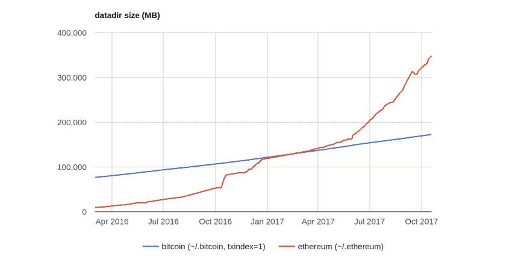
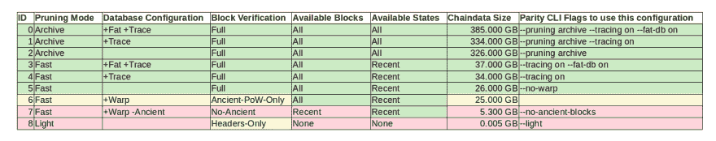

# 以太坊-区块链的大小不会很快超过 1TB。

> 原文：<https://dev.to/5chdn/the-ethereum-blockchain-size-will-not-exceed-1tb-anytime-soon-58a>

在开始阅读本文之前，请阅读本文底部的两篇关于我参与的披露(1，2)和一篇关于数据准确性的披露(3)。

每月至少有人在[r/以太坊](https://reddit.com/r/ethereum)上发布一张[图表](http://bc.daniel.net.nz/)，预测以太坊的区块链规模将很快超过 1 TB。我想借此机会在这篇文章中整理一些关于以太坊-区块链大小的故事，并尝试解释为什么这个图表在技术上是正确的，但不是全部。

[T2】](https://res.cloudinary.com/practicaldev/image/fetch/s--SHFjkIkC--/c_limit%2Cf_auto%2Cfl_progressive%2Cq_auto%2Cw_880/https://i.imgur.com/A5tl3oY.png)

让我们先看看这张图表。它显示了一个以太坊节点(红色)的完整数据目录大小，在这种情况下是 [Geth](https://github.com/ethereum/go-ethereum/) ，以及一个比特币节点(蓝色)，可能是[比特币核心](https://github.com/bitcoin/bitcoin)，随时间绘制。虽然比特币图表以看似线性的倾角略微向上移动，但以太坊图表提醒读者指数增长的斜率。

### 关于块、块历史、状态和状态历史

指责以太坊“区块链膨胀”的用户与他们的假设相差不远。但实际上，不是连锁店臃肿而是以太坊*状态*。在继续之前，我想检查一下[白皮书](https://github.com/ethereum/wiki/wiki/White-Paper)中的一些术语。

*   **挡位**。在正确执行后更新状态的一组事务。每个事务捆绑块都有一个编号，有一些困难，并且包含最近的状态。
*   **状态**。状态由所有初始化的以太坊账号组成。在撰写本文时，大约有 1200 万个已知账户和合同在以[大约每天 10 万个新账户](https://etherscan.io/chart/address)的速度增长。
*   **区块历史**。所有历史街区的链，从*创世纪*街区到最新最好的街区，也被称为*区块链*。
*   **国家历史**。每个历史块的状态构成了状态历史。稍后我将详细介绍这一点。

如果这已经让你厌烦了，请继续读下去。

### 了解修剪模式和同步模式

2016 年初，Go-Ethereum 团队推出了所谓的 *[快速](https://ethereum.stackexchange.com/q/1161/87)* 同步模式。从那以后，运行`geth --fast`变得非常有名，尤其是在同年晚些时候以太坊上的[垃圾邮件攻击](https://blog.ethereum.org/2016/09/22/transaction-spam-attack-next-steps/)使*完全*同步模式变得痛苦之后。我写这些模式*斜体*是因为我将在本文的后面回到一个重要的消歧问题。只是暂时把它们记在心里。

奇偶校验团队(原 Ethcore)通过在 2016 年底提供 *[warp](https://ethereum.stackexchange.com/q/9991/87)* 同步模式来应对链上垃圾信息，以方便新用户的链同步。与 Geth 的 *fast* 一样，`parity --warp`很快成为用户试图同步以太坊链的事实上的标准模式。到今天为止，这两个选项在两个客户端中都是默认的。

但是**快速-同步**对完全*-同步第一个节点意味着什么呢？**对奇偶校验节点进行*扭曲*-同步**而不是*无扭曲*-同步它实际上意味着什么？*

 *一个 *full* Geth 节点处理整个区块链，并重放曾经发生的所有事务。一个 *fast* Geth 节点将所有交易收据并行下载到所有块，以及最近的状态数据库。一旦完成，它就切换到*完全*同步模式。请注意，这不仅会导致*快速*同步，还会导致*修剪过的*状态数据库，因为对于小于最佳块减 1024 的块，历史状态是不可用的。这不是问题，但是在继续阅读之前，请记住 Geth 同步模式也是修剪模式。

看看奇偶校验配置选项，这变得更加复杂。除了前面提到的同步模式，奇偶校验还提供单独的*修剪*模式，即*快速*和*存档*...没错，Geth *fast* 是一种同步模式，我们了解到，即使是修剪，但是，奇偶校验 *fast* 是修剪模式，与同步模式的耦合度不高。在这一点上，我必须承认，术语是混乱的，我可能已经失去了你。让我们用笔和纸画些东西。

[T2】](https://res.cloudinary.com/practicaldev/image/fetch/s--sKqnhWld--/c_limit%2Cf_auto%2Cfl_progressive%2Cq_auto%2Cw_880/https://i.imgur.com/xRfwjsM.png)

Geth 的 *fast* 支持更快的同步和数据库修剪。Geth *full* 禁用两者。**奇偶性 *warp* 然而，可以在不禁用状态树修剪的情况下禁用！这是一个重要的句子。因此我把它加粗了。我不是在这里比较以太坊客户端，至少这不是我的意图。**我想向您展示，用一个小数据库运行一个完全验证的以太坊节点是可能的。**奇偶校验正好为此提供了概念验证。**

但这是为什么呢？因为只要磁盘上有所有的历史块，就可以通过重新处理整个链来计算任何历史状态。但是在大多数用例中，你根本不需要历史状态！因此，从状态历史中删除过时的条目并减少 95%的磁盘空间是明智的。

### 那么，一个全验证节点的最小尺寸是多少？

仅仅运行`parity --no-warp`就有大约 10 个 GB。今年秋天早些时候，它还不到 20gb(T2)，但是这个州发展非常快。目前，包含块和事务的原始历史块数据的大小约为 12-15GB，最新状态约为 1-2GB。

但是**这算不算*满*以太坊节点**？是:

*   它从*开始*运行完整的区块链同步。
*   它重放所有交易并执行所有合同。
*   它重新计算每个块的状态。
*   它将所有历史数据块保存在磁盘上。
*   它将最新的状态保存在磁盘上，并删除旧的状态。

以太坊客户端永远不会做的事情是删除旧块。这是比特币和以太坊的一个显著区别，因为*修剪*一个比特币节点除了[移除旧块](https://bitcoin.stackexchange.com/a/37497/6441)之外别无选择。有了这个上下文，就更容易理解为什么用户经常认为一个修剪过的以太坊节点不是一个完整的节点。但是现在，亲爱的读者，你知道相反的是`true`。:)

除此之外，即使是一个 *warp* 同步的奇偶校验节点也在初始同步后下载数据块的全部历史记录，一旦完成旧数据块同步，它就可以作为一个*完整*节点为网络服务。

### 全图:9 种奇偶校验配置对比

下面是我的彩色电子表格的截图，试图区分不同奇偶校验操作模式的节点安全性。

[T2】](https://res.cloudinary.com/practicaldev/image/fetch/s--olSg-8JO--/c_limit%2Cf_auto%2Cfl_progressive%2Cq_auto%2Cw_880/https://i.stack.imgur.com/2cPjk.png)

配置`00`到`05`都被认为是*全*节点。配置`06`是一个默认配置 *warp* 节点，一旦古块下载完成，就可以认为*满*。但是，它不会重放所有事务；它只检查历史块的工作证明。

* * *

配置`07`是[用户经常要求](https://ethereum.stackexchange.com/a/31848/87)的东西，但是在生产使用中应该非常不鼓励。该设置类似于修剪的比特币节点，因为历史块部分不可用。这是*不再是*的完整节点。请注意，我是如何在这一段上面添加分隔符的。你明白了。

Configuration `08`是一个轻量级客户端，但是值得再写一篇博客文章。感谢您一直向下滚动，这是您的结论:默认情况下，以太坊完整节点不需要超过 20-30 GB 的磁盘空间。:)

* * *

*值得注意的披露和底线评论。*

(1)我为平价工作。我比较不同的奇偶校验配置不仅是因为我真诚地了解和理解它们，还因为奇偶校验允许用户分别配置修剪模式和同步模式。

*(2)我持有一些比特币和一些以太。我希望这不会对我在本文中概述的技术方面有任何影响。此外，我试图不要变得过于政治化。*

(2)六周以来，我一直在 36 种不同的配置下运行奇偶校验，以收集数据。这既费时又耗资源，而且还有一个问题，那就是我不能让所有的配置同时运行，因此，本文中给出的数字的准确性必须谨慎对待。我预计结果会与运行相同配置的其他节点相差正负 20%。但是你[明白了](https://ethereum.stackexchange.com/a/31195) :

```
| ID | Pruning / DB Config | Verification    | Available History          | ETH        | ETC        | MSC        | EXP        | Parity CLI Options                         |
|====|=====================|=================|============================|============|============|============|============|============================================|
| 00 | archive +Fat +Trace | Full/No-Warp    | All Blocks + States        | 385     GB |  90     GB |  25     GB |   5.6   GB | --pruning archive --tracing on --fat-db on |
| 01 | archive +Trace      | Full/No-Warp    | All Blocks + States        | 334     GB |  90     GB |  21     GB |   5.8   GB | --pruning archive --tracing on             |
| 02 | archive             | Full/No-Warp    | All Blocks + States        | 326     GB |  91     GB |  30     GB |   5.5   GB | --pruning archive                          |
| 03 | fast +Fat +Trace    | Full/No-Warp    | All Blocks + Recent States |  37     GB |  13     GB |   3.5   GB |   1.3   GB | --tracing on --fat-db on                   |
| 04 | fast +Trace         | Full/No-Warp    | All Blocks + Recent States |  34     GB |  13     GB |   3.5   GB |   1.2   GB | --tracing on                               |
| 05 | fast                | Full/No-Warp    | All Blocks + Recent States |  26     GB |   9.7   GB |   3.0   GB |   1.1   GB | --no-warp                                  |
| 06 | fast +Warp          | PoW-Only/Warp   | All Blocks + Recent States |  25     GB |   9.6   GB |   2.6   GB |   0.96  GB |                                            |
| 07 | fast +Warp -Ancient | No-Ancient/Warp | Recent Blocks + States     |   5.3   GB |   2.9   GB |   0.19  GB |   0.13  GB | --no-ancient-blocks                        |
| 08 | light               | Headers/Light   | No Blocks + No State       |       5 MB |       3 MB |       4 MB |       5 MB | --light                                    | 
```

Enter fullscreen mode Exit fullscreen mode

*Meta-data:*

```
Version: Parity/v1.8.0-unstable-7940bf6ec-20170921/x86_64-linux-gnu/rustc1.19.0 from source w/ musicoin support
Ubuntu: 17.04 Kernel 4.10.0-35-generic / September 2017 / Lenovo Thinkpad X270, Core i7-7600U, 1TB SSD, 16GB RAM 
```

Enter fullscreen mode Exit fullscreen mode

*感谢您滚动到底部。* < 3

* * *

*更新*:感谢在[发展到](https://dev.to/)和[推特](https://twitter.com/ThePracticalDev/status/935967812987817984)上介绍我。喜欢阅读这篇文章的用户可能也会觉得下面的 [reddit 讨论](https://www.reddit.com/r/ethereum/comments/7gcheo/the_ethereumblockchain_size_will_not_exceed_1tb/)很有趣。

*趣闻*:发表本文时，比特币价格破 10000 美元，以太坊 500 美元。我想我以后会在我的文章中加入当前的市场价格，只是为了好玩。

* * *

*更新*:感谢给这个[状元贴](https://dev.to/thepracticaldev/the-7-most-popular-dev-posts-from-the-past-week-egg-6e71)打分，亲爱的开发组< 3 < 3 < 3

* * *

*更新*:这里有一个关于[黑客新闻](https://news.ycombinator.com/item?id=15935342)的更有争议的讨论。*