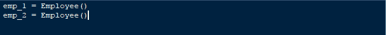
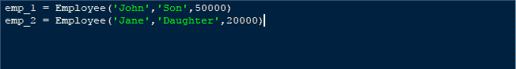
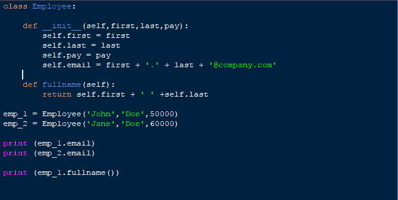

# Python 实例化类在 python 中创建和实例化一个简单的类

> 原文:[https://dev . to/ogwurjohnson/creating-and-instantiating-a-simple-class-in-python-79b](https://dev.to/ogwurujohnson/creating-and-instantiating-a-simple-class-in-python-79b)

上个月，我开始学习 python 课程，无意中发现了一个从 python 角度看面向对象编程的教程，在本周和未来几周，我将分享我所学到的东西。

今天我们将学习类的创建和实例化。为了帮助我们更好地理解这一点，我们将创建一个雇员类，每个雇员都有像姓名、电子邮件、工资等属性。现在让我们先尝试创建和实例化一个类。

[T2】](https://res.cloudinary.com/practicaldev/image/fetch/s--gMGGOYYY--/c_limit%2Cf_auto%2Cfl_progressive%2Cq_auto%2Cw_880/https://thepracticaldev.s3.amazonaws.com/i/x5nuuarkq42lpap1qf7z.PNG)

上面的代码片段显示了如何在 python 中创建一个类，下面的 pass 关键字告诉 python 忽略该类，如果没有该关键字，python 会将该类视为空类并返回错误。类是创建实例的蓝图，我们创建的每个独特的雇员都是该类的一个实例。

例如:

上面的代码显示了 Employee 类的唯一实例的创建，为了给这个实例分配数据，我们将使用实例变量。实例变量包含实例独有的数据。要为每个雇员创建实例变量，我们需要执行以下操作:

[T2】](https://res.cloudinary.com/practicaldev/image/fetch/s--2EtlZT7C--/c_limit%2Cf_auto%2Cfl_progressive%2Cq_auto%2Cw_880/https://thepracticaldev.s3.amazonaws.com/i/8nsraz5i80musomqh5ts.PNG)

想象一下，我们要创建 1000 名员工，每次创建一名员工都要设置变量，这意味着会有大量的代码和错误。但是 python 允许你能够自动创建实例，我们可以使用它的 **( **init** )** 方法来实现。

[T2】](https://res.cloudinary.com/practicaldev/image/fetch/s--2JRCFzdf--/c_limit%2Cf_auto%2Cfl_progressive%2Cq_auto%2Cw_880/https://thepracticaldev.s3.amazonaws.com/i/odirggaagoo712d8vne2.PNG)

创建后的 init 方法会自动接收一个名为( **self** )的实例，我们还会传入 Employee 类的其他属性，如 name 和 pay。下一步，我们将考虑设置实例。

 
完成后，当我们创建雇员时，实例会自动传入，我们所要做的就是提供雇员属性。
 
在运行这个脚本时 **(emp_1)** 会作为 self 被传递到 **(init)** 方法中。
现在，假设我们想要打印每个用户的全名，我们实际上可以使用 python 中的 format 函数来连接字符串以获得全名，但这需要在每次我们想要打印雇员全名时都这样做，但是为了更好地享受代码重用的优势，我们将创建一个方法来帮助我们生成每个雇员的全名。

这就是类和类实例的创建。下面是完整的源代码。
[T3】](https://res.cloudinary.com/practicaldev/image/fetch/s--GSG2w3Na--/c_limit%2Cf_auto%2Cfl_progressive%2Cq_auto%2Cw_880/https://thepracticaldev.s3.amazonaws.com/i/6ewfxo89ssb8pfm3rqty.PNG)

**(注意)**
当试图打印雇员全名时，你可以这样做- > **(emp_1.fullname())** 或者你可以尝试**(employee . full name(EMP _ 1))**，它们的意思是一样的，事实上后者是当你运行程序时在后台发生的事情。

明天我们将会看到实例变量和类变量之间的区别，常规方法、静态方法和实例方法之间的区别