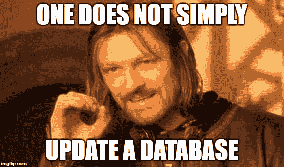

# “不仅仅是更新数据库”——基于迁移的数据库开发

> 原文:[https://dev.to/pesse/one-does-not-simply-update-a-database-移民-基础-数据库-发展-527d](https://dev.to/pesse/one-does-not-simply-update-a-database--migration-based-database-development-527d)

[T2】](https://res.cloudinary.com/practicaldev/image/fetch/s--fRumYMyb--/c_limit%2Cf_auto%2Cfl_progressive%2Cq_auto%2Cw_880/https://cleandatabase.files.wordpress.com/2017/11/1zlzpi.jpg%3Fw%3D676)

我已经在[的前一篇文章](https://dev.to/pesse/there-is-no-clean-database-development-without-version-control-2hfe-temp-slug-1558795)中描述了为什么从开发的角度来看，数据库不同于应用程序。在我看来，最有影响的区别是，您可以按州部署应用程序。你在你的版本控制系统中选择某个点，构建你的应用程序，并且手头有你的应用程序的某个状态。

最好的情况是，这个状态由大量的自测支持，并且有一个惟一的版本号(好吧，它有一个由您的特定提交的散列决定的版本号)。无论您客户是否安装了不同版本(状态)的应用程序，您都可以获得该构建并部署它。

当然，这是经过简化的，可能会有外部 API、库、配置文件或者——谁曾想到过——数据库阻止您轻松切换应用程序状态，但通常这种约束相对较少。

数据库不一样。一旦将数据库交付给客户，就不能在数据库中保存状态。当你把它交给别人的时候，数据库就开始不断地改变它的状态。您不能简单地在客户数据库上“安装”新版本的数据库模式——需要保留数据，而且在大多数情况下，甚至不可能清楚地将模式和数据分开。是的，应用程序的数据也会改变，但是根据我的经验，数据库模式通常比应用程序与数据的耦合更紧密(这很有道理，不是吗？).

那么，我们如何克服这些困难，尤其是如果我们的目标是频繁发布和敏捷、协作开发的话？

# 通过模式比较进行基于状态的部署

这种方法的基本思想是，你在一个单独的数据库上开发，这个数据库是主要的“真理持有者”。您可以决定这个主数据库何时处于适合下一个版本的状态。

这种状态可以通过执行完整备份来保存，例如，一旦您想要部署它，您可以在您的主数据库和客户数据库之间进行模式比较(取决于您的解决方案，甚至是数据比较)。

有几种商业解决方案试图支持这种部署方式，从非常便宜到非常昂贵。RedGate 有一整套围绕这种方法的套件，DbForge 在其企业产品中提供了一些功能，甚至用于 Visual Studio 的 SQL Server 数据工具(SSDT)也鼓励开发人员将他们的当前状态“发布”到数据库中，编写通过直接比较发现的更改。

这些比较函数的结果在质量上有很大的不同，所以如果你真的想走这条路(我会告诉你为什么不应该)，就用昂贵的工具。根据我的经验，运行这样一个自动创建的脚本，破坏目标数据库、丢失数据或引入不必要的副作用的风险非常高。

# 混乱中的西斯档案

你回到了死星，你的西斯尊主需要你的数据库专家。尽管秩序的意志在西斯中并不普遍，但这位特殊的指挥官希望你对一个数据库进行一些修改，这个数据库保存着有史以来最强大的西斯的信息。

曾经创建解决方案的人不太熟练，对数据规范化一无所知，而您现在看到的表格是这样的:

| 身份证明 | 名字 | 活着的 |
| --- | --- | --- |
| one | 达斯·西迪厄斯 | Zero |
| Two | 昆，Exar | Zero |
| three | 维德，达斯 | one |

你的西斯指挥官希望你改进表格，以便更容易搜索特定的名字，因此他想要一个新列:“Prename”(为了简单起见，他同意“Darth”也可以用作 PRENAME)。将来“名字”应该只包含姓氏。

应该是个很简单的任务，不是吗？通过执行 ALTER TABLE 语句，添加一个新的“PRENAME”列，可以立即在主开发数据库上启动。之后，您执行一个简单的更新语句，如下所示:

```
update powerful_sith SET PRENAME = trim(substr(NAME, instr(NAME, ',')+1)), NAME = trim(substr(NAME, 0, instr(NAME, ','))) 
```

*(是的，引入另一个列“姓氏”并将姓名的第二部分保存到该列中，首先保留“姓名”不变，这将是一个好主意。然后在第二步中，你应该检查 SURNAME || '，' || PRENAME 是否等于 NAME，这样你就可以确保在最后删除名字和重命名姓氏之前没有出错，但是我想让主例子尽可能简单)*

现在，您在主开发数据库中有了首选状态，可以继续进行备份和模式比较，以便部署到生产数据库中。应该不会太难吧？

即使您选择的工具能够以一种有用的方式发布第一个更改(表模式)(这并不确定——当您添加或删除表列时，我看到自动比较工具使用了非常奇怪甚至极具破坏性的方法),它也不能正确地完成第二个更改，因为您的工具如何知道数据背后的业务逻辑呢？

它将要求您在通过模式比较完成脚本之后运行一些迁移脚本，或者将特定的更新编织到自动创建的脚本中。我预计会有很多头痛和巨大的混乱。

# 基于迁移的数据库开发

有一种不同的数据库开发和部署方法，它尊重数据库的不同性质:您总是使用“迁移”或“转换”。不是保存数据库的某个状态，而是保存到达该状态所需的所有步骤。

这意味着您必须为您对数据库所做的每一个更改编写脚本，并以一种您可以将它们(重新)应用到任何目标数据库的方式存储这些脚本，从而导致相同的行为和功能状态(但不改变特定于客户的事情)。这意味着你可能不得不改变你目前的工作方式——尤其是当你使用可视化 IDE 来改变模式对象的时候。你所做的每一个改变都必须有脚本。

最后，您正在做一件与模式比较类似的事情，您只是以一种更加可控和安全的方式来做这件事。而且你在开发的时候就做对了，所以你知道所有的业务逻辑和注意事项。

但是这难道不是速度和生产力的可怕下降吗？这听起来不像单调乏味的工作吗(大多数开发人员最讨厌单调乏味的工作，包括我自己)？

乍一看似乎如此，但让我们来看看它的好处:

*   它支持坚如磐石的部署流程，因为在更新本地数据库、开发数据库、QA 数据库、验收数据库和生产数据库时，您所做的完全相同。这总是相同的过程，并且可以自动化。
*   通过加载基线备份并运行所有迁移脚本，您可以轻松地将(CI)数据库恢复到您想要的时间点。
*   如果你做对了，你就有了数据库版本和变更文档
*   这种方法鼓励每次进行小的更改，从而降低部署的风险
*   它支持持续集成，因为您可以轻松地将您的功能状态转移到不同的数据集(例如测试数据)
*   你很清楚发生了什么。在我看来，这是最大的好处，因为它给了你信心，让你相信你所交付的东西会起作用。它还为您提供了巨大的灵活性，让您可以解决任何类型的挑战——甚至是需要特定业务逻辑的挑战。

# 这不是毛茸茸的独角兽魔法

将所有数据库更改编写成一堆文件不会突然让你摆脱所有问题，也不会让你不用动脑筋。事实上，如果没有一个好的流程和一些工具，让一些脚本文件到处乱飞会使事情变得更糟。

我遇到过一个人，他编写了所有数据库更改的脚本，将它们组织在大型文件夹结构中，有严格的命名约定和规则，必须将文件放在哪个文件夹中，并且当他部署它们时，他手动运行它们。常常超过一百个文件。按照正确的顺序。用手。有时在深夜，因为“我们需要马上释放”的压力。我自己也不能保证运行数百个 SQL 文件，手动组织在不同的文件夹中而不出错。事实上，我怀疑他能。部署后提出的一些客户问题支持了我的怀疑。

因此，为了正确地进行基于迁移的数据库开发，您必须在您的脚本周围放置一些东西——这些东西有它们自己的好处。

## 自动迁移

也许在使用迁移脚本时，您想要的最重要的东西是一些自动化其部署的工具。你想要一些这样的文件

```
migrations/
  1.0/
    1.0.1_alter_table_powerful_sith.sql
    1.0.2_update_table_powerful_sith_split_name.sql
  1.1/
    1.1.1_add_view_V_POWERFUL_SITH.sql 
```

以及以正确的顺序应用它们的工具。但这还不是全部，您需要一个工具来跟踪哪个迁移脚本已经在您的目标数据库上运行，它是何时运行的，可能是谁运行的。

有几十种免费的工具可用于数据库迁移，不幸的是，其中许多(例如 liquibase)使用某种 DSL(领域特定语言),不允许您使用普通 SQL 进行迁移。

当你来自应用程序开发的抽象层时，这可能是一个好主意(拥有一些 DSL，让我们能够在任何数据库上运行我们的–**简单的**–迁移，不是很好吗？).

如果是为 Oracle 这样的特定数据库开发，完全不够用。你是 SQL、PL/SQL 或 TSQL 的英雄，想在迁移脚本中使用你的超能力。

因此我最喜欢的是[飞行路线](https://flywaydb.org/)。

它带来了我期望从这样一个工具中获得的所有安全性、自动化、灵活性和简单性，并允许您使用简单的、特定于供应商的 SQL 脚本。它是开源的，用 java 编写，如果它的开箱即用特性不够灵活，有几种可能性可以通过钩子轻松扩展它。

*(如果你更进。你可能想给 [Evolve](https://github.com/lecaillon/Evolve) 一个尝试，一个受 flyway 启发很大的. NET 实现。*

## 版本化您的数据库

总是确切地知道数据库模式的版本/状态不是很好吗？如果能有一些关于发生了什么变化的文档不是很好吗？

如果你用的是 flyway 或者类似的工具，那就是内置的。而且是自动化的。

在我告诉他像 flyway 这样的迁移工具是如何处理这些事情的之后，我前面提到的那个家伙提出了在数据库中记录特性的概念。他实现的功能/表格设计包括了你想要的一切:特性描述、版本号、谁负责、哪些脚本属于它等等。唯一的问题是:您必须手工填写文档(或者手工编写迁移脚本)。它完全没有自动化。因此，在观察数周后，我们不能再依赖这些信息，因为我们不能确定每个人在进行迁移时是否真的总是输入正确的数据。这是一个好心办坏事的可悲例子。

如果你想让事情变得可靠，那就自动化它们。机器在遵守规则方面比人好得多。

## 幂等迁移脚本

理论上，您不应该多次运行迁移脚本。在一个完美的世界中，您总是将每个迁移脚本应用一次——然后继续下一个。

实际上，我认为编写幂等的迁移脚本是非常好的实践。这意味着一个迁移脚本可以运行多次，总是得到相同的输出。

例如，如果要修改一个表，可以用 ALTER TABLE 语句编写脚本。这不会是等幂的，因为第二次运行它时，它会引发一个异常(因为新的列 or 已经存在)。

如果您像这样编写迁移脚本:

```
declare
  v_count integer;
begin
  select count(*) into v_count from user_columns where table_name ='POWERFUL_SITH' and column_name ='PRENAME';
  if ( v_count <= 0 ) then
    execute immediate 'alter table POWERFUL_SITH add PRENAME varchar2(100)';
  else
    dbms_output.put_line('POWERFUL_SITH.PRENAME already exists');
  end if;
end;
/ 
```

您可以一次又一次地运行它，总是得到相同的输出:一个带有 PRENAME 列的表。

在我看来，你应该尽可能让你的脚本幂等。这将使您的迁移更不容易出错，而且将某个迁移作为生产数据库的修补程序提取出来也很容易。这也将使开发变得更加容易。

## 迁移测试

当我开始深入数据库自测的话题时，我无意中发现了一篇博文，这篇博文描述了如何也可以[测试您的迁移脚本](https://www.red-gate.com/blog/database-unit-testing-wrong)的结果，并在发生意外时回滚错误。我发现它非常有趣，并试图将它包含到我的一些迁移脚本中。

虽然我仍然认为这个想法很吸引人，但至少对于 oracle 开发来说，感觉不太合适。这是您无法在 oracle 中回滚 DDL 的主要原因(我知道 Oracle 12c 中有一些方法，但总的来说太复杂了，并且不如 SQL Server 中那样轻松)。我仍然偶尔将它用于一些复杂的数据迁移。

相反，您可以并且应该做的是在每次迁移之后添加您的(希望是现有的)[自测](https://dev.to/pesse/strongholds-of-confidence-self-testing-your-database-1dlk-temp-slug-511737)套件的完整运行。我在我的本地机器上使用了一个简单的 powershell 脚本，让我更难**而不是**进行完整的测试运行，这帮助我养成了一个健康的测试习惯。

# 结论

我没能在本文中包含所有与基于迁移的数据库开发相关的主题，所以您可以期待在以后的文章中看到更多。

我自己前段时间也转了，不后悔。我认为这种方法极大地支持了敏捷、自信的数据库开发，并鼓励您拥抱变化，即使是像数据库这样的整体系统。

我强烈推荐每个人阅读 Martin Fowler 和 Pramod Sadalage 关于[进化数据库设计](https://www.martinfowler.com/articles/evodb.html)的精彩文章，这篇文章将这个概念向前推进了一(或两)步。这也是我改变数据库开发方式的最初灵感。

让我知道你对它的想法以及你对基于迁移的数据库开发的体验(你也可以通过 [twitter](https://twitter.com/Der_Pesse) 这样做)

[ ](http://feeds.wordpress.com/1.0/gocomments/cleandatabase.wordpress.com/1124/) [ ](https://res.cloudinary.com/practicaldev/image/fetch/s--WRcJU2h2--/c_limit%2Cf_auto%2Cfl_progressive%2Cq_66%2Cw_880/https://pixel.wp.com/b.gif%3Fhost%3Dcleandatabase.wordpress.com%26blog%3D134663363%26post%3D1124%26subd%3Dcleandatabase%26ref%3D%26feed%3D1)