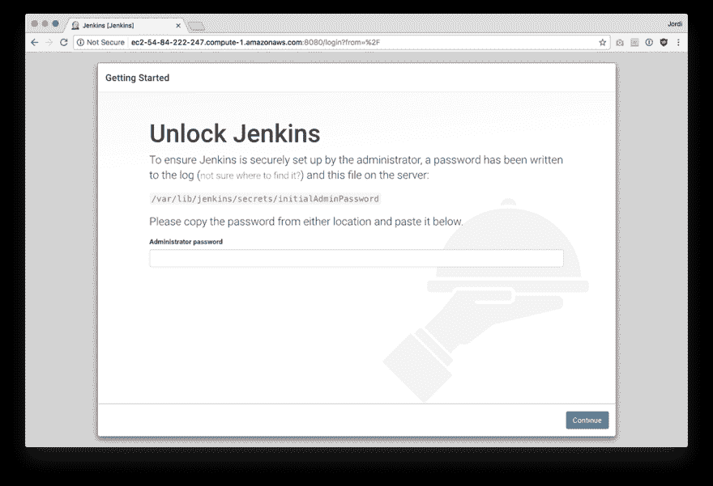
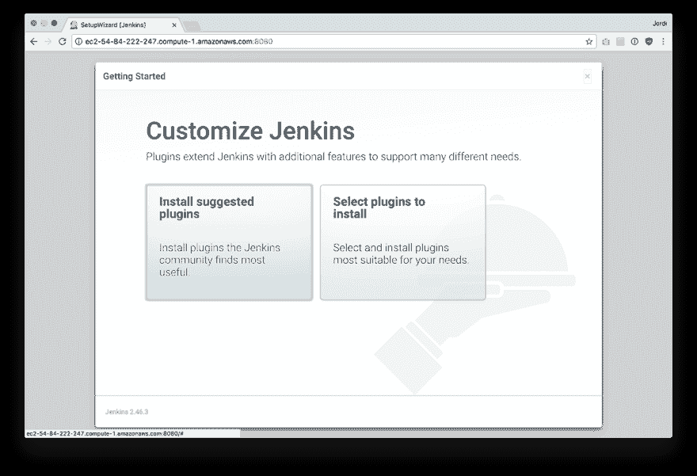
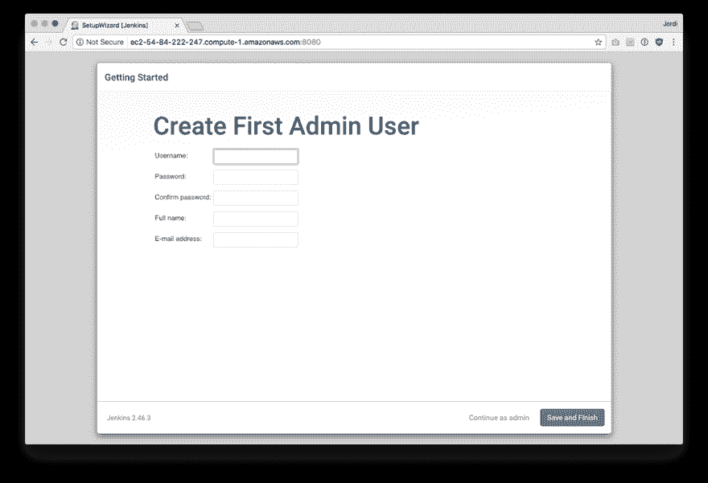
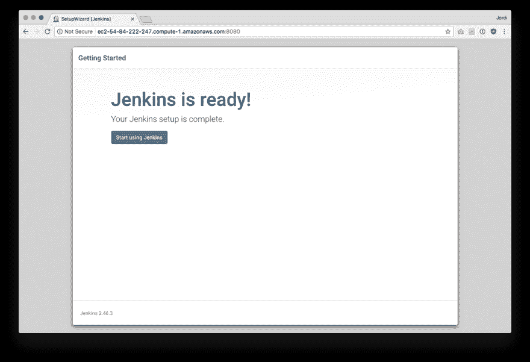

# 如何在 Ubuntu 中安装 Jenkins

> 原文:[https://dev . to/bugfenderapp/how-to-install-Jenkins-in-Ubuntu-38j](https://dev.to/bugfenderapp/how-to-install-jenkins-in-ubuntu-38j)

[T2】](https://res.cloudinary.com/practicaldev/image/fetch/s--zgVX4Pew--/c_limit%2Cf_auto%2Cfl_progressive%2Cq_auto%2Cw_880/https://bugfender.com/wp-content/uploads/2017/11/bugfender-installing-jenkins.jpg)

*这篇文章最初发表在我们的[博客](https://bugfender.com/blog/how-to-install-jenkins-in-ubuntu/)上。*

如果你错过了我们的第一篇文章，或者如果你不确定 Jenkins 或 CI 是什么，回头看看:[什么是 Jenkins，你为什么要使用它？](https://bugfender.com/blog/what-is-jenkins-and-why-should-you-be-using-it/)

如果您正在开始使用 Jenkins，在您点击下载之前，有许多事情需要考虑。你必须选择在哪里运行 Jenkins:在你自己维护的硬件上还是通过托管服务。您应该与您的团队一起决定最适合您需求的选项。

作为一家[完全远程生活方式企业](https://bugfender.com)，我们选择在装有 Ubuntu 16.04 的 t2.nano 机器类型上使用亚马逊网络服务，但这种配置可以根据用例进行调整。

## 选择合适的机器

确保你选择的机器至少有 1GB 的内存。如果你没有足够的内存，詹金斯不会运行。为了获得不错的性能，2 到 4GB 是理想的。

对于 Android，我们会推荐一台至少是 t2.medium 的机器。对于 iOS，你需要一台 Mac，所以我们会推荐一台 Mac Mini。许多人在办公室里找到一台旧的 Macbook，用它来运行 Jenkins。

## 选择操作系统

Jenkins 几乎可以在你能想到的任何操作系统上运行，只要它能运行 Java 或 Docker。在这篇文章中，我将使用 Ubuntu，但是你可以使用任何最适合你的操作系统，因为步骤非常相似。

## 如何安装 Jenkins

### 步骤 1:使用你的软件包管理器安装 Jenkins。

在 Ubuntu 上，你可以通过以下方式实现:

```
wget -q -O - https://pkg.jenkins.io/debian-stable/jenkins.io.key | sudo apt-key add -
echo "deb http://pkg.jenkins.io/debian-stable binary/" | sudo tee /etc/apt/sources.list.d/jenkins.list
sudo apt-get update && sudo apt-get -y install jenkins
```

注意:您有其他安装选项，包括两个不同的发布行。参见[https://jenkins.io/download/](https://jenkins.io/download/)了解周线释放和 LTS(长期支持)期权的区别。

一旦安装完毕，Jenkins 将在端口 8080 上运行。如果您远程访问此服务器，请确保打开防火墙中的端口 8080。

### 第三步:打开你的浏览器

在浏览器中，转到`[http://your-ci-server-name.com:8080](http://your-ci-server-name.com:8080)`。如果您的机器运行的是 Jenkins，窗口应该会显示设置向导。

### 第四步:解锁詹金斯

[T2】](https://res.cloudinary.com/practicaldev/image/fetch/s--hiNSxi8Z--/c_limit%2Cf_auto%2Cfl_progressive%2Cq_auto%2Cw_880/https://bugfender.com/wp-content/uploads/2017/11/jenkins-2-2-unlock.png)

为了确保您是机器的真正管理员，密码已被写入指定的日志文件。在新的终端中，键入`sudo cat`，然后粘贴到本页提供的路径中，以获得临时密码。然后，您可以在浏览器的**管理员密码**字段中输入密码。这一步是一项安全措施，以防您的 Jenkins 下载可从互联网或您公司的网络公开访问。(有关 Jenkins 的更多安全措施的信息，请参见下面的“建议绕道:添加 SSL 以保护您的 Jenkins 安装”。)

### 步骤 5:定制 Jenkins 插件

[T2】](https://res.cloudinary.com/practicaldev/image/fetch/s--5kKptZhq--/c_limit%2Cf_auto%2Cfl_progressive%2Cq_auto%2Cw_880/https://bugfender.com/wp-content/uploads/2017/11/jenkins-2-3-customize.png)

你可以点击**安装建议的插件框**。这将激活一些有用插件的下载，包括 Git 和一些管道插件。你可以随时[下载其他必要的插件](https://plugins.jenkins.io)来补充这些预选选项。

### 步骤 6:创建管理员登录

[T2】](https://res.cloudinary.com/practicaldev/image/fetch/s--pqc0ZKJK--/c_limit%2Cf_auto%2Cfl_progressive%2Cq_auto%2Cw_880/https://bugfender.com/wp-content/uploads/2017/11/jenkins-2-4-admin-user.png)

您可以通过添加用户名、输入新密码以及输入全名和电子邮件地址来创建您的用户帐户。进入 Jenkins 后，您可以选择启用新用户，这将允许同事根据需要创建更多登录帐户。

就是这样！你已经安置了詹金斯。

[T2】](https://res.cloudinary.com/practicaldev/image/fetch/s--QhZbadag--/c_limit%2Cf_auto%2Cfl_progressive%2Cq_auto%2Cw_880/https://bugfender.com/wp-content/uploads/2017/11/jenkins-2-5-ready.png)

## 建议绕道:添加 SSL 来保护您的 Jenkins 安装

由于 Jenkins 可以访问您的应用程序的源代码，我们建议您使用加密。你的产品的本质——代码——可能是敏感的，应该保密。如果您是通过互联网或在与其他人共享的本地网络上运行 Jenkins，那么用 SSL 保护通信可能是个好办法。

自从推出 [Let's Encrypt](https://letsencrypt.org/) 以来，获得这些证书相当容易，而且完全免费，所以我们强烈推荐。不要偷懒！

**步骤 1:** 如果您的服务器位于防火墙之后，首先确保您在端口 80 和 443 上接受入站流量，并取消对端口 8080 的访问。

为了让 SSL 正常工作，您首先需要一个服务器的 DNS 名称。在这个例子中，我们称它为`your-ci-server-name.com`。确保编辑我们将在此列出的配置文件，以匹配您选择的域名。

**第二步:**然后安装 nginx ( `sudo apt-get install nginx`)并编辑你的`/etc/nginx/sites-enabled/default`文件，如下所示:

```
upstream app_server {
    server 127.0.0.1:8080 fail_timeout=0;
}

server {
    listen 80 default_server;
    listen [::]:80 default_server;
    server_name _;
    location ^~ /.well-known/acme-challenge/ {
        alias /usr/share/nginx/html/.well-known/acme-challenge/;
    }
    location / {
        return 301 https://$host$request_uri;
    }
}
```

一旦安装完毕，让 nginx 加载你的修改:`service nginx reload`

这将让我们加密验证服务与您的服务器对话，并验证您是否拥有它。

**步骤 3:** 现在，您可以安装 Let's Encrypt 代理，并为您的服务器创建一个 SSL 证书:

```
sudo apt-get install letsencrypt
letsencrypt
```

按照向导的步骤操作，您将在类似于`/etc/letsencrypt/live/your-ci-server-name.com/`的目录中获得 SSL 证书。

现在再次编辑`/etc/nginx/sites-enabled/default`以使用这些证书，添加以下行:

```
server {
    listen       443;
    server_name  your-ci-server-name.com;
    ssl    on;
    ssl_certificate    /etc/letsencrypt/live/your-ci-server-name.com/fullchain.pem;
    ssl_certificate_key    /etc/letsencrypt/live/your-ci-server-name.com/privkey.pem;

    location / {
        proxy_set_header X-Forwarded-For $proxy_add_x_forwarded_for;
        proxy_set_header X-Forwarded-Proto https;
        proxy_set_header Host $http_host;
        proxy_redirect off;

        if (!-f $request_filename) {
            proxy_pass http://app_server;
            break;
        }
    }
}
```

然后再次要求 nginx 加载您的更改:`service nginx reload`

**第四步:**现在你应该有 SSL 了，试着在你的浏览器上打开`[https://your-ci-server-name.com](https://your-ci-server-name.com)`。如果你按照这些步骤正确，你会看到你的全新加密詹金斯安装。

既然 Jenkins 已经完全安装好了，请关注我们即将发布的关于添加您的第一个 Android 和 iOS 作业的帖子。

* * *

这篇文章由 Sarabeth Flowers Lewis 编辑，她是一名自由作家，也是 Lewis 商业写作的联合创始人，专门从事 SEO 和直接回应内容创作。她目前和她的姜黄色丈夫一起远程工作，为科技、非营利组织和房地产写作。点击这里查看更多她的作品。

*这篇文章最初发表在我们的[博客](https://bugfender.com/blog/how-to-install-jenkins-in-ubuntu/)上。*