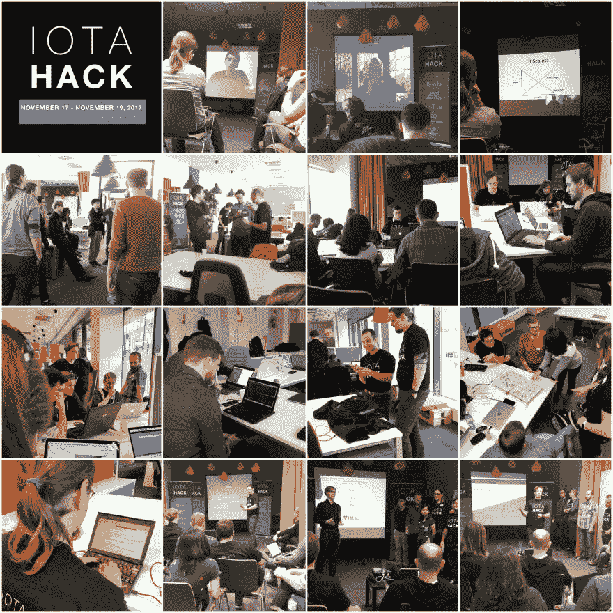

# IOTA 黑客马拉松

> 原文：<https://dev.to/brightdevs/iota-hackathon-c1g>

上周末，我们很高兴地共同组织并参加了 IOTA Hackathon，来自欧洲各地的软件开发人员前来测试 IOTA 平台的不同用例。IOTA 黑客马拉松于 11 月 17 日至 19 日举行，由 [IOTA](https://iota.org/) 、[波罗的海数据科学](http://balticdatascience.com/)(区块链和大数据服务)、 [Datarella](http://datarella.com/) (区块链和大数据咨询)和[光明发明](https://twitter.com/BrightDevs)赞助。

黑客马拉松从 IOTA 的 Chris Dukakis 和 Outlier Ventures 的 Jamie Burke 的主题演讲开始。这两次演讲实际上是为新来者和所有参与者举办的一次很好的平行研讨会。在熟悉 IOTA，头脑风暴会议和解决许多疑问后，参与者选择了他们想要关注的想法，组成了小组，拿出他们的笔记本电脑，潜入 IOTA 世界争夺 4200 IOTA 的奖金。

[T2】](https://res.cloudinary.com/practicaldev/image/fetch/s--_wQqlJX8--/c_limit%2Cf_auto%2Cfl_progressive%2Cq_auto%2Cw_880/https://thepracticaldev.s3.amazonaws.com/i/7aqi5919s8itwkdoxnr5.jpg)

产量怎么样？就质量而言，产出比某些人预期的要好得多——三个独立的项目，每个都解决现实生活中的问题。

在比赛中获得第一名的团队“PlugInBaby”提供了分散充电站的物联网网络与需要充电服务的传统或自动驾驶汽车之间的链接，并创建了一个开放式汽车充电站。您可以在[中找到更多关于迭代过程的总结](http://datarella.com/iota-hackathon-open-car-charging-network-part-1/)以及在定义项目主题时发生的相关枢纽(以及[这里](http://datarella.com/iota-hackathon-open-car-charging-network-part-2/)更多关于项目本身的开发和设计的细节)。

亚军团队“自由通行证”面临着来自伦敦议会的波格丹一世·瓦库斯塔带来的真正挑战。自由通行证是一项允许残疾居民免费使用伦敦公共交通的举措。在发放免费通行证之前，人们必须获得医生证明以证明残疾，然而，有很多骗子通过 PS 医生证明来为自己获得免费通行证。该团队决定建立一个概念验证来防止这种欺诈。在 IOTA 的帮助下，他们创建了一个警报，每年可以为伦敦公众节省数百万英镑。

在比赛中获得第三名的团队使用 IOTA 创建了一种由温度传感器组成的内部系统，这些传感器使用 IOTA Tangle 相互通信。如果使用标准系统，在尝试同步设备网络时会遇到一些问题。每个设备都有自己的指定地址，该地址由指定的种子生成，用于在各方之间发送交易。在 IOTA 中，发送包含一些消息的零值事务是可能的，这里正好实现了这个特性。首先在测试网上使用，但是计划在主网上应用。

你可以在这里观看所有的 IOTA 黑客马拉松演讲。

有人可能会问，和一群陌生人在电脑前呆两天是否真的有趣。IOTA Hackathon 的例子说明确实如此。黑客马拉松并不总是涉及不健康的竞争结构。它们应该为参与者提供学习新知识的机会，并在他们感兴趣的问题上取得进展。真正的黑客马拉松只是解决现实生活问题的漫长旅程的开始。在 IOTA 黑客马拉松期间，不存在不切实际的期望或压力。彼此不认识的人相遇并开始讨论和合作，就像他们以前一起做过几十个项目一样有效。这一切都是为了互相帮助，扩展知识，提高(甚至发现)你自己的技能，而不是为了赢。因为在最成功的黑客马拉松中，每个人都是赢家。

最初发表于 2017 年 11 月 24 日 [brightinventions.pl](https://brightinventions.pl/blog/) 。

社交媒体和雇主品牌女孩@光明发明
[电子邮件](//ula.stankiewicz@beightinventions.pl)， [LinkedIn](https://www.linkedin.com/in/urszula-stankiewicz-7bb10577/)