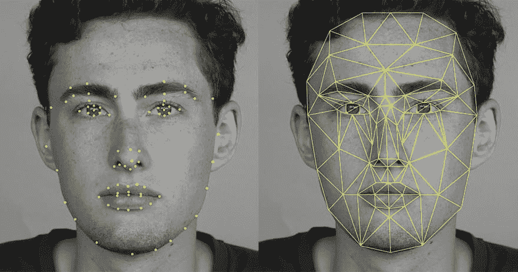

# 编程类似 Snapchat 的过滤器

> 原文:[https://dev . to/unqlite _ db/Prog amming-snapchat-like-filters-cod](https://dev.to/unqlite_db/progamming-snapchat-like-filters-cod)

由于你现在可能拥有一部智能手机，你可能已经注意到你的随从中有人在社交网络上突然出现，头上戴着一顶花冠或一些狗的东西。这种效果是由 [Snapchat](https://www.snapchat.com) 应用程序产生的，被命名为**滤镜**，现在该应用程序的每个竞争对手都在复制它。

在本帖中，我们将尝试干燥并回答一些关于它们的问题:它们实际上是如何制造的？需要什么软件库来模仿它们的行为？最后，我们将在 [PixLab API](https://pixlab.io/start) 的帮助下，使用 Python 或任何支持 HTTP 请求的语言实现一些著名的过滤器。

事不宜迟，让我们深入了解一下这个 Snapchat 输出(实际上，它是由我们的[程序](https://gist.github.com/symisc/b11b38ffea4feb3a3f3299e555d72358)生成的，我们将在下面实现它):

[T2】](https://res.cloudinary.com/practicaldev/image/fetch/s--b5VhId7s--/c_limit%2Cf_auto%2Cfl_progressive%2Cq_auto%2Cw_880/https://pixlab.ximg/snap_dg2.jpg)

要产生这样的效果，实际上需要两个阶段:**分析** & **处理**。

## 计算机视觉来救援

**分析阶段**总是第一遍，也是最复杂的。它需要一些计算机视觉算法在引擎盖下运行，并执行以下任务:

## 人脸检测

给定一幅输入图像或视频帧，找出当前所有人脸并输出其包围盒(即矩形坐标形式: **X** 、 **Y** 、**宽度** & **高度**)。

自 21 世纪初以来，人脸检测一直是一个得到解决的问题，但面临一些挑战，包括检测[微小](https://arxiv.org/pdf/1612.04402.pdf)、[部分](https://arxiv.org/pdf/1603.09364.pdf)、&、[非正面](http://ieeexplore.ieee.org/abstract/document/5459421/)人脸。最广泛使用的技术是方向梯度直方图(简称为 [HOG](https://en.wikipedia.org/wiki/Histogram_of_oriented_gradients) )和支持向量机(简称为 [SVM](https://en.wikipedia.org/wiki/Support_vector_machine) )的组合，这种技术在给出高质量图像的情况下实现了一般到相对较好的检测率，但是这种方法至少在 **CPU** 上不能进行实时检测。

*下面是猪/SVM 探测器的工作原理*:

给定一个输入图像，计算该图像的[金字塔](https://en.wikipedia.org/wiki/Pyramid_%28image_processing%29)表示，它是原始图像的多尺度(可能是[高斯](http://docs.opencv.org/2.4/modules/imgproc/doc/filtering.html?highlight=pyrdown))下降版本的金字塔。对于金字塔上的每个条目，使用滑动窗口方法。滑动窗口的概念非常简单。通过以恒定的步长在图像上循环，以不同的比例提取通常大小为 64×128 像素的小图像碎片。对于每个小块，算法会决定它是否包含人脸。为当前窗口计算 HOG，并将其传递给 SVM 分类器(线性或非线性),以进行决策(即，是否人脸)。完成金字塔后，通常会进行一个[非极大值抑制](http://users.ecs.soton.ac.uk/msn/book/new_demo/nonmax/)(简称 NMS)操作，以丢弃堆叠的矩形。你可以在这里阅读更多关于猪和 SVM 组合的信息。

## 面部标志

这是我们分析阶段的下一步，工作方式如下:

对于每个检测到的面部，输出该面部的每个成员或面部特征的局部区域坐标。这包括*眼睛*，*骨头*，*嘴唇*，*鼻子*，*嘴巴*，...坐标通常以点的形式出现( **X** ， **Y** )。

提取面部标志对于给定边界框(即带有目标面部的裁剪图像)的 CPU 来说是相对廉价的操作，但是对于程序员来说很难实现，除非使用一些*不那么快*的机器学习方法。

你可以找到更多关于提取面部标志的信息[这里](http://www.learnopencv.com/facial-landmark-detection/)或者这个 PDF: [用回归树集合进行一毫秒面部对齐](http://www.cv-foundation.org/openaccess/content_cvpr_2014/papers/Kazemi_One_Millisecond_Face_2014_CVPR_paper.pdf)。

[T2】](https://res.cloudinary.com/practicaldev/image/fetch/s--q0VtNt3T--/c_limit%2Cf_auto%2Cfl_progressive%2Cq_auto%2Cw_880/https://petapixel.com/assets/uploads/2016/06/facialrecognition_1.jpg)

在一些明显有用的情况下，面部检测和界标提取被组合成单个操作。 ~~Dlib 实现了~~(不，事实上 [Dlib](http://dlib.net/face_landmark_detection_ex.cpp.html) 要求首先进行人脸检测，然后进行形状提取，所以这是一个两步操作)。

**PixLab** 通过我们稍后将使用的 [facelandmarks](https://pixlab.io/cmd?id=facelandmarks) API 端点，在一次调用中实现这一点。我们现在进入寻找最佳快照的下一步:**处理阶段**。

## 图像&视频处理

一旦我们有了面部标志，70%的工作就完成了，我们现在要做的就是叠加目标滤镜，比如*花冠*、*狗鼻子*等。在面部的期望区域的顶部，如用于花冠盒的<u>骨</u>。这个操作被命名为[合成](https://en.wikipedia.org/wiki/Compositing)。也就是说，将来自不同来源的多个视觉元素组合成一幅图像。

为了简单起见，我们将只讨论图像处理。视频处理在概念上类似，但需要一些额外的步骤，例如使用解码器(即 OpenCV 的 [FFmpeg](https://ffmpeg.org/) 或 [CvCapture](http://docs.opencv.org/2.4/modules/highgui/doc/reading_and_writing_images_and_video.html?highlight=cvcapture) )提取每一帧，并像处理图像一样处理该帧。

既然我们已经了解了这些过滤器是如何创建的，那么是时候使用下一节中的一些代码来创建一些过滤器了！

## Restful APIs 来帮忙了

幸运的是，对于应用程序构建者来说，如果使用一些**云视觉服务**而不是构建&来编译你自己的，那么生产这些过滤器是非常容易的。您所需要做的就是向目标服务发出一个简单的 HTTP 请求，以便代表您进行**分析**阶段。著名的云提供商有:

*   [微软认知服务](https://azure.microsoft.com/en-gb/services/cognitive-services/)
*   [谷歌视觉 API](https://cloud.google.com/vision/) 。
*   [PixLab -机器视觉&媒体处理 API](https://pixlab.io)。

前两家(微软和谷歌)只提供机器视觉。换句话说，你将能够检测人脸，使用最先进的机器学习算法提取它们的形状，但执行**处理阶段**取决于你。也就是说，使用你自己的**图像处理库**合成花冠或其他滤镜。

另一边的 PixLab 提供了**计算机视觉&媒体处理**作为一套统一的 Restful APIs，并附带了超过 130 个 [API 端点](https://pixlab.io/cmdls)。

说够了，让我们开始编程我们的过滤器...

## 编程我们的第一个过滤器

给定一幅有一些漂亮面孔的输入图像:

[T2】](https://res.cloudinary.com/practicaldev/image/fetch/s--n8wCHdii--/c_limit%2Cf_auto%2Cfl_progressive%2Cq_auto%2Cw_880/https://pixlab.ximg/snap_ft.jpg)

这顶花冠是:

[T2】](https://res.cloudinary.com/practicaldev/image/fetch/s--qDp0-g-i--/c_limit%2Cf_auto%2Cfl_progressive%2Cq_auto%2Cw_880/https://pixlab.ximg/flower_crown.png)

位于[pixlab.ximg/flower_crown.png](http://pixlab.ximg/flower_crown.png)

输出类似这样的内容:

[T2】](https://res.cloudinary.com/practicaldev/image/fetch/s--plcWS6Ek--/c_limit%2Cf_auto%2Cfl_progressive%2Cq_auto%2Cw_880/https://pixlab.ximg/snap_filter_crown.jpg)

使用此代码: