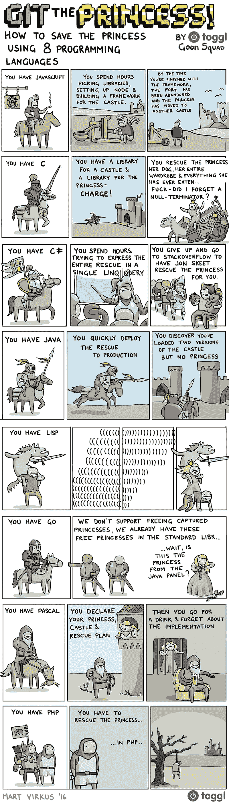

# 冒名顶替综合症:PHP 版

> 原文:[https://dev . to/restore dev/imposter-syndrome-PHP-edition-8p 9](https://dev.to/restoreddev/imposter-syndrome-php-edition-8p9)

[T2】](https://res.cloudinary.com/practicaldev/image/fetch/s--kn0BNYmu--/c_limit%2Cf_auto%2Cfl_progressive%2Cq_auto%2Cw_880/https://thepracticaldev.s3.amazonaws.com/i/tvhkb9ezs40obddvnshp.jpg)

你以前看过这部动画片吗？Lisp 面板特别((((((爆笑))))))。嘲笑编程语言的每一个怪癖都很有趣。除非你是 PHP 开发人员。显然，PHP 并不像所有编程语言一样有独特的缺陷，它只是自杀。

编程是一个惊人的小团体。每个开发人员都有自己喜欢的语言，并有哲学推理或性能排名来支持自己的选择。我喜欢我们在选择技术时的多样性，它让行业保持兴奋和敏捷。然而，我讨厌许多程序员对他们不使用的语言不断的嘲笑。我有罪。“我讨厌 JavaScript，回调地狱是最糟糕的”，“Ruby 就是古怪”，“C#是给微软追星族的”都是我们自己听过或想过的感悟。这些消极的想法源于对技术的缺乏理解，或者源于对验证程序员已经在使用的任何工具的不安全需求。特别是，PHP 一直是这个笑话的笑柄。

我几年前开始使用 PHP，目前在全职工作中使用它。PHP 肯定有它的缺陷，就像其他编程语言一样，但我仍然喜欢它的简单性、开发速度和开放的生态系统。当我开始使用 PHP 时，我没有想到的是，其他程序员甚至非技术人员对这种语言的不断嘲笑。“我是安德鲁，我主要使用 PHP”/“哦哇，对不起”是常见的口头交流。在足够多的这样的对话之后，消极开始影响你。

> 冒名顶替综合症(Impostor syndrome)是一个概念，描述的是那些无法将自己的成就内化，并持续害怕被揭露为“骗子”的人。~维基百科

猜猜谁得了冒名顶替综合症？当你不断觉得你需要学习另一种编程语言时，很容易患上冒名顶替综合症。不管你是用 PHP 开发了一个成功的应用程序，还是你的贡献得到了公司的重视。你的下一个想法会是“我应该用 Java 写这个应用程序”。

治疗骗子综合症的方法之一是接受自己的成就，重视自己的专长。因此，我想传播这个词。如果你写了一个被公司重视的、安全的、易于维护的 app，那么你就是成功的，不管是什么编程语言。如果你是一名初露头角的 PHP 开发人员，不要因为所有的负面消息而气馁，只要做一些伟大的事情就好。如果你不使用 PHP，我鼓励你看看所有用这种语言构建的 web 应用程序，并给它一个机会。也许终究不会那么糟糕: [PHP:正道](http://www.phptherightway.com/)。