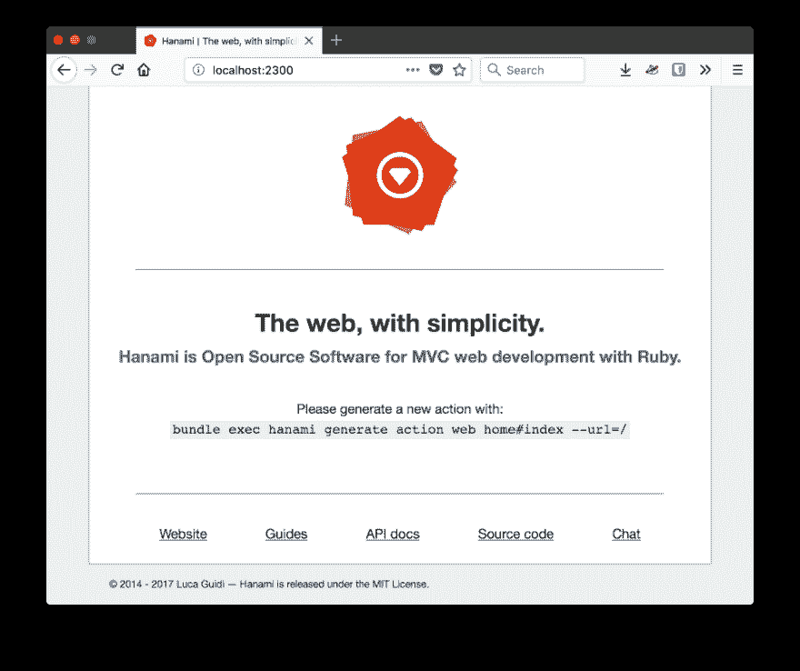
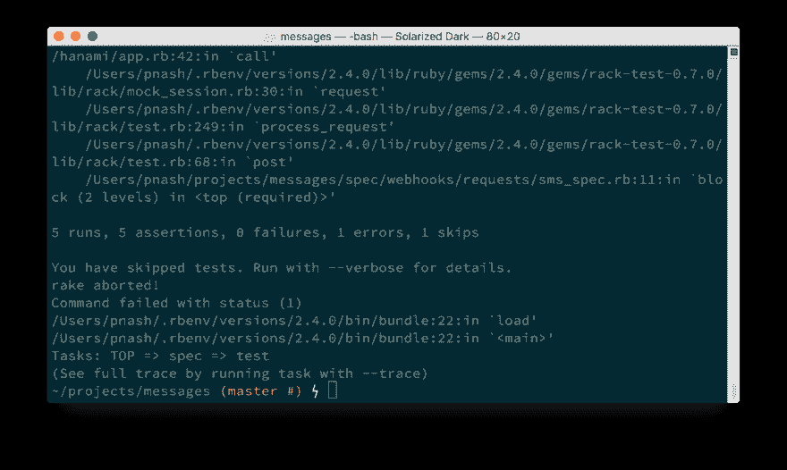
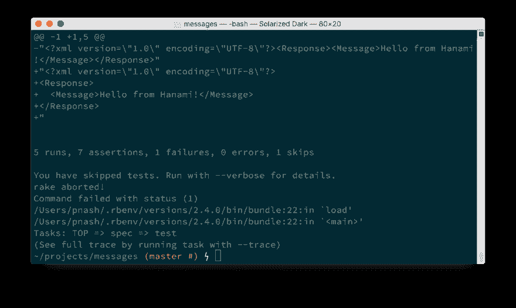
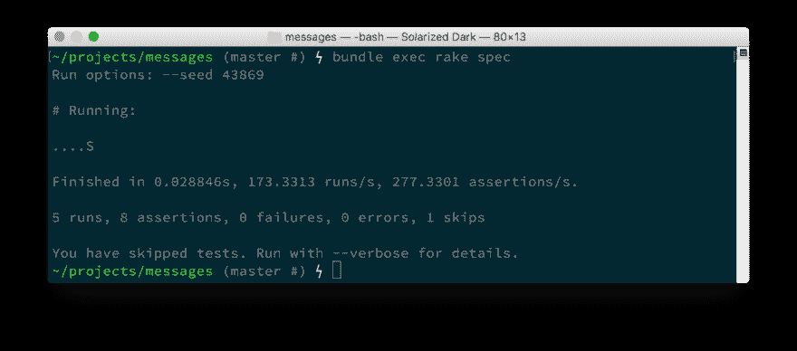
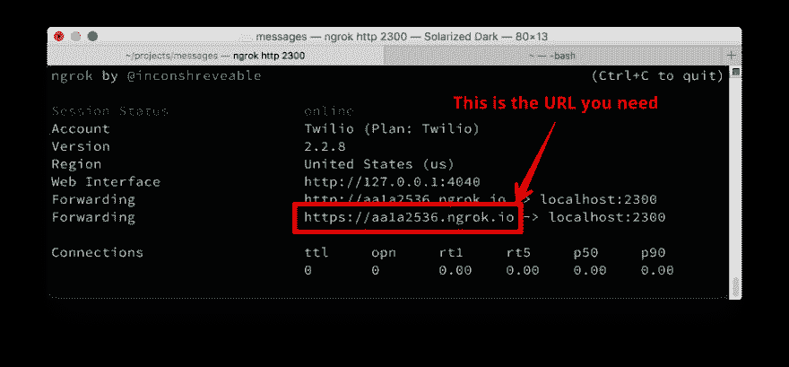
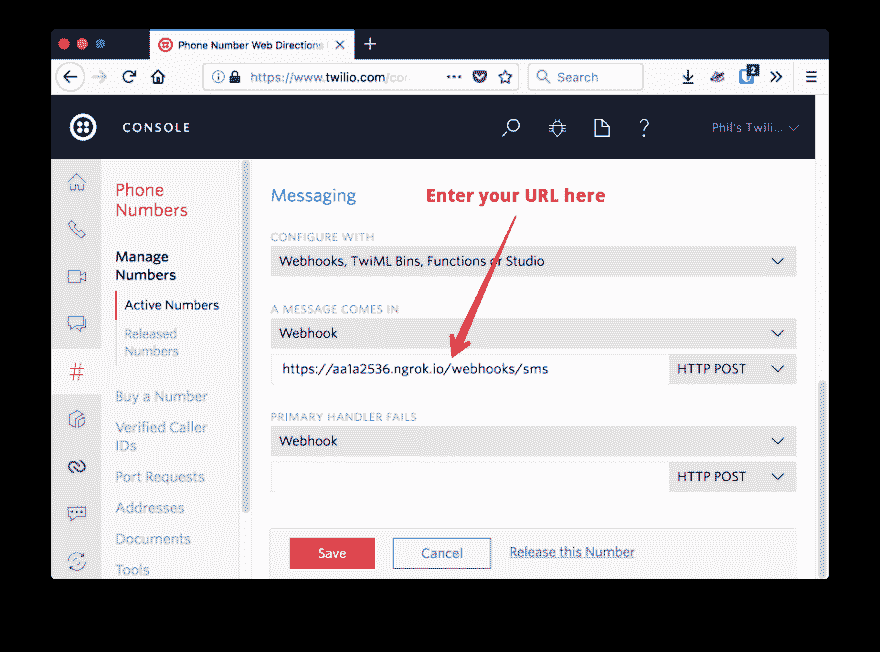
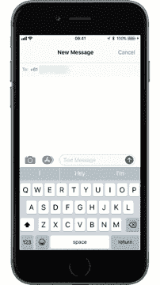

# 如何使用 Hanami 和 Twilio 在 Ruby 中接收和回复短信

> 原文：<https://dev.to/twilio/how-to-receive-and-respond-to-text-messages-in-ruby-with-hanami-and-twilio-7il>

如果你正在用 Ruby 构建 web 应用程序，那么你可能会使用 [Rails](http://rubyonrails.org/) 。 [Hanami](http://hanamirb.org/) 是一家年轻的竞争对手，致力于为 Ruby 开发者提供一个快速、安全和灵活的全功能现代 web 框架。

Hanami 是 Ruby 社区的一个新的 web 应用程序框架。它从 2014 年开始研发，[最初名为 Lotus](http://hanamirb.org/blog/2016/01/22/lotus-is-now-hanami.html) 。2017 年 4 月发布了版本 1，10 月份刚刚发布了版本 1.1。

正如《花见指南》的介绍所说，“如果你曾经觉得自己在‘铁轨上’伸展，你会欣赏花见的。”虽然本文不是对 Hanami 和 Rails 进行比较，但是当我们使用 Hanami 构建时，您将会看到它们的不同之处，并能够决定您更喜欢哪种方法。

让我们研究用 Hanami 构建一个 web 应用程序，该应用程序具有经过测试的 Twilio 特性，可以接收和响应文本消息。

## 你需要什么

要构建这个应用程序，您需要一些东西:

*   Twilio 账户(如果你没有免费账户，你可以[注册一个)](https://www.twilio.com/try-twilio)
*   [一个 Twilio 电话号码](https://www.twilio.com/console/phone-numbers/incoming)，可以发送和接收短信
*   (我在这篇文章中使用的是最新版本，2.4.2，Hanami 至少需要 2.3.0)
*   [捆扎机](http://bundler.io/)
*   [ngrok](https://ngrok.com) ，这样我们就可以[将我们的开发服务器暴露给 Twilio 的 webhooks](https://www.twilio.com/blog/2015/09/6-awesome-reasons-to-use-ngrok-when-testing-webhooks.html)

一旦你有这些位，我们可以安装花见，并开始与我们的应用程序。

## 创建花见应用程序

要创建一个 Hanami 应用程序，我们首先需要安装 gem。打开终端，输入:

```
gem install hanami 
```

Enter fullscreen mode Exit fullscreen mode

现在生成一个新的 Hanami 项目并安装依赖项:

```
hanami new messages
cd messages
bundle install 
```

Enter fullscreen mode Exit fullscreen mode

我们有一个可以运行的 Hanami 应用程序。输入:

```
bundle exec hanami server 
```

Enter fullscreen mode Exit fullscreen mode

访问[http://localhost:2300](http://localhost:2300)，你会看到你现在正在运行你的 Hanami 应用。

[T2】](https://res.cloudinary.com/practicaldev/image/fetch/s--2LOKY2HX--/c_limit%2Cf_auto%2Cfl_progressive%2Cq_auto%2Cw_880/https://twilioinc.wpengine.com/wp-content/uploads/2017/11/b8ZuPjZKSE4SZDOK99bj3C2nsej3-kJfTBgMFHFokM2G6ic-iRLcUego6aWcxrISWqsJ3RpzT0bvN3WujdheFqgiOXsdSFv4ZQkofwaoaD3dUv1AqHEqsH8n0oWh9RTW2k8a0w8.png)

## 巨石第一

花见项目[被描述为“独石第一”](http://hanamirb.org/guides/1.1/architecture/overview/)。当您第一次开始构建 web 应用程序时，微服务可能不是必需的，但是以后您可能想要利用它。Hanami 就是为了在其架构中适应这一点而构建的。

Hanami 项目由两部分组成:

1.  核心，包括模型、存储、邮件程序和其他实现业务逻辑的对象。您可以在 Hanami 项目的`lib`文件夹中找到核心
2.  负责向外界公开功能的应用程序集合。你可以在`apps`文件夹中找到默认的“web”应用

应用程序是 Hanami 的解决方案，用于跨不同的数据呈现和访问方式共享核心业务逻辑。默认应用程序用于您项目的公共网站，[您可以创建一个新的应用程序](http://hanamirb.org/guides/1.1/architecture/overview/#monolith-first)，仅向您站点的管理员展示相同的数据。

我们将为我们希望向 Twilio 的 webhooks 公开的端点使用一个新的应用程序，因为它们是与我们的默认 web UI 完全不同的表示。使用以下命令生成一个新应用:

```
bundle exec hanami generate app webhooks 
```

Enter fullscreen mode Exit fullscreen mode

您现在会在`apps`目录中找到一个名为“webhooks”的新目录。

### 配置 app

现在，我们有了一个单独的应用程序来响应 webhooks，我们可以从 web 界面对它进行不同的配置。Twilio webhooks 期望得到回应 [TwiML](https://www.twilio.com/docs/api/twiml) ，所以我们应该总是用 XML 来回应。我们可以配置我们的 webhooks 应用程序来做到这一点。

打开`apps/webhooks/application.rb`，找到`default_response_format`。取消注释，将其从`:html`更改为`:xml`并保存。

```
default_response_format :xml 
```

Enter fullscreen mode Exit fullscreen mode

这个简单的改变显示了拥有多个应用程序的力量，这些应用程序为核心项目提供不同的交付机制。默认情况下，web 应用程序仍然使用 HTML 进行响应，现在我们的 webhooks 应用程序将默认使用 XML。

### 生成一个动作

要接收和回复传入的 SMS 消息，我们需要一个操作。Hanami 提供了生成器来为我们编写样板代码，所以运行下面的代码:

```
bundle exec hanami generate action webhooks sms#create 
```

Enter fullscreen mode Exit fullscreen mode

这产生了许多问题:

*   `apps/webhooks/config/routes.rb`中的一条路线。[像在 Rails](http://guides.rubyonrails.org/routing.html#resource-routing-the-rails-default) 中一样，Hanami 在生成路由时试图在 HTTP 动词和 REST 之间进行映射，所以既然我们生成了一个“创建”动作，我们现在就有了一个`POST`路由
*   SMS 控制器，它是操作类所在的名称空间
*   创建动作，这是 SMS 控制器中的一个类，它有一个`call`方法，当向路由发出 POST 请求时将调用该方法
*   创建动作的视图，处理对动作响应的呈现
*   创建操作的模板

是时候写一些代码了，而不仅仅是运行生成器。让我们开始一个测试吧！

## 在花见测试

Hanami 非常注重测试，甚至[入门指南](http://hanamirb.org/guides/1.1/getting-started/)也通过测试来驱动你构建的功能。本着这种精神，让我们对 TwiML 端点进行一次测试。

现在让我们构建一个集成测试，随着我们继续我们的功能，您将会看到为什么。

Hanami 包括 [Capybara](http://teamcapybara.github.io/capybara/) 用于交互式页面上的集成测试，但[文档建议使用`Rack::Test`来测试机器可读的端点，如 API 响应](http://hanamirb.org/guides/actions/testing/#requests-tests)。在`spec/webhooks`中创建一个名为`requests`的文件夹，然后在`requests`中创建一个名为`sms_spec.rb`的文件。添加以下测试:

```
require 'spec_helper'

describe "Webhooks SMS response" do
  include Rack::Test::Methods

  def app
    Hanami.app
  end

  it "is successful" do
    post "/webhooks/sms"

    last_response.must_be :ok?
    twiml = Twilio::TwiML::MessagingResponse.new.message(body: 'Hello from Hanami!')
    last_response.body.must_equal twiml.to_s
    last_response.headers['Content-Type'].must_equal 'application/xml; charset=utf-8'
  end
end 
```

Enter fullscreen mode Exit fullscreen mode

在我们运行这个测试之前，您会注意到我们需要 twilio-ruby gem 来生成我们的测试 XML。通过将宝石添加到您的`Gemfile` :
来安装宝石

```
source 'https://rubygems.org'

gem 'rake'
gem 'hanami',           '~> 1.1'
gem 'hanami-model', '~> 1.1'

gem 'sqlite3'

gem 'twilio-ruby'

group :development do 
```

Enter fullscreen mode Exit fullscreen mode

并运行`bundle install`。

现在，运行测试应该会给我们一个错误。

```
bundle exec rake spec 
```

Enter fullscreen mode Exit fullscreen mode

[T2】](https://res.cloudinary.com/practicaldev/image/fetch/s--mXWwqx49--/c_limit%2Cf_auto%2Cfl_progressive%2Cq_auto%2Cw_880/https://twilioinc.wpengine.com/wp-content/uploads/2017/11/VcXK-szZIm-TbDe3eNf9qMs0TYJwhM-7fZRNnOHDVf2Cjcgb90yvdYVa54aq7Aoy2KhD21fR3W2LVlsoIm1wiTxT3ViLIo3auMLW2KPY0F6uP5Fd6P5jE6xdkHNSEvZAY1SYyns.png)

让我们解决这个问题。

## 模板驱动视图

动作生成器创建了`apps/webhooks/templates/sms/create.html.erb`。我们已经更新了应用程序以返回 XML，所以首先将这个文件重命名为`create.xml.erb`。我们可以用[来填充这个 TwiML，我们需要这个 TwiML 来回复一个传入的 SMS 消息](https://www.twilio.com/docs/api/twiml/sms/message) :

```
<?xml version="1.0" encoding="UTF-8"?>
<Response>
  <Message>Hello from Hanami!</Message>
</Response> 
```

Enter fullscreen mode Exit fullscreen mode

再次运行测试。

[T2】](https://res.cloudinary.com/practicaldev/image/fetch/s--QISDGL8V--/c_limit%2Cf_auto%2Cfl_progressive%2Cq_auto%2Cw_880/https://twilioinc.wpengine.com/wp-content/uploads/2017/11/SK8sTdHuHHFwk_axGQysSinV3FBSBkklJH1thooxIS1OpuPUoLyQt5-wIgrP1Ue8fWK1zzBBZDavbkJXk7Up8VjcVU2Ohtt56g5awfAZJDNAJL_VG8ApnaQpWXn9dQEfc9RIp1Y.png)

嗯……应该可以通过，但是由于我们响应中的换行符和缩进，它失败了。我们可以通过从模板中删除这些不必要的空白来解决这个问题，但是让我们研究一下产生这个输出的其他方法。

## 从视图中绕过模板

与 Rails 不同，Hanami 视图是对象。这有助于分离关注点，因为视图对象单独负责返回一个字符串，该字符串将作为响应的主体呈现。因此，我们可以完全绕过模板，直接从视图中渲染身体。

打开`apps/webhooks/views/sms/create.rb`并添加以下内容:

```
module Webhooks::Views::Sms
  class Create
    include Webhooks::View

    def render
      twiml = Twilio::TwiML::MessagingResponse.new
      twiml.message body: 'Hello from Hanami!'
      raw twiml.to_s
    end
  end
end 
```

Enter fullscreen mode Exit fullscreen mode

通过覆盖`render`方法，我们简化了模板并从视图中呈现 TwiML。我们使用`raw`方法来确保 XML 不被转义。

虽然这感觉不对。视图的工作是渲染，而不是创建我们要渲染的对象。这是行动的工作。

打开`apps/webhooks/controllers/sms/create.rb`，你应该找到一个空的`call`方法。当调用操作时，将调用此方法。我们可以在这里生成 TwiML，让视图只呈现输出。

在操作中添加以下内容:

```
module Webhooks::Controllers::Sms
  class Create
    include Webhooks::Action

    expose :twiml

    def call(params)
      @twiml = Twilio::TwiML::MessagingResponse.new
      @twiml.message body: 'Hello from Hanami!'
    end
  end
end 
```

Enter fullscreen mode Exit fullscreen mode

这段代码意味着当动作被调用时，它将生成 TwiML 对象，然后使用`expose`类方法将它公开给视图。现在视图只需要担心内容的呈现。在`apps/webhooks/views/sms/create.rb`中将渲染方法替换为:

```
 def render
      raw twiml.to_s
    end 
```

Enter fullscreen mode Exit fullscreen mode

这次进行测试，他们通过了。

[T2】](https://res.cloudinary.com/practicaldev/image/fetch/s--97fTxPCM--/c_limit%2Cf_auto%2Cfl_progressive%2Cq_auto%2Cw_880/https://twilioinc.wpengine.com/wp-content/uploads/2017/11/t3CLzOtSWOOmSSNbMzC5NxtoK2L0aRt1St31wca6we4OASRfwmCcEndqM5vbyKHq3y0d1D1vbi41awGQm_Q54AjUrG8vYKOzw0dgw7nE4Byk37iE3gLCT4duBA1AgzXRi78OW-8.png)

## 从行动中绕过视图

在这个阶段，视图实际上并没有做太多事情，所以为什么不也绕过它呢？由于我们避免了创建不必要的对象，这可以在应用程序中带来一点点性能改进。

要绕过视图，您可以分配给动作的`body`。将`apps/webhooks/controllers/sms/create.rb`中的代码替换为:

```
module Webhooks::Controllers::Sms
  class Create
    include Webhooks::Action

    def call(params)
      @twiml = Twilio::TwiML::MessagingResponse.new
      @twiml.message body: 'Hello from Hanami!'
      self.body = @twiml.to_s
    end
  end
end 
```

Enter fullscreen mode Exit fullscreen mode

您现在可以删除视图，连同它的测试(`spec/webhooks/views/sms/create_spec.rb`)和模板，因为我们不再使用它们。再次运行测试，你会看到他们通过。这意味着我们已经准备好将应用程序连接到电话号码。

## 连接到 Twilio

我们需要向互联网公开我们的应用程序，用我们刚刚创建的动作来响应传入的文本消息。首先，确保您正在运行应用程序。如果不是，运行:

```
bundle exec hanami server 
```

Enter fullscreen mode Exit fullscreen mode

[我喜欢用一个叫 ngrok](https://www.twilio.com/blog/2015/09/6-awesome-reasons-to-use-ngrok-when-testing-webhooks.html) 的工具来公开应用。按照[的说明下载并安装 ngrok](https://ngrok.com/download) 。然后运行 ngrok，传递我们要将流量转发到的端口号。Hanami 默认运行在端口 2300 上，所以运行:

```
ngrok http 2300 
```

Enter fullscreen mode Exit fullscreen mode

您将看到 ngrok 正在运行，并看到 URL 正在转发到您的 Hanami 应用程序。获取 URL，您将需要在 Twilio 控制台中使用它。

[T2】](https://res.cloudinary.com/practicaldev/image/fetch/s--JyIK0b3s--/c_limit%2Cf_auto%2Cfl_progressive%2Cq_auto%2Cw_880/https://twilioinc.wpengine.com/wp-content/uploads/2017/11/gsBpuLzbpKAuBgXQe8WS9-rOwwLQwdVjhwHGj8ZRaf44R0pYmrkmguEUZd_CGkqSmMgkd7DvPbZT-koo7B8bKYnNxkZZWlfz26gHLXgDTf9wxv8zaEVIbEph9ZFU7OmpzZ2gc2M.png)

打开 [Twilio 控制台](https://www.twilio.com/console)并前往[数字仪表盘](https://www.twilio.com/console/phone-numbers/incoming)。如果你已经有了一个号码，然后点击它进行编辑，否则，给自己买一个新的支持 SMS 的电话号码。

一旦你有了你的号码，是时候为收到的信息设置网页挂钩网址了。获取您之前获得的 ngrok URL，并将我们的操作路径`/webhooks/sms`添加到其中。当有消息进来时，在字段中输入此信息。

[T2】](https://res.cloudinary.com/practicaldev/image/fetch/s--BQxd28pP--/c_limit%2Cf_auto%2Cfl_progressive%2Cq_auto%2Cw_880/https://twilioinc.wpengine.com/wp-content/uploads/2017/11/NjTruqAK0kRmtbpyacPebj8Q2toEHS3lHeNAt4rdBAXE9AIyGMQD0ZFF6Frhu1w6DCKcmf8JNlDKR1t7urJRd0H3RbAp8RTNGZdAWhCNvKFKpXWzKRfUzXkSZhcFF8F_rD6N3a8.png)

省省吧，拿起你的手机。向您的 Twilio 号码发送短信，然后等待 Hanami 应用程序回复您的消息。

[T2】](https://res.cloudinary.com/practicaldev/image/fetch/s--WAdnK5Ly--/c_limit%2Cf_auto%2Cfl_progressive%2Cq_auto%2Cw_880/https://twilioinc.wpengine.com/wp-content/uploads/2017/11/GSrV5cjQGcPWUiES-xJuxBmU-tp2BBmI5xp_-X63DFoudOSJbaE19l-8jQ9QnJc-RfXK5l-Wri0orwY2Ea-DzVlfWghGJZg5zAwSx5zILGPTrCBnn0bNmupbz5jAACB8-uLC5zs.png)

## 欢迎来到花见

我们已经看到了如何设置 Hanami 来接收和响应传入的 SMS 消息。如果你想看到最终的代码[，请查看 GitHub](https://github.com/philnash/sms-messages-hanami) 上的应用程序。如果你想了解更多关于花见的知识，我推荐[花见指南](http://hanamirb.org/guides/1.1/getting-started/)。

我们不仅建立了一个可以回复短信的 Hanami 应用程序，我们还看到了 Hanami 作为一个框架是多么灵活。

*   您可以在一个项目中使用不同的配置创建不同的应用程序
*   响应传入请求的每个阶段都有特定的对象，这使得分离应用程序的关注点变得很容易
*   如果不需要模板和视图，您可以绕过它们

对我来说，这种强大和灵活的结合使 Hanami 成为 Rails 的有力竞争者。让我知道你对 Hanami 的想法，以及你是否会考虑在你的下一次申请中使用它。请在推特上给我打电话@philnash ，给我发电子邮件到 philnash@twilio.com 的T3，或者在下面留言。

* * *

*[如何用 Ruby 接收和回复 Hanami 和 Twilio 的短信](https://www.twilio.com/blog/2017/11/how-to-receive-and-respond-to-text-messages-in-ruby-with-hanami-and-twilio.html)原载于 2017 年 11 月 21 日 [Twilio 博客](https://www.twilio.com/blog)。*