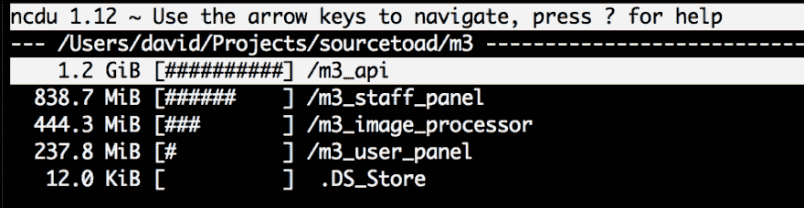

# 在 Linux 和 OSX 中直观查看磁盘使用情况的 CLI 工具

> 原文:[https://dev . to/David _ j _ eddy/CLI-tool-to-visual-see-disk-usage-12b](https://dev.to/david_j_eddy/cli-tool-to-visually-see-disk-usage-12b)

[murze.be](https://murze.be/view-disk-space-usage-on-ubuntu) 刚刚发表了一篇关于 linux 的`ncdu`工具的文章。这是一个基于 cli 的磁盘使用工具。超级方便。所以我想看看 OSX 是否也有。令人惊叹的是！

*   `brew install ncdu`
*   `cd ~/{wherever you want to, probably a project root}`
*   `ncdu`
*   收藏培根！

[T2】](https://res.cloudinary.com/practicaldev/image/fetch/s--Ky1Azmus--/c_limit%2Cf_auto%2Cfl_progressive%2Cq_auto%2Cw_880/https://thepracticaldev.s3.amazonaws.com/i/j4txwr8erbggr6nadv0q.png)