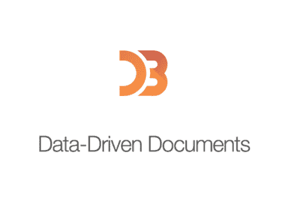
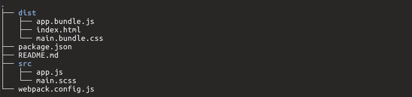
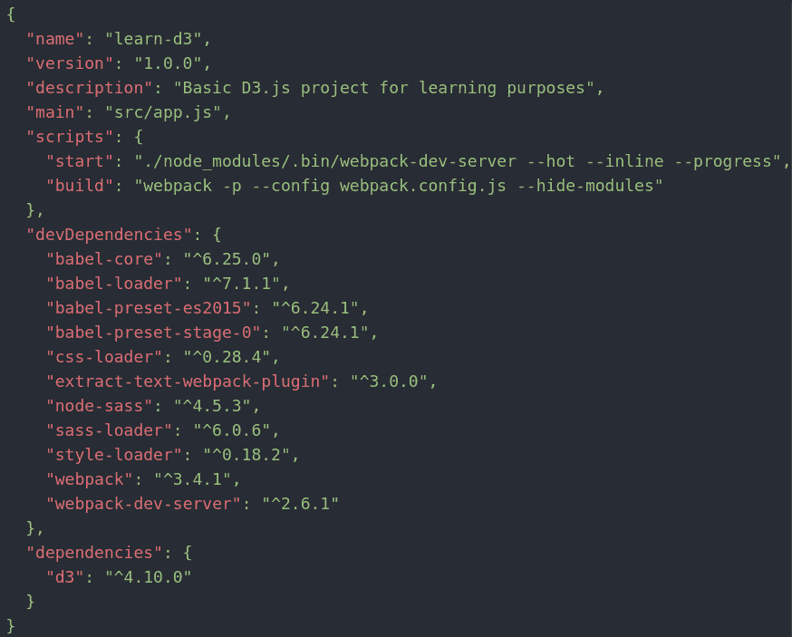
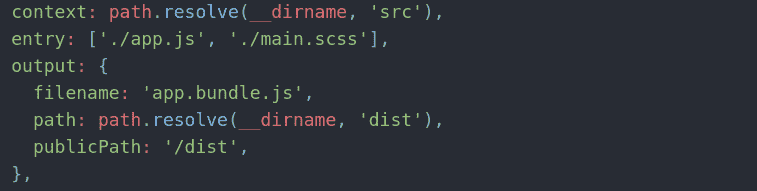
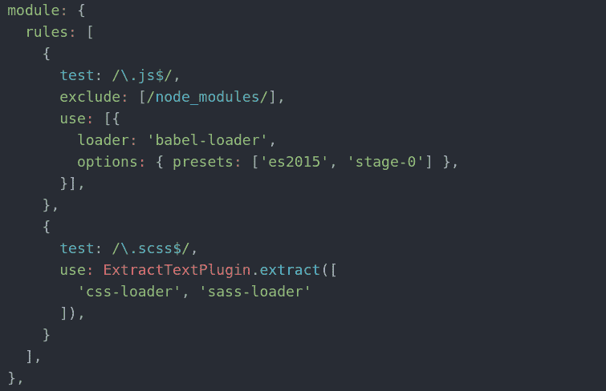
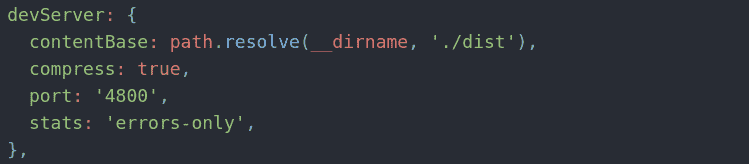

# 用 Babel 和 Webpack 设置 D3.js

> 原文：<https://dev.to/willamesoares/setting-up-d3js-with-babel-and-webpack-dc3>

[T2】](https://res.cloudinary.com/practicaldev/image/fetch/s--i_6_zyuW--/c_limit%2Cf_auto%2Cfl_progressive%2Cq_auto%2Cw_880/http://willamesoares.cimg/posts/d3/d3logo.png)

###### 本帖最初发布于我的个人[博客](http://willamesoares.com)

你好。这是我发现自己在寻找基本设置以便开始学习 [D3.js](https://d3js.org/) 时决定写的一篇文章。是的，我知道，你不需要配置一个 npm 包就可以开始玩 D3。最简单的方法是，你可以去 blockbuilder.org 的[编辑提供的样板代码来看看事情是如何运作的。同样，您可以简单地创建一个 index.html 文件，添加](http://blockbuilder.org/) [D3 CDN](https://cdnjs.com/libraries/d3) ，并包含一个您已经编写了一些 D3 代码的脚本。如果你只是想创建一些草稿，看看 D3 是如何工作的，这些确实是很好的选择。然而，当我们想要创建一个结构良好的项目时，我们必须使用 D3 并处理外部数据源，例如，从一些我们可以轻松扩展的东西开始是很好的。

事实上，真正推动我进行这种设置的是，我发现每次我想看事情如何变化时，都必须打开浏览器并手动重新加载页面，这真的很乏味。现在，如果你考虑用 D3 工作，你基本上是在处理作为输出的视觉材料，你能理解有实时重载是多么好吗？

## 这种设置背后的概念

足够的激励性谈话，让我们进入这个项目设置的一些细节和概念。你可以看看它的 [Github 库](https://github.com/willamesoares/learn-d3)并在阅读时检查文件。

### D3.js

如您所知，D3.js 是一个 JavaScript 库，它使用 HTML、SVG 和 CSS 来创建数据驱动文档的可视化集。你可以在他们的[图库](https://github.com/d3/d3/wiki/Gallery)中看到一些用 D3 创建的惊人的数据可视化。

### Webpack 和 webpack-dev-server

为了给你提供无数的选项来扩展你的项目，这个设置提供了一个基本的 [Webpack](https://webpack.js.org/) 配置文件，你可以根据需要定制它。
至于实时重载选项，这个设置提供了对 [webpack-dev-server](https://webpack.github.io/docs/webpack-dev-server.html) 包的配置，这给了你一个小小的 Node.js [Express](http://expressjs.com/) 服务器。这就是当您对文件进行更改时，允许您重新编译资产的原因。

### 通天塔

这种设置中的另一个好处是可以选择编写 [ES6](http://es6-features.org/#Constants) 代码，这为 JavaScript 添加了新的特性，比如支持常量和箭头函数。
[Babel](https://babeljs.io/) 是一款 Javascript 编译器，允许你编写下一代 Javascript，并持续为你的浏览器提供浏览器兼容的 Javascript 代码。

## 项目结构

该项目基本上由文件夹 src 和 dist 组成，src 中保存了所有尚未编译的源代码，dist 中可以找到为所有代码生成的包。此外，正如您在下面的项目树中看到的，您还可以获得一个`webpack.config.js`和`package.json`，在这里您可以检查项目使用的依赖项。

[T2】](https://res.cloudinary.com/practicaldev/image/fetch/s--QHpkTPot--/c_limit%2Cf_auto%2Cfl_progressive%2Cq_auto%2Cw_880/http://willamesoares.cimg/posts/d3/project-tree.png)

### package.json

首先，让我们检查一下在这个设置中使用的依赖项和命令列表。下面你可以看到`package.json`文件的内容。

[T2】](https://res.cloudinary.com/practicaldev/image/fetch/s--49AFCtuc--/c_limit%2Cf_auto%2Cfl_progressive%2Cq_auto%2Cw_880/http://willamesoares.cimg/posts/d3/packagejson.png)

在脚本块中，您可以看到为启动和构建项目而配置的命令。对于 start 命令，我们使用 node_modules 文件夹中的 webpack-dev-server，考虑到这个包没有全局安装在您的机器上。对于传递给该命令的选项，我们有:

- hot:这将启用服务器中的[热模块更换](https://webpack.github.io/docs/webpack-dev-server.html#hot-module-replacement-with-inline-mode-on-cli)。
- inline:这将 webpack-dev-server 客户机入口点添加到 webpack 配置中。
- progress:在命令行显示编译进度。

build 命令负责使用在`webpack.config.js`中传递的选项，并为您的资产生成定制的构建。为此，我们有:

-p:设置[生产环境配置](https://webpack.js.org/guides/production/)的快捷方式，比如最小化 Javascript 文件，运行 LoaderOptionsPlugin。
- config:指定要使用的配置文件。
- hide-modules:隐藏正在编译的模块上难看的和不必要的输出。

至于依赖项，我们使用`babel-core`、`babel-loader`、`babel-preset-es2015`和`babel-preset-stage-0`来设置巴别塔编译器。此外，我们必须添加依赖关系来处理 CSS 中的 Sass 语法，并将我们的样式捆绑在一个单独的文件中(`main.bundle.css`)。最后，当然，我们在其版本 4.10.0 中添加了 D3 依赖。

### webpack.config.js

在 webpack 配置文件中，您可以定制您的构建过程以满足您的需求。在该项目提供的默认配置中，我们有以下几个部分:

`context`、`entry`、`output`、
、[、、](https://res.cloudinary.com/practicaldev/image/fetch/s--cT_mcraz--/c_limit%2Cf_auto%2Cfl_progressive%2Cq_auto%2Cw_880/http://willamesoares.cimg/posts/d3/webpackcontext.png)

在这里，您基本上是在告诉 webpack 应该在哪里寻找要编译的文件，以及应该将哪些文件用作包的入口点。在这种情况下，我们传递的是`app.js`和`main.scss`文件，所有的脚本和样式都应该导入到这里。之后，输出键表示生成的包文件的文件夹和名称。

`module`
[T4】](https://res.cloudinary.com/practicaldev/image/fetch/s--OA8rgYxZ--/c_limit%2Cf_auto%2Cfl_progressive%2Cq_auto%2Cw_880/http://willamesoares.cimg/posts/d3/webpackmodule.png)

在这里，我们将所有的模块(Javascript 和 Sass 文件)应用到加载器中，这样 webpack 就可以生成浏览器兼容的代码。需要注意的是，加载器是从右到左应用的，这意味着对于我们的样式表来说，对于实例来说，`sass-loader`将在`css-loader`之前应用。

这里使用了`ExtractTextPlugin`,因此我们可以为样式表生成一个单独的文件，而不是将它们附加到最终的`index.html`文件中的样式标签上。

`devServer`
[T4】](https://res.cloudinary.com/practicaldev/image/fetch/s--aSMB7W8V--/c_limit%2Cf_auto%2Cfl_progressive%2Cq_auto%2Cw_880/http://willamesoares.cimg/posts/d3/webpackdevserver.png)

这里是配置`webpack-dev-server`的地方，使实时重装选项对我们可用。首先，我们定义服务器应该在哪个文件夹中查找要服务的静态文件。正如`webpack-dev-server`文档所解释的，这些文件将从内存而不是从磁盘提供，所以即使你没有生成源代码到`dist`文件夹，这些文件仍然会提供给浏览器。

### app.js

这是你可以添加所有 D3 代码的地方。如果你想得到一个更好的结构，你可以创建单独的脚本文件，并把它们导入到这里。下面是作为示例提供的代码片段，其中我们使用了一个 ID 为 root 的 div，它在`index.html`文件中可用。

```
import * as d3 from 'd3'

d3.select('#root')
  .append('h5')
  .append('text')
  .text(`D3 version: ${d3.version}`) 
```

## 项目设置

如果您的机器上已经安装了[节点](https://nodejs.org/en/)和 [npm](https://www.npmjs.com/get-npm?utm_source=house&utm_medium=homepage&utm_campaign=free%20orgs&utm_term=Install%20npm) ，您可以简单地运行下面步骤中列出的命令。

### 1。安装依赖项

```
$ npm install 
```

或者使用纱线

```
$ yarn install 
```

### 2。运行服务器

```
$ npm start 
```

或者使用纱线

```
$ yarn start 
```

现在，您可以打开浏览器并进入`http://localhost:4800/`。您应该看到这个项目使用的 D3 版本，它是由下面显示的片段提供的(在`app.js`中也有)。

```
import * as d3 from 'd3'

d3.select('#root')
  .append('h5')
  .append('text')
  .text(`D3 version: ${d3.version}`) 
```

## 项目构建

如果您想为项目生成缩小的文件，您可以简单地运行下面的命令。

```
$ npm run build 
```

或者使用纱线

```
$ yarn run build 
```

## 加载外部数据

由于加载外部数据是 D3 项目中最常见的事情之一，这个设置包括一个基本的流程来提供数据文件，比如 JSON 和 CSV。
默认文件夹名为`data`，位于项目根目录下。如果你想改变该文件夹的名称或位置，你只需更新`webpack.config.js`中名为`paths`的常量，以匹配你想要的文件夹位置。

在`app.js`文件中，你可以找到一个使用 D3 加载外部文件的例子。在你克隆这个回购的时候，`sample.csv`文件已经被复制到了`dist`文件夹中。但是，如果您想添加更多的数据文件或更改现有的文件，您将不得不构建项目，这样您就可以在`dist`文件夹中获得这些修改。

```
// Loading external data
d3.csv('/data/sample.csv', (error, dataset) => {
  dataset.forEach((data) => {
    console.log(data)
  })
}) 
```

如果一切顺利，那么你就可以开始一些 D3 黑客了。我希望你喜欢这篇文章，如果你有任何意见或贡献，请随时联系我或打开一个拉请求。

最后，看看下面的例子，这样你就能更好地理解我在本文中解释的内容。

玩得开心！:)

[T2】](https://res.cloudinary.com/practicaldev/image/fetch/s--62zUz5UZ--/c_limit%2Cf_auto%2Cfl_progressive%2Cq_66%2Cw_880/http://willamesoares.cimg/posts/d3/d3example.gif)

## 有用的资源

*   [斯考特·玛瑞 D3 教程](http://alignedleft.com/tutorials/d3/)
*   [25+资源从零开始学习 D3.js】](https://blog.modeanalytics.com/learn-d3/)