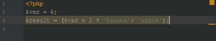

# 给我父亲的情书

> 原文:[https://dev.to/bosepchuk/a-love-letter-to-my-ide-dlb](https://dev.to/bosepchuk/a-love-letter-to-my-ide-dlb)

我不是诗人，也不喜欢公开表露感情，但我控制不住自己。我非常爱你。

### 开始

我总是有某种工具来帮助我写代码。我几乎不好意思说，我是从一个语法高亮文本编辑器和一个 FTP 程序开始我的程序员生涯的。我会写我的代码，保存它，FTP 到服务器，然后运行它，看看它是否“工作”。我知道这听起来很疯狂，但那是在世纪之交，我还年轻，不知道任何更好的东西。

### 我的第一个 IDE

这样编程了几年后，我转到了我的第一个 IDE。它的能力让我惊叹不已。我喜欢它的自动代码格式化、直观的代码导航、自动完成、Subversion 集成，而且它是免费的。但这不是一段完美的关系。我的 IDE 又慢又丑，有时还很难使用。当它发脾气并拒绝服从我的命令时，我们有过几次激烈的争吵。作为一名程序员，我成长得越多，就越挣扎于它的局限性。

### 遇见你的时候

然后我发现你我一见钟情。当您从 Git 导入我的项目并在几分钟内启动和运行时，我知道我做出了正确的决定。我立刻抛弃了我的另一个 IDE，再也没有回头。你可以做我的另一个 IDE 能做的一切，甚至更多。你值得每一分钱。

### 你让我的生活变得更加轻松

你明白我和所有人类一样，认知能力极其有限。我的工作记忆少得可怜，我的思考能力有限，很容易耗尽。不出所料，我累的时候会犯错。但是你尽你所能减少我的[认知负荷](https://en.wikipedia.org/wiki/Cognitive_load)，这使我们成为极好的合作伙伴。

### 你的基本特征是完美

例如，如果我只输入某个东西的前几个字母，你会建议补全。当我试图记住给一个方法调用什么参数时，你可以在我的光标下面显示它们。你在重构方面很棒——是我见过的最好的。当我需要一只手来记住一些东西是如何工作的时候，文档、方法签名等等只是一个热键。

你帮我实现了项目格式的标准化，解决了行尾、文件编码以及将制表符转换成空格的问题。您负责所有的括号和代码格式，这样我就可以专注于我试图解决的逻辑和问题。

您的搜索和替换功能是强大的，可配置的，非常快。我想象不出比这更好的了。

### 检查和静态分析

我喜欢你的代码检查。你不断地扫描我的代码，指出错误或可能的问题。当我第一次运行您的检查时，看到您在我的代码中发现了这么多问题，我感到很惭愧，但是您从来没有幸灾乐祸过。

然而，正如您的检查一样好，您也支持我最喜欢的开箱即用的第三方静态分析器。我指的不是一个可以在终端中运行其他静态分析器的按钮。我指的是完全集成，这样它们会自动运行，并像本机检查一样出现在我的屏幕上。太棒了。

我喜欢你帮我摆脱三元运算符。这是一种把自己伪装成作业的条件，我认为这是邪恶的。我知道这是我个人最讨厌的，我很感激你有足够的可配置性来找到它，并在它出现在我的代码中的任何时候标记它。

[T2】](https://res.cloudinary.com/practicaldev/image/fetch/s--wDojue7f--/c_limit%2Cf_auto%2Cfl_progressive%2Cq_auto%2Cw_880/https://thepracticaldev.s3.amazonaws.com/i/9he7fr3x3pbmj6p7ebqz.png)

### Git 集成

你帮我和 Git 相处，这可不是小壮举。三十年后当我们回头看 Git 时，我们会对这样一个可怕的工具如何成为主流版本控制系统感到困惑。你能想出另一个更难掌握的流行软件吗？无论如何，Git 是我现在需要的最好的 VCS，你帮助平滑粗糙的边缘，隐藏可怕的细节。

你的图形合并冲突解决功能是惊人的。我无法想象如果没有这个插件，我会做什么，这个插件会定期从 origin 获取数据，并不引人注目地让我知道发生了什么变化。谢谢你。

### 测试支持

你在制造时就考虑了测试。我可以通过按键或热键运行我的单元测试。我可以轻松地运行我所有的测试，或者只是一个文件夹，或者只是一个文件，或者只是一个测试或者只是一个测试用例。由于您对无限测试套件配置文件的支持，您还可以支持更复杂的测试设置。当我想尝试基于属性的测试时，你表现得超级酷。这就是灵活性。

### 你真好用

我个人并不认识为你设计和写作的人，但是请转达我的问候。他们不惜一切代价让你变得非常容易使用，高度可配置，同时又非常强大。你的每一次更新都让你变得更好，我迫不及待地想看到你在未来五到十年里不断进步的一切。

你帮助我提高了我编写代码的质量和速度。所以，尽管我们才在一起几年，我还是无法想象没有你的生活。

爱情，

布莱恩