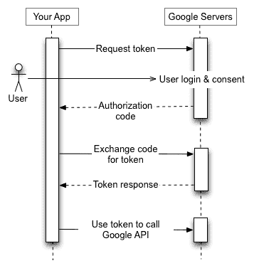
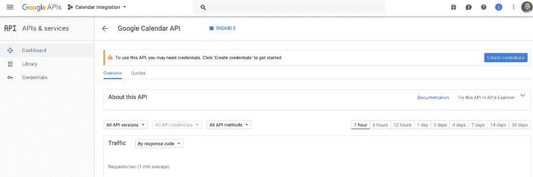
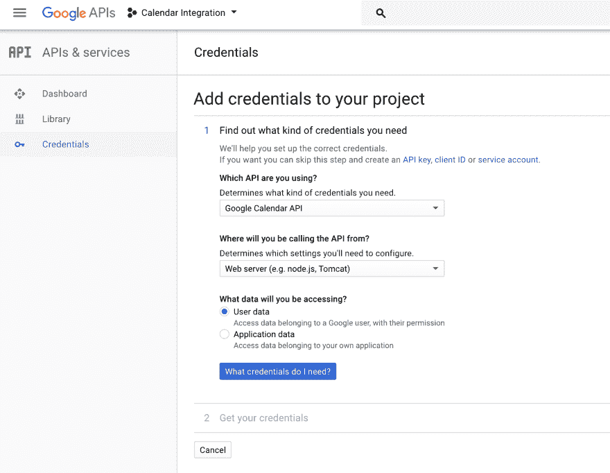
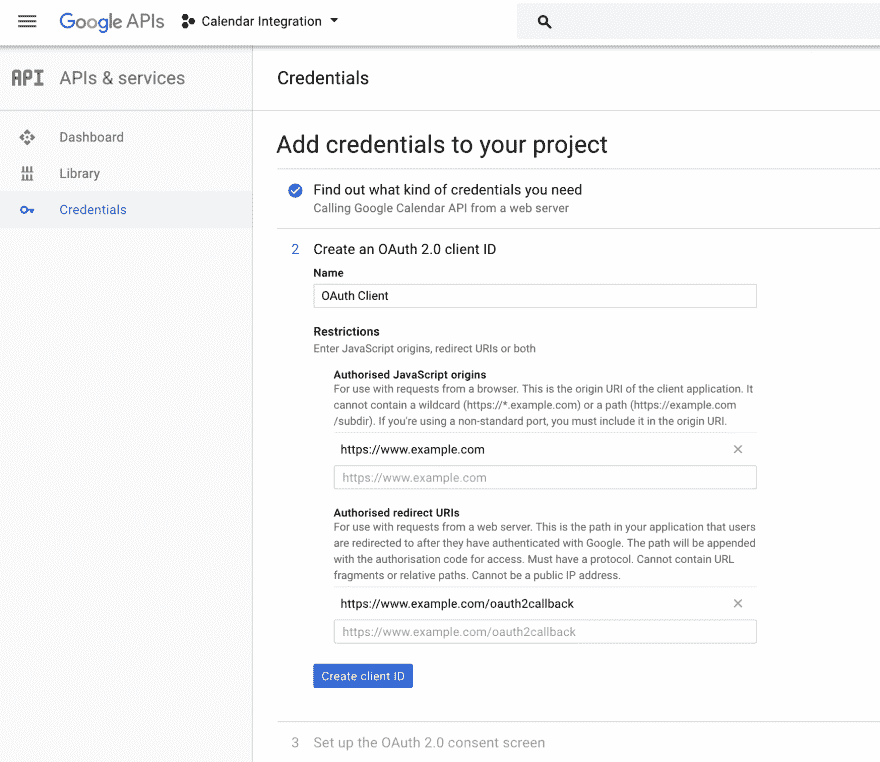
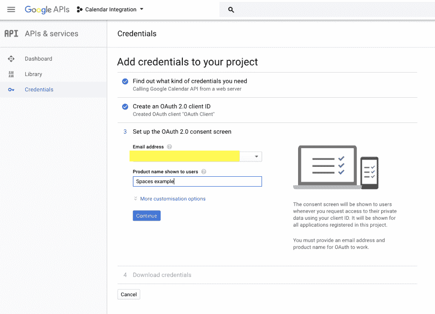
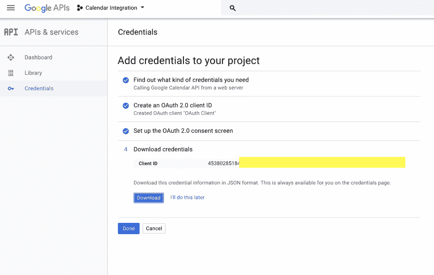
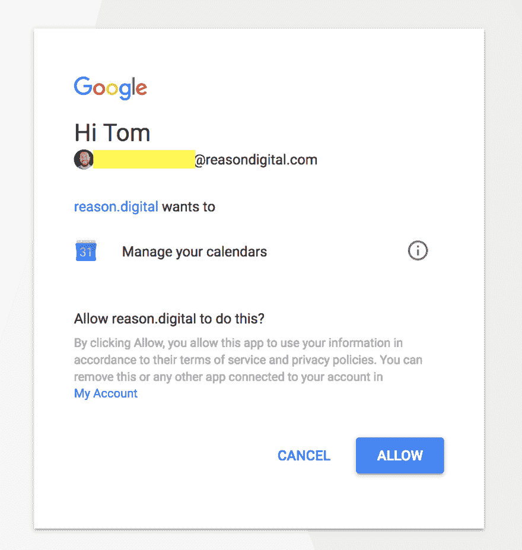

# 将 Google 日历与 Laravel 网站集成

> 原文：<https://dev.to/tommym9/integrating-google-calendar-with-a-laravel-site-2bd>

我们通过 Google API 将 Google Calendar 集成到一个客户端站点(Laravel)的工作已经接近尾声。我想我会写下我们的解决方案，希望能帮助下一个需要这样做的人。

# [T1】简介](#intro)

客户希望将提供免费或低价空间的场所与需要活动空间的青年组织联系起来。

这些场馆在网站上有简介，并有日历显示它们何时可用。要求是场馆能够添加预订到这个日历，它自动添加到链接的谷歌日历，反之亦然。

# 概述

[](https://res.cloudinary.com/practicaldev/image/fetch/s--YcFesmbq--/c_limit%2Cf_auto%2Cfl_progressive%2Cq_auto%2Cw_880/https://thepracticaldev.s3.amazonaws.com/i/j9dia7pp02w6e6tpcuoh.png) 
图片来源:【https://developers.google.com/identity/protocols/OAuth2】T4

为了从场馆链接的谷歌日历中提取任何数据，场馆必须同意该网站访问这些数据。

如上图所示，场馆同意向网站提供授权码，网站可以用该授权码与 Google API 交换访问令牌。该访问令牌只能用于与场馆同意访问的服务进行交互。在这种情况下，它是谷歌日历。

# 创建项目

第一步是让客户使用他们的谷歌账户建立一个项目。谷歌的快速入门指南给出了一个很好的演示:[https://developers . Google . com/Google-apps/calendar/quick start/PHP](https://developers.google.com/google-apps/calendar/quickstart/php)

它还包括启动和运行演示，但我将跳过这一步。

一旦项目设置完毕，客户端需要设置通过该项目访问 Google Calendar API 的凭证。

[T2】](https://res.cloudinary.com/practicaldev/image/fetch/s--ypRP-D59--/c_limit%2Cf_auto%2Cfl_progressive%2Cq_auto%2Cw_880/https://thepracticaldev.s3.amazonaws.com/i/4zh6jnakbpekiwp8rkds.png)

# 添加凭证

有一个创建凭据的向导。这不是令人惊讶的清晰，所以这里是我们设置的截图。注意:我使用了虚拟内容，而不是客户端数据。

第一步询问将使用哪个 API 以及如何访问它
[](https://res.cloudinary.com/practicaldev/image/fetch/s--ZnTMBVCu--/c_limit%2Cf_auto%2Cfl_progressive%2Cq_auto%2Cw_880/https://thepracticaldev.s3.amazonaws.com/i/9t0wrsrbvojo0aoact44.png)

第二步是将 URL 列入白名单，并设置 oAuth 回调路径。
[T3】](https://res.cloudinary.com/practicaldev/image/fetch/s--IBoeIH7E--/c_limit%2Cf_auto%2Cfl_progressive%2Cq_auto%2Cw_880/https://thepracticaldev.s3.amazonaws.com/i/02mb7rz7cveanlgs2tey.png)

第三步是设置场馆将收到的同意书。
[T3】](https://res.cloudinary.com/practicaldev/image/fetch/s--oY3U9JpL--/c_limit%2Cf_auto%2Cfl_progressive%2Cq_auto%2Cw_880/https://thepracticaldev.s3.amazonaws.com/i/nw5ukwaud821m5py55t9.png)

第四步为您提供客户端 ID 和凭证。
[T3】](https://res.cloudinary.com/practicaldev/image/fetch/s--p03uPRrD--/c_limit%2Cf_auto%2Cfl_progressive%2Cq_auto%2Cw_880/https://thepracticaldev.s3.amazonaws.com/i/zu1tjdxycpxco3fqxkqw.png)

在最后一个屏幕上单击“下载”会显示 client_id.json 文件，这是通过客户端项目访问 API 的站点密钥。这应该存储在服务器的私有位置。

```
{  "web":{  "client_id":"[hash-string].apps.googleusercontent.com",  "project_id":"calendar-integration-[project-id]",  "auth_uri":"https://accounts.google.com/o/oauth2/auth",  "token_uri":"https://accounts.google.com/o/oauth2/token",  "auth_provider_x509_cert_url":"https://www.googleapis.com/oauth2/v1/certs",  "client_secret":"[hash-string]",  "redirect_uris":[  "https://www.example.com/oauth2callback"  ],  "javascript_origins":[  "https://www.example.com"  ]  }  } 
```

Enter fullscreen mode Exit fullscreen mode

# 需要 Google API 客户端

由于这是一个 Laravel 网站，我们已经有了 Composer 设置，所以首先我们需要谷歌 API 客户端:

`composer require google/apiclient:^2.0`

这为我们提供了一个 PHP 库来与 Google APIs 进行通信，并为每个 API 和 OAuth2 提供了大量的帮助函数。

更多信息可以在这里找到:[https://github.com/google/google-api-php-client](https://github.com/google/google-api-php-client)

# 授权

## 请求同意

该网站的第一步是为场馆提供一种方法，允许网站访问他们的谷歌日历。

为此，我们需要创建一个链接，将发送到谷歌场地，这将显示同意屏幕。

为此，我们将初始化由`google/apiclient`提供的谷歌客户端，并设置我们的应用程序特定的设置。

```
<?php

namespace App\Helpers;

// Initialise the client.
$client = new Google_Client();
// Set the application name, this is included in the User-Agent HTTP header.
$client->setApplicationName('Calendar integration');
// Set the authentication credentials we downloaded from Google.
$client->setAuthConfig('[private-path]/client_id.json');
// Setting offline here means we can pull data from the venue's calendar when they are not actively using the site.
$client->setAccessType("offline");
// This will include any other scopes (Google APIs) previously granted by the venue
$client->setIncludeGrantedScopes(true);
// Set this to force to consent form to display.
$client->setApprovalPrompt('force');
// Add the Google Calendar scope to the request.
$client->addScope(Google_Service_Calendar::CALENDAR);
// Set the redirect URL back to the site to handle the OAuth2 response. This handles both the success and failure journeys.
$client->setRedirectUri(URL::to('/') . '/oauth2callback'); 
```

Enter fullscreen mode Exit fullscreen mode

*注意:*上面的代码块用于所有与 Google API 的交互。我们把它放在一个助手类中，这样我们就不用在任何地方复制它了。

一旦我们有了谷歌客户端设置，我们可以使用内置的`createAuthUrl()`方法返回一个链接到谷歌的场馆同意他们的谷歌日历。

```
<?php
// Set state allows us to match the consent to a specific venues
$client->setState($venue->id);
// The Google Client gives us a method for creating the 
$client->createAuthUrl(); 
```

Enter fullscreen mode Exit fullscreen mode

当 venue 点击链接时，他们会被重定向到 Google，并被要求同意该网站访问他们的 Google 日历。

[T2】](https://res.cloudinary.com/practicaldev/image/fetch/s--5UYEvLb8--/c_limit%2Cf_auto%2Cfl_progressive%2Cq_auto%2Cw_880/https://thepracticaldev.s3.amazonaws.com/i/arawr1f1nixqng5qbbbj.png)

## 处理响应

Google 会将场地重定向回此处指定的网址`$client->setRedirectUri(URL::to('/') . '/oauth2callback');`。如果场馆同意访问他们的谷歌日历，或者他们拒绝访问，则使用该路线。

```
<?php
/**
 * Google OAuth2 route
 */
Route::get('oauth2callback', [
    'as' => 'oauth',
    'uses' => 'OAuthController@index'
]); 
```

Enter fullscreen mode Exit fullscreen mode

这条路径表示当对`/oauth2callback`发出 GET 请求时，使用`OAuthController`控制器中的`index`方法。

更多关于 Laravels 路由的信息可以在这里找到:[https://laravel.com/docs/5.5/routing](https://laravel.com/docs/5.5/routing)

这就是那个方法的样子:

```
<?php

public function index(Request $request)
    {
        // Get all the request parameters
        $input = $request->all();

        // Attempt to load the venue from the state we set in $client->setState($venue->id);
        $venue = Venue::findOrFail($input['state']);

        // If the user cancels the process then they should be send back to
        // the venue with a message.
        if (isset($input['error']) &&  $input['error'] == 'access_denied') {
            \Session::flash('global-error', 'Authentication was cancelled. Your calendar has not been integrated.');
            return redirect()->route('venues.show', ['slug' => $venue->slug]);

        } elseif (isset($input['code'])) {
            // Else we have an auth code we can use to generate an access token

            // This is the helper we added to setup the Google Client with our 
            // application settings
            $gcHelper = new GoogleCalendarHelper($venue);

            // This helper method calls fetchAccessTokenWithAuthCode() provided by 
            // the Google Client and returns the access and refresh tokens or 
            // throws an exception
            $accessToken = $gcHelper->getAccessTokenFromAuthCode($input['code']);

            // We store the access and refresh tokens against the venue and set the 
            // integration to active.
            $venue->update([
                'gcalendar_credentials' => json_encode($accessToken),
                'gcalendar_integration_active' => true,
            ]);

            \Session::flash('global-success', 'Google Calendar integration enabled.');
            return redirect()->route('venues.show', ['slug' => $venue->slug]);
        }
    } 
```

Enter fullscreen mode Exit fullscreen mode

现在，我们可以使用从`fetchAccessTokenWithAuthCode()`返回的访问令牌来访问场馆的谷歌日历。这个方法不仅仅返回访问令牌，它还返回一些其他的位:

```
{  "access_token":"[hash-string]",  "token_type":"Bearer",  "expires_in":3600,  "created":1510917377,  "refresh_token":"[hash-string]"  } 
```

Enter fullscreen mode Exit fullscreen mode

这个返回已经被 json 编码存储在数据库中。

这个令牌只能存在一个小时，如上面的`expires_in`所示。当访问令牌过期时，我们将需要使用`refresh_token`来请求新的访问令牌。

## 刷新访问令牌

Google 客户端提供了检查当前访问令牌是否过期的方法。我们将上面 JSON 的值`$venue->gcalendar_credentials`传递给`setAccessToken()`，然后在令牌过期时刷新令牌。

```
<?php
// Refresh the token if it's expired.
$client->setAccessToken($venue->gcalendar_credentials);
if ($client->isAccessTokenExpired()) {
    $accessToken = $client->fetchAccessTokenWithRefreshToken($client->getRefreshToken());
    $venue->update([
        'gcalendar_credentials' => json_encode($accessToken),
    ]);
} 
```

Enter fullscreen mode Exit fullscreen mode

我们再次将它保存在数据库中。这被添加到我们设置的助手类中，用来初始化 Google 客户端。

# 从谷歌日历中提取预订

现在我们有一个有效的访问令牌，我们可以开始轮询场馆的谷歌日历事件。

```
<?php

// Load up the helper to initialise the Google Client
$gcHelper = new GoogleCalendarHelper($venue);

// Use the Google Client calendar service. This gives us methods for interacting 
// with the Google Calendar API
$service = $gcHelper->getCalendarService();

// Set over what timeframe we want to grab calendar events
// Dates must be an RFC3339 timestamp with mandatory time zone offset, e.g.,
// 2011-06-03T10:00:00-07:00
$optParams = array(
    'orderBy' => 'startTime',
    'singleEvents' => true,
    'timeMin' => '2011-06-03T10:00:00-07:00',
    'timeMax' => '2011-06-03T10:00:00-23:00',
);

// Poll this venue's Google Calendar
$googleBookings = $service->events->listEvents($calendarId, $optParams);

// Check if we have any events returned
if (count($googleBookings->getItems()) > 0) { 
```

Enter fullscreen mode Exit fullscreen mode

一旦我们从谷歌日历中获得了一个事件列表，我们就将它们保存到数据库中，在网站上显示为预订。

# 将预订推送到谷歌日历

当一个场馆向网站添加预订时，他们的 Google 日历中会自动创建一个预订。

```
<?php

// Set the start time and date for pushing to Google.
$tz = new DateTimeZone('Europe/London');
$startTime = Carbon::create(
    2017,
    11,
    25,
    10,
    0,
    0,
    $tz
);

// Use the Google date handling provided by the Google Client
$googleStartTime = new Google_Service_Calendar_EventDateTime();
$googleStartTime->setTimeZone($tz);
$googleStartTime->setDateTime($endTime->format('c'));

// Create the calendar event and give a default title.
$event = new Google_Service_Calendar_Event();
$event->setStart($googleStartTime);
// Same process to create end time as we use for the start time above. Code 
// omitted for brevity.
$event->setEnd($googleEndTime);
$event->setSummary('Booking automatically created from Calendar Example');

// Use the Google Client calendar service to push 
$service = $gcHelper->getCalendarService();
$createdEvent = $service->events->insert($calendarId, $event);

// Save the newly created event id against the booking.
if (!empty($createdEvent->id)) { 
```

Enter fullscreen mode Exit fullscreen mode

如果`$createdEvent`有一个 id，那么我们已经成功地将此预订作为一个新事件推送到 Google 日历中。

这个 id 可以用来从 Google 日历中删除事件，就像 so `$service->events->delete($calendarId,$eventId);`一样。

# 明白了

## 刷新令牌

根据我们的经验，`$client->setApprovalPrompt('force');`需要与 auth 令牌一起取回刷新令牌。看了一堆 SO 文章，看起来这也应该迫使用户在每次授权令牌过期时同意他们的 Google 日历，但对我们来说情况并非如此。

## Timezones

你会注意到，当我们在场地的谷歌日历中创建活动时，我们将时区设置为`Europe/London`。默认情况下，API 使用美国时区之一。这不适合我们英国人。

## 创建事件

当一个事件通过 API 被创建时，场馆仍然需要把他们拉进他们的日程表。这就像有人邀请你参加一个活动，你必须在它进入你的日历之前接受。

# 总结

总之，使用 Google API 对于`google/apiclient`来说非常简单。OAuth 的东西是最棘手的部分，这主要是由于 SO 和其他网站上关于 auth/access/refresh 令牌如何工作的许多相互矛盾的信息。

Google 文档本身对于最好的情况是好的，但是关于什么时候出错的信息是不存在的。

欢迎任何和所有的评论