# 在 Lexer 的帮助下，正确阅读代码

> 原文：<https://dev.to/vaidehijoshi/reading-code-right-with-some-help-from-the-lexer-61d>

<figure>[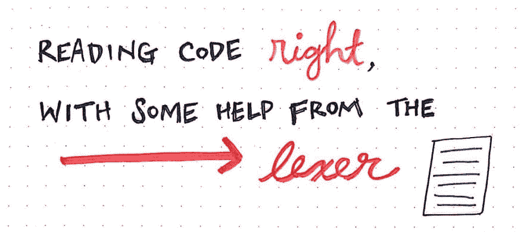](https://res.cloudinary.com/practicaldev/image/fetch/s--mvmMiHPT--/c_limit%2Cf_auto%2Cfl_progressive%2Cq_auto%2Cw_880/https://cdn-images-1.medium.com/max/1024/1%2A60jM612MnBJEc0CJrnngvA.jpeg) 

<figcaption>阅读正确的代码，借助 lexer。</figcaption>

</figure>

软件都是关于逻辑的。编程被认为是一个数学和疯狂方程式非常多的领域。计算机科学似乎是这种误解的症结所在。

当然，有一些数学和一些公式——但是我们没有人真的需要有微积分博士学位才能理解我们的机器是如何工作的！事实上，我们在编写代码的过程中学到的许多规则和范例，与应用于复杂的计算机科学概念的规则和范例是相同的。有时候，这些想法实际上来源于计算机科学的 *，而我们只是从来不知道而已。*

不管我们使用什么编程语言，当我们大多数人编写代码时，我们的目标是将不同的东西封装到类、对象或方法中，有意地将代码的不同部分分开。换句话说，我们知道将我们的代码分开，让一个类、对象或方法只关心和负责一件事情，这通常是件好事。如果我们不这样做，事情可能会变得超级混乱，并交织成一个混乱的网络。有时，即使关注点分离，这种情况仍然会发生。

事实证明，甚至我们计算机的内部工作也遵循非常相似的设计模式。例如，我们的编译器有不同的部分，每个部分负责处理编译过程的一个特定部分。上周，当[我们学习负责创建解析树的解析器](https://dev.to/vaidehijoshi/grammatically-rooting-oneself-with-parse-trees-16a)时，我们遇到了一点这种情况。但是解析器不可能承担所有的任务。

解析器需要它的伙伴们的帮助，现在我们终于可以知道他们是谁了！

### 逐步进入编译器

当我们最近学习解析时，我们尝试了语法、句法，以及编译器如何在编程语言中对这些事情做出反应。但是我们从来没有真正强调编译器到底是什么！随着我们深入到编译过程的内部工作，我们将会学到很多关于编译器设计的知识，所以理解我们在这里到底在谈论什么是至关重要的。

编译器听起来有点可怕，但他们的工作实际上并不太复杂，难以理解——特别是当我们将编译器的不同部分分解成小部分时。

但是首先，让我们从最简单的定义开始。一个 ***编译器*** 是一个程序，它读取我们的代码(或任何编程语言中的任何代码)，并将其翻译成另一种语言。

<figure>[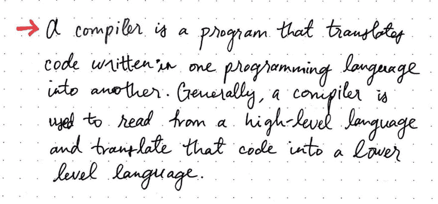](https://res.cloudinary.com/practicaldev/image/fetch/s--2bDmhGPk--/c_limit%2Cf_auto%2Cfl_progressive%2Cq_auto%2Cw_880/https://cdn-images-1.medium.com/max/1024/1%2Aq0vT9J6ylmIe2t-IvnWdtw.jpeg) 

<figcaption>编译器:一个定义。</figcaption>

</figure>

一般来说，编译器实际上只会把代码从高级语言翻译成低级语言。编译器将代码翻译成的低级语言通常被称为汇编代码、机器代码或目标代码。值得一提的是，大多数程序员并没有真正处理或编写任何机器代码；相反，我们依赖编译器将我们的程序翻译成机器代码，也就是我们的计算机将运行的可执行程序。

我们可以认为编译器是我们、程序员和计算机之间的中间人，计算机只能运行低级语言的可执行程序。

> 编译器以我们的机器可以理解和执行的方式翻译我们想要发生的事情。

如果没有编译器，我们将被迫通过编写难以理解和破译的机器码来与计算机交流。机器代码对人眼来说可能看起来只是一堆 0 和 1——都是二进制的，[还记得](https://dev.to/vaidehijoshi/bits-bytes-building-with-binary)吗？—这使得读取、写入和调试变得非常困难。编译器为我们这些程序员抽象出了机器码，因为它让我们很容易不用考虑机器码，而是用更优雅、清晰、易读的语言编写程序。

在接下来的几周里，我们将继续解开越来越多关于这个神秘编译器的谜团，希望在这个过程中它不那么神秘。但是现在，让我们回到手头的问题:编译器最简单的部分是什么？

每个编译器，无论如何设计，都有不同的阶段。这些阶段是我们区分编译器独特部分的方式。

<figure>[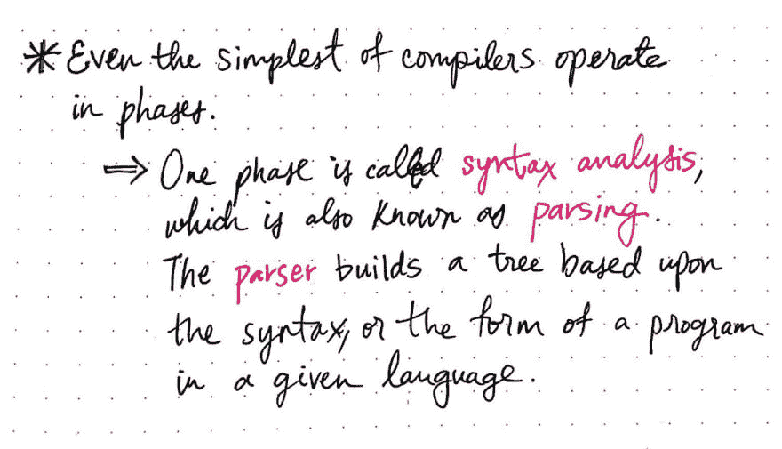](https://res.cloudinary.com/practicaldev/image/fetch/s--4B3vk_ut--/c_limit%2Cf_auto%2Cfl_progressive%2Cq_auto%2Cw_880/https://cdn-images-1.medium.com/max/1024/1%2AAIvVRxpq2OIvE-l_xP-64Q.jpeg) 

<figcaption>语法分析:编译器的第一阶段</figcaption>

</figure>

当我们最近了解到[解析器和解析树](https://dev.to/vaidehijoshi/grammatically-rooting-oneself-with-parse-trees-16a)时，我们已经遇到了编译冒险中的一个阶段。我们知道，*解析*是获取一些输入并从中构建一棵*解析树*的过程，这有时被称为 ***解析*** 的动作。事实证明，解析的工作特定于编译过程中的一个阶段，称为 ***语法分析*** 。

然而，解析器并不只是凭空构建一棵解析树。它有一些帮助！我们还记得，解析器被赋予了一些*标记*(也称为*终端*)，它从这些标记中构建了一个解析树。但是它从哪里得到这些代币呢？幸运的是，解析器不必在真空中操作；相反，它有一些帮助。

这就把我们带到了编译过程的另一个阶段，这个阶段在语法分析阶段之前: ***词法分析阶段*** 。

<figure>[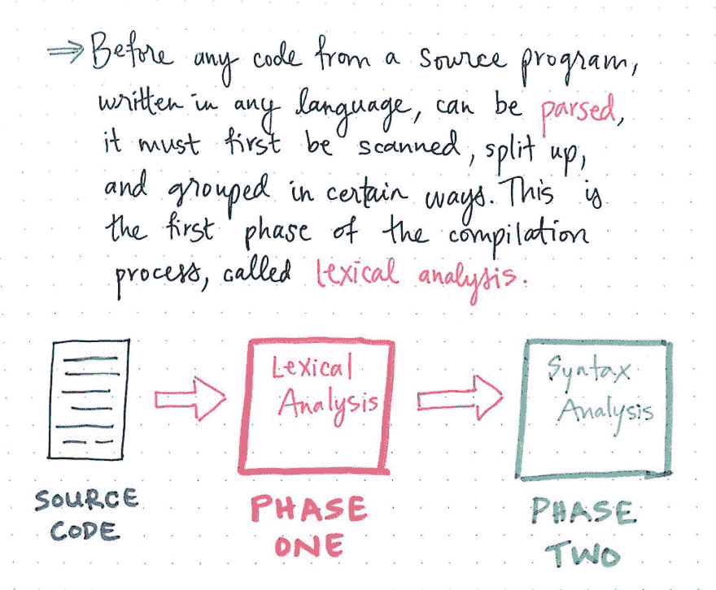](https://res.cloudinary.com/practicaldev/image/fetch/s--OFrtqiwp--/c_limit%2Cf_auto%2Cfl_progressive%2Cq_auto%2Cw_880/https://cdn-images-1.medium.com/max/1024/1%2AM4Aajot1rhEZ2ayQeinqww.jpeg) 

<figcaption>编译器的初始阶段</figcaption>

</figure>

术语*“词汇的”*指的是一个单词的意思与包含它的句子相分离，不考虑它的语法上下文。如果我们试图仅仅根据这个定义来猜测我们自己的意思，我们可以假设词法分析阶段与程序中的单个单词/术语本身有关，而与语法或包含这些单词的句子的意思无关。

> 词法分析阶段是编译过程的第一步。它不知道也不关心一个句子的语法或一篇文章或程序的意思；它所知道的只是单词本身的意思。

词法分析必须在源程序的任何代码被解析之前进行。在程序被解析器读取之前，它必须首先被扫描、分割并以某种方式组合在一起。

当我们上周开始查看[语法分析阶段](https://dev.to/vaidehijoshi/grammatically-rooting-oneself-with-parse-trees-16a)时，我们了解到解析树是通过查看句子的各个部分并将表达式分解成更简单的部分来构建的。但是在词法分析阶段，编译器不知道或无法访问这些“单独的部分”。相反，它必须首先识别并找到它们，然后将文本分割成单独的片段。

例如，当我们读到莎士比亚的一句话时，我们喜欢睡觉，或者做梦。我们知道空格和标点符号分隔了一个句子的“单词”。当然，这是因为我们被训练去阅读一个句子，“lex”它，并解析它的语法。

但是，对于编译器来说，第一次读这个句子时，它可能是这样的:Tosleepperhachancetodream。当我们阅读*这个*句子时，我们就有点难以确定实际的“单词”是什么了！我相信我们的编译器也有同样的感觉。

那么，我们的机器如何处理这个问题呢？在编译过程的词法分析阶段，它总是做两件重要的事情:它 ***扫描*** 代码，然后它 ***评估*** 代码。

<figure>[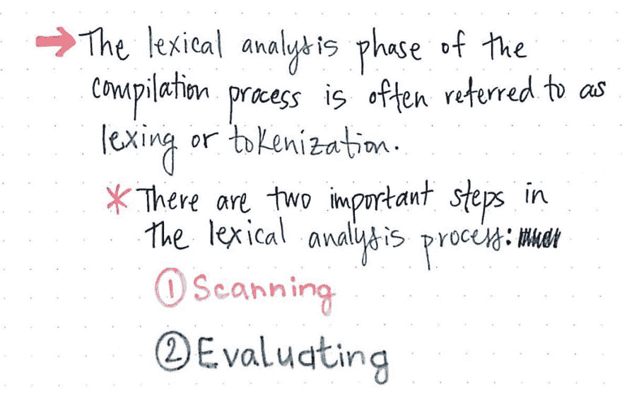](https://res.cloudinary.com/practicaldev/image/fetch/s--WcXc7gHM--/c_limit%2Cf_auto%2Cfl_progressive%2Cq_auto%2Cw_880/https://cdn-images-1.medium.com/max/1024/1%2A3uLsp6ofW0yb5qW9xKGlYQ.jpeg) 

<figcaption>词法分析过程的两个步骤！</figcaption>

</figure>

扫描和评估的工作有时可以集中在一个程序中，也可以是两个相互依赖的独立程序；这实际上只是一个编译器是如何被设计出来的问题。编译器内负责执行扫描和评估工作的程序通常被称为*词法分析器或 ***分词器*** ，整个词法分析阶段有时被称为 ***词法分析*** 或 ***分词*** 的过程。*

 *### 扫描，怪里怪气地阅读

词法分析中两个核心步骤的第一步是 ***扫描*** 。我们可以把扫描看作是实际“阅读”一些输入文本的工作。记住，这个输入文本可以是一个字符串、一个句子、一个表达式，甚至是一个完整的程序！这并不重要，因为在这个过程的这个阶段，它只是一个巨大的字符块，还没有任何意义，是一个连续的块。

让我们看一个例子，看看这到底是如何发生的。我们会用我们原来的句子，睡觉，偶尔做梦。，也就是我们的 ***源码*** 或者 ***源码*** 。对于我们的编译器来说，这个源文本将作为输入文本被读取，看起来像是睡着了，或者睡着了。，这只是一串尚未被破译的字符。

<figure>[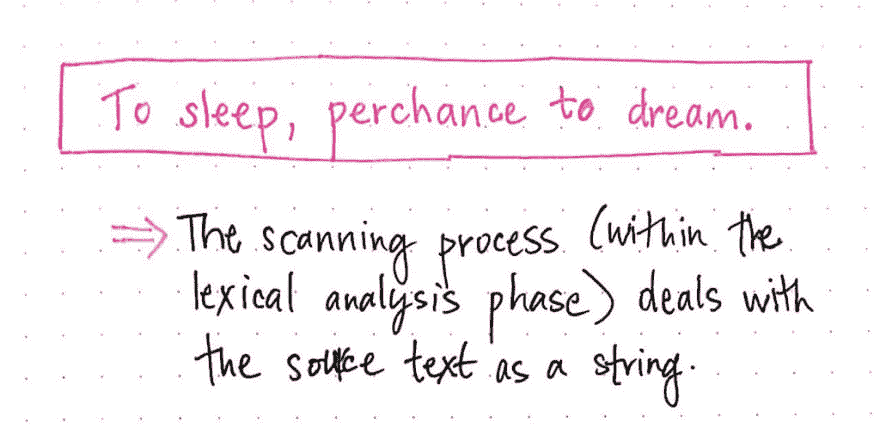](https://res.cloudinary.com/practicaldev/image/fetch/s--l_j4HZXT--/c_limit%2Cf_auto%2Cfl_progressive%2Cq_auto%2Cw_880/https://cdn-images-1.medium.com/max/1024/1%2A5Fqzasm9-6PLE9ty545k7Q.jpeg) 

<figcaption>扫描流程，步骤 1。</figcaption>

</figure>

我们的编译器要做的第一件事实际上是将文本块分割成尽可能小的块，这将使识别文本块中的单词的实际位置变得容易得多。

> 阅读一大段文本最简单的方法是缓慢而系统地阅读，一次一个字符。这正是编译器要做的。

通常，扫描过程由一个名为 ***扫描器*** 的独立程序处理，其唯一的工作是一次一个字符地读取源文件/文本。对我们的扫描仪来说，我们的文本有多大并不重要；当它“读取”我们的文件时，它只能一次看到一个字符。

下面是我们的扫描仪会读出的莎士比亚句子:

<figure>[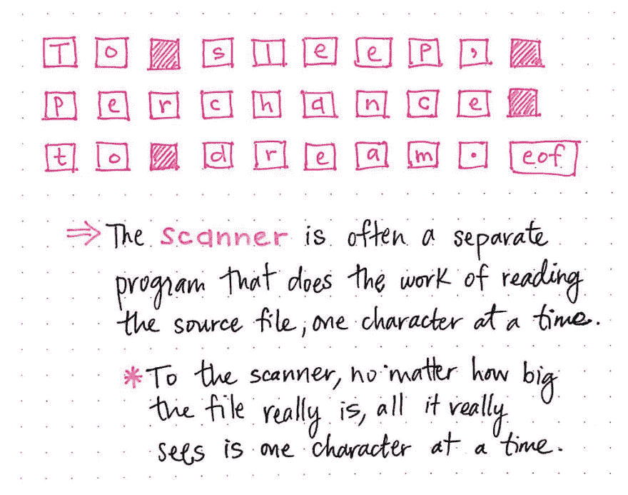](https://res.cloudinary.com/practicaldev/image/fetch/s--3nhrP8qO--/c_limit%2Cf_auto%2Cfl_progressive%2Cq_auto%2Cw_880/https://cdn-images-1.medium.com/max/1024/1%2A3ZSNBRYAft5myw1KRnwr6Q.jpeg) 

<figcaption>扫描流程，步骤 2。</figcaption>

</figure>

我们会注意到睡觉，偶尔做梦。被我们的扫描仪分割成单个的字符。此外，就连单词之间的空格也被视为字符，就像我们句子中的标点符号一样。在这个序列的末尾还有一个特别有趣的字符:eof。这是字符“文件结束”，它类似于制表符、空格和换行符。因为我们的源文本只是一个句子，所以当我们的扫描器到达文件的末尾(在本例中是句子的末尾)时，它会读取文件的末尾，并将其视为一个字符。

因此，实际上，当我们的扫描仪读取我们的输入文本时，它将它解释为单个字符，这导致了:["T "，" o "，空格，" s "，" l "，" e "，" e "，" p "，" a "，" p "，" e "，" r "，" c "，" h "，" a "，" n "，" c "，" e "，空格，" T "，" o "，空格，" d "，" r "，" e "，" a "，" m "，"，eof】。

<figure>[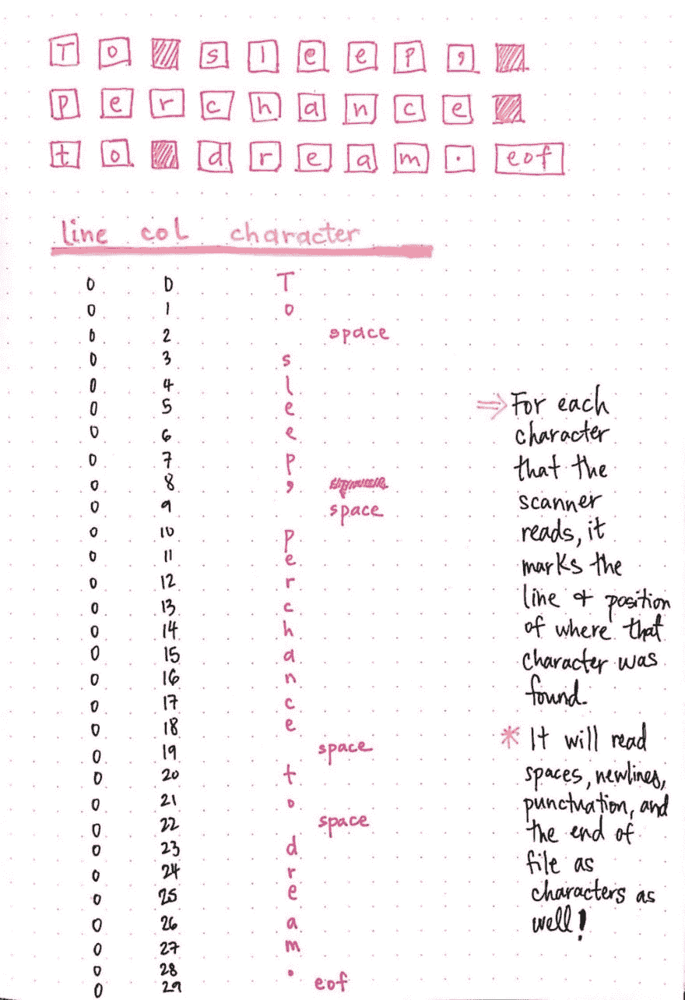](https://res.cloudinary.com/practicaldev/image/fetch/s--zLiwoKS8--/c_limit%2Cf_auto%2Cfl_progressive%2Cq_auto%2Cw_880/https://cdn-images-1.medium.com/max/1024/1%2A5PLEk4PtvzHIrmbpxsQiAg.jpeg) 

<figcaption>扫描流程，步骤 3。</figcaption>

</figure>

现在，我们的扫描仪已经读取了我们的源文本，并将其分割成尽可能小的部分，这将使我们更容易找出句子中的“单词”。

接下来，扫描仪需要按顺序查看拆分的字符，并确定哪些字符是单词的一部分，哪些不是。对于扫描仪读取的每个字符，它会标记该字符在源文本中的行和位置。

这里显示的图像说明了我们的莎士比亚句子的这一过程。我们可以看到，我们的扫描仪正在为句子中的每个字符标记行和列。我们可以把行和列的表示看作是字符的矩阵或数组。

回想一下，由于我们的文件中只有一行，所以所有内容都位于第 0 行。然而，当我们在句子中前进时，每个字符的列会增加。同样值得一提的是，因为我们的扫描仪将空格、换行符、eof 和所有标点符号都作为字符读取，所以它们也出现在我们的字符表中！

<figure>[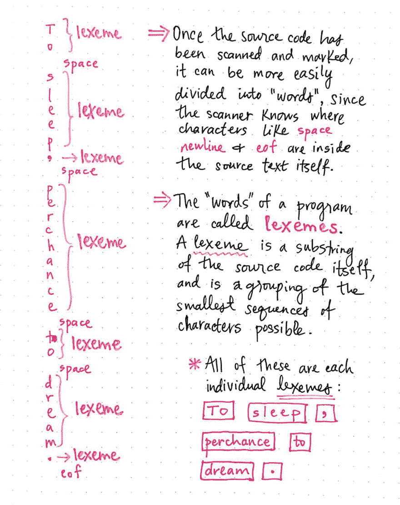](https://res.cloudinary.com/practicaldev/image/fetch/s--EpMN6wKm--/c_limit%2Cf_auto%2Cfl_progressive%2Cq_auto%2Cw_880/https://cdn-images-1.medium.com/max/1024/1%2AFcXbL37JCmMQU22HjZuFiQ.jpeg) 

<figcaption>扫描流程，步骤 4。</figcaption>

</figure>

一旦扫描并标记了源文本，我们的编译器就准备好将这些字符转换成单词。因为扫描器不仅知道文件中空格、换行符和 eof 的位置，还知道它们相对于周围其他字符的位置，所以它可以扫描字符，并根据需要将它们分成单独的字符串。

在我们的例子中，扫描仪将查看字符 T，然后是 o，然后是空格。当它找到一个空格时，它会把 To 分成自己的单词，这是扫描仪遇到空格之前可能出现的最简单的字符组合。

它找到的下一个单词也是类似的情况，那就是睡眠。然而，在这个场景中，它读取 s-l-e-e-p，然后读取标点符号 a。因为这个逗号的两边是一个字符(p)和一个空格，逗号本身被认为是一个“单词”。

单词 sleep 和标点符号都被称为*，它们是原文的子串。一个词位是我们源代码中最小可能的字符序列的组合。源文件的词位被认为是文件本身的单个“词”。一旦我们的扫描仪读取完文件中的单个字符，它将返回一组词汇，如下所示:["To "、" sleep "、" possible "、" To "、" dream "、" perceptual "，"].*

 *<figure>[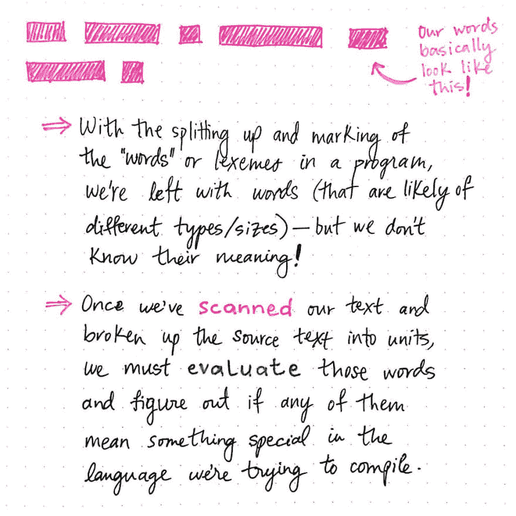](https://res.cloudinary.com/practicaldev/image/fetch/s--KSsHiJ66--/c_limit%2Cf_auto%2Cfl_progressive%2Cq_auto%2Cw_880/https://cdn-images-1.medium.com/max/1024/1%2AXyK9-EgmIrrbdGGNMbgLuw.jpeg) 

<figcaption>扫描流程，步骤 5。</figcaption>

</figure>

请注意，我们的扫描仪是如何将一团文本作为输入的，它最初无法读取，然后一次一个字符地扫描它，同时读取并标记它的内容。然后，它通过使用字符之间的空格和标点符号作为分隔符，将字符串划分为尽可能小的词位。

然而，尽管做了所有这些工作，在词法分析阶段的这一点上，我们的扫描器对这些单词一无所知。当然，它将文本分割成不同形状和大小的单词，但至于这些单词是什么，扫描仪并不知道！这些单词可以是一个字符串，也可以是一个标点符号，或者完全是别的什么东西！

> 扫描仪不知道单词本身，也不知道它们是什么“类型”的单词。它只知道单词在文本中的结束和开始。

这就为词法分析的第二阶段做好了准备:评估。一旦我们扫描了我们的文本并将源代码分解成单独的词位单元，我们必须评估扫描仪返回给我们的单词，并找出我们正在处理的单词类型——特别是，我们必须寻找在我们试图编译的语言中有特殊意义的重要单词。

### 评估重要零件

一旦我们完成了对源文本的扫描并确定了我们的词位，我们就需要对我们的词位“单词”做一些事情。这是词法分析的 ***求值*** 步骤，在编译器设计中常被称为对我们的输入进行*或 ***标记化*** 的过程。*

 *<figure>[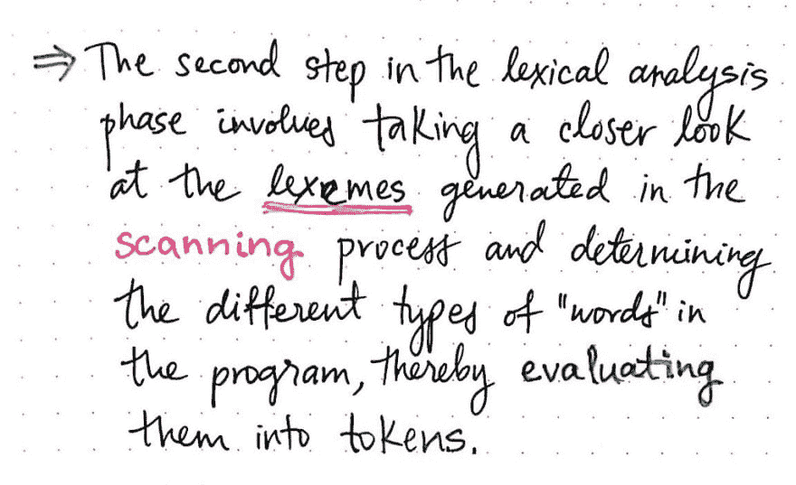](https://res.cloudinary.com/practicaldev/image/fetch/s--dpDoEFsO--/c_limit%2Cf_auto%2Cfl_progressive%2Cq_auto%2Cw_880/https://cdn-images-1.medium.com/max/1024/1%2AGBeKPFlvWhAY8lmt6EenZw.jpeg) 

<figcaption>评估扫描码是什么意思？</figcaption>

</figure>

当我们评估我们扫描的代码时，我们真正做的是仔细查看我们的扫描器生成的每个词位。我们的编译器将需要查看每个词位单词，并决定它是什么种类的单词。确定文本中每个“单词”的词位类型的过程就是我们的编译器如何将每个单独的词位转化为标记，从而标记我们的输入字符串。

我们第一次遇到记号是在学习解析树的时候。记号是特殊的符号，是每种编程语言的核心。记号，如(，，+，-，if，else，then，都有助于编译器理解表达式的不同部分和各种元素之间的关系。解析器是语法分析阶段的核心，它依赖于从某处接收来自*的标记，然后将这些标记转换成解析树。*

<figure>[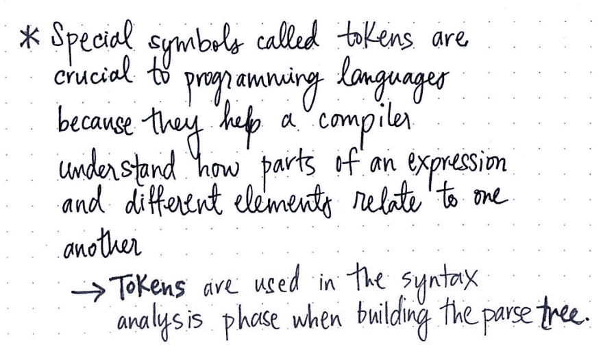](https://res.cloudinary.com/practicaldev/image/fetch/s--E3-l6FKt--/c_limit%2Cf_auto%2Cfl_progressive%2Cq_auto%2Cw_880/https://cdn-images-1.medium.com/max/1024/1%2ABhXvgX-OXpUtSpsXO7rjXg.jpeg) 

<figcaption>令牌:一个定义。</figcaption>

</figure>

你猜怎么着？我们终于找到了“某个地方”！事实证明，发送到解析器的标记是在词法分析阶段由 ***标记器*** 生成的，也称为 ***词法分析器*** 。

<figure>[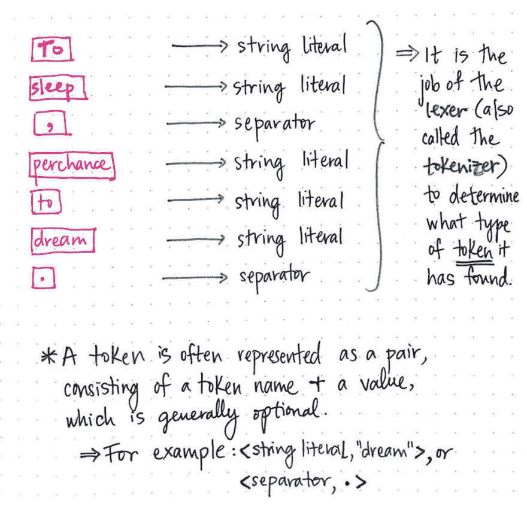](https://res.cloudinary.com/practicaldev/image/fetch/s--BSpm9fPu--/c_limit%2Cf_auto%2Cfl_progressive%2Cq_auto%2Cw_880/https://cdn-images-1.medium.com/max/1024/1%2AQTDpT9GfXYbwnU2_h0_3lw.jpeg) 

<figcaption>把我们的莎士比亚句子符号化！</figcaption>

</figure>

那么令牌到底是什么样子的呢？一个 ***令牌*** 相当简单，通常表示为一对，由一个令牌名和一些值(可选)组成。

例如，如果我们对莎士比亚的字符串进行记号化，我们最终得到的记号大部分是字符串文字和分隔符。我们可以把词位“梦”表示成这样的记号:<string literal="">。同样，我们可以用词位来表示。作为令牌，<separator .="">。</separator></string>

我们会注意到，这些标记中的每一个根本没有修改词汇——它们只是添加了额外的信息。一个标记是具有更多细节的词位或词汇单位；具体来说，增加的细节告诉我们正在处理的是哪一类标记(什么类型的“单词”)。

现在我们已经标记了我们的莎士比亚句子，我们可以看到在源文件中标记的类型没有太多的变化。我们的句子中只有字符串和标点——但这只是象征性的冰山一角！一个词位可以被归类到许多其他类型的“词”中。

<figure>[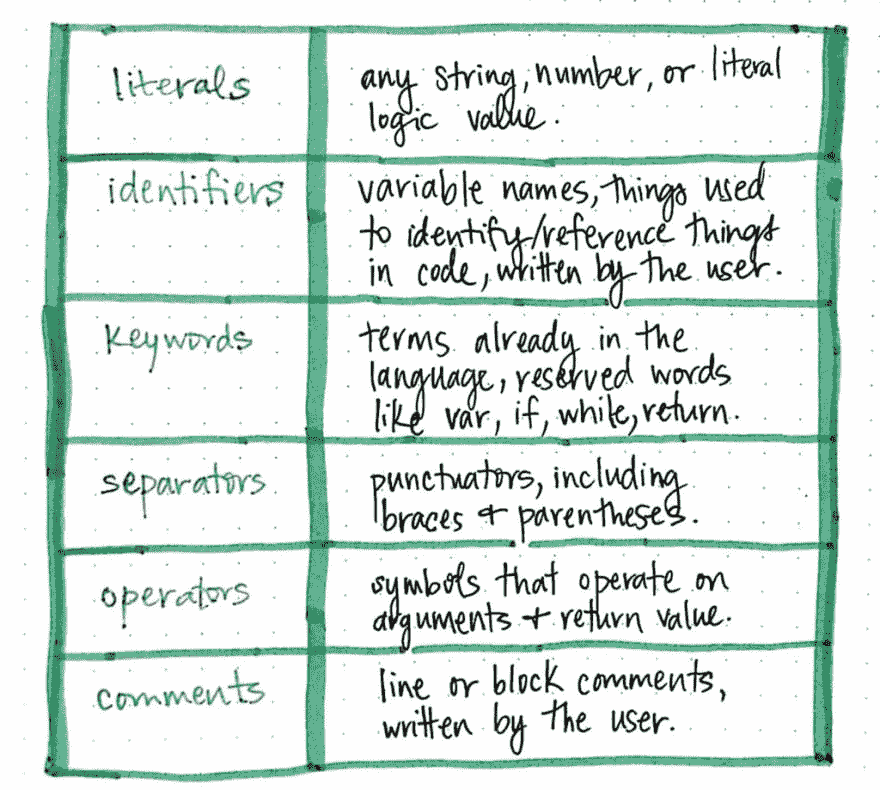](https://res.cloudinary.com/practicaldev/image/fetch/s--ngKnsHWL--/c_limit%2Cf_auto%2Cfl_progressive%2Cq_auto%2Cw_880/https://cdn-images-1.medium.com/max/1024/1%2A8DR6f-Z9CzZJDeLmjpNO5Q.jpeg) 

<figcaption>在我们的源代码中找到的常见形式的令牌。</figcaption>

</figure>

此处显示的表格说明了我们的编译器在几乎任何编程语言中读取源文件时会看到的一些最常见的标记。我们看到了文字的例子，可以是任何字符串、数字或逻辑/布尔值，以及分隔符，可以是任何类型的标点符号，包括大括号({})和圆括号(())。

但是，也有关键字，它们是语言中保留的术语(如 if、var、while、return)，还有操作符，它们对参数进行操作并返回某个值(+、-、x、/)。我们还可能遇到可以标记为标识符的词位，通常是变量名或由用户/程序员编写的引用其他内容的东西，以及注释，可以是用户编写的行或块注释。

我们原来的句子只给我们看了两个记号的例子。让我们把我们的句子改写成:var toSleep = " to dream。我们的编译器会如何处理这个版本的莎士比亚？

<figure>[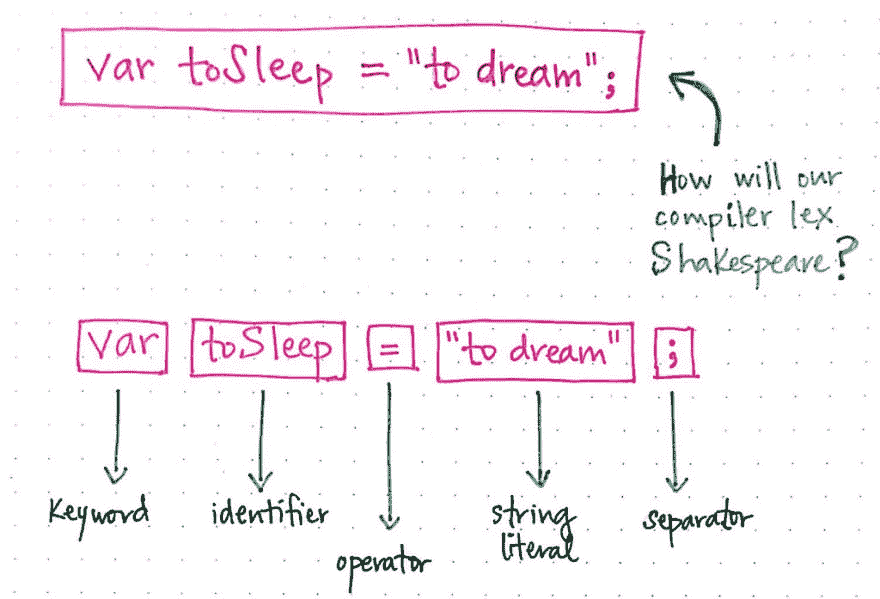](https://res.cloudinary.com/practicaldev/image/fetch/s--pb2fTJOt--/c_limit%2Cf_auto%2Cfl_progressive%2Cq_auto%2Cw_880/https://cdn-images-1.medium.com/max/1024/1%2A05UzHoMpYFIDKV-lHgpTqA.jpeg) 

<figcaption>我们的词法分析器将如何标记这个句子？</figcaption>

</figure>

在这里，我们将看到我们有更多种类的令牌。我们在 var 中有一个关键字，在这里我们声明一个变量，还有一个标识符，toSleep，这是我们命名变量的方式，或者引用即将到来的值。接下来是 our =，这是一个操作符标记，后面是字符串文字“to dream”。我们的语句以 a 结尾；分隔符，指示行尾，并分隔空白。

关于标记化过程需要注意的一件重要事情是，我们既不标记任何空白(空格、换行符、制表符、行尾等。)，也不会将其传递给解析器。请记住，只有*标记*会被提供给解析器，并最终出现在解析树中。

同样值得一提的是，不同的语言会有不同的构成空白的字符。例如，在某些情况下，Python 编程语言使用缩进(包括制表符和空格)来指示函数的范围如何变化。因此，Python 编译器的标记器需要意识到这样一个事实，在某些情况下，制表符或空格实际上需要被标记为单词，因为实际上*需要被传递给解析器！*

<figure>[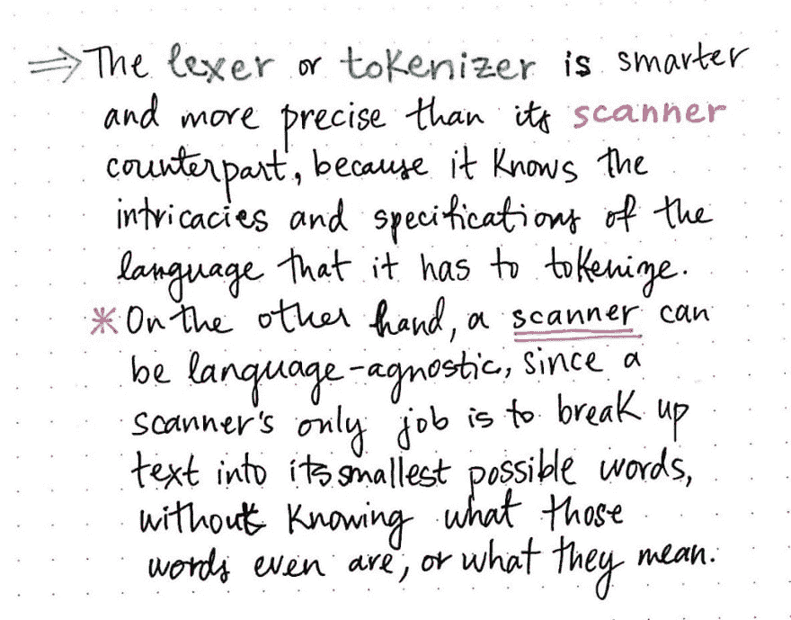](https://res.cloudinary.com/practicaldev/image/fetch/s--_q1BbiPZ--/c_limit%2Cf_auto%2Cfl_progressive%2Cq_auto%2Cw_880/https://cdn-images-1.medium.com/max/1024/1%2AGcSKg37lnx2z5tLNfjBlvg.jpeg)

<figcaption>lexer vs 扫描器的约束。</figcaption>

</figure>

记号赋予器的这一方面是对比词法分析器/记号赋予器如何不同于扫描器的好方法。虽然扫描仪是无知的，只知道如何将文本分解成尽可能小的部分(它的“单词”)，但是词法分析器/分词器相比之下更敏感、更精确。

记号赋予者需要知道正在编译的语言的复杂性和规范。如果标签很重要，它需要知道这一点；如果换行符在被编译的语言中有特定的含义，标记器就需要知道这些细节。另一方面，扫描仪甚至不知道它分割的单词是什么，更不知道它们是什么意思。

> 编译器的扫描器与语言无关，而符号化器必须是特定于语言的。

词法分析过程的这两个部分是齐头并进的，它们是编译过程第一阶段的核心。当然，不同的编译器有其独特的设计方式。一些编译器在一个单独的进程中和作为一个单独的程序执行扫描和标记化步骤，而另一些编译器将它们分成不同的类，在这种情况下，标记化器将在运行时调用 scanner 类。

<figure>[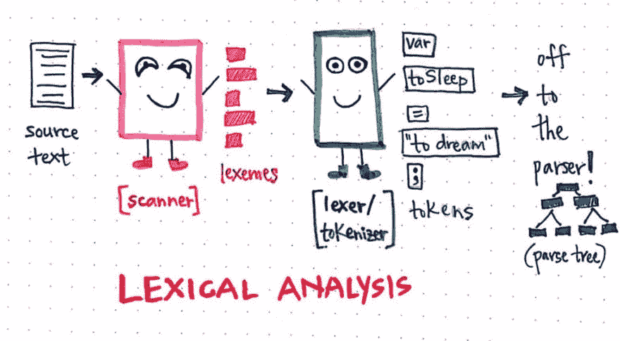](https://res.cloudinary.com/practicaldev/image/fetch/s--j6wc3UTj--/c_limit%2Cf_auto%2Cfl_progressive%2Cq_auto%2Cw_880/https://cdn-images-1.medium.com/max/1024/1%2AcD0IcZisXfPwd9suSlluZw.jpeg) 

<figcaption>词法分析:快速直观总结！</figcaption>

</figure>

无论哪种情况，词法分析这一步对编译都非常重要，因为语法分析阶段直接依赖于它。尽管编译器的每个部分都有自己特定的角色，但它们相互依赖，就像好朋友一样。

### 资源

因为有许多不同的方法来编写和设计编译器，所以也有许多不同的方法来教授它们。如果你对编译的基础做了足够的研究，很明显有些解释比其他解释更详细，这可能有帮助，也可能没有帮助。如果您发现自己想要了解更多，下面是关于编译器的各种资源——重点是词法分析阶段。

1.  第 4 章——打造口译员，罗伯特·尼斯特罗姆
2.  [编译器构造](https://cs.nyu.edu/courses/fall06/G22.2130-001/class-notes.html)，艾伦·戈特利布教授
3.  [编译器基础知识](http://www.cs.man.ac.uk/~pjj/farrell/comp3.html)，詹姆斯·艾伦·法雷尔教授
4.  编写编程语言——Lexer，安迪·巴兰
5.  关于解析器和编译器如何工作的注释
6.  记号和词位有什么区别？，StackOverflow

* * ****