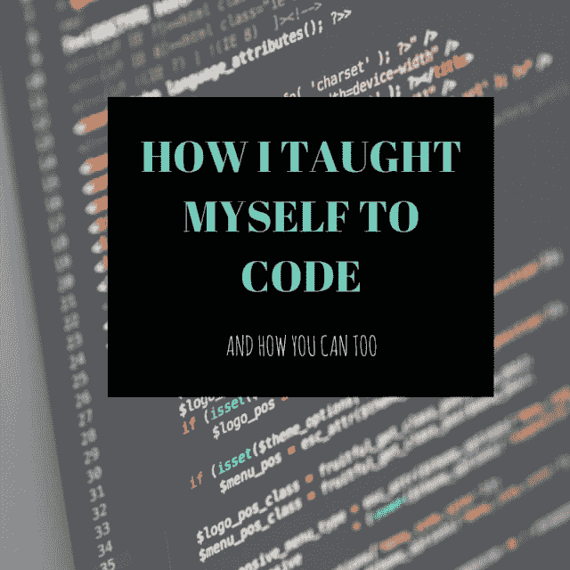

# 以下是我自学编码的方法

> 原文：<https://dev.to/nateruze/heres-how-im-teaching-myself-to-code-5i3>

[T2】](https://ibb.co/j9g0Nm)

直到一年前，如果你问我打算在大学选择什么职业道路，我会说——神经外科。我在我的高中年鉴中公开声明过，就在我(尴尬的)学校照片下面。每个人——从我的朋友和家人到老师，都习惯称我为半个医生。(部分原因是因为我的父母也是医生，这个职业在我的国家/文化中很像一种遗产)。还因为我可以完美地解剖生物，在轻微的紧急情况下开 OTC 药，并且在生物和化学方面总是拿 A*。所以你可以说成为一名医生是一个等待执行的最终决定。

所以当我在大学选择软件开发作为我的专业时，每个人问我的第一件事就是，“你知道这是怎么回事吗？”

事实是，我没有。

嗯，我确实对计算机的工作原理、安全和网络有一些了解，并且很好地掌握了每个人在日常工作中操作机器所需的基本知识。但是我不知道软件是如何开发的，如何成为一名网络开发人员，或者前端和后端开发的区别。

那么，我为什么选择从事软件开发呢？那是另一个讨论的话题。但我在这里真正想说的是，是什么给了我勇气去追求一条完全不同的道路，以及我认为追求这条道路的最佳方式。

[T2】](https://ibb.co/iGvo8R)

解决了所有这些问题后，我建议你在刚开始进入编程世界时，买一本计算机科学的书。

### 买一本计算机科学的书

一本针对初学者的书。

除非你想成为专业人士，买一本高级书籍，然后遇到需要谷歌搜索的术语，然后用来描述这些术语的术语也需要谷歌搜索，你会感到沮丧，准备放弃——就像我一样。

因此，买一本解释基本术语、阐述算法结构和教授伪代码的书。(你还将学习逐步细化、递归等一些我认为非常酷的术语和函数的基础知识！)

我研究了 A-Level/高中计算机科学书籍，因为学术书籍保持一定的标准，它们通常从头开始解释一切。我在进入大学之前的间隔年做了这件事，以便对自己将要从事的工作有所了解。虽然从头开始自学有点令人沮丧，但一旦我掌握了窍门(你也会的)，事情就变得有趣多了。

更好的策略是同时学习 Python 作为你的第一编程语言。

为什么？因为它比其他编程语言更像人，口才好，超级好学。

### 对于完全的初学者来说，Codecademy 是一个极好的资源

这不是一个赞助的职位。

我这样建议是因为我从 Codecademy 中学到了很多，受益匪浅。还有其他资源，如 Udemy、Skillshare 等。但由于我没有亲身尝试过，我不会发表意见。你也可以注册编码训练营(例如，Quincey Larson 的 freeCodeCamp，建立一个开发者社区！).尝试不同的资源，看看什么最适合你。

我个人认为 Codecademy 对于完全的初学者来说是一个很好的开始编码的方式。然而，和世界上的其他事物一样，它也有一些局限性。最大的限制(我认为)是——一旦一个话题被教授了，他们就不会再温习了(除了做小而简单的练习),所以它很容易被遗忘。解释有时也是不充分的。

这就引出了我的下一个观点:

### 记笔记。是的，写下来

使用笔记本记录正在教授的主题。如果你遇到不懂的东西，就在网上查一下。YouTube 上有很多。

免费的。

### 在 YouTube 上查找科技频道

再次声明，这不是一个赞助的帖子。

但是我从 YouTube 上受益匪浅，我觉得如果我不对它表示感谢，那将是背信弃义。老实说，YouTube 上的一些讲座/视频比你在大学花钱请的教授更有帮助。

不公平，我知道。

如果你像我一样正在学习 Python，那么作为奖励，这里有两个很棒的频道推荐你去看看！

1.  苏格拉底

2.  科里·斯查费

### 修行。练习。实践

练习吧，就像你的生活依赖于它一样。好吧，不要太戏剧化——好像你的职业生涯取决于此。因为确实如此。

下载一个 IDE，想出项目想法，然后编码出来。即使你认为这很容易或者很傻，因为很有可能，你会被最简单的函数卡住，这没关系。这就是你首先练习的原因。也有像 Project Euler 这样的免费资源，在那里你可以挑战你的逻辑能力并发展所需的技能。哦，别忘了 Reddit 上的每日节目！

### 获得计算机科学或软件工程学位

尽管有许多人不同意这一点。甚至我个人也相信自我约束是最好的约束。但是仍然有许多公司在招聘时遵循传统规则。所以，如果你真的想把软件或网站开发作为你的职业，如果你有方法和机会接受大学教育，那么无论如何，去做吧。

如果没有，那么网上有很多资源(付费和免费)可以帮助你！

### 在 GitHub 或任何其他平台上建立社区

我们都知道社区有多重要。我们自己的小社区，或者社会团体——不管你怎么称呼它。生活中最重要的事情之一，是一个由和你有着相同心态、相同激情和相同道德观的人组成的小圈子。你结交的朋友决定了你一生能走多远，所以你最好明智地选择。在这种情况下，你的小中枢将帮助你更好地学习和实践你的课程，也帮助你圈子里的其他人。

**奖励提示:**

**打开任何网站/软件/程序的源代码并研究它**

看看软件和/或网站的源代码。研究不同人的不同编码方式。这不仅会给你一个新的视角，还会在你以后的工作/职业生涯中帮助你提高阅读代码的能力(如果这是一件事的话),因为你必须维护别人很久以前写的代码。

这些是我在大学主修软件开发时用过的小步骤和策略。你不必同意我提到的每一点。

但是如果你有更多的提示和技巧，或者任何关于我如何更好地自学编程的建议，那么请在下面的评论中留下它们。

另外，如果这篇文章对你有所帮助，留点爱吧。