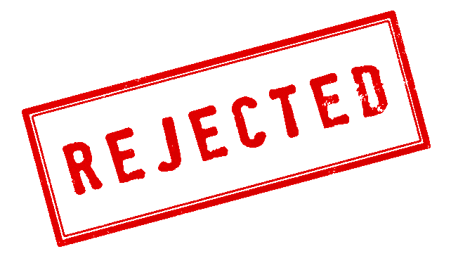
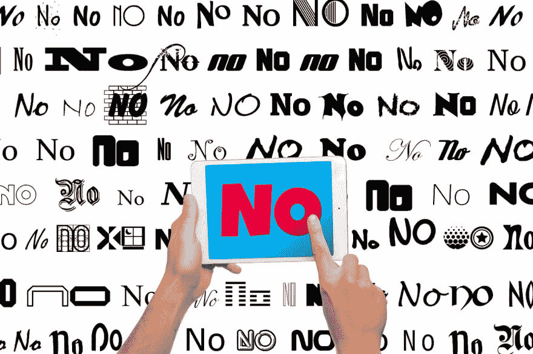

# 不要让你的 iOS 应用被拒绝

> 原文:[https://dev . to/bright devs/don-let-your-IOs-app-be-rejected-4 i6](https://dev.to/brightdevs/dont-let-your-ios-app-be-rejected-4i6)

在实施应用内购买时，尤其是**自动续费订阅**，如果你没有严格遵循指南，你的应用很有可能在审核过程中被拒绝。怎么能避免不必要的麻烦？

[T2】](https://res.cloudinary.com/practicaldev/image/fetch/s--QUv_hvu8--/c_limit%2Cf_auto%2Cfl_progressive%2Cq_auto%2Cw_880/https://thepracticaldev.s3.amazonaws.com/i/8r1txboc43oqtojmbb5m.png)

## 将你的应用货币化

菲尔·席勒在 2017 年 WWDC 上宣布，苹果迄今为止已经向开发者支付了超过 700 亿美元，其中 210 亿美元是去年支付的。到 2017 年，应用内购买的全球总销售额[预计将达到 360 亿美元](https://www.statista.com/statistics/220186/total-global-in-app-revenue-forecast)，而付费应用下载的全球总销售额[预计将达到 270 亿美元](https://www.statista.com/statistics/273122/global-paid-for-mobile-app-revenues-forecast)。这意味着，如果有免费版本，用户更愿意在移动应用上花钱，并且他们可以在以后为完全访问付费(免费增值模式)。移动收入每年都在增长，应用内购买是应用货币化的一个很好的方式。

## 应用内购买

在 iOS 上，我们区分了 4 种应用内购买:

*   消费品
*   非消耗品
*   自动续费订阅
*   非续订订阅

可消耗的应用内购买只使用一次，可以再次购买，这使得它们成为应用内礼物或额外游戏奖金的简单解决方案。非消耗性购买是永久的，即使在应用程序重新安装后也可以恢复，这通常用于解锁应用程序的高级功能或禁用广告。此外，非续订订阅仅在有限的时间内有效，例如可以应用于季节性通行证。这就像非消耗品，在一段特定的时间后就会被消耗掉。

对开发者来说，最有吸引力的可能是**自动续费订阅**，它可以从应用内的内容中提供稳定的收入。它们不能在应用程序中取消(没有相应的 API)，这使得用户更难停止订阅。为了鼓励用户试用，你可以提供 3 天到 1 年的免费试用。订阅模式的另一个优势是 1 年后收入增加。用户累积一年付费服务后，您的收入将增加到订购价格的 85%，而不是传统的 70%。

## 流弊

不幸的是，缺少用于以编程方式取消订阅的 API，再加上一个相当不明显的手动重新签名过程，为欺诈创造了一些可能性。

最近，[林剑衡在 AppStore](https://medium.com/@johnnylin/how-to-make-80-000-per-month-on-the-apple-app-store-bdb943862e88) 上发现了许多排名靠前的诈骗应用，这些应用会提示用户每周支付高达**100 美元**。有人可能会认为，没有人会为像 WEP 密码生成或信誉可疑的 VPN 服务这样的简单服务支付那么多钱，但据[传感器塔](sensortower.com)报道，其中一些应用程序每月收入高达**30 万美元**！经过快速研究，Johnny 发现了 10 个诈骗应用程序，它们每年的总收入可能超过 700 万美元。似乎模糊传达的订阅很容易被不知情的用户接受。

这种情况可能**使得苹果在商店发布应用程序之前审查自动更新订阅时更加苛刻**。现在，当你不满足任何关于订阅的要求时，无论是在应用内还是在 AppStore 描述中，你的二进制文件很可能会被**拒绝**。

[T2】](https://res.cloudinary.com/practicaldev/image/fetch/s--3myHK4jR--/c_limit%2Cf_auto%2Cfl_progressive%2Cq_auto%2Cw_880/https://thepracticaldev.s3.amazonaws.com/i/ie7qt3e1r1b3ofpc22oh.jpg)

## 墨守规则

为了确保你满足苹果的要求，你需要在应用程序的**二进制**和**元数据**中包含关于订阅的自动续订性质的信息。

根据苹果公司的规定，你必须包括:

> *   Name of publication or service
> *   Subscription period (time period and content or service provided in each subscription period)
> *   Payment will be collected from iTunes account upon confirmation of purchase.
> *   Subscriptions will be automatically renewed unless automatic renewal is turned off at least 24 hours before the end of the current period.
> *   The account will receive the renewal fee within 24 hours before the end of the current period, and the renewal fee will be determined.
> *   Subscriptions can be managed by users, and automatic renewal can be closed by going to the user's account settings after purchase.
> *   When the user purchases the subscription of this publication, any unused free trial period (if provided) will be cancelled.
> *   Links to Terms of Use

这意味着，必须在 AppStore 应用程序的描述(元数据)和应用程序 UI(二进制)中明确传达有关定价、用户将被收费的确切时间(和频率)以及他们如何取消订阅的指令。

你必须对成本坦诚，你需要确保用户不会感到惊讶，一旦收费。你越诚实，越人性化，越好。

最初发表于 2017 年 10 月 13 日 [brightinventions.pl](https://brightinventions.pl/blog/) 。

作者 Mateusz Klimczak,《推动事物前进》@光明的发明

[推特](https://twitter.com/Klimczak_M)，[邮件](mateusz.klimczak@brightinventions.pl)