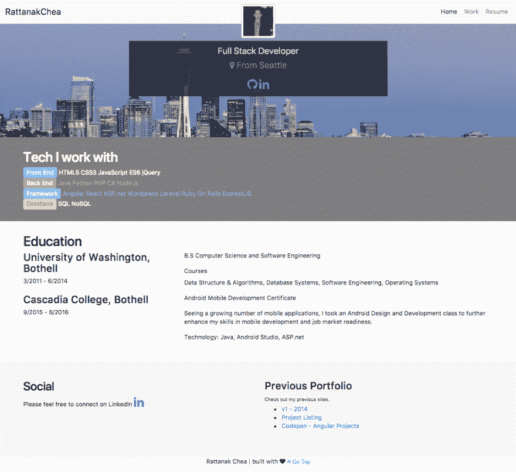
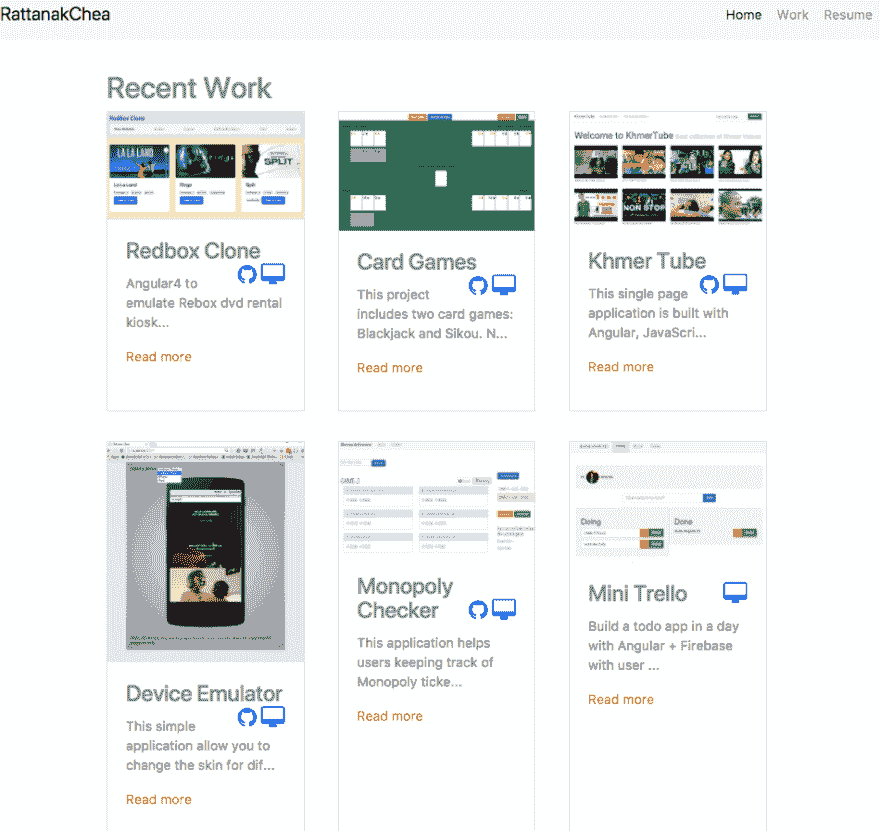
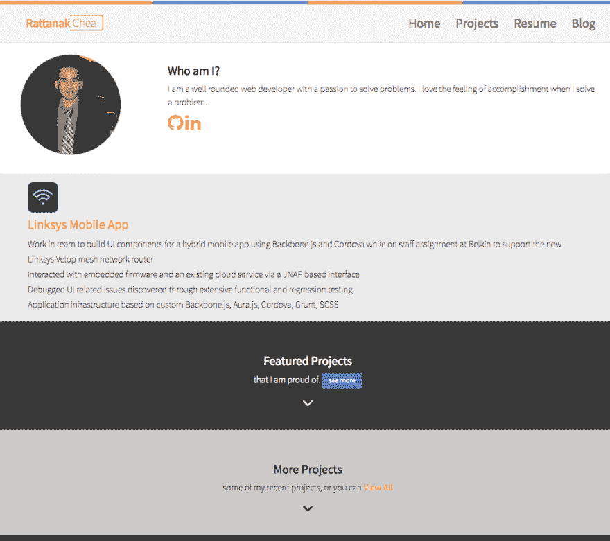
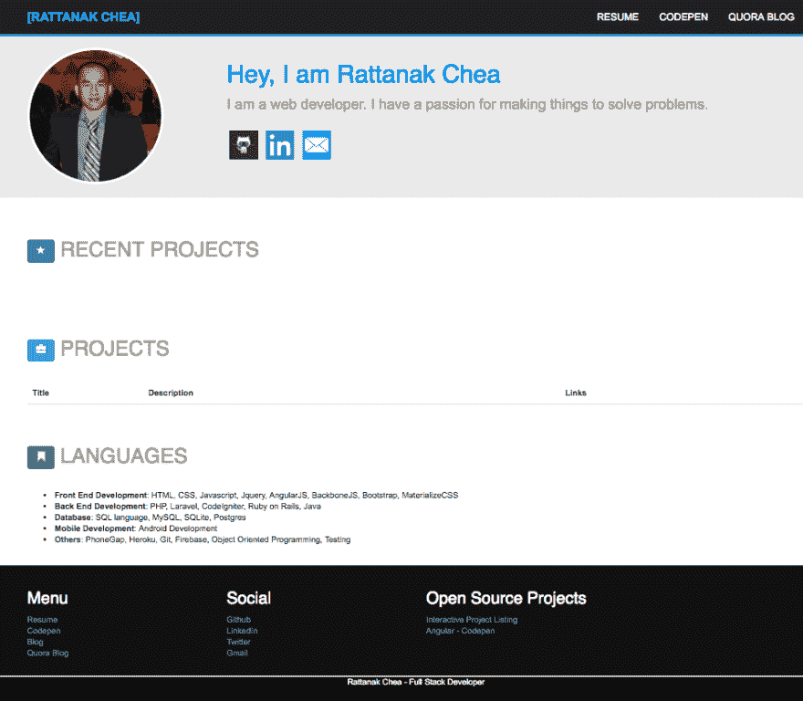

# 我如何在 24 小时内建立我的网站 3.0 版(非连续)

> 原文:[https://dev . to/rattanakchea/how-I-build-my-site-v30-in-24-hours-non-continuously-20d](https://dev.to/rattanakchea/how-i-built-my-site-v30-in-24-hours-non-continuously-2od)

## 目标

*   快速建立一个*极简、可维护、免费的*网站*来展示我的作品。*
**   在适当的时候利用新技术。*

 *建设我的新网站实际上更具挑战性，花费的时间比我预期的要长。为了长话短说，让我直接跳到**挑战**上。

**1。应该选择哪个框架？或者我应该什么都不用？**
我已经研究了用于 JavaScript 库的 **React、Angular 4.0 和 Yeoman web app generator** 以及用于 CSS 框架的**布尔玛、Boostrap、Material** 的选项。这是一个艰难的决定，因为有太多的选择。一方面，我想学习新的东西。另一方面，选择新的技术堆栈不仅会减慢我的开发速度，还会使项目更加难以管理，尤其是在一个人的团队中工作时。在开发 UI、应用程序逻辑的同时学习新技术是困难的、适得其反的，并且会令人沮丧。经过反复测试和试验，我选择了 Angular 4.0 + Bootstrap，主要是因为我对这两个版本比其他版本更有经验，而且我对开发速度很满意。个人满意度等于生产率的提高。

**2。如何在没有 UI 原型的情况下，用尽可能少的时间把一个功能性的网站搭建起来？**
我想在尽可能短的时间内建立我的新网站。我没有足够的时间和 photoshop/sketch 技能来用颜色主题、漂亮的字体等来润色一个干净的 UI，我也不想在这上面花时间。我只在一张纸上画了一个简单的快速线框，用于 UI 模型。我重用了一些我能在 Bootstrap 上找到的最常见的 UI 组件，这样我就可以专注于我的一些设计思想和应用程序逻辑。在头脑中没有坚实的原型的情况下进行开发是具有挑战性的。然而，我对最终的结果很满意，我可以在未来的版本中迭代。

**3。如何让站点可维护，而且费用还免费？**
我认为任何网站/应用程序最重要的一个方面就是它的可维护性。这意味着代码是有组织的，易于理解。更新和部署新版本只需几个步骤。当项目是不言自明的，并且需要最少的时间来理解时，它将更易于维护，并且在许多年后仍然存在。在这个项目中，我必须做两步(可以合并成一步)`npm run pre-deploy`，然后`npm run deploy`部署网站到 Github 页面，这是免费的主机静态网站。

查看下面我现在和以前的网站。你更喜欢哪一个？留下评论和反馈；我喜欢听。

### 2017 年 11 月 [rattanakchea.github.io](https://rattanakchea.github.io)

[T6】](https://res.cloudinary.com/practicaldev/image/fetch/s--XERh3okF--/c_limit%2Cf_auto%2Cfl_progressive%2Cq_auto%2Cw_880/https://raw.githubusercontent.com/rattanakchea/rattanakchea.github.io/dev/src/assets/portfolio2017-2.png)

### 2016

[T2】](https://res.cloudinary.com/practicaldev/image/fetch/s--y9ti7wNO--/c_limit%2Cf_auto%2Cfl_progressive%2Cq_auto%2Cw_880/https://raw.githubusercontent.com/rattanakchea/rattanakchea.github.io/dev/src/assets/portfolio2016.png)

### 2014 年

[T2】](https://res.cloudinary.com/practicaldev/image/fetch/s--EpqMh0xl--/c_limit%2Cf_auto%2Cfl_progressive%2Cq_auto%2Cw_880/https://raw.githubusercontent.com/rattanakchea/rattanakchea.github.io/dev/src/assets/portfolio2014.png)*