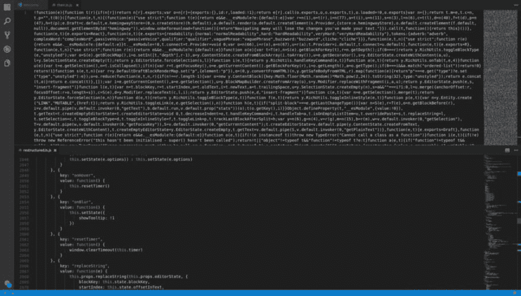

# 解构海明威应用程序

> 原文：<https://dev.to/samwsoftware/deconstructing-the-hemingway-app-390>

我一直在使用海明威应用程序来改进我的帖子。与此同时，我一直在努力寻找小项目的创意。我想到了将海明威风格的编辑器整合到 markdown 编辑器中的想法。所以我需要了解海明威是如何工作的！

## 获取逻辑

当我开始的时候，我不知道这个应用程序是如何工作的。它可以将文本发送到服务器来计算工作的复杂性，但我希望它是在客户端计算。幸运的是，在 Chrome 中打开开发者工具(Control + Shift + I 或 F12)并导航到源代码。在那里我找到了我一直在寻找的文件:hemingway3-web.js。

[](https://res.cloudinary.com/practicaldev/image/fetch/s--g5M4tR7A--/c_limit%2Cf_auto%2Cfl_progressive%2Cq_auto%2Cw_880/https://cdn-images-1.medium.com/max/1000/1%2Ay18ngb6SHy2M0rvHzwDjoQ.png) 
缩小的文件在上面，格式化的文件在下面。这是多么大的差别啊！

这段代码是缩略形式，读起来很难理解。为了解决这个问题，我将文件复制到 VS 代码中，并格式化文档(VS 代码为 Control + Shift + I)。这将一个 3 行的文件变成了一个 4859 行的文件，所有内容都被很好地格式化了。

## 探索代码

随着文件的格式变得更好，我开始寻找任何我能理解的东西。文件的开头是许多被立即调用的函数表达式，这让我对正在发生的事情知之甚少。

```
!function(e) {
  function t(r) {
      if (n[r])
          return n[r].exports;
      var o = n[r] = {
          exports: {},
          id: r,
          loaded: !1
      };
... 
```

这种情况持续了大约 200 行，然后我决定我可能是在阅读代码以使页面运行(React？).我开始浏览剩下的代码，直到找到我能理解的东西。(通过查找函数调用和函数定义，我错过了很多东西)。

我理解的第一段代码是在第 3496 行！

```
getTokens: function(e) {
  var t = this.getAdverbs(e), 
    n = this.getQualifiers(e),
    r = this.getPassiveVoices(e), 
    o = this.getComplexWords(e);
  return [].concat(t, n, r, o).sort(function(e, t) {
    return e.startIndex - t.startIndex
  })
} 
```

令人惊讶的是，所有这些功能都在下面定义了。现在我知道他们如何定义副词、限定词、被动语态和复合词。有些很简单。有限定词、复合词和被动语态短语的列表，每个单词都要对照它们进行检查。this.getAdverbs 根据单词是否以“ly”结尾来过滤单词，然后检查它是否不在以“ly”结尾的非副词单词列表中。

下一段有用的代码是实现单词或句子高亮显示的地方。在这段代码中有一行:

```
e.highlight.hardSentences += h 
```

然后我在文件中搜索“硬句子”,找到了 13 个匹配项。这导致计算可读性统计的一行:

```
n.stats.readability === i.default.readability.hard && (e.hardSentences += 1),
n.stats.readability === i.default.readability.veryHard && (e.veryHardSentences += 1) 
```

用这个，我再次搜索“可读性”，得到了 40 个匹配。我找到了 getReadabilityStyle 函数，发现了他们是如何给你的写作打分的。它们有三个等级:正常、困难和非常困难。

```
t = e.words;
n = e.readingLevel;
return t < 14
  ? i.default.readability.normal
  : n >= 10 && n < 14
    ? i.default.readability.hard
    : n >= 14 ? i.default.readability.veryHard 
      : i.default.readability.normal; 
```

如果少于 14 个单词，那么这是正常的。如果阅读水平在 10 到 14 之间，那就很难，如果超过 14，那就很难。现在来看看如何计算阅读水平。

我在这里花了一段时间试图找到如何计算阅读水平的任何概念。我发现它在 getReadabilityStyle 函数上面 4 行。

```
e = letters in paragraph;
t = words in paragraph;
n = sentences in paragraph;

getReadingLevel: function(e, t, n) {
  if (0 === t || 0 === n) return 0;
  var r = Math.round(4.71 * (e / t) + 0.5 * (t / n) - 21.43);
  return r <= 0 ? 0 : r;
} 
```

也就是说你的分数是 4.71 *平均单词长度+ 0.5 *平均句子长度-21.43。

## 我发现的其他有趣的事情

*   重点注释(右手边关于你写作的信息)是一个大的转换声明。三元语句用于根据你写得有多好来改变回答。

*   在被归类为“研究生”水平之前，该等级上升到 16 级。

## 我要拿这个做什么

我计划做一个非常基本的网站，并应用我从解构海明威应用程序中学到的东西。我以前已经建立了一个 Markdown 预览器，所以我想看看我是否可以集成这个突出和

## 你从逆向工程网站中学到了什么？

如果你曾经做过类似的事情，请在评论中告诉我。很高兴听到其他开发者发现了很酷的东西。

#### 请回复这篇文章以示支持，并跟随我学习和发展我的编码技能。