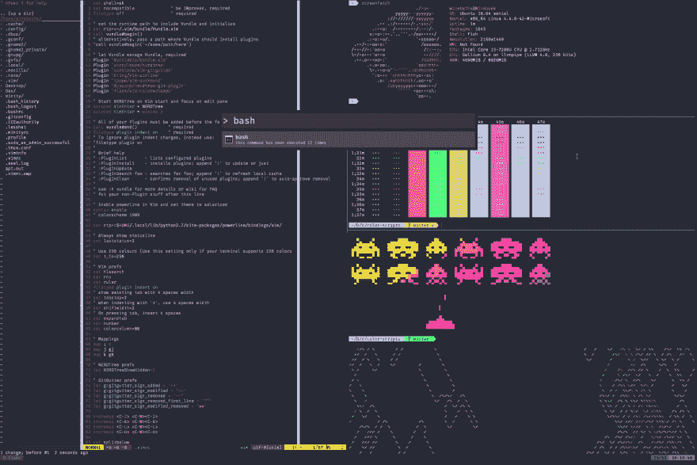

# 启动并运行 Linux 的 Windows 子系统

> 原文：<https://dev.to/winebaths/getting-up-and-running-with-the-windows-subsystem-for-linux-8oc>

徒劳的练习

[T2】](https://res.cloudinary.com/practicaldev/image/fetch/s--XIAQ1l5I--/c_limit%2Cf_auto%2Cfl_progressive%2Cq_auto%2Cw_880/https://raw.githubusercontent.com/thisisshi/dotfiles/master/screenfetch.png)

这个周末，我开始摆弄 Linux 的 Windows 子系统(WSL)。当我在 reddit 上看到/u/noahnichols2008 的[帖子](https://www.reddit.com/r/Windows10/comments/689to0/xfce4_on_windows_10/)时，我受到了真正开始实验的启发。以下是我的一些想法/观察。

## 背景

我是一名软件工程师，主要从事 Python、AWS、Ansible 等工作。我从事开源云合规规则引擎[云托管](https://www.github.com/capitalone/cloud-custodian)的工作，最近大部分开发工作都是在 2016 年的 15 英寸 Macbook Pro 上完成的。以前，我在大学期间在各种 Windows 机器上工作，从 Windows 7 到 8 到 10，都没有 WSL。那段时间我站了多个 Ubuntu 双开机，VM 的等等。一边还把脚趾头伸进了[流浪汉](https://www.vagrantup.com/)。这些天来，我主要使用 [iTerm2](https://www.iterm2.com) 作为我在 macOS 上的终端仿真器， [tmux](https://github.com/tmux/tmux) 用于登录和退出随机 ec2 实例而不用拔头发，以及 vim。由于在云中开发和维护大量虚拟机的性质，我更熟悉用 GNU/Linux 的方式做事，而不是 M$FT 的方式。

几周前，我给自己买了一台 12 英寸的 Macbook，看看我是否能够应付小尺寸和有争议的蝴蝶键盘。尽管苹果在发布会上对按键开关大加赞赏，但我还是觉得这个键盘令人难以置信的乏味，打字时很烦人，而且不可靠。我把它退了回去，暂时搁置了买笔记本电脑的想法。不过，我确实喜欢它的几个方面，包括尺寸、屏幕和 USB-C。幸运的是，华为 Matebook X 上市销售了所有这些方面...但它运行 Windows。

再说一遍，我对 Windows 并不陌生。我最近才开始从事 macOS 的工作。在我人生的大部分时间里，我以各种形式使用过 Windows:台式机、2 合 1 设备、平板电脑和笔记本电脑。虽然我所有的 Windows 体验都是有用的，但开发体验却是一场噩梦。当微软宣布 WSL 时，我非常感兴趣。在 Windows 中基本原生运行 GNU/Linux？能够完成实际工作，然后能够在 Lightroom 或 Photoshop 中编辑照片，而不必购买 Mac 或运行虚拟机？这一切听起来好得令人难以置信。毕竟，这不就是前任首席执行官史蒂夫·鲍尔默曾经说过的那个微软吗:

> Linux 是一个癌症

嗯，我想我应该试试。

## 设置

首先启动并运行 WSL 本身就是一件痛苦的事情。出于某种原因，WSL 不能开箱即用，可能是因为微软太害怕正常人不小心进入`cmd.exe`并键入`dir`而不是`ls`？不管怎样，要开始，你实际上必须先做大量的事情。

### 第一步:更新一切

如果你想要 WSL 的最新和最棒的特性，你将不得不花一些时间在 Windows 寻找和更新它自己到最新版本的时候什么也不做。这本身是一个非常琐碎的工作，只需进入你的系统设置，并检查更新。

### 第二步:为 Linux 启用 Windows 子系统

再说一次，我不知道为什么微软会默认禁用这个，特别是因为这真的不太可能会让人感到困惑。要真正进入 WSL，你需要打开`cmd.exe`并运行`bash`，据我所知，这足以成为大多数正常人需要的进入壁垒。不过，我跑题了。点击`Start`并搜索`Turn Windows Features On or Off`，然后寻找 Linux 的 Windows 子系统并打开它。

### 第三步:更新 2:电动布加洛

一旦启用了 WSL，就会提示您启用它需要另一次更新。去更新它吧。坚持住，我们快到了。

### 第四步:(实际上)入门

现在我们已经完全更新并启用了 WSL，我们终于可以开始了。去 Windows 应用商店下载 Ubuntu(或者其他版本的 GNU/Linux)。截至目前，只有 SUSE 和 Ubuntu 可用)。这将在你的电脑上安装一个应用程序，最终让你可以在你的电脑上使用 Ubuntu。然而，这只是用 Bash 打开了`cmd.exe`,这意味着您仍然会得到一个糟糕的终端模拟器和糟糕的体验。

### 第五步:让它看起来更好。

不像其他操作系统，Windows 没有太多好的终端模拟器。默认情况下，Bash for Windows/Ubuntu 将在相当于 good ol '的命令提示符下运行。具有最少的颜色和很差的/没有电力线字体支持。为了解决这个问题，我们暂时不得不使用其他东西，直到微软决定在 Windows 中捆绑一个可用的终端模拟器。以下是几个选项:

*   cmd.exe
*   明蒂
*   cmder
*   comemu
*   超级 js

其中，我用过 cmder、mintty 和 hyper.js。

我在终端模拟器中寻找的最重要的东西是:

1.  性能:我希望能够打字并实时看到字符在屏幕上移动。不幸的是，这并不是必然的。
2.  主题:我很虚荣。我需要在屏幕上有漂亮的颜色。
3.  窗格:很好，但不是必需的。
4.  标签:有很好，但不是必须的。

Hyper.js(一个基于 javascript 电子终端模拟器)在 Windows 上很糟糕。在 macOS 上也没好到哪里去。它很慢，使用大量的系统资源，而且“惊人的”插件系统在 Windows 上运行有大量的问题。此外，由于某种原因，它不喜欢我使用 Ctrl+h 在 Vim 中的窗格之间移动。

Cmder 还可以；我还没有在 WSL 中大量使用它，但是过去我在大学做 Windows 的时候有过不错的体验。从我最近修改它的时候开始，当在 Vim 中工作和在文件系统中移动时，它的响应有点慢。

这让我们找到了明蒂。如果你想开始使用 WSL，从我的角度来看，除了 [WSL 终端](https://www.github.com/mintty/wsltty)之外，真的没有其他选择。它的速度很快(在 Vim 中使用大约 5MB 的内存，相比之下，. hyper.js 在空屏幕上使用大约 100MB，cmder 使用 35MB)，具有良好的主题化功能，并且功能相对完整。要开始，只需按照 wsltty 的自述文件中的说明进行操作。

### 可选步骤 WSL 上的 XFCE

我花了一个周末的时间研究了一下，基本上可以正常工作了。有了这个，你就可以完全访问大多数 GUI GNU/Linux 应用程序，尽管有一些限制。

#### 入门

首先，你需要安装一个 Windows X 服务器，即 [XMing](https://sourceforge.net/projects/xming/) ，或者 [VcXsrv](https://sourceforge.net/projects/vcxsrv/) 。安装其中任何一个即可开始。

然后，将以下内容添加到您的`.bashrc`中，将`/some/directory/you/specify`更改为您自己的目录:

```
export DISPLAY=:0
export XDG_RUNTIME_DIR=/some/directory/you/specify 
export RUNLEVEL=3
sudo mkdir /var/run/dbus
sudo dbus-daemon --config-file=/usr/share/dbus-1/system.conf
rm -rf .cache/sessions 
```

现在，您可以安装 XFCE 了:

```
sudo apt install xfce4
sudo apt install blueman
sudo apt install gnome-themes-standard
sudo apt-get install libcanberra-gtk3-module 
```

从这里开始，假设一切顺利，您应该能够运行以下代码并获得一个 GUI:

```
xfce4-session 
```

感谢/u/kenshen 在/r/bashonubuntuonwindows 上的[帖子](https://www.reddit.com/r/bashonubuntuonwindows/comments/6ysgn4/guide_to_xfce4_install_in_wsl_for_advanced_noobs/)

完成所有设置后，您现在可以访问 GNU/Linux 上任意数量的终端模拟器。然而，我现在将坚持使用 WSLtty。

## 使用 WSL

现在，实际使用 WSL。如前所述，设置一个功能强大、外观漂亮的终端模拟器是一件非常痛苦的事情。因为主要的两个需求是性能和主题，所以 Mintty/WSLtty 似乎涵盖了这两个基础。然而，对于那些来自 iTerm2 的人来说，这仍然是一场艰苦的战斗。

### 使用 tmux

为了解决这个问题，我开始更多地使用 tmux。我已经在登录实例、启动 tmux、然后用 tmux 创建分割的上下文中使用了 tmux，以允许我自己运行进程、连接/分离会话，并且通常不会讨厌我的生活。因为我将从一个操作系统转移到另一个操作系统，从一个终端模拟器转移到另一个终端模拟器，所以让我自己去记忆不同的键盘快捷键来做我希望在所有环境中使用的事情，这种做法没有什么意义。

下面是我的`.tmux.conf`:

```
# remap prefix from 'C-b' to 'C-a'
unbind C-b
set-option -g prefix C-a
bind-key C-a send-prefix

# split panes using d and s, a la iTerm2
bind -n M-d split-window -h
bind -n M-s split-window -v
unbind '"'
unbind %

# reload config file (change file location to your the tmux.conf you want to use)
bind r source-file ~/.tmux.conf

bind -n M-j select-pane -D 
bind -n M-k select-pane -U
bind -n M-h select-pane -L
bind -n M-l select-pane -R

set -g mouse on
set -g base-index 1
setw -g pane-base-index 1 
```

这里，我将前缀从默认的`C-b`切换到更合理的`C-a`，并将拆分行为更改为`M-d`和`M-s` (alt+d 和 alt+s)，以更好地与 iTerm2 中我习惯的 cmd+d 窗格拆分保持一致。我还启用了鼠标移动来滚动历史、日志等。并更新了`pane-base-index`从 1 开始，以获得更好的人体工程学。此外，我还添加了使用`hjkl` a la Vim 和`alt`修饰键在窗格间移动的功能。现在，我简单地将下面的代码添加到我的`.bashrc`中，以便每次都启动 tmux:

```
[[ $- != *i* ]] && return
[[ -z "$TMUX" ]] && exec tmux 
```

### 鱼:更好的外壳

现在我们已经有了一些基本的移动和功能，是时候升级我们的外壳了。Bash 很棒，但它缺少很多好的东西，可以通过在你的`.bashrc`或`.bash_profile`中添加一大堆东西来修复*，但我希望这些东西从盒子中出来。为了得到这个，我用了[鱼](https://fishshell.com/)。Fish 提供了很多很棒的特性，比如更好的命令自动完成、包管理器( [Oh My Fish](https://github.com/oh-my-fish/oh-my-fish) )、手册页完成，以及在基于 web 的 UI 中编辑主题(不可否认，我并不经常使用)。*

简单地说，安装 Fish 相当简单:

```
sudo apt-get install fish 
```

然后，安装“我的鱼”:

```
curl -L https://get.oh-my.fish | fish 
```

我使用 agnoster 主题，安装时使用:

```
omf install agnoster 
```

现在，您需要做的就是更新您的 shell。据说 WSL 现在支持用`chsh`更换外壳，但是我还没能让它工作。我把这个贴在我`.bashrc`的底部(hacky，我知道):

```
if [[ -t 1 && -x /usr/bin/fish ]]; then exec /usr/bin/fish
fi 
```

### 附加(重要)信息

现在，WSL 并不能完全与 Windows 互操作。甚至像在`notepad.exe`中打开文件这样简单的事情也不能开箱即用。首先，微软不希望你在 Windows 中使用 WSL 中的文件，这可能会导致问题，因为两者之间的文件系统差异很大。此外，即使在 explorer 中查找 WSL 也不是很容易。要访问您的个人目录，您必须访问:

```
C:\Users\<Windows User>\AppData\Local\Packages\CanonicalGroupLimited.UbuntuonWindows_79rhkp1fndgsc\LocalState\rootfs 
```

注意:不要碰这里的任何东西，如果有的话，它应该是只读的。

然而，在你的 Windows 系统中访问文件没有限制。只需转到:

```
/mnt/c 
```

从那里，你可以访问你的`C:/`驱动器中的所有内容，也应该可以访问其他驱动器。

## 结论

WSL 是微软的一个非常有趣的项目。很明显，它试图赢得那些发誓放弃 Windows 操作系统，转而选择基于 unix 操作系统的绿色领域的 macOS 用户。它最近[发布了一个命令行工具来改变`cmd.exe`](https://github.com/Microsoft/console/releases/tag/1708.14008) 的配色方案，并将 Ubuntu 和 SUSE 发行版转移到微软商店，这些都非常明显地表明了它渴望重新获得开发者群体。从我摆弄它的时间来看，我不得不说它绝对是一个鱼龙混杂的东西。启动和运行它的工作量是不小的，尤其是在我现在正在使用的无风扇超极本上。此外，在没有大量研究的情况下，缺乏用于 WSL 的绝对一流的终端仿真器，这对于那些试图入门的人来说是非常令人不快的。

当然，有很多资源可以帮助你找到如何启动和运行的方法， [/r/bashonubuntuonwindows](https://www.reddit.com/r/bashonubuntuonwindows) 是一个不错的选择，尽管有些多余的地方来寻找答案，如果你愿意深入研究一些 github 问题，他们的 github [repo](https://www.github.com/Microsoft/WSL) 当然有答案。不幸的是，它还不够“开箱即用”,不足以推荐任何人立即使用。尤其是，如果你刚刚开始。

如果你有很棒的`.tmux.conf`、`.bashrc`等。，您可能能够相对容易地切换。但是，直到微软修复了一些随机的问题，比如 [`dbus`不能正常启动](https://github.com/Microsoft/WSL/issues/376)，或者 [WSL 随机地找到某些文件](https://github.com/Microsoft/WSL/issues/2448)，这是一种徒劳的尝试。你当然可以*完成事情*，代价是花费大量时间*完成愚蠢的事情*。