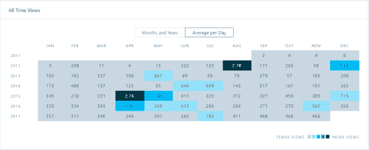
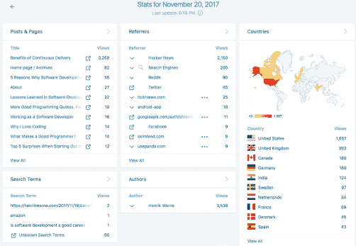

# 6 年的编程思考

> 原文:[https://dev . to/Henrik warne/6-years-of-thinks-on-programming-1k 29](https://dev.to/henrikwarne/6-years-of-thoughts-on-programming-1k29)

从我开始写关于软件开发的博客到现在已经超过 6 年了。这是一次很棒的经历，我想我会反思我所学到的东西。所以这里是我写编程的原因，一点关于我的过程，和一些统计数据。[T2】](https://henrikwarne1.files.wordpress.com/2017/11/stats1.png)

# 为什么

知道我在想什么。以书面形式阐述或解释某件事会让我非常仔细地思考。写下来的行为暴露了我的论点和知识的缺口，迫使我澄清自己的想法。真的就像琼·狄迪恩的这句话:*“我不知道我在想什么，直到我试着把它写下来。”*

**分享。**有时候，我认为有些工作方式确实很有帮助，但可能不太为人所知。然后，能够描述我们做了什么，以及为什么我认为它是有用的，这很好。比如[从你的 bug 中学习](https://henrikwarne.com/2016/04/28/learning-from-your-bugs/)和[开发者书友会](https://henrikwarne.com/2016/11/08/developer-book-club/)。

**排气。**时不时会有让我烦恼的事情，或者我不喜欢的工作方式。然后我可以写一篇博客，讨论事情应该如何发展。这类帖子的例子有[伟大的程序员编写可调试的代码](https://henrikwarne.com/2013/05/05/great-programmers-write-debuggable-code/)和[开发者——与人交谈](https://dev.to/henrikwarne/developers--talk-to-people-3dkm-temp-slug-9938838)。

**学习。总的来说，我喜欢在评论和论坛中讨论我的帖子。唯一的例外是当人们诉诸侮辱而不是讨论想法的优点时(偶尔发生)。但是如果有一个健康的讨论，我通常会学到一些新的东西，比如一个想法在什么条件下行得通，什么条件下行不通。有时候讨论让我改变主意，就像在[单元测试私有方法](https://henrikwarne.com/2014/02/09/unit-testing-private-methods/)上。**

**记住。**当我读一本关于编程的书或参加 MOOC 课程时，我通常会写一篇评论。知道我将写一篇评论让我更好地学习材料——我正在更积极地学习。我做笔记，试图总结最重要的要点。我也更多地思考我最喜欢和最不喜欢的东西，以及它与我已经知道的关于这个主题的东西相比如何。希望这些评论对考虑阅读这本书或选修这门课的人也有价值。示例帖子有 [Coursera 课程评论-软件安全](https://henrikwarne.com/2015/10/20/coursera-course-review-software-security/)和[书评-有效工程师](https://henrikwarne.com/2017/01/15/book-review-the-effective-engineer/)。

拥有读者的快感。当我开始写博客时，我没有想到的是有人阅读(和喜欢)我写的东西的兴奋感。在论坛上投票或在 Twitter 上分享帖子感觉真好。

**能见度。拥有博客有助于你在网络上的身份认同。如果人们用谷歌搜索你，你的博客很有希望出现在搜索结果的顶部。这在求职时会很有帮助。从来没有任何招聘人员因为我的博客联系我(95%是通过 LinkedIn 找到我的，其余是通过 StackOverflow)。但是当我最后一次申请工作时，我能够指向我的博客来详细了解我对软件开发的想法。**

**存档。**我的博客也成了我可以参考的很好的档案。例如，偶尔我会和某人讨论 RSI 的话题。然后能够发送一个链接到我在[发表的关于我如何战胜重复性压力损伤](https://henrikwarne.com/2012/02/18/how-i-beat-rsi/)的文章，这很好。

# 如何

保留一份清单。每当我想写一篇博文时，我都会把它写在我的主题想法列表中(我用 [Toodledo](https://www.toodledo.com) )。我加上我能想到的任何支持和反对的理由。有时候只是一个标题，有时候注释还挺多的。目前我的列表中有大约 120 个条目(质量不一)。

仔细考虑一下。在我写一个主题之前，我通常会断断续续地思考几天——也许是在散步或洗澡的时候。如果我在这个问题上提出了更多的论点或不同的角度，我会把它们添加到列表中。通过花几天时间思考这个问题，我让我的潜意识在想法上工作。

质量胜于数量。经常看到推荐你每周写一次博客。对我来说，这太频繁了。我平均一个月连一个帖子都不写。我花了很多时间来完成一篇文章(我会说实际的写作花了我 3 到 7 个小时)。这是一个相当大的努力，我没有时间写更多的时间。我认为帖子的质量比帖子的数量更重要。因为每个帖子都有希望永远存在，所以我希望每个帖子都尽可能的好。

**容易撇去。**我觉得容易浏览的帖子更容易被阅读。你可以浏览一下，了解一下它的要点。如果你对主题感兴趣，你可以更仔细地阅读它。如果只是一堵文字墙，不清楚是否值得，那么很多人就会直接跳过(反正我的理论就是这样)。我通常使用项目符号或短段落来划分内容。我还发现，比起简单地写一篇长文章，它能帮助我更好地组织我的想法和论点。

**图片。**我读过几项研究，声称包含图片的帖子在社交媒体上被分享得更多。这可能是真的。如果没有别的，它看起来更好，当有一个图片包括在内。我通常会附上一张我拍摄的照片，最好与内容有某种关联。

**编辑。**我经常在试图阐明某事时陷入困境。我发现写一些不太完美的东西并坚持下去要好得多。稍后我会回来修理它。在我完成之前，我会反复检查和编辑我写的东西。对我来说，第一次就把它做好真的很难，但是经过几轮编辑之后，我通常会很高兴。最后，我检查了整篇文章的拼写，然后点击发布。

[T2】](https://henrikwarne1.files.wordpress.com/2017/11/stats3.png)

# 交通

当我写完一篇博文，我会把它提交给[黑客新闻](https://news.ycombinator.com/news)和 [Reddit/r/programming](https://www.reddit.com/r/programming/) 。有人质疑提交你自己的帖子，但我认为这是有道理的。我写的是我觉得有趣的软件开发方面的内容，所以有可能其他人也会觉得有趣。此外，我不仅提交我自己的帖子——我还会提交任何我感兴趣的、还没有分享的帖子。

当我向黑客新闻和 Reddit/r/programming 投稿时，我永远不知道什么会流行。如果一篇博客文章出现在任何一个网站的首页，通常会有成千上万的浏览量。如果没有，总共最多也就几百个。我用的是免费版的 WordPress，但是你得到的统计数据相当全面。我可以看到每个帖子的浏览量，以及流量来自世界的哪个地方。出现在首页几天后，流量将恢复到正常水平，每天的浏览量略低于 300 次。在过去六年中，总共有 917，000 次页面浏览。[T2】](https://henrikwarne1.files.wordpress.com/2017/11/stats2.png)

**黑客新闻。**能上黑客新闻头版是相当辛苦的。这需要在提交的前 45 分钟内获得大约 5 张赞成票。这部分是因为提交的故事太多了——有时一分钟就有一个。一篇文章一旦登上头版，通常会在那里停留几个小时。如果人们对帖子发表评论，那就太好了——评论的质量通常很高。我也喜欢你在黑客新闻上看到的是向上的投票，而不是向下的投票。在我的帖子中，[大约有 12 篇出现在首页](https://hn.algolia.com/?query=henrikwarne.com&sort=byPopularity&prefix&page=0&dateRange=all&type=story)。

**Reddit/r/编程。**更容易上 Reddit/r/programming 首页，主要是因为那里提交的故事没那么多。我经常在周末写博客，然后在周一早上(欧洲时间)提交。通常他们会直接进入首页(在第 12 位左右)，因为这是一个相对安静的提交时间。然而，只需要几张反对票就能让它出局。如果帖子在 Reddit/r/programming 上很受欢迎，它可以在首页停留几乎一天。Reddit 上有许多好的评论者，但也有相当多质量相当低的评论。我的大约 25 篇帖子[已经被恰当地放在首页](https://www.reddit.com/search?q=site%3Ahenrikwarne.com&sort=top)。

**推特。我通常会在推特上发布新的博客文章，但这通常只会带来几次点击。我唯一一次从 Twitter 上看到显著的流量是当有成千上万的追随者链接到一个帖子的时候(已经发生过一两次)。**

**领英。**我也在 LinkedIn 上发布我写的东西。我从来没有从那里得到很多流量，但很高兴看到人们喜欢或分享我写的东西。这主要是一种更新我的想法和写作内容的方式。

**搜索词。**到目前为止，获得最多搜索流量的博客文章是[软件开发人员是一个伟大职业选择的 5 个理由](https://henrikwarne.com/2014/12/08/5-reasons-why-software-developer-is-a-great-career-choice/)。典型的搜索词是“为什么软件工程”和“为什么你想成为一名软件开发人员”。其他常见的搜索词是“coursera reviews”和“我爱编码”。

# 结论

对我来说，写一篇新的博文需要很多时间。但绝对值得。我喜欢思考软件开发，写博客进一步帮助我理解和学习。当人们阅读和评论我写的东西时，我也非常满意。希望有人觉得有用。如果你一直在考虑写博客，我的建议是开始——我很高兴 6 年前我冒了这个险。