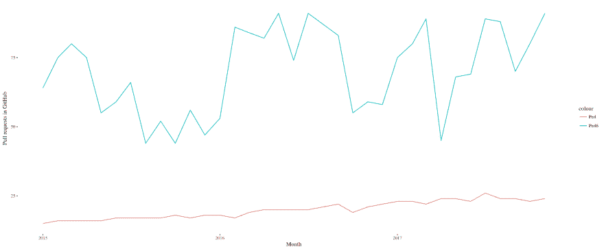
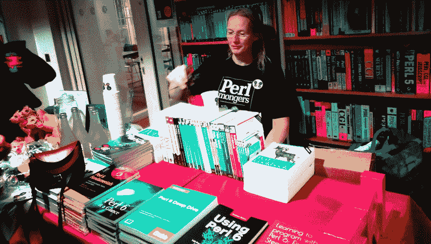

# 狮子、蝴蝶和骆驼

> 原文:[https://dev . to/jj/the-lion-and-butterfly-and-the-camel-a8b](https://dev.to/jj/the-lion-and-the-butterfly-and-the-camel-a8b)

所以我刚从伦敦 Perl 研讨会回来

> 这实际上包括从伦敦到希思罗机场乘 6 次火车，因为我又老又哑。皮卡迪利线也在这里停了一小会儿。
> [T3】](https://res.cloudinary.com/practicaldev/image/fetch/s--2MX1_GJq--/c_limit%2Cf_auto%2Cfl_progressive%2Cq_auto%2Cw_880/https://thepracticaldev.s3.amazonaws.com/i/f4nateammb11s7sz17s1.jpg)

伦敦 Perl 研讨会是关于 Perl 的。

> 如果您想了解更多关于 Perl 的知识，请查看即将发布的 [Perl 6 降临节日历](https://perl6advent.wordpress.com/)和相应的 [Perl 降临节日历](https://perladvent.com/)。今天早上 [BBC 提到了一些奇怪的基督降临节日历，比如猪肉卷日历](http://www.bbc.co.uk/news/uk-42107580)，但是不知何故他们忘记提到了。虽然我们绝对应该有这样的东西。例如，Perl Camel 和 Camelia Scratchings 日历。你可以抓任何东西，对吗？

总之。在这里，Perl6 似乎是一件很小的事情，所以我不妨先谈谈它。这是一种关于包容性(与排他性相反)和多样性的语言。Perl6 不排斥任何范式，它囊括了所有范式。它是并发的*和*面向对象的*和* *功能性的*，并且它确实在某种程度上与 Unicode 一起工作，很少有语言能做到这一点。Perl6 仍然是 Perl，并且两个 Perl 都是关于[完成现在](http://blogs.perl.org/users/buddy_burden/2014/02/perl-and-me-part-9-thats-why-i-failed-recess.html)的事情。例如，yhis [25 行程序](https://github.com/JJ/perl6em/blob/master/utils/bq.perl6)对该语言的两个版本的 pull 请求进行 BigQuery 请求。我花了几个小时才得到正确的查询，并理解它，大约 10 分钟处理它，只提取提到 Perls 及其排名。

```
use JSON::Tiny;

my @months_numeral =  "0" «~« (1…9);
@months_numeral.append(<10 11 12>);
my @months = <2015 2016 2017> X~ @months_numeral;
@months.pop;

my $fh = open "new_repos.csv", :w;
my $fh2 = open "rank.csv", :w;
$fh.say("Perl, Perl6");
$fh2.say("Perl, Perl6");
for @months -> $m {
    # Taken from https://stackoverflow.com/questions/41475499/how-to-measure-language-popularity-via-github-archive-data
    say "Querying $m";
    my $output = qqx{bq query --format json "SELECT COUNT(*) c, JSON_EXTRACT_SCALAR(payload, '\$.pull_request.base.repo.language') lang FROM [githubarchive:month.$m] WHERE JSON_EXTRACT_SCALAR(payload, '\$.pull_request.base.repo.language') IS NOT NULL GROUP BY 2 ORDER BY 1 DESC LIMIT 100"};
    my @ranking = from-json( $output );
    my @perls = @ranking[0].pairs.grep( { $^þ.values[0]{'lang'} ~~ /Perl/ } );
    my $year = $m.substr(0,4);
    my $month = $m.substr(4);
    $fh.say( "$year/$month, ", (@perls.map: *.values.map( { $^þ{'c'} } )).flat.join( ", " ) );
    $fh2.say( "$year/$month, ", (@perls.map: *.keys ).flat.join(", ") );

}
$fh.close;
$fh2.close; 
```

这就是结果，BTW。
[](https://res.cloudinary.com/practicaldev/image/fetch/s--JF_-pzow--/c_limit%2Cf_auto%2Cfl_progressive%2Cq_auto%2Cw_880/https://raw.githubusercontent.com/JJ/perl6em/master/data/perl-perl6-prs-rank.jpg) 。我在会议上的演讲中就用到了它。

你可以很容易地看到排名下滑到 20 多位，Perl6 疯狂地上下波动，但从未离开前 100 名的较低部分。

> 我还有点难过的是，在最近的一个对实践开发者的提问中，没有人提到 Perl。它也不是我的第一语言，但它是我很久以前学会的第一种语言，并且一直使用至今。

参加这个研讨会你可能看不出来。它不像周六晚上的牛津街
[](https://res.cloudinary.com/practicaldev/image/fetch/s--qiYOXr86--/c_limit%2Cf_auto%2Cfl_progressive%2Cq_auto%2Cw_880/https://farm5.staticflickr.com/4527/24777438008_20a174e76b_k_d.jpg) 
那么拥挤，但仍然非常繁忙，有三条独立的赛道，近 200 人注册。
[](https://res.cloudinary.com/practicaldev/image/fetch/s--V9tsXnUT--/c_limit%2Cf_auto%2Cfl_progressive%2Cq_auto%2Cw_880/https://thepracticaldev.s3.amazonaws.com/i/dp30yo5pudo8yqile73v.jpg) 
Perl 6 是大会的 [(Rakudo)明星](https://rakudo.org)，包括我在内的许多人都专门讨论过它，并且卖出了许多书，包括，是的，[我的书，那是写给那些对编程知之甚少或一无所知的人的](http://amzn.to/2hSokDt)。
[](https://res.cloudinary.com/practicaldev/image/fetch/s--C482ZsPD--/c_limit%2Cf_auto%2Cfl_progressive%2Cq_auto%2Cw_880/https://thepracticaldev.s3.amazonaws.com/i/qbzu1idfx8kwukqo1jhu.jpg)

## 但是进展如何呢？

你可以在 [`#lpw2017`](https://twitter.com/search?q=%23lpw2017&src=typd) 标签中查看。很顺利。细节并不太重要，但组织者在适应各个层面的会谈方面做得很好，包括其他语言，如苏·斯彭斯的《T4》或《铁锈》或《T7》，所有这些都是《T8》。Perl 社区对所有社区开放，也对烘焙素材的人开放
[](https://res.cloudinary.com/practicaldev/image/fetch/s--L86CESXk--/c_limit%2Cf_auto%2Cfl_progressive%2Cq_auto%2Cw_880/https://thepracticaldev.s3.amazonaws.com/i/imcxm03ydzyyoz3550dz.jpg)

社区给我们提供了很多糕点，还有一些赞助商给我们带来了[成堆的*T4】的咖啡。事实上，这个致力于广泛不喜欢的语言的会议如此受欢迎，这可能是也可能不是对英国退出欧盟的反应*](https://www.flickr.com/photos/atalaya/26860983299/in/dateposted/)

[T2】](https://res.cloudinary.com/practicaldev/image/fetch/s--pKzheHUX--/c_limit%2Cf_auto%2Cfl_progressive%2Cq_auto%2Cw_880/https://thepracticaldev.s3.amazonaws.com/i/6ig3ov4cmrzzvkd5mdwi.jpg)

但是，事实上，会谈是热情的、有见识的、有趣的，这意味着 Perl 的未来可能比我们想象的更光明。事实上有四家招聘公司: [Eligo](http://eligo.co.uk/) ， [Perl Careers](https://perl.careers/jobs/) ， [CV 库](https://www.cv-library.co.uk/)和 [WCN](https://www.wcn.uk/) 太。

## 你为什么会在意

如果你很好奇，并且想把事情做好，你最好检查一下 Perl。Perl 6 现在可能更好，但是 Perl 5 很快就会有重大变化，使它变得更快更好。如果你不知道从哪里开始，就问。