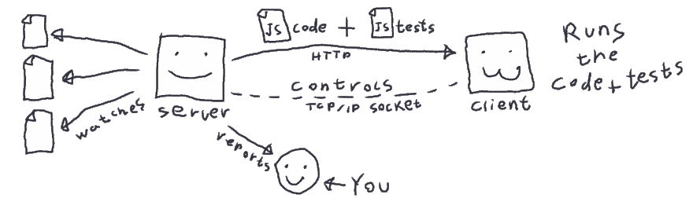

# 基础 KarmaJS 教程

> 原文：<https://dev.to/satansdeer/basic-karmajs-tutorial-df8>

*原贴于[maksimivanov.com](http://maksimivanov.com/posts/basic-karma-js)T3】*

*这个帖子还有一个[视频版本](https://www.youtube.com/watch?v=0_XhWBqgx-c)一定要看看。*

*Psst，你写了在浏览器中运行的 javascript 吗？*我有样东西给你，叫**因缘**，你会喜欢的。

当你写 javascript 代码时，你必须测试它。相同的代码在不同的浏览器中运行可能会略有不同，所以你最好至少在最常用的浏览器中测试你的代码。

这就是**业**的作用。

Karma 是一个试跑者。它允许你用真正的 DOM 在真正的浏览器中运行你的测试。它甚至可以连接到远程客户端，你可以在 *Browserstack* 上测试你的代码。

这不是你使用 Karma 得到的唯一好处。当您保存相关文件时，它可以通过查看文件和重新运行规格来加快您的工作。这将缩短反馈循环，所以你会有更流畅的编码体验。

## 它是如何工作的？

**Karma** 有两部分，服务器和客户端(或客户端)。

服务器是主要部分，它:

*   查看您的文件
*   与客户端通信并管理它们(通过套接字连接)
*   向客户端提供代码和测试(通过 HTTP)
*   向您转寄测试结果

[T2】](https://res.cloudinary.com/practicaldev/image/fetch/s--ZfJG1XJC--/c_limit%2Cf_auto%2Cfl_progressive%2Cq_auto%2Cw_880/http://d33wubrfki0l68.cloudfront.net/1fd7b491b02d42223621d59491a7861743a7a08e/36f54/asseimg/karma_scheme.png)

客户端根据代码运行测试，并将结果报告给服务器。

## 安装

```
# Install Karma
$ yarn add karma

# To be able to use command "karma" install karma-cli
$ yarn add karma-cli

# Install plugins
$ yarn add karma-jasmine jasmine-core karma-chrome-launcher 
```

Enter fullscreen mode Exit fullscreen mode

这将把 karma 及其插件安装到你当前工作目录的`node_modules`中，并在`package.json`中保存为`devDependencies`。

现在创建 **Karma** 配置文件。

```
karma init 
```

Enter fullscreen mode Exit fullscreen mode

接受所有默认值。将源文件和测试文件的位置设置为`js/*.js`和`test/*_spec.js`。以下是我所拥有的:

```
Which testing framework do you want to use ?
Press tab to list possible options. Enter to move to the next question.
> jasmine

Do you want to use Require.js ?
This will add Require.js plugin.
Press tab to list possible options. Enter to move to the next question.
> no

Do you want to capture any browsers automatically ?
Press tab to list possible options. Enter empty string to move to the next question.
> Chrome
>

What is the location of your source and test files ?
You can use glob patterns, eg. "js/*.js" or "test/**/*Spec.js".
Enter empty string to move to the next question.
> js/*.js
> test/*_spec.js
>

Should any of the files included by the previous patterns be excluded ?
You can use glob patterns, eg. "**/*.swp".
Enter empty string to move to the next question.
>

Do you want Karma to watch all the files and run the tests on change ?
Press tab to list possible options.
> yes 
```

Enter fullscreen mode Exit fullscreen mode

现在 **Karma** 应该说配置文件已经成功创建。

## 来写点规格吧！

你可能对我们将要用规格描述的问题很熟悉。记住 **Karma** 没有给你任何写规格的功能。所有这些`describe`、`it`、`expect`都来自 **Jasmine** ，我们在这里用它作为测试框架。

创建文件`test/fizzbuzz_spec.js`并将以下内容粘贴到其中:

```
describe('fizzbuzz', function(){
  describe('#process', function(){
    it('returns Fizz if number is divisible by 3', function(){
      expect(fizzbuzz.process(3)).toBe('Fizz');
      expect(fizzbuzz.process(6)).toBe('Fizz');
    });

    it('returns Buzz if number is divisible by 5', function(){
      expect(fizzbuzz.process(5)).toBe('Buzz');
      expect(fizzbuzz.process(10)).toBe('Buzz');
    });

    it('returns FizzBuzz if number is divisible by both 3 and 5', function(){
      expect(fizzbuzz.process(15)).toBe('FizzBuzz');
      expect(fizzbuzz.process(30)).toBe('FizzBuzz');
    });

    it('returns number itself if number is not divisible by 3 or 5', function(){
      expect(fizzbuzz.process(4)).toBe(4);
    });
  })
}); 
```

Enter fullscreen mode Exit fullscreen mode

这个规范代表了用于淘汰不称职程序员的经典面试问题。毫无疑问，你对它很熟悉。

现在开始因果报应。

```
$ karma start 
```

Enter fullscreen mode Exit fullscreen mode

它会观察你的文件，并在文件发生变化时重新运行。

由于你没有 fizzbuzz 模块，所有四个规格应该失败。

创建文件`js/fizzbuzz.js`并将下面的代码粘贴到那里:

```
var fizzbuzz = (function(){
  function process(n){
    if(!(n%15)){
      return 'FizzBuzz'
    }
    if(!(n%3)){
      return 'Fizz'
    }
    if(!(n%5)){
      return 'Buzz'
    }
    return n
  }

  return {
    process: process
  }
})() 
```

Enter fullscreen mode Exit fullscreen mode

为了让本教程简单明了，我将`fizzbuzz`全局定义为自调用匿名函数(从`window.fizzbuzz`中可以获得)。

这是我所知道的最愚蠢、最简单、最直接的解决方案，但是现在所有的测试都应该通过了。

在 Karma 运行的时候，你可以摆弄代码。尝试改进解决方案。尝试将其实现为一行程序。

解决这个任务最少需要多少字符？