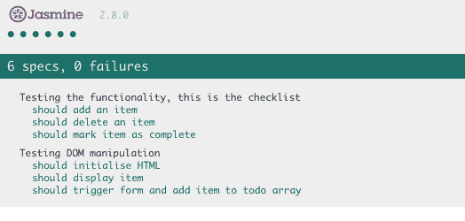

# 用普通 JavaScript 进行单元测试:非常基础

> 原文:[https://dev . to/aurelkurtula/unit-testing-with-vanilla-JavaScript-the-very-basics-7jm](https://dev.to/aurelkurtula/unit-testing-with-vanilla-javascript-the-very-basics-7jm)

在我的上一篇教程中，我介绍了 JavaScript 测试的基础，或者说，我举例说明了它是什么以及如何实现它。但是 JavaScript 测试最好用框架来完成。因此，在本教程中，我将使用 [Jasmine](https://jasmine.github.io/) “一种用于测试 JavaScript 代码的行为驱动开发框架”来测试一个简单的 Todo 应用程序。

我发现当想到它的存在仅仅是为了给我们的测试提供结构和更强的健壮性时，这是非常容易的，特别是与之前的普通方法相比。

## 设置项目

我们将建立一个基本的待办事项应用程序。它将有两个组成部分。一个控制数据，另一个将数据注入 DOM。

为了简单起见，我们不打算使用任何构建工具。我们只有四个文件:

*   `index.html` -实际的应用程序将从这里呈现并提供给客户端。
*   我们将在这里编写我们的应用程序代码。
*   `SpecRunner.html` -测试结果将显示在这里。
*   `ToDoSpec.js` -使用 Jasmine 我们将在这里测试我们在`ToDo.js`中编写的代码。

对于更大的应用程序，我们当然会以不同的方式构建这些文件，但是为了简单起见，它们都在根文件夹中。此外，在这里谈论 css 可能有些矫枉过正，但显然您会使用 CSS 来设计索引页面中的代码。

`index.html`将是空的，一切都将通过 JavaScript 注入。

```
<!DOCTYPE html>
<html lang="en">
<head>
  <title>Todo</title>
</head>
<body>
</body>
<script src="ToDo.js"></script>
</html> 
```

<svg width="20px" height="20px" viewBox="0 0 24 24" class="highlight-action crayons-icon highlight-action--fullscreen-on"><title>Enter fullscreen mode</title></svg> <svg width="20px" height="20px" viewBox="0 0 24 24" class="highlight-action crayons-icon highlight-action--fullscreen-off"><title>Exit fullscreen mode</title></svg>

`SpecRunner.html`就像 wise empty，但是我们将链接到 Jasmine 文件，后面是`ToDo.js`和`ToDoSpec.js`。原因是`ToDoSpec.js`需要从`ToDo.js`读取方法，以检查它们是否按照我们想要的方式运行。

```
<!DOCTYPE html>
<html lang="en">
<head>
    <title>Testing with Jasmine</title>
    <link rel="stylesheet" href="https://cdnjs.cloudflare.com/ajax/libs/jasmine/2.8.0/jasmine.min.css">
    <script src="https://cdnjs.cloudflare.com/ajax/libs/jasmine/2.8.0/jasmine.min.js"></script>
    <script src="https://cdnjs.cloudflare.com/ajax/libs/jasmine/2.8.0/jasmine-html.js"></script>
    <script src="https://cdnjs.cloudflare.com/ajax/libs/jasmine/2.8.0/boot.min.js"></script>
    <script src="ToDo.js"></script>
    <script src="ToDoSpec.js"></script>
</head>
<body>
</body>
</html> 
```

<svg width="20px" height="20px" viewBox="0 0 24 24" class="highlight-action crayons-icon highlight-action--fullscreen-on"><title>Enter fullscreen mode</title></svg> <svg width="20px" height="20px" viewBox="0 0 24 24" class="highlight-action crayons-icon highlight-action--fullscreen-off"><title>Exit fullscreen mode</title></svg>

锅炉板到此为止。现在让我们想一想我们希望我们的应用程序做什么。

## 我们需要应用程序做的事情清单

测试功能，这是清单:

*   应该添加一个项目
*   应该删除项目
*   应该将项目标记为完成

测试 DOM 操作:

*   应该注入初始 HTML
*   应该显示新项目
*   应该触发窗体并将项目添加到 todo 数组

在本教程结束时，Jasmine 将跟踪上面的清单，它看起来像这样:

[T2】](https://res.cloudinary.com/practicaldev/image/fetch/s--W94R9rU4--/c_limit%2Cf_auto%2Cfl_progressive%2Cq_auto%2Cw_880/https://thepracticaldev.s3.amazonaws.com/i/9xkzgv9524fognqwklw1.png)

在研究过程中，我听说了不同的测试方法。“测试第一”的方法是一个很好的例子。这意味着编写测试，然后实现通过测试的代码。但是当我为这个教程写代码的时候，我不得不两者兼而有之。然而，不管采用什么方法，我觉得沿途测试的一个直接好处是，它将迫使我们非常认真地考虑模块化。

## 茉莉结构的基本知识

在我之前的教程中，我使用 if 语句来检查我的函数是否做了我需要做的事情，Jasmine 做了类似的事情，但是是这样的:

```
describe('Testing the functionality, this is the checklist', ()=>{
  it('should add an item', ()=>{
    //...
  })
  it('should delete an item', ()=>{
    //...
  })
  it('should mark item as complete', ()=>{
    //...
  })
}) 
```

<svg width="20px" height="20px" viewBox="0 0 24 24" class="highlight-action crayons-icon highlight-action--fullscreen-on"><title>Enter fullscreen mode</title></svg> <svg width="20px" height="20px" viewBox="0 0 24 24" class="highlight-action crayons-icon highlight-action--fullscreen-off"><title>Exit fullscreen mode</title></svg>

注意它是如何与我们的清单和上面的截图相匹配的。然后我们将“测试 DOM 操作”测试归入另一个`describe`组。

现在让我们开始每个测试。

### 应增加一项测试和实现

待办事项列表将是一个对象，然后它将有方法作为其原型的一部分来修改待办事项列表。

我们将开始第一项测试。

```
describe('Testing the functionality, this is the checklist', ()=>{
  it('should add an item', ()=>{
    let todo = new ToDo();
    let item = {
     title: "get milk",
     complete: false
   }
    const done = todo.addTodo(item)
    expect(todo.getItems().length).toBe(1);
  })
}) 
```

<svg width="20px" height="20px" viewBox="0 0 24 24" class="highlight-action crayons-icon highlight-action--fullscreen-on"><title>Enter fullscreen mode</title></svg> <svg width="20px" height="20px" viewBox="0 0 24 24" class="highlight-action crayons-icon highlight-action--fullscreen-off"><title>Exit fullscreen mode</title></svg>

对于第一个测试，我们尝试创建一个`ToDo()`对象的实例，然后将一个硬编码的(假列表)项目对象传递给`todo.addTodo`，然后是**最重要的部分:**我们通过检查我们的项目是否被正确存储来检查它是否工作。简单地说，我们要求 Jasmine“期望”`todo.getItems().length`返回条目数组的长度，并且它是`1`(因为)我们刚刚在一个空数组中添加了一个条目(此时我们不关心它是否是一个数组，但是它将是一个数组)。

在浏览器中打开`SpecRunner.html`。我们显然会得到一个错误。它会说“ToDo 未定义”。

#### 让我们通过那个测试吧

在`ToDoSpec.js`中，我们试图测试将存储在`ToDo.js`中的生产代码。因此，打开该文件，让我们尝试修复测试中的错误。

测试尝试做的第一件事是实例化`ToDo`对象。创建它，然后刷新浏览器中的`SpecRunner.html`

```
function ToDo(){
  this.todo = [];
} 
```

<svg width="20px" height="20px" viewBox="0 0 24 24" class="highlight-action crayons-icon highlight-action--fullscreen-on"><title>Enter fullscreen mode</title></svg> <svg width="20px" height="20px" viewBox="0 0 24 24" class="highlight-action crayons-icon highlight-action--fullscreen-off"><title>Exit fullscreen mode</title></svg>

现在`ToDoSpec.js`试图运行不存在的`todo.addTodo`。

让我们编写通过测试所需的全部代码:

```
function ToDo(){
  this.todo = [];
}
ToDo.prototype.addTodo= function(item){
  this.todo.push(item)
}
ToDo.prototype.getItems= function(){
  return this.todo
} 
```

<svg width="20px" height="20px" viewBox="0 0 24 24" class="highlight-action crayons-icon highlight-action--fullscreen-on"><title>Enter fullscreen mode</title></svg> <svg width="20px" height="20px" viewBox="0 0 24 24" class="highlight-action crayons-icon highlight-action--fullscreen-off"><title>Exit fullscreen mode</title></svg>

通过测试。我们有`addTodo`、`getItems`方法(也称为 getter 和 setters)。

### 应该删除一个测试项并实现

每个测试和功能的实现将遵循相同的模式，我们创建测试，然后创建通过测试的方法

```
 it('should delete an item', ()=>{
    let todo = new ToDo();
    let item = {
      id: 1,
      title: "get milk 1",
      complete: false
     }
     let item2 = {
      id: 2,
      title: "get milk 2",
      complete: false
     }
     todo.addTodo(item)
     todo.addTodo(item2)
    todo.delete(2)
    expect(todo.getItems()[todo.getItems().length-1].id).toBe(1);
  }) 
```

<svg width="20px" height="20px" viewBox="0 0 24 24" class="highlight-action crayons-icon highlight-action--fullscreen-on"><title>Enter fullscreen mode</title></svg> <svg width="20px" height="20px" viewBox="0 0 24 24" class="highlight-action crayons-icon highlight-action--fullscreen-off"><title>Exit fullscreen mode</title></svg>

为了测试删除特性，我们需要添加一个条目，然后能够删除它。我们添加了两项来测试`delete`方法实际上删除了我们想要的那一项。

我们现在需要在`ToDo.js`创建`delete`方法

```
ToDo.prototype.delete = function(id){
 this.todo =  this.todo.filter(item => item.id !== id)
} 
```

<svg width="20px" height="20px" viewBox="0 0 24 24" class="highlight-action crayons-icon highlight-action--fullscreen-on"><title>Enter fullscreen mode</title></svg> <svg width="20px" height="20px" viewBox="0 0 24 24" class="highlight-action crayons-icon highlight-action--fullscreen-off"><title>Exit fullscreen mode</title></svg>

正如我们在测试中计划的那样，我们过滤掉项目，并删除没有通过`id`的项目。

### 应该将项目标记为完成测试和实现

我们希望能够将`complete`的属性从`false`更改为`true`。同样，为了确保正确完成，我正在添加项目，并试图改变其中一个项目以完成(我越想越觉得它不是必需的，但它让我感到安全，因为它实际上是可行的)。

```
 it('should mark item as complete', function(){
    let todo = new ToDo();
    let item = {
      id: 1,
      title: "get milk 1",
      complete: false
     }
     let item2 = {
      id: 2,
      title: "get milk 2",
      complete: false
     }
     todo.addTodo(item)
     todo.addTodo(item2)
     todo.complete(2)
    expect(todo.getItems().find(item => item.id == 2).complete).toBe(true);
  }) 
```

<svg width="20px" height="20px" viewBox="0 0 24 24" class="highlight-action crayons-icon highlight-action--fullscreen-on"><title>Enter fullscreen mode</title></svg> <svg width="20px" height="20px" viewBox="0 0 24 24" class="highlight-action crayons-icon highlight-action--fullscreen-off"><title>Exit fullscreen mode</title></svg>

上面我们期望`2`的`id`项的属性`complete`被设置为真。

实际的`todo.complete`方法是:

```
ToDo.prototype.complete = function(id){
  this.todo.find(item => item.id == id).complete = true;
} 
```

<svg width="20px" height="20px" viewBox="0 0 24 24" class="highlight-action crayons-icon highlight-action--fullscreen-on"><title>Enter fullscreen mode</title></svg> <svg width="20px" height="20px" viewBox="0 0 24 24" class="highlight-action crayons-icon highlight-action--fullscreen-off"><title>Exit fullscreen mode</title></svg>

## 重构代码

可以看到，我们在每次测试中都初始化了`ToDo`对象。Jasmine 允许我们在每次测试之前运行一些代码。

在所有测试的顶部，我们可以添加明显重复的代码

```
describe('Testing the functionality, this is the checklist', ()=>{
  let todo, item, item2;
  beforeEach(function(){
    todo = new ToDo();
    item = {
      id: 1,
      title: "get milk 1",
      complete: false
     }
     item2 = {
      id: 2,
      title: "get milk 2",
      complete: false
     }   
  })
  //...
}) 
```

<svg width="20px" height="20px" viewBox="0 0 24 24" class="highlight-action crayons-icon highlight-action--fullscreen-on"><title>Enter fullscreen mode</title></svg> <svg width="20px" height="20px" viewBox="0 0 24 24" class="highlight-action crayons-icon highlight-action--fullscreen-off"><title>Exit fullscreen mode</title></svg>

相当酷！当然，我们会从每个测试用例中删除那些重复的片段。

现在我们有了它们，我们计划从“测试功能”开始检查的所有测试都以优异(绿色)的成绩通过了！

## 测试 DOM 操作

在这一批测试中，我们希望确保 DOM 注入如我们预期的那样工作。

对于这些新的测试集，我们使用新的`describe`方法。我们还利用`beforeEach`方法实例化了`DomManipulation`对象(我们必须创建它),并创建了一个虚拟条目(我们稍后会用到)

```
describe('Testing DOM manipulation', function(){
  let Dom, item, todo;
  beforeEach(function(){
     todo = new ToDo();
    Dom = new DomManipulation();
    item = {
      complete: false,
      id : 1, 
      title: 'some Title'
    }
 })
// it methods will go here ...
}) 
```

<svg width="20px" height="20px" viewBox="0 0 24 24" class="highlight-action crayons-icon highlight-action--fullscreen-on"><title>Enter fullscreen mode</title></svg> <svg width="20px" height="20px" viewBox="0 0 24 24" class="highlight-action crayons-icon highlight-action--fullscreen-off"><title>Exit fullscreen mode</title></svg>

有趣的是，如果我们刷新浏览器，仍然指向`SpecRunner.html`，即使`DomManipulation`不存在，我们也不会看到错误。这证明，`beforeEach`只有在我们进行测试时才真正运行。让我们创建第一个。

### 应该初始化 HTML

如果你记得的话，我们在`index.html`中没有任何东西。我选择这种方法是为了测试这个框架。所以我们需要创建 DOM 节点。这是第一个考验。

```
it('should initialise HTML', function(){
    const form = document.createElement('form');
    const input = document.createElement('input')
    const ul = document.createElement('ul')
    input.id = "AddItemInput"
    form.id="addItemForm"
    form.appendChild(input);
    expect(Dom.init().form).toEqual(form)
    expect(Dom.init().ul).toEqual(ul)
  }) 
```

<svg width="20px" height="20px" viewBox="0 0 24 24" class="highlight-action crayons-icon highlight-action--fullscreen-on"><title>Enter fullscreen mode</title></svg> <svg width="20px" height="20px" viewBox="0 0 24 24" class="highlight-action crayons-icon highlight-action--fullscreen-off"><title>Exit fullscreen mode</title></svg>

上面我们想确保`Dom.init()`创建了正确的 DOM 节点。**注意，我们可以有多个期望**，我们希望`Dom.init()`产生一个表单和一个无序列表。

在`ToDo.js`中，我们可以创建`DomManipulation`和它的`init`方法

```
function DomManipulation(){}
DomManipulation.prototype.init = function(){
  const form = document.createElement('form');
  const input = document.createElement('input')
  const ul = document.createElement('ul')
  input.id = "AddItemInput"
  form.id="addItemForm"
  form.appendChild(input);
  return {
    form, ul
  }
} 
```

<svg width="20px" height="20px" viewBox="0 0 24 24" class="highlight-action crayons-icon highlight-action--fullscreen-on"><title>Enter fullscreen mode</title></svg> <svg width="20px" height="20px" viewBox="0 0 24 24" class="highlight-action crayons-icon highlight-action--fullscreen-off"><title>Exit fullscreen mode</title></svg>

### 应创建项

当用户提交一个项目时，我们希望创建一个列表 DOM 元素。因为这是测试元素的反应，而不是表单提交，我们伪造了数据，假装它来自表单(`item`是我们在`beforeEach`方法中创建的对象)。

```
it('should create item', function(){
    const element = Dom.displayItem(item);
    const result = document.createElement('li');
    result.innerText = item.title
    expect(element).toEqual(result)
  }) 
```

<svg width="20px" height="20px" viewBox="0 0 24 24" class="highlight-action crayons-icon highlight-action--fullscreen-on"><title>Enter fullscreen mode</title></svg> <svg width="20px" height="20px" viewBox="0 0 24 24" class="highlight-action crayons-icon highlight-action--fullscreen-off"><title>Exit fullscreen mode</title></svg>

应该创建我们在测试中创建的元素。所以让我们创建这个方法:

```
DomManipulation.prototype.displayItem = function(item){
  const li = document.createElement('li');
  li.innerText = item.title
  return li;
} 
```

<svg width="20px" height="20px" viewBox="0 0 24 24" class="highlight-action crayons-icon highlight-action--fullscreen-on"><title>Enter fullscreen mode</title></svg> <svg width="20px" height="20px" viewBox="0 0 24 24" class="highlight-action crayons-icon highlight-action--fullscreen-off"><title>Exit fullscreen mode</title></svg>

### 应触发窗体并向 todo 数组添加项

这是迄今为止我最难接受的部分。我觉得它好像是个黑客！

我们需要检查表单是否被提交，输入是否被添加到 todo 数组(来自前面的实现)。

由于测试是自动化的，而且我们无法访问原始的 DOM，所以表单、输入和触发器都是伪造的！让我们来看看测试。

```
 it('should trigger form and add item to todo array', function(){
    const form = document.createElement('form');
    form.innerHTML= `<input value="get milk" />
      <button type="submit" />`;
    document.body.appendChild(form)
    const ul = document.createElement('ul'); 
    Dom.addTodoEvent(
      form, 
      todo.addTodo.bind(todo), 
      ul)
    form.getElementsByTagName('button')[0].click();
    document.body.removeChild(form)
    expect(todo.todo[0].title).toEqual('get milk')
  }) 
```

<svg width="20px" height="20px" viewBox="0 0 24 24" class="highlight-action crayons-icon highlight-action--fullscreen-on"><title>Enter fullscreen mode</title></svg> <svg width="20px" height="20px" viewBox="0 0 24 24" class="highlight-action crayons-icon highlight-action--fullscreen-off"><title>Exit fullscreen mode</title></svg>

我们创建表单和硬编码的输入，否则用户会添加它。然后将表单注入 DOM！**这是触发事件**的唯一方法。然后我们运行`Dom.addTodoEvent`，向它传递表单、`todo.addTodo`方法和一个无序列表。

最后，我们“伪造”表单提交，然后**从 DOM** 中移除表单(否则在加载`SpecRunner.html`时，它会出现在浏览器中)。

最后，我们希望添加一个条目，其标题与我们添加到表单输入中的标题相同。

**我感觉一定有比那样添加和删除 DOM 元素更好的方法！**

最后，让我们创建上面测试所期望的`DomManipulation.prototype.addTodoEvent`

```
DomManipulation.prototype.addTodoEvent = function(form, createTodo, unorderedList){
  const displayItem = this.displayItem;
  const id = new Date().getUTCMilliseconds();
  form.addEventListener('submit', function(e){
        e.preventDefault();
        const input = document.querySelector('input').value
        const item = {complete: false,id : id, title: input}
        createTodo(item);
        unorderedList.appendChild(displayItem(item))
    }) 
} 
```

<svg width="20px" height="20px" viewBox="0 0 24 24" class="highlight-action crayons-icon highlight-action--fullscreen-on"><title>Enter fullscreen mode</title></svg> <svg width="20px" height="20px" viewBox="0 0 24 24" class="highlight-action crayons-icon highlight-action--fullscreen-off"><title>Exit fullscreen mode</title></svg>

`addTodoEvent`处理表单。它需要表单、处理表单输出的方法以及应该更改的 DOM。

## 结论

我真的很喜欢这个。从长远来看，这将使添加功能或修改现有代码的过程更加容易。同样，我越是使用“测试优先”的方法，我的代码就越是模块化。我仍然感到不安，因为像上次测试那样添加和删除 DOM 元素可能会遗漏一些东西，你认为呢？