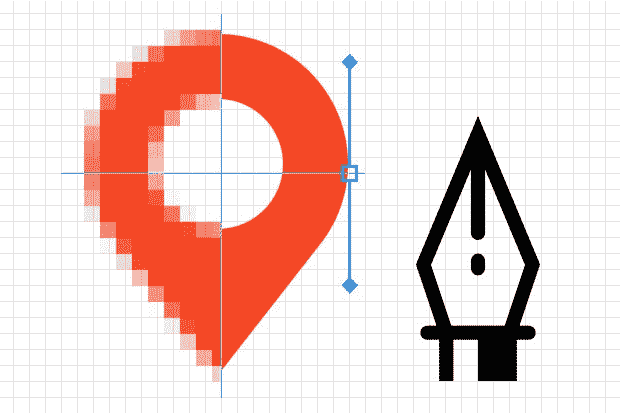
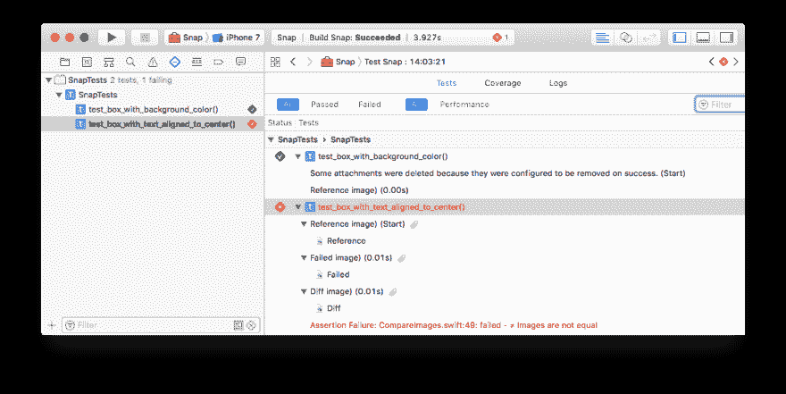
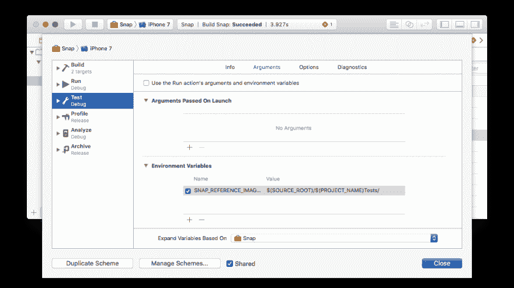

# 快照测试简介📸

> 原文：<https://dev.to/skyweb07/an-intro-to-snapshot-testing--ke>

因此，我正在制作一个新的应用程序，我很乐意分享我在这个过程中学到的所有知识，这样我就可以保持自我激励，并分享一些知识，希望你可以用于你自己的应用程序。

### 🎨为什么要测试 UI？

你要确保每次接触任何 UI 元素时，所有东西都保持它们原本的样子，而且这种集成测试可以帮助你实现完美的像素视图，让你的设计者高兴，因为他们甚至可以在你的拉取请求中看到设计参考图像。

[](https://res.cloudinary.com/practicaldev/image/fetch/s--40MCPO7n--/c_limit%2Cf_auto%2Cfl_progressive%2Cq_auto%2Cw_880/https://cdn-images-1.medium.com/max/1600/1%2A_Kt6ULxjNjf8wVv3l9dzrg.jpeg) 
所以你想在做一些漂亮的测试时达到像素完美？

### ⚡️是怎么工作的？

我将尝试使用我最新的 lib [Snap.swift](https://github.com/skyweb07/Snap.swift) 来描述如何使用这个方法。

它的工作原理是生成一个存储在存储库中的参考图像，然后将每个新的测试用例与`reference image`进行比较，以检查是否有任何差异。如果 test 发现了任何差异，它会在您的测试用例中添加一个附件，这样您就可以检查什么发生了变化

[T2】](https://res.cloudinary.com/practicaldev/image/fetch/s--fKSWNNDp--/c_limit%2Cf_auto%2Cfl_progressive%2Cq_auto%2Cw_880/https://github.com/skyweb07/Snap.swift/blob/develop/.art/xcode_attachment.png%3Fraw%3Dtrue)

### 🛠配置

为了配置快照测试文件夹，我们需要向项目添加一个新的环境变量，名称为`SNAP_REFERENCE_IMAGE_PATH`，值为`$(SOURCE_ROOT)/$(PROJECT_NAME)Tests/`，这样`Snap.swift`就可以找到存储参考图像的文件夹。如果配置设置正确，项目应该如下所示:

[T2】](https://res.cloudinary.com/practicaldev/image/fetch/s--GJSLow3n--/c_limit%2Cf_auto%2Cfl_progressive%2Cq_auto%2Cw_880/https://github.com/skyweb07/Snap.swift/blob/develop/.art/xcode_project_environment_variable.png%3Fraw%3Dtrue)

### 🎯装置

Snap.swift 可通过 [CocoaPods](http://cocoapods.org) 获得。要安装
,只需在 Podfile 中添加下面一行:

```
pod 'Snap.swift' 
```

Enter fullscreen mode Exit fullscreen mode

### ✅创造了我们的第一个试验

1)我们首先需要记录我们的参考图像，为了这样做，我们必须首先进入我们的测试类，将`isRecording`变量设置为`true`，这样库就知道我们处于记录模式，并且可以提取`reference images`T3

```
import XCTest
import Snap_swift

class SnapTests: XCTestCase {

  override func setUp() {
    super.setUp()
    isRecording = true
  }

  func test_box_with_text_aligned_to_center() {
    let view = BoxWithTextAlignedToCenterView()

    expect(view).toMatchSnapshot()
  }
} 
```

Enter fullscreen mode Exit fullscreen mode

在执行完测试套件后，如果一切正常，我们应该会看到所有的测试都失败了，并出现类似于
的警告

```
⚠️ Test ran in record mode, reference image has been saved to $SNAP_REFERENCE_IMAGE_PATH/testcase.png, now remove `isRecording` in order to perform the snapshot comparison. 
```

Enter fullscreen mode Exit fullscreen mode

这没问题，这只是意味着我们的参考图像被保存，我们可以在我们的`reference image`目录中检查它们，我们通常应该将它们添加到`git`中，这样我们就可以与它们进行比较。

#### 警告

> *生成参考图像后，记得移除`isRecording`标记，否则您将无法进行图像比较*

### 📝笔记

> 像今天一样，您可以对`UIView`和`CALayer`类进行断言。

这个项目在`Facebook` [FBSnapshotTestCase](https://github.com/facebookarchive/ios-snapshot-test-case/) 库上得到了很大的启发，看起来他们已经对这个库进行了归档，所以我开始了这个项目来继续完善这个项目，并继续使用 mobile `snapshot-testing`

还有其他方法可以通过使用库来测试 UI 元素，比如 KIF 或 Google 的 EarlGrey，但是我认为这种快照测试更容易维护，其中一个快照测试可以等同于许多其他框架。如果你有任何疑问或问题，可以通过[推特](https://twitter.com/skyweb07)联系我，我会尽力帮你解决。

谢谢大家，祝快照测试愉快📸