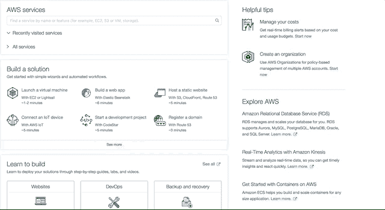
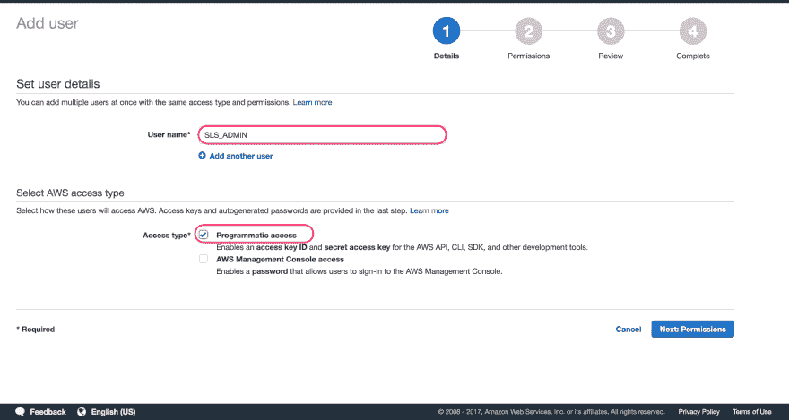
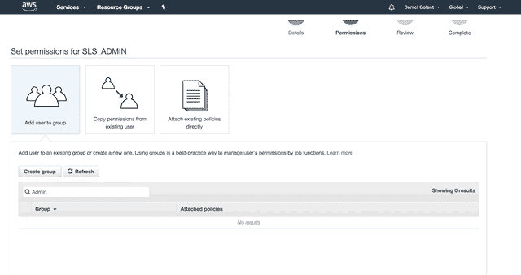
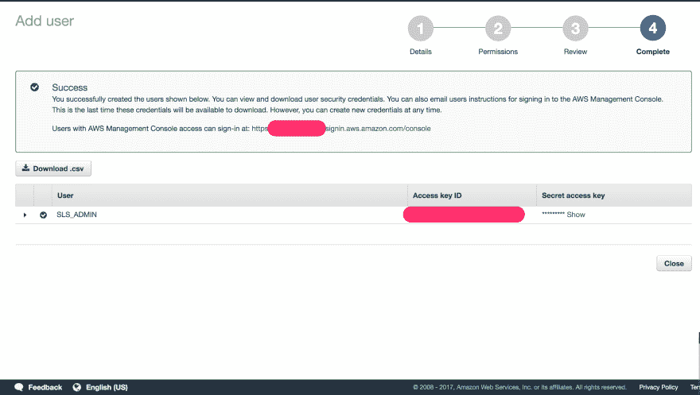

# 用 Python 和 AWS Lambda 创建无服务器函数

> 原文:[https://dev . to/dango lant/creating-server less-functions-with-python-and-AWS-lambda-DLI](https://dev.to/dangolant/creating-serverless-functions-with-python-and-aws-lambda-dli)

## 一本入门书

大多数读过这方面书籍的人都知道，“无服务器功能”这个名称是用词不当。服务器仍然参与到整个过程中，只是，正如 web 开发的趋势一样，开发人员对它的控制越来越少。

虽然这听起来很糟糕，但是对于那些只想把酷产品展示给酷人的开发人员来说，生产就绪型应用程序的大部分部署和操作都是一份冗长乏味的待办事项清单(使用你的产品的人都是酷的，这是商业的第一原则)😁).云托管和托管软件的历史表明，放弃对这些东西的控制通常会降低许多开发人员的准入门槛。“无服务器”功能，或者更准确地说，“功能即服务”，只是这一趋势的下一个逻辑发展；一个让我们这个领域的许多[头脑](https://www.redhat.com/files/summit/session-assets/2017/S109151-serverless.pdf)非常兴奋的事情。

主要的好处是，当将这些功能作为服务运行时，云托管的“按使用付费”承诺实际上得到了扩展，因为您不会在项目中构建任何开销。你没有运行一个虚拟服务器，它在空闲时使用资源，而你是按分钟计费的。你运行的函数只在被触发时使用资源，也就是说你只在用户真正使用你的代码时付费。整洁，对不对？

虽然我个人对放弃更多的生产资料有所顾虑(格迪特？😁)对于我们那些被认为是仁慈的公司老板，我觉得为了我自己和我的技术发展，我应该尝试一下无服务器功能，特别是因为有这么多文章赞美这些工具节省成本的优点。我照做了。

## 基本设置

如果您之前已经创建了一个无服务器功能，您可以跳到第 3 节。

#### 1。装置

首先，你要安装 [*无服务器*](https://serverless.com/) 框架。完全有可能在没有框架的情况下编写无服务器功能，但是据我所知，*无服务器*让整个过程变得更加容易。可以用
安装

```
npm install -g serverless 
```

<svg width="20px" height="20px" viewBox="0 0 24 24" class="highlight-action crayons-icon highlight-action--fullscreen-on"><title>Enter fullscreen mode</title></svg> <svg width="20px" height="20px" viewBox="0 0 24 24" class="highlight-action crayons-icon highlight-action--fullscreen-off"><title>Exit fullscreen mode</title></svg>

注意，不管你用什么语言编写函数，*无服务器*是一个节点模块，必须和`npm`一起安装。

#### 2。设置管理服务帐户

接下来，您必须设置一个可以附加代码的服务。对于*无服务器*支持的任何提供商，设置过程应该类似，目前包括:

*   [AWS](https://aws.amazon.com/)
*   [微软 Azure](https://azure.microsoft.com/)
*   [IBM OpenWhisk](https://www.ibm.com/cloud/functions)
*   [GCP](https://cloud.google.com/functions/)
*   [kub less](http://kubeless.io/)
*   [Spotinst](https://spotinst.com/)
*   [网络任务](https://webtask.io/)

在这篇文章中，我们将只讨论如何在 AWS 中实现它。如果你使用不同的服务，那么我建议你查阅一下*无服务器的文档；是**优秀的**。*

首先，转到 AWS 并导航到 IAM 服务。

[T2】](https://res.cloudinary.com/practicaldev/image/fetch/s--MudEIoaA--/c_limit%2Cf_auto%2Cfl_progressive%2Cq_66%2Cw_880/https://thepracticaldev.s3.amazonaws.com/i/h7hqivynbal1uowxer6a.gif)

接下来，导航到`Users`并点击*添加用户*。在那里，为您的服务帐户添加一个描述性名称。由于这是您安装的*无服务器* CLI(为了避免混淆，我将在下文中称之为 *SLS* )用来更改您的 AWS 帐户的管理帐户，您可以给它一个通用名称，并在您编写的所有服务中使用一个公共服务帐户。你也可以自由地使用单独的账户，当我第一次设置我的账户时，我给它起了一个特定于项目的名字，因为我不知道我在做什么。使用特定于项目的帐户有助于确保您创建的所有内容保持整洁和独立，但这不是绝对必要的。

确保选中*编程访问*复选框，这允许 CLI 自动将更改应用到您的帐户。

[T2】](https://res.cloudinary.com/practicaldev/image/fetch/s--fBzfnUK9--/c_limit%2Cf_auto%2Cfl_progressive%2Cq_auto%2Cw_880/https://thepracticaldev.s3.amazonaws.com/i/97qxnszo5a5sldglr7w1.png)

在下一页，授予您的服务帐户 *AdministratorAccess* 权限。

[T2】](https://res.cloudinary.com/practicaldev/image/fetch/s--mTgvWi5k--/c_limit%2Cf_auto%2Cfl_progressive%2Cq_66%2Cw_880/https://thepracticaldev.s3.amazonaws.com/i/xq2alq3rnag6mxkm81qd.gif)

准备好之后点击*创建用户*，复制出你的*访问密钥 ID* 和*秘密密钥*(或者下载成 CSV 格式)。如果您已经深入其中，我想您应该知道这些秘密非常重要，应该妥善保管。

[T2】](https://res.cloudinary.com/practicaldev/image/fetch/s--eJzJYfS---/c_limit%2Cf_auto%2Cfl_progressive%2Cq_auto%2Cw_880/https://thepracticaldev.s3.amazonaws.com/i/7mo8dsl0tgp36l1a07xw.png)

你快成功了！当你只想构建一些东西时，难道你不喜欢无止境的配置吗？

[T2】](https://res.cloudinary.com/practicaldev/image/fetch/s--O_HbKFJN--/c_limit%2Cf_auto%2Cfl_progressive%2Cq_66%2Cw_880/https://thepracticaldev.s3.amazonaws.com/i/qy24a6colp1ulaguua7n.gif)

现在你需要做的就是运行下面的代码，让 *SLS* 访问你的凭证:

```
serverless config credentials --provider aws --key <ACCESS KEY ID> --secret <SECRET KEY> 
```

<svg width="20px" height="20px" viewBox="0 0 24 24" class="highlight-action crayons-icon highlight-action--fullscreen-on"><title>Enter fullscreen mode</title></svg> <svg width="20px" height="20px" viewBox="0 0 24 24" class="highlight-action crayons-icon highlight-action--fullscreen-off"><title>Exit fullscreen mode</title></svg>

瞧，你已经准备好… *创建*你的项目了。嘿，没人说过这不会有点乏味。只要高兴 *SLS* 正在为你处理一堆这种事情。

#### 3。创建您的服务项目

现在您已经准备好创建您的项目，导航到您想要创建服务的文件夹并执行以下命令:

```
serverless create --template aws-python3 --path <PATH> 
```

<svg width="20px" height="20px" viewBox="0 0 24 24" class="highlight-action crayons-icon highlight-action--fullscreen-on"><title>Enter fullscreen mode</title></svg> <svg width="20px" height="20px" viewBox="0 0 24 24" class="highlight-action crayons-icon highlight-action--fullscreen-off"><title>Exit fullscreen mode</title></svg>

你现在应该有一个绝对*满满的*无服务器的文件夹。在该文件夹中，您应该会看到一个名为`serverless.yml`的文件。这是新项目的主要配置文件。如果你打开它，你应该会看到这样的东西(还有一堆我删除的评论):

```
service: my-service

provider:
  name: aws
  runtime: python3.6
package:
  exclude:
    - secrets.yaml

functions:
  hello:
    handler: handler.hello 
```

<svg width="20px" height="20px" viewBox="0 0 24 24" class="highlight-action crayons-icon highlight-action--fullscreen-on"><title>Enter fullscreen mode</title></svg> <svg width="20px" height="20px" viewBox="0 0 24 24" class="highlight-action crayons-icon highlight-action--fullscreen-off"><title>Exit fullscreen mode</title></svg>

您还应该有一个包含一个`hello()`函数的`handler.py`文件。如果你看上面，你会看到这是以`hello`的名字注册的服务(就在底部)。这意味着您可以将服务的各个部分拆分成不同于`handler.py`的文件，同时仍然可以将它们直接注册到您的服务中。方便！

我不喜欢一些作者在这些指南中做的事情，他们故意让你尝试一些不起作用的东西，只是为了证明一个观点，我觉得这很烦人，所以我会告诉你:

虽然你*确实*已经定义了一个名为`hello`的函数，它链接到一个函数处理程序，但是你目前没有办法触发那个函数。这就是为什么我们需要在`serverless.yml`中定义的函数中添加一个`event`。更新如下:

```
functions:
  hello:
    handler: handler.hello
    events:
      - http:
          path: hello
          method: get 
```

<svg width="20px" height="20px" viewBox="0 0 24 24" class="highlight-action crayons-icon highlight-action--fullscreen-on"><title>Enter fullscreen mode</title></svg> <svg width="20px" height="20px" viewBox="0 0 24 24" class="highlight-action crayons-icon highlight-action--fullscreen-off"><title>Exit fullscreen mode</title></svg>

`events`集合包含函数的触发器，并且有多种类型。其中包括 [cron 任务，Alexa 技能，物联网触发器，以及更多](https://serverless.com/framework/docs/providers/aws/events/)。现在，您将使用一个简单的 HTTP 触发器，当您向`/hello`端点发送一个`GET`请求时，它将做出响应。

从这里开始，您可以像对待一个普通的 Python 项目一样对待它，只有一个例外，我将在最后提到。要安装依赖项，只需像平常一样创建您的`env`目录，或者使用 Pipenv。您可能希望在您的服务目录中安装来自[这个库](https://github.com/UnitedIncome/serverless-python-requirements)的`serverless-python-requirements`，它将自动捆绑来自您的`requirements.txt`或`Pipfile`的需求，并通过其`PYTHONPATH`使它们对您的功能可用。

###### 关于 PipEnv 的一个注记

###### PipEnv 是一个相对较新的工具，用于替代全局安装模块或之前的默认解决方案虚拟环境。它是由 Kenneth Reitz 撰写和推荐的，他是流行工具如`requests`和“Python 搭便车指南”的作者。PipEnv 对我的开发过程有很大的帮助，然而，我在使用 PipEnv 的`google-client-api`模块时遇到了一些问题，不得不围绕`venv`重新设计我的项目。如果你依赖这个模块并且正在编写一个无服务器函数，我建议不要使用 PipEnv。

#### 4。部署和测试

最后，您需要部署您的功能:

```
serverless deploy 
```

<svg width="20px" height="20px" viewBox="0 0 24 24" class="highlight-action crayons-icon highlight-action--fullscreen-on"><title>Enter fullscreen mode</title></svg> <svg width="20px" height="20px" viewBox="0 0 24 24" class="highlight-action crayons-icon highlight-action--fullscreen-off"><title>Exit fullscreen mode</title></svg>

获取输出中列出的端点，应该类似于:

```
GET - https://xxxxxxxxxx.execute-api.us-east-1.amazonaws.com/dev/hello 
```

<svg width="20px" height="20px" viewBox="0 0 24 24" class="highlight-action crayons-icon highlight-action--fullscreen-on"><title>Enter fullscreen mode</title></svg> <svg width="20px" height="20px" viewBox="0 0 24 24" class="highlight-action crayons-icon highlight-action--fullscreen-off"><title>Exit fullscreen mode</title></svg>

如果您在不执行部署的情况下需要关于您的服务的信息，只需运行`sls info`来注销端点、功能等等。

如果您在浏览器中导航到该 URL，您应该会收到响应:

`Go Serverless!`

您也可以通过使用命令调用您的服务:

```
sls invoke -f hello 
```

<svg width="20px" height="20px" viewBox="0 0 24 24" class="highlight-action crayons-icon highlight-action--fullscreen-on"><title>Enter fullscreen mode</title></svg> <svg width="20px" height="20px" viewBox="0 0 24 24" class="highlight-action crayons-icon highlight-action--fullscreen-off"><title>Exit fullscreen mode</title></svg>

如果由于某种原因没有收到响应，您可以运行:

```
sls logs -f <function_name> —tail 
```

<svg width="20px" height="20px" viewBox="0 0 24 24" class="highlight-action crayons-icon highlight-action--fullscreen-on"><title>Enter fullscreen mode</title></svg> <svg width="20px" height="20px" viewBox="0 0 24 24" class="highlight-action crayons-icon highlight-action--fullscreen-off"><title>Exit fullscreen mode</title></svg>

查看来自服务器的给定函数的连续日志。

呜呜呜，我们完了！对吗？嗯嗯…有点儿...

[T2】](https://res.cloudinary.com/practicaldev/image/fetch/s--7k_Cy7XL--/c_limit%2Cf_auto%2Cfl_progressive%2Cq_66%2Cw_880/https://thepracticaldev.s3.amazonaws.com/i/eg2r7o4iy4e3mrk861sf.gif)

问题是，部署到您的服务需要相当长的时间，这样的测试可能会很乏味。另外，如果你有一个产品服务，部署测试是不可取的。

那么我们如何测试我们闪亮的新功能呢？

有一些不同的方法，包括一些奇特的库，但是现在我发现简单地添加关键字`local`就可以了，如下所示:

```
sls invoke local --function <FUNCTION> --log 
```

<svg width="20px" height="20px" viewBox="0 0 24 24" class="highlight-action crayons-icon highlight-action--fullscreen-on"><title>Enter fullscreen mode</title></svg> <svg width="20px" height="20px" viewBox="0 0 24 24" class="highlight-action crayons-icon highlight-action--fullscreen-off"><title>Exit fullscreen mode</title></svg>

您不是访问您的远程函数实例，而是访问一个托管在您自己机器上的实例，这意味着您可以保存文件并测试它们，而无需重新部署。

##### 好了，这些是基本的，但是还有更多要学的

#### 5。后续步骤

我在使用无服务器功能时遇到的第一个问题是不清楚如何管理秘密值。我发现[这个指南](http://www.goingserverless.com/blog/keeping-secrets-out-of-git)非常有用，也很容易理解，建议你去看看。

如果你对无服务器解决方案的理念和架构更感兴趣，我喜欢这篇文章，我建议你阅读一下 FaaS 方法和传统 web 后端之间的架构差异。

## 我的用例

> ### So, what am I building with all this?

在过去的十个月或十一个月里，我已经承诺要更频繁地去健身房，幸运的是，我能够保持这个承诺。在我一周去健身房的三天中，从一月到八月下旬，我最多有一天没去，在和一些密友进行了一次让我有点精疲力尽的奇妙旅行后，我在九月错过了几周。我一直完美地保持的一件事是，每次我在健身房进行锻炼时，我都会用谷歌表记录我做了多少次重复和几组，有时还会记录我对它们的感受。这可能看起来毫无必要或者毫无意义，但是我已经注意到跟踪和回顾这些类型的度量标准有助于我坚持下去并取得进步。

现在我有了所有这些数据，我想处理它(目前有 46 个电子表格)并在我的网站上以交互式图表的形式呈现出来。如果我有数据，我也可以使用它，对不对？

为了实现这个目标，我设置了一个函数，它从我的工作表中获取数据，将每个工作表转换成一个对象，然后提供给一个静态前端，将数据输入到一个 D3 图形中。这仍然是一个正在进行的工作，但我希望它能很快出版。

无服务器功能无疑使我的路线工作起来比我必须建立一个服务器快得多。

## 局限性

> 我欢迎对以下任何陈述的纠正(当然，还有前面的任何陈述)

无服务器功能看起来很棒，因为从哲学上来说，它们(看起来)是云托管精神的最终进化。然而，也有缺点。

如果您是自托管的，它们看起来不像是一个逻辑架构选择，因为底层服务器仍然在那里，空闲着，并且可能使用更多的资源来协调每个函数调用的启动和关闭。这种模式只有在亚马逊或谷歌买单时才有意义。此外，如果您有长时间运行的进程或后台任务(不包括 crons，它可以被设置为函数的触发器)，这种架构可能不是最适合您的应用程序的。持久层也带来了挑战，因为它们*必须*在外部托管，要么在服务器上，要么使用像 DynamoDB、GCD 等数据存储服务。最后，将空闲时间视为总成本最小部分的项目可能会从这种架构中获得较小的收益，这意味着如果您的服务经常受到攻击，并且具有稳定的数量，FaaS 可能是您应该等待尝试的一种趋势。

## 结论

无服务器功能似乎将在未来相当长的一段时间内为我提供深入而广泛的学习，因为它们既消除了由传统开发过程引起的现有顾虑，又为习惯于设置服务器的开发人员创建了新的顾虑。下一次，当你发现自己在做原型，或者创建一个很少被访问的路径时，我强烈建议你先看看无服务器。

###### 鸣谢

###### 这篇文章中的大部分知识来自这个[入门指南](https://hackernoon.com/a-crash-course-on-serverless-with-node-js-632b37d58b44)，我为我的 python 用例进行了调整，还来自优秀的[文档](https://serverless.com/framework/docs/providers/aws/guide/quick-start/)。

###### 特别为我的好朋友[马利克·布朗](https://www.malikbrowne.com/)的编辑大声喊出来！