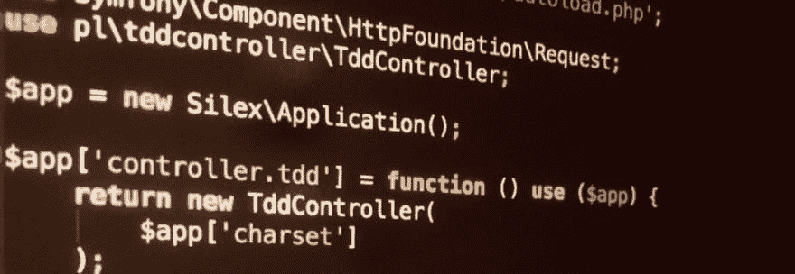

# 从 PHPUnit 启动嵌入式 PHP web 服务器

> 原文:[https://dev.to/phpprofi/-PHP-phpunit-2mk 8](https://dev.to/phpprofi/--php----phpunit-2mk8)

[T2】](https://res.cloudinary.com/practicaldev/image/fetch/s--xW1BETEP--/c_limit%2Cf_auto%2Cfl_progressive%2Cq_auto%2Cw_880/http://phpprofi.ru/resources/img/blogs/f9f69e92-5eee-487e-b9ca-c1beac882a04.jpeg)

有时，在 PHP 中，我们需要编写集成测试，有时，这些集成测试需要一个 WeB 服务器。从 PHP 5.4 开始，您可以使用板载 web 服务器。

* * *

http://phpprofi.ru/blogs/post/81 的читать

* * *

en:[https://medium . com/@ Peter . Lafferty/start-phps-built-in-we B- server-from-phpunit-9571 f38c 5045](https://medium.com/@peter.lafferty/start-phps-built-in-web-server-from-phpunit-9571f38c5045)