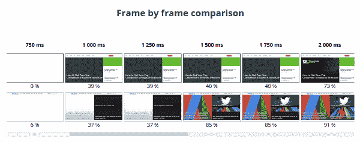
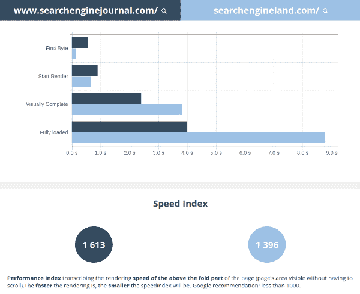

# 加载时间到了！

> 原文:[https://dev.to/damienjubeau/load-time-is-out-252](https://dev.to/damienjubeau/load-time-is-out-252)

*这篇文章最初见于 [Dareboost 的博客](https://blog.dareboost.com/en/2017/11/load-time-is-out/)。*

* * *

网络代理和他们的客户，经理和技术团队，正在就加载时间进行讨论和辩论，但并不总是相互理解。
鉴于网站加载速度是一个不可否认的战略性问题，参与 web 项目的每个人都应该考虑，因此必须首先选择相关且一致的 web 性能指标。你只能改进你所测量的，并且这个测量必须是可靠的。

## “加载时间”就是不存在！

这个有争议的标题强调了一个事实:加载时间是一个通用的概念，通常没有指定一个精确的指标！事实上，有几个工具讨论加载时间，而它们的定义可能会因工具而异:

*   Google Analytics 提供的平均页面加载时间(通过 Behavior > Site Speed 菜单获得)实际测量的是触发`onload`事件之前的时间。
*   Pingdom 还创造了一个“加载时间”，相当于触发`onload`事件。但是，这个指示器在他们的瀑布中被用作满载时间，导致一些渲染问题。为了解决这个问题，我们必须检查可下载的 HAR 文件。
*   测试我的网站(想想谷歌)事实上提供了一个速度指标的措施。一些你可以通过工具提示发现的东西。正如我们将在后面看到的，使用速度指数是一件好事。但是将它命名为“加载时间”会产生误导。最后，这个工具给出了非常少的关于测试环境的信息(哪个位置？什么样的 3G 连接？).

Alexa 工具的另一个例子，给出了当前的定义:

> 单个页面的加载时间是指加载 DOM(页面的结构)所需的时间。例如，这个时间不包括加载所有图像和样式表的时间。Alexa.com

通过排除图像(根据 HTTP Archive 的数据，现在超过网页总重量的 50%)和样式表(它们的加载阻碍了视觉渲染)，Alexa 离测量用户体验还很远！

即使我们应该质疑这一指标的价值，我们也必须承认这一工具的透明度，为所提供的指标下一个定义。

然而，正如许多工具一样，Alexa 失败了，因为它没有给出关于测量上下文的信息:是用机器人还是用真正的浏览器？什么样的联系？从哪个位置？所有这些参数都是关键参数，因为它们会强烈影响测量值。如果没有这些信息，我们就不能依赖它们，因为它们可能会随着时间的推移而缺乏恒定性！

您更愿意使用清楚地提到他们的测试方法的工具(收集哪些指标，以及如何测量它们)。这样做，你将避免偏见，误解和毫无根据的辩论。

## 装载结束前的时间

你还可以在 Dareboost 上找到一个加载时间指示器。是的，你读了！尽管如此，我们没有精神分裂。事实上，我们测量的是满载时间(你可以在其他工具上找到这个指标)。

简单介绍一下我们的测量方法:Dareboost 请求网页，然后监听网络活动。我们的网络浏览器(Chrome)在认为网页完全加载之前会等待网络流量的显著中断。请不要犹豫，浏览我们的文档以获得更多细节: [Web 性能测试>加载时间/完全加载](https://www.dareboost.com/en/doc/website-speed-test/metrics/fully-loaded)

## 满载时间和用户体验

但是，我们是否可以将满载时间作为一个相关指标来评估用户对网页性能的体验呢？一个简单的例子就足以推翻这个假设…所以让我们来比较两个非常著名的搜索引擎优化新闻网站的表现:Searchenginejournal.com 和 Searchengineland.com。看看他们主页加载的视频回放…

你觉得哪个好像最快？[查看视频回放](https://blog.dareboost.com/wp-content/uploads/2017/11/video-comparison-loading-SEJ-SELand.webm)

这两种浏览体验之间没有明显的差距，但你可能会发现 Searchengineland.com 更快，因为它的渲染开始得更快，主图像也显示得更快。
如需更详细的分析，您还可以查看我们的测试工具提供的[对比报告](https://www.dareboost.com/en/comparison/598c525b0cf2aac95f75e668/598c525b0cf2aac95f75e669)中的幻灯片:

[T2】](https://res.cloudinary.com/practicaldev/image/fetch/s--KrvNja22--/c_limit%2Cf_auto%2Cfl_progressive%2Cq_auto%2Cw_880/https://blog.dareboost.com/wp-content/uploads/2017/11/filmstrip-comparison-SEJ-SELand-1.png)

这证实了 searchengineland.com 险胜(就速度而言):事实上，在 1.5 秒内，它完成了 85%，而 searchengineland.com 只完成了 40%。对于你们中最好奇的人，让我指出，目前的测试是通过 Dareboost.com 进行的，模拟了一名西雅图的谷歌 Chrome 桌面浏览器用户和一条下行带宽为 10 Mbps(28 毫秒延迟)的电缆连接。

让我们回到完全相同的测试的满载时间值，并检查它们告诉我们什么…结果完全不同！Searchenginejournal.com 的 3.95 秒对 Searchengineland.com 的 8.75 秒！因此，根据满载时间分析，我们可以得出结论，Searchengineland.com 比 Searchenginejournal.com 慢两倍多。那就是**关于视频回放分析的不一致结论**！

那为什么搜索引擎 Land 比它的竞争对手获得如此高的满载时间呢？因为这个指标考虑了在 web 页面加载过程中触发的所有 HTTP 请求和响应，包括延迟的请求和响应，甚至是不影响页面呈现和交互性的请求和响应(例如:重定向技术)。

换句话说，完全加载的时间绝对不会影响用户的渲染速度，而仅仅是技术上的加载延迟。

日复一日，网页变得越来越复杂，不再局限于几行 HTML 代码…总是被更多的媒体、更多的功能和外部资源所丰富，同时异步行为或渐进技术的增长也使浏览体验更加流畅。如今，在最终用户看来，满载时间已经完全失去了与网站速度的相关性。它唯一剩下的兴趣纯粹是技术性的。

## 速度指数，关于 UX 的一个指标！

如果我们不再依靠加载结束前的时间来评估我们的网页速度，那么还有什么其他指标可以信赖呢？几年来，基于视频分析，出现了一系列新的指标。一个直接关注与网页渲染相关的用户体验的测试基地！

其中，Dareboost 基于这种分析提供了 3 个主要指标:

*   [开始渲染](https://www.dareboost.com/en/doc/website-speed-test/metrics/start-render)
*   [视觉上完成](https://www.dareboost.com/en/doc/website-speed-test/metrics/visually-complete)
*   [速度指数](https://www.dareboost.com/en/doc/website-speed-test/metrics/speed-index)

这三个指示器都集中在页面的上方部分(无需滚动即可看到)！开始渲染，视觉完成和速度指数是互补的，但是如果你必须选择一个，你应该选择速度指数。它在一个单一的值中综合了访问者所感知的网页渲染的复杂性和进步性。

即使速度指数是由一个聪明的数学公式计算出来的(阅读[这篇文章](https://blog.dareboost.com/en/2015/07/start-render-visually-complete-speedindex-2/)以获得关于我们基于视频分析的 3 个指标的更多信息)，它也很容易使用:它越低，你的网页显示得越快。

因此，让我们用我们之前在搜索引擎土地和搜索引擎期刊之间的比较来检查一下:

[T2】](https://res.cloudinary.com/practicaldev/image/fetch/s--DeOtkKvo--/c_limit%2Cf_auto%2Cfl_progressive%2Cq_auto%2Cw_880/https://blog.dareboost.com/wp-content/uploads/2017/11/Webperf-comparison-dareboost-SEJ-SELand.png)

1396 年为 Searchengineland.com；1613 for search engine journal . com…有了速度指数，我们就能赶上通过观看页面加载视频观察到的速度差距！

尽管如此，这篇文章描述的“加载时间”问题和局限性必须告诉我们一件重要的事情:一个网站的性能很难用一个单一的指标来衡量！如果速度指数可以被认为是今天最“合成”的，它可能不是在所有情况下都相关！

例如，速度索引可能会被动画篡改。这可能会影响指标的一致性，或使其与转录渲染速度无关。

不过，作为一个在所有情况下管理 web 性能的完整工具，Dareboost 允许处理这类问题！我们的高级测试参数提供了一个特殊的功能来[关闭你的网页的动画](https://www.dareboost.com/en/doc/website-speed-test/settings/animations-slider)。一个功能(仍在实验中)将允许通过禁用 CSS3 动画或转盘来处理大多数情况。

## 结论

为了成功地管理你的网站性能，你首先必须采用一个可靠和严格的测量工具——当然是像 [Dareboost](https://www.dareboost.com) 一样！然后，确定并使用几个绩效指标的组合，满足你的目标。如果你必须保留一个，那应该是速度指数！

一些其他指标正在出现，非常有前途，即使有些仍然需要在健壮性方面有所提高。例如，第一个有意义的画图可以成为 Start Render 的一个很好的补充，允许只考虑有重要兴趣的内容的渲染…