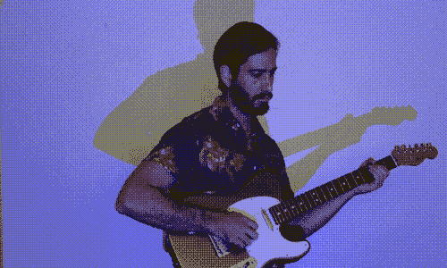
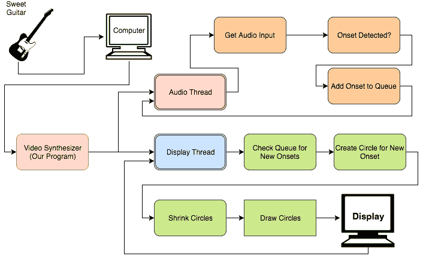

# 用 Python 构建视频合成器

> 原文：<https://dev.to/burningion/building-a-video-synthesizer-in-python-7g4>

[T2】](https://res.cloudinary.com/practicaldev/image/fetch/s--SssLl9ak--/c_limit%2Cf_auto%2Cfl_progressive%2Cq_66%2Cw_880/https://thepracticaldev.s3.amazonaws.com/i/osp4gfvj66vwt2psn8ad.gif)

视频合成器是从音频输入创建视觉信号的设备。他们有很长的历史，至少从 60 年代开始。

20 世纪 60 年代，李·哈里森开始制作一款名为 [Scanimate](https://www.youtube.com/watch?v=TS1WY4H4Dvk) 的视频合成器，它通过语音输入来制作人脸动画。

最近， [Critter 和 Guitari](https://www.critterandguitari.com) 制造了一堆疯狂的视频合成器，可以对现场音乐表演做出反应。它们是用来增强和自动伴随表演的。

这是他们的一个视频合成器，叫做[节奏示波器](https://www.amazon.com/Critter-Guitari-Rhythm-Scope/dp/B00OTC5L8G/ref=as_li_ss_tl?ie=UTF8&qid=1511471466&sr=8-1&keywords=critter+and+guitari+etc&linkCode=ll1&tag=travelingfore-20&linkId=0beb68887d6297198876b1f2ac433786)，正在运行:

今天，我们将使用 Python 编写一个基本的视频合成器，使用 aubio 进行发作检测，使用 Pygame 可视化显示我们的图形。我们最终会得到一个可以通过投影仪播放的节目。

由于我没有架子鼓(还没有！)，我会用我的吉他带动 onsets，在屏幕上画画。

## 我们开始之前

您需要有一种方法将音频输入到您的程序中。

对于我的视频，我使用了便宜的 Rocksmith USB 线。但是如果你的电脑有音频接口，你可以随意使用，连接到你选择的乐器上。

如果你没有吉他作为输入，你也可以只使用电脑的麦克风，或者制造巨大的噪音，或者打鼓，就像你在上面的动物和吉他视频中看到的那样。我们将使用发作检测来绘制我们的圆圈，所以声音来自哪里并不重要，只要声音足够大，可以触发发作。

(如果你没有吉他，为什么没有呢？！你可以得到这些中的[和](http://amzn.to/2BhYP6M)[中的](http://amzn.to/2zgfcPV)，过几天就可以玩了。)

## Python 中视频合成器的架构

<figure>

[T2】](https://res.cloudinary.com/practicaldev/image/fetch/s--4dznEcWk--/c_limit%2Cf_auto%2Cfl_progressive%2Cq_auto%2Cw_880/https://thepracticaldev.s3.amazonaws.com/i/y0lr86sgvnyc07dcd7mu.png)

<figcaption>It's not as complicated as it looks!</figcaption>

</figure>

随着视觉效果的出现，我们希望尽可能减少延迟。我们不希望在开始在屏幕上绘图之前等待每组音频帧的到来。

正因为如此，我们在这个程序中使用线程，一个接收我们的音频并检测我们的开始，另一个在屏幕上绘制我们的圆圈。

我们使用 PyAudio 和 aubio 库，首先从我们的计算机读入音频输入，然后分析一组帧来寻找发作。一旦我们检测到一个开始，我们就把一个新值推送到一个队列中，供另一个线程读取。

在我们的显示线程中，我们无限循环，首先检查队列中是否检测到新的开始，如果有，则创建一个新的循环。然后我们缩小并在屏幕上画出我们的圆圈。

有了这个基本流程，我们就有了一个视频合成器的开端，可以对来自计算机的音频做出实时反应。

## 编写代码

我们要做的第一件事是允许用户选择合适的输入设备来开始读取音频。在我的个人电脑上，我有 7 种不同的音频输入可供选择。

因此，在导入库之后，我们必须打开并描述可用的输入，然后再继续:

```
import pyaudio
import sys
import numpy as np
import aubio

import pygame
import random

from threading import Thread

import queue
import time

import argparse

parser = argparse.ArgumentParser()
parser.add_argument("-input", required=False, type=int, help="Audio Input Device")
parser.add_argument("-f", action="store_true", help="Run in Fullscreen Mode")
args = parser.parse_args()

if not args.input:
    print("No input device specified. Printing list of input devices now: ")
    p = pyaudio.PyAudio()
    for i in range(p.get_device_count()):
        print("Device number (%i): %s" % (i, p.get_device_info_by_index(i).get('name')))
    print("Run this program with -input 1, or the number of the input you'd like to use.")
    exit() 
```

Enter fullscreen mode Exit fullscreen mode

通过这个`argparse`设置，我们的用户可以获得一个音频输入列表，并可以选择从命令行指定一个。因此，您第一次运行它时，可能看起来像这样:

```
$ python3 video-synthesizer.py 
Device number (0): HDA Intel PCH: ALC1150 Analog (hw:0,0)
Device number (1): HDA Intel PCH: ALC1150 Digital (hw:0,1)
Device number (2): HDA Intel PCH: ALC1150 Alt Analog (hw:0,2)
Device number (3): HDA NVidia: HDMI 0 (hw:1,3)
Device number (4): HDA NVidia: HDMI 1 (hw:1,7)
Device number (5): HDA NVidia: HDMI 2 (hw:1,8)
Device number (6): HDA NVidia: HDMI 3 (hw:1,9)
Device number (7): HD Pro Webcam C920: USB Audio (hw:2,0)
Device number (8): Rocksmith USB 

Run this program with -input 1, or the number of the input you'd like to use.

$ python3 video-synthesizer.py -input 8 
```

Enter fullscreen mode Exit fullscreen mode

这样，我们就可以启动我们的程序，使用 Rocksmith USB 作为我们的输入。

接下来，我们可以初始化 Pygame。如果我们计划使用投影仪来实现实时性能，我们应该在全屏模式下运行 Pygame。否则，出于调试和开发目的，我们应该在窗口模式下运行。

你会看到我在上面的 argparse 解析器中添加了一个标志，如果我们从命令行传入`-f`,我们将全屏运行，否则窗口化。处理此标志的代码如下所示:

```
pygame.init()

if args.f:
    # run in fullscreen
    screenWidth, screenHeight = 1024, 768
    screen = pygame.display.set_mode((screenWidth, screenHeight), pygame.FULLSCREEN | pygame.HWSURFACE | pygame.DOUBLEBUF)

else:
    # run in window
    screenWidth, screenHeight = 800, 800
    screen = pygame.display.set_mode((screenWidth, screenHeight)) 
```

Enter fullscreen mode Exit fullscreen mode

接下来，我们定义我们的`Circle`对象，以及我们用来画圆的颜色集，还有一个用来存储所有`circles`的列表。

```
white = (255, 255, 255)
black = (0, 0, 0)

class Circle(object):
    def __init__(self, x, y, color, size):
        self.x = x
        self.y = y
        self.color = color
        self.size = size

    def shrink(self):
        self.size -= 3

colors = [(229, 244, 227), (93, 169, 233), (0, 63, 145), (255, 255, 255), (109, 50, 109)]
circleList = [] 
```

Enter fullscreen mode Exit fullscreen mode

您会注意到,`Circle`对象本身有一个方法，可以收缩。我们在每一次循环中将圆圈缩小 3 个像素。

稍后，如果他们在`size`中的排名低于 1，我们会将`circles`从我们的主列表中删除。

接下来，我们可以添加音频设置，初始化 PyAudio 和 aubio 开始检测器:

```
# initialise pyaudio p = pyaudio.PyAudio()

clock = pygame.time.Clock()

# open stream 
buffer_size = 4096 # needed to change this to get undistorted audio pyaudio_format = pyaudio.paFloat32
n_channels = 1
samplerate = 44100
stream = p.open(format=pyaudio_format,
                channels=n_channels,
                rate=samplerate,
                input=True,
                input_device_index=args.input,
                frames_per_buffer=buffer_size)

time.sleep(1)

# setup onset detector tolerance = 0.8
win_s = 4096 # fft size hop_s = buffer_size // 2 # hop size onset = aubio.onset("default", win_s, hop_s, samplerate)

q = queue.Queue() 
```

Enter fullscreen mode Exit fullscreen mode

这些值大多是猜测，我使用了 aubio 的默认开始检测器。您可能想要调整窗口、跳跃大小和容差，以便更好地适应您的数据和音频。

关于我们开放的 PyAudio 流，有一点需要注意。为了获得好的音频质量，我不得不在 Linux 中将我的缓冲区大小设置为一个相当大的 4096。如果是一个低于这个数的数字，我的输入会有一点静电干扰。

最后，我们创建我们的`queue`,我们将使用它将消息从音频线程传递回主要的 Pygame 线程。

## 拉开序幕

我们用一个非常基本的例子来开始我们的开端。我们创建一个主要的 Pygame 绘图循环来清空屏幕，然后遍历列表中剩余的每个圆圈。

我们收缩每个循环中的每个圆，并检查`queue`中是否有新的开始。如果有，我们把它添加到列表中。

```
def draw_pygame():
    running = True
    while running:
        key = pygame.key.get_pressed()

        if key[pygame.K_q]:
            running = False
        for event in pygame.event.get():
            if event.type == pygame.QUIT:
                running = False

        if not q.empty():
            b = q.get()
            newCircle = Circle(random.randint(0, screenWidth), random.randint(0, screenHeight),
                               random.choice(colors), 700)
            circleList.append(newCircle)

        screen.fill(black)
        for place, circle in enumerate(circleList):
            if circle.size < 1:
                circleList.pop(place)
            else:
                pygame.draw.circle(screen, circle.color, (circle.x, circle.y), circle.size)
            circle.shrink()

        pygame.display.flip()
        clock.tick(90) 
```

Enter fullscreen mode Exit fullscreen mode

## 创建我们的音频线程

一旦我们为我们的绘图建立了基础设施，我们的音频和开始检测线程就非常简单了。

我们只是循环读取音频缓冲区，并让它通过我们的开始检测器。如果在当前缓冲区中检测到一个新的开始，我们在`queue`中创建一个新的对象，并等待主绘图线程来获取它。

这可能发生在它自己的线程中，不管程序绘图部分的当前状态如何。

```
def get_onsets():
    while True:
        try:
            buffer_size = 2048 # needed to change this to get undistorted audio
            audiobuffer = stream.read(buffer_size, exception_on_overflow=False)
            signal = np.fromstring(audiobuffer, dtype=np.float32)

            if onset(signal):
                q.put(True)

        except KeyboardInterrupt:
            print("*** Ctrl+C pressed, exiting")
            break

t = Thread(target=get_onsets, args=())
t.daemon = True
t.start()

draw_pygame()
stream.stop_stream()
stream.close()
pygame.display.quit() 
```

Enter fullscreen mode Exit fullscreen mode

这样，我们的代码就准备好了，并创建了我们可以在 YouTube 视频中看到的效果。

## 下一步

aubio 具有音高检测功能，这是最明显的下一个编程功能。根据吉他上弹奏的音符做出一些视觉反馈。

但除此之外，我们还可以利用 FFT 分解我们从吉他本身获得的信号，以实现更具互动性的视觉效果。发病其实只是冰山一角。

生物和吉他我在这方面也做得很好，因为他们有了一个新产品，叫做 ETC，更好的是，可以用 Python 和 Pygame 编程！

从他们的演示视频来看，他们真的把视频合成器钉在了这个小盒子里。

你能做什么？我很想看看你建造了什么，你是怎么玩的！在 Twitter 或 Instagram 上联系我，分享你的任何创作。

和往常一样，这篇文章的代码可以在 Github 上找到。

如果你对更多类似的项目感兴趣，请注册我的时事通讯或在[用 Python 制作艺术](https://www.makeartwithpython.com/signup)上创建一个账户。当你这样做的时候，你会免费得到我新书的前三章，并且你会帮助我继续做这样的项目。