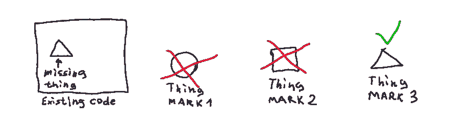

# 不要嘲笑你不拥有的东西

> 原文:[https://dev.to/satansdeer/dont-mock-what-you-dont-own-cd6](https://dev.to/satansdeer/dont-mock-what-you-dont-own-cd6)

*原贴于[maksimivanov.com](http://maksimivanov.com/posts/dont-mock-what-you-dont-own)T3】*

当我决定模仿 CarierWave 的`ImageUploader`类时，我正在重构一些 Rails 应用程序的规范。我希望能够检查特定的图像 url。但是这是个好主意吗？

## 不，不要这样做

我知道，模仿那些通过数据库或网络调用来使规范运行得更快的库可能很有诱惑力，但这不是测试双精度的目的。

Test doubles 旨在帮助您在应用程序的各个部分之间创建实用而方便的接口。

[T2】](https://res.cloudinary.com/practicaldev/image/fetch/s--cUZra8CB--/c_limit%2Cf_auto%2Cfl_progressive%2Cq_auto%2Cw_880/http://d33wubrfki0l68.cloudfront.net/ffdb5ecb003cb96dfe10eb900fe011835d06f89e/2c8d8/asseimg/dont_mock_1.png)

想象一下，你必须创建一些应该集成到现有代码中的东西。

使用 test double 你可以很容易地检查出*事物*(还没有实现)的接口是否清晰易用。如果没有，扔掉它重新开始是很便宜的。

现在从**这个角度**看，你应该明白嘲讽第三方*的事情*没有任何意义。

但这不仅毫无意义…

## 等等，什么视角？

我的意思是， **TDD 不仅仅是关于测试**，它也是关于设计的。嘲笑外部库不会帮助你创建好的设计，因为你对它没有任何控制。

这个想法是使用模拟作为快速和粗略的原型，看看你的*东西*将如何集成到现有的代码中。如果你发现这个接口不是很方便——你只需要用不同的方法或者不同的方法签名来编写模拟。

因此，您只需首先原型化您的接口，然后编写您的实现。

现在，如果你将这个逻辑应用于模仿外部库(你不能改变它的接口)，你会发现它毫无意义。

明白了吗？让我们继续…

## 也有害

最明显的危险是得到假阳性(或假阴性，取决于视角)。换句话说，你的测试会通过，而实际的测试不会成功。要么是因为你用错误的方式模仿了它，要么是因为你模仿的库在升级后发生了微小的变化。

此外，通过模仿外部库，你将自己绑定到一个特定的实现上，将来要修改这个库将会困难得多。

另一个不利之处是，你可能最终会得到大量没有任何价值的多余代码。这也使得理解代码中发生的事情变得更加困难。

## 但是 HTTP 和数据库调用使我的测试变慢了

如果这真的是个问题的话——**围绕第三方*的东西*创建包装器**。

不要忘记为包装器编写集成测试。

额外的好处是，你会弄清楚你真正使用的外部函数库的函数，并且以后替换这种依赖会容易得多。

## 总结

在我的例子中，我直接使用了`ImageUploader`，为它写一个包装器简直是疯了。

我希望这篇小文章能帮助你避免这种警告。

如果你对该主题的进一步阅读感兴趣，这里有更多的文章:

*   [http://Dave squared . net/2011/04/dont-mock-types-you-dont-own . html](http://davesquared.net/2011/04/dont-mock-types-you-dont-own.html)
*   [http://www . markhneedham . com/blog/2009/12/13/TDD-only-mock-types-you-own](http://www.markhneedham.com/blog/2009/12/13/tdd-only-mock-types-you-own)
*   [http://blog . 8 th light . com/Eric-Smith/2011/10/27/thas-not-yours . html](http://blog.8thlight.com/eric-smith/2011/10/27/thats-not-yours.html)
*   [http://stack overflow . com/questions/1906 344/should-you-only-mock-types-you-own](http://stackoverflow.com/questions/1906344/should-you-only-mock-types-you-own)