# 使用 TDD 模式#3 在 Laravel 5.5 上构建高级博客帖子有评论

> 原文:[https://dev . to/Kris/building-advance-blog-on-laravel-55-with-TDD-mode-3-post-has-comment-6an](https://dev.to/kris/building-advance-blog-on-laravel-55-with-tdd-mode-3-post-has-comment-6an)

[T2】](https://res.cloudinary.com/practicaldev/image/fetch/s--CKs_9dsJ--/c_limit%2Cf_auto%2Cfl_progressive%2Cq_auto%2Cw_880/https://cdn-images-1.medium.com/max/1024/1%2AYQn0GuR07X6rKPhjx8uYSg.png)

在上一集中，我们看到了如何设置 PHPUnit 并测试博客主页可以访问以及访客可以阅读的单个帖子

在这一集，我们需要显示一个帖子的评论

首先，我们牢记 BDD 用户故事，并遵循这个上下文

//给定一个帖子

//并且帖子有评论

//然后我访问单个帖子页面

//我已经看到评论了

### 创建测试

打开 PostTest 并创建新的测试名称**test _ guest _ can _ see _ comment _ when _ visit _ single _ post()**

然后抓取之前的用户故事并粘贴

```
public function test_guest_can_see_comment_when_visit_single_post(){
        // Given a Post
        // and Post have comments
        // then I visit single post page
        // I’ve see the comment
    } 
```

而我们填充的代码跟随着

```
public function test_guest_can_see_comment_when_visit_single_post(){
        // Given a Post
        $post = factory('App\Post')->create();
        // and Post have comments
        $comment = factory('App\Comment')
                    ->create(['post_id'=>$post->id]);
        // then I visit single post page
        $response = $this->get('blog/'.$post->id);
        // I’ve see the comment
        $response->assertSee($comment->body);
    } 
```

这应该会失败

[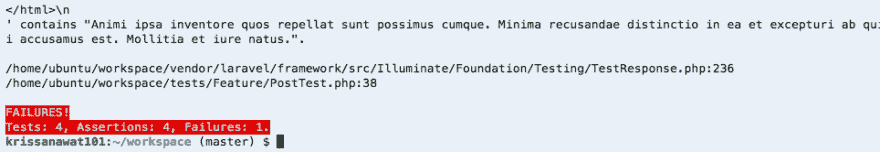T2】](https://res.cloudinary.com/practicaldev/image/fetch/s--WlQjcpyb--/c_limit%2Cf_auto%2Cfl_progressive%2Cq_auto%2Cw_880/https://cdn-images-1.medium.com/max/964/1%2Av95gjINlCd1m5S_90-XnZA.png)

好了，当我们完全创建了规格，然后让我们填写空白。

不要认为我们需要复杂

*   更新显示注释的视图
*   创建帖子和评论之间的关系

### 显示注释

转到 show.blade.php 抓取 HTML 代码显示职位，并粘贴在这下面

我们创建评论部分

```
<div class="row">
        <div class="col-md-8 col-md-offset-2">
           @foreach($post->comment as $comment)
            <div class="panel panel-default">
                <div class="panel-heading"></div>

<div class="panel-body">
                   <article>
                       <div class="body">{{ $comment->body }}</div>
                   </article>
                   </div>
            </div>˛
            @endforeach
        </div>
    </div> 
```

我们循环$post->comment 来获取注释对象并显示注释体

尝试测试

[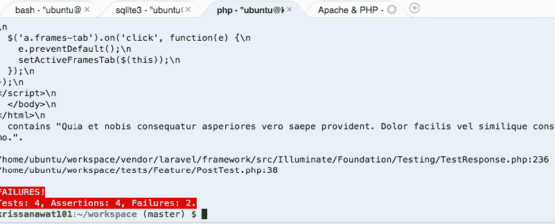T2】](https://res.cloudinary.com/practicaldev/image/fetch/s--YP57_zKQ--/c_limit%2Cf_auto%2Cfl_progressive%2Cq_auto%2Cw_880/https://cdn-images-1.medium.com/max/801/1%2ANbRVEApQnKo3SoF0SlVUPQ.png)

应该会再次失败，因为我们没有创建模型之间的关系

打开 **Post** 模型，为评论模型
的关系创建**评论**功能

```
class Post extends Model
{
    public function comment(){
        return $this->hasMany(Comment::class);
    }
} 
```

然后还是测试

[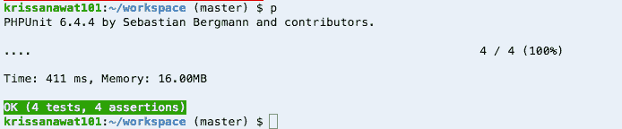T2】](https://res.cloudinary.com/practicaldev/image/fetch/s--RQgScP4A--/c_limit%2Cf_auto%2Cfl_progressive%2Cq_auto%2Cw_880/https://cdn-images-1.medium.com/max/694/1%2AXaAXe6OkvCbIpSjWk-Z8Dg.png)

是啊，绿色工作

并再次在浏览器中查看

[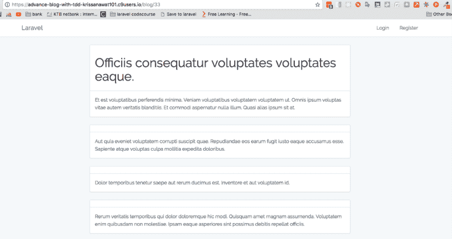T2】](https://res.cloudinary.com/practicaldev/image/fetch/s--YRdWxwkG--/c_limit%2Cf_auto%2Cfl_progressive%2Cq_auto%2Cw_880/https://cdn-images-1.medium.com/max/1024/1%2Aej2jmotHD3O8h8MuHAAlLg.png)

太好了，我们完成了目标

### 奖金部分

但是注释没有显示所有必要的数据，例如(所有者、创建日期)

#### 添加已创建 _at

接下来我们添加评论创建日期

```
<div class="panel-heading">{{ $comment->created_at }}</div> 
```

增加

[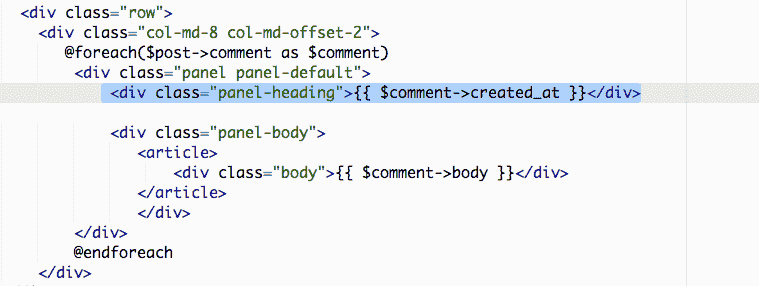T2】](https://res.cloudinary.com/practicaldev/image/fetch/s--SH9-akgQ--/c_limit%2Cf_auto%2Cfl_progressive%2Cq_auto%2Cw_880/https://cdn-images-1.medium.com/max/759/1%2A7xu86H7ekjyyVRaNYdZZMA.png)

保存并刷新浏览器

[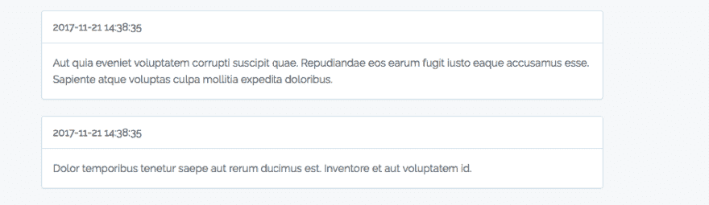T2】](https://res.cloudinary.com/practicaldev/image/fetch/s--X9-xT-Li--/c_limit%2Cf_auto%2Cfl_progressive%2Cq_auto%2Cw_880/https://cdn-images-1.medium.com/max/945/1%2AJchEaPuGI-SERgyMm3ejvQ.png)

我已经用 **diffForHumans()**
修改了日期格式

```
{{ $comment->created_at->diffForHumans() }} 
```

和刷新

[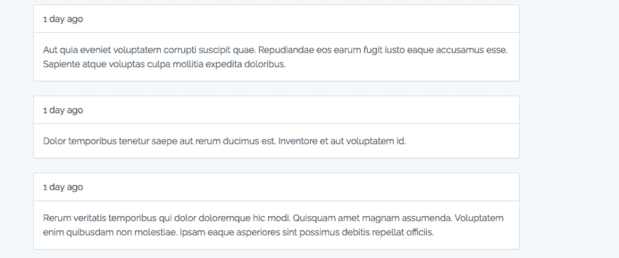T2】](https://res.cloudinary.com/practicaldev/image/fetch/s--LkDyAvzg--/c_limit%2Cf_auto%2Cfl_progressive%2Cq_auto%2Cw_880/https://cdn-images-1.medium.com/max/954/1%2ADSbM28Mx_zjH8Y35GudziA.png)

看起来好多了

#### 显示评论创建者

现在我们需要显示注释创建者，我们将使用 test 来确保注释创建者使用 PHP artisan make:test comment test-unit

使用单位，因为这个小规模的测试不使用其他类

[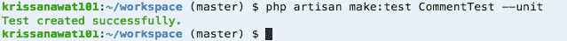T2】](https://res.cloudinary.com/practicaldev/image/fetch/s--M3zRPJrm--/c_limit%2Cf_auto%2Cfl_progressive%2Cq_auto%2Cw_880/https://cdn-images-1.medium.com/max/639/1%2ACUgnQNTm5J2tldwaRhXI-A.png)

文件应出现在测试/单元中

[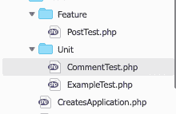T2】](https://res.cloudinary.com/practicaldev/image/fetch/s--3J1uwWJI--/c_limit%2Cf_auto%2Cfl_progressive%2Cq_auto%2Cw_880/https://cdn-images-1.medium.com/max/220/1%2AmN4uK4xMXvO8v3jO1MVq3g.png)

打开这个填充测试功能，记住用户故事

```
public function test_comment_should_has_creator()
 {
 // Giving comment object
 // should include User object 
 } 
```

然后填写空白

```
public function test_comment_should_has_creator()
 {
 // Giving comment object
 $comment = factory(‘App\Comment’)->create();
 // should include User object 
 $this->assertInstanceOf(‘App\User’,$comment->creator); // I expect creator function has User instance
 } 
```

开始测试

[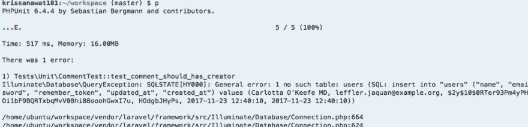T2】](https://res.cloudinary.com/practicaldev/image/fetch/s--PIFundvX--/c_limit%2Cf_auto%2Cfl_progressive%2Cq_auto%2Cw_880/https://cdn-images-1.medium.com/max/1024/1%2A2NczBp7rpnpYS0suz9j-8A.png)

嗯，不是用户表，但我们已经有了

这个错误来自于我们没有使用 **RefreshDatabase** 特征

[https://medium . com/media/12 da 67 cf 2 fc 20 cef 27527 fbbe 25 e 9 BCB/href](https://medium.com/media/12da67cf2fc20cef27527fbbe25e9bcb/href)

再次尝试测试

[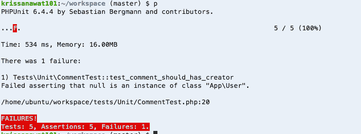T2】](https://res.cloudinary.com/practicaldev/image/fetch/s--gELmRs65--/c_limit%2Cf_auto%2Cfl_progressive%2Cq_auto%2Cw_880/https://cdn-images-1.medium.com/max/704/1%2Av7VV_WvhfVqT1mYon_sJpw.png)

好吧，错误这说得通。我们和用户模型没有关系

goto app/comment.php 填充此函数

```
public function creator(){
        return $this->BelongsTo(User::class,'user_id');
    } 
```

那样地

[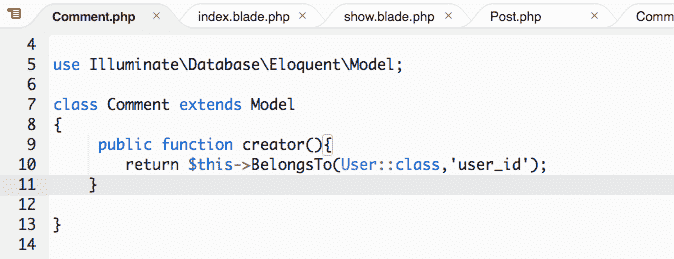T2】](https://res.cloudinary.com/practicaldev/image/fetch/s--uQcNKxvp--/c_limit%2Cf_auto%2Cfl_progressive%2Cq_auto%2Cw_880/https://cdn-images-1.medium.com/max/674/1%2AaVBpPM_mqJmU48MNegoW3A.png)

保存并测试

[T2】](https://res.cloudinary.com/practicaldev/image/fetch/s--IAWJMhWE--/c_limit%2Cf_auto%2Cfl_progressive%2Cq_auto%2Cw_880/https://cdn-images-1.medium.com/max/643/1%2A7FIVF70Tq-i0uEn9jEURmQ.png)

好的，绿色通过。

现在我们可以在一篇文章中显示评论创建者

我要填

```
{{ $comment->creator->name }} comment since 
```

并尝试测试第一次这应该会失败

[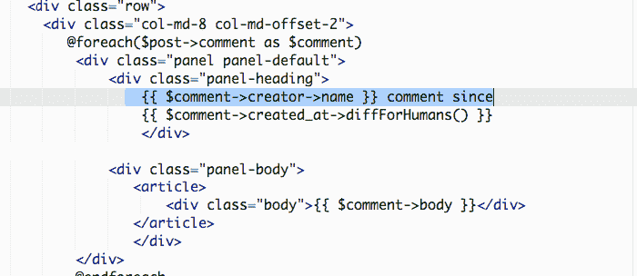T2】](https://res.cloudinary.com/practicaldev/image/fetch/s--2Yez5b4y--/c_limit%2Cf_auto%2Cfl_progressive%2Cq_auto%2Cw_880/https://cdn-images-1.medium.com/max/700/1%2Ap3rBvg0-SrjJ5VIMd7cRRg.png)

保存并转到浏览器

[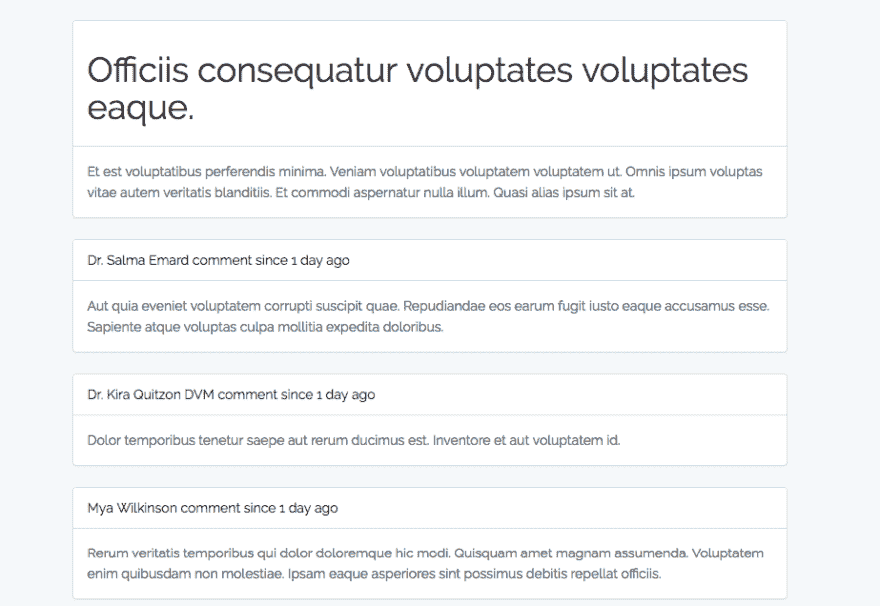T2】](https://res.cloudinary.com/practicaldev/image/fetch/s--GKGsYCtD--/c_limit%2Cf_auto%2Cfl_progressive%2Cq_auto%2Cw_880/https://cdn-images-1.medium.com/max/923/1%2ANbcRPxUc77DC49tctC6E4A.png)

这是工作

### 重述

在这篇文章中，我们看到了如何用 TDD 的方式给文章添加评论，并添加了一些使评论看起来更好的功能

**如果你喜欢这个，请给我 50 个掌声，并点击跟随鼓励前进**

**这个** [**项目 Github 提交**](https://github.com/krissnawat/advance-blog-in-laravel-5.5-in-tdd/commit/8672c1908d5ff96d7038dc4ceb9d22f10350df5b) **就可以启动了**

* * *