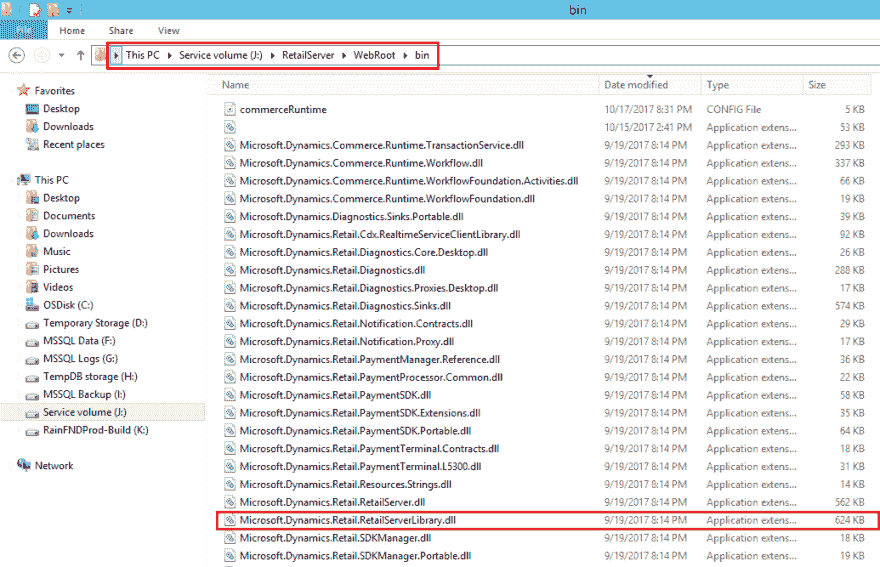
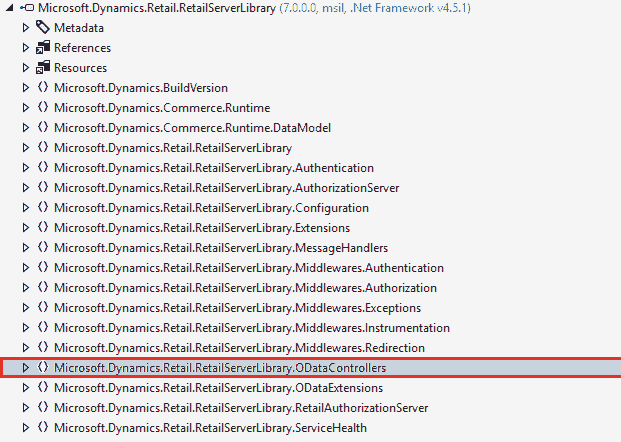
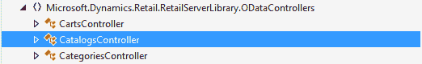
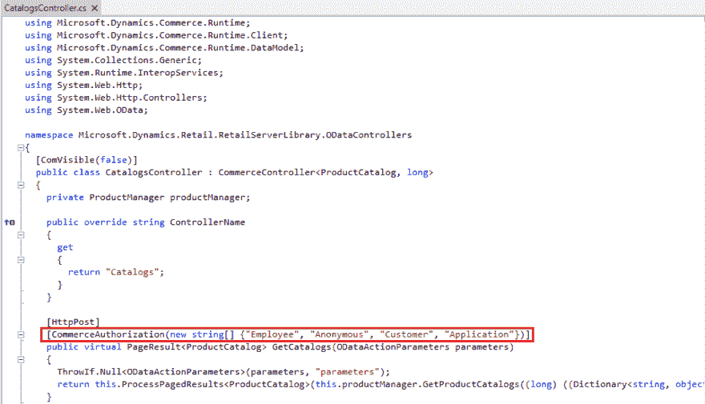

# 零售服务器 OData 控制器允许的角色

> 原文:[https://dev . to/shanalikhan/allowed-roles-for-retail-server-odata-controllers-3n M4](https://dev.to/shanalikhan/allowed-roles-for-retail-server-odata-controllers-3nm4)

零售服务器是商业运行时的包装器。Retail Server 使用 web API 和 OData 来支持商店中的瘦客户机以及平板电脑和手机上的瘦客户机。商务运行时通过商务数据交换服务与零售总部通信。

零售服务器支持服务到服务认证，这使得服务能够与零售服务器通信，而不需要用户在屏幕前在某个时间点提供凭证。这使得当您需要创建流程来定期联系零售服务器以执行不同类型的任务时，例如，同步客户、订单、发布电子商务功能产品等。

要使用零售服务器 OData 控制器，您必须获得某些角色的授权。如果您没有获得所需角色的授权，零售服务器将抛出异常，如下所示:

> 零售代理异常:用户未获授权。

但是您可以通过以下方式检查每个零售服务器控制器操作需要什么类型的角色。

**从机器上打开零售服务器 SDK。**

导航到 Azure Machine 中的零售服务器。控制器存在于零售服务器库中，您需要反编译该程序集。我个人更喜欢 [JetBrains dotPeek](https://www.jetbrains.com/decompiler/)

[T2】](https://res.cloudinary.com/practicaldev/image/fetch/s--lnGZw11e--/c_limit%2Cf_auto%2Cfl_progressive%2Cq_auto%2Cw_880/http://shanalikhan.github.io/img/rs-odata-role1.PNG)

**在反编译器中打开程序集**

控制器存在于“ODataControllers”命名空间中。

[T2】](https://res.cloudinary.com/practicaldev/image/fetch/s--WZk6PtGA--/c_limit%2Cf_auto%2Cfl_progressive%2Cq_auto%2Cw_880/http://shanalikhan.github.io/img/rs-odata-role2.PNG)

**打开控制器，查看授权角色**

 

如果您通过任何应用程序自定义应用程序连接，您必须启用应用程序模式，正如我在之前的[帖子](http://shanalikhan.github.io/2017/08/31/enable-application-mode-dynamics-retail-server.html)中所讨论的，您将能够调用允许应用程序角色的操作。

欢迎提问！