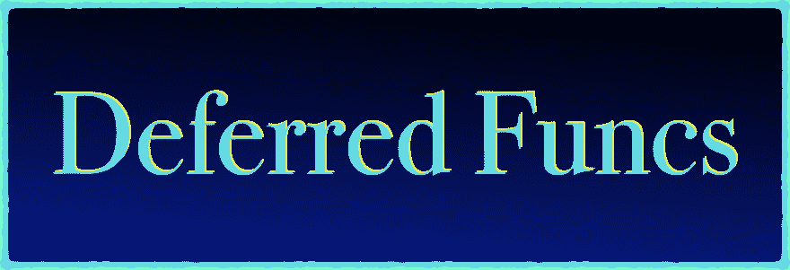

# 去推迟简化与实用的视觉效果

> 原文:[https://dev . to/financx/go-defer-simplified-with-practical-visual-25o](https://dev.to/inancx/go-defer-simplified-with-practical-visuals-25o)

[T2】](https://blog.learngoprogramming.com/golang-defer-simplified-77d3b2b817ff)

## 里面是什么？

*   什么是延迟？
*   释放获得的资源
*   拯救我们脱离恐慌
*   延期关闭
*   参数评估
*   多次延期
*   延期方法

**[点击这里阅读教程](https://blog.learngoprogramming.com/golang-defer-simplified-77d3b2b817ff)** 。

两周后见！请将本教程分享给你的朋友。

* * *

我在推特上分享围棋技巧和窍门。
📚[学习围棋编程](https://blog.learngoprogramming.com)