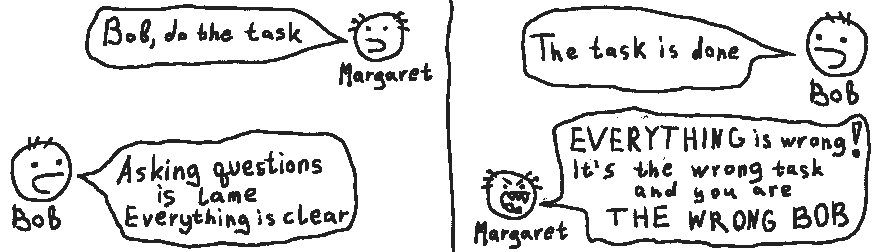
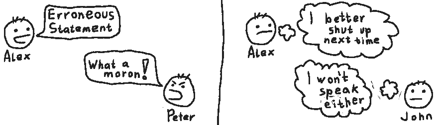
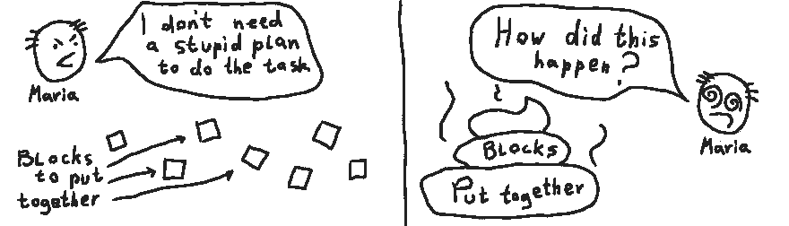

# 高效开发人员的 7 项技能

> 原文:[https://dev . to/satans deer/7-skills-of-a-a-effective-developer-560](https://dev.to/satansdeer/7-skills-of-an-effective-developer-560)

*原贴于[maksimivanov.com](http://maksimivanov.com/posts/7-skills-of-an-effective-developer)T3】*

当你看到术语**高效开发者**时，你可能会想象一个做很多事情的人。如果是，那么你错了。

有效并不意味着做更多的事情，它意味着做正确的事情(T2)。

在今天的世界里，大多数优秀的软件都是由团队创造的，而不是个人。要成为一名有效的开发人员，你需要掌握技能，这将使你成为一名优秀的团队成员。

先说最明显的一个。

本文中描述的所有故事、名字、人物和事件都是虚构的。任何与真人、活人或死人、或真实事件的相似之处都是巧合。

## 沟通

[T2】](https://res.cloudinary.com/practicaldev/image/fetch/s--HnYTdP83--/c_limit%2Cf_auto%2Cfl_progressive%2Cq_auto%2Cw_880/http://d33wubrfki0l68.cloudfront.net/aa06cf2d2eb7fad197b9a14a9c1035088743adad/aaedd/asseimg/communication_1.png)

这个绝对是金块。你无法想象，如果你是一个好的沟通者，你会避免多少问题。而且不仅仅意味着你要知道如何清晰地表达自己的想法，或者如何做一个好的倾听者。

沟通最重要的目标是确保每个人都在同一页上，并对给定的问题有尽可能完整的看法。

**例#1:**

见见鲍勃和玛格丽特。Bob 是开发人员，Margaret 是项目经理。他们开发了一个待办事项工具 *Taskey Doey 3000*

Margaret 创建了一个任务“向**添加功能，将**待办事项复制到不同的列表”。她希望这个新功能可以让 T2 在列表间共享条目。因此，如果您更新一个列表中的共享任务，它将在它共享到的所有列表中更新。

鲍勃开始着手这项任务。对他来说，很明显玛格丽特想在清单之间复制任务。所以他添加了创建新的任务实例的功能，这些任务彼此之间没有联系。因此，如果你更新一个，它的副本保持不变。

经过几天的专注工作，Bob 展示了新的功能。玛格丽特发现这不是她所期望的，并告诉了鲍勃。玛格特认为鲍勃是个白痴。鲍勃也质疑玛格丽特的认知能力。后来 Bob 解决了问题，但是最后期限被打破了，每个人都不高兴。

如果 Bob 和 Margaret 在 Bob 开始工作之前讨论任务，这是可以避免的。

**例 2:**

认识一下设计师 Paul 和开发商 Marco。他们在 CheapBargainMart.com 网上商店的网站上工作。

Paul 设计了一个退出意图弹出窗口。它会吸引那些没有在商店买东西的游客。他不知道他们之前已经实现了一个非常相似的弹出窗口，他可以重用其中的一部分。

马可知道另一个弹出窗口，但**认为**保罗从头开始创建新设计是有原因的。

结果，两个人都在他们的任务上花了更多的时间，而不是无缘无故地拥有一套几乎相同的元素。

**例#3:**

这是两位开发人员，凯西和珍。他们在一个约会应用程序上工作。它用人们的名字和星座来匹配他们。

凯西对这个项目不熟悉，但她真的很投入。她的任务是实现一种替代的匹配算法。她不知道的是，他们已经有了一个特殊的 DSL 来匹配算法。

Jen 知道 DSL，实际上是她写的。但是珍正忙于另一项任务。

经过几天的专注工作，Kathy 展示了该功能。一切都正常运行，但是凯西在这项任务上花了更多的时间。此外，他们现在有一部分代码与其他代码不完整。

现在他们不得不花额外的时间来重写它，并使之统一。

**结论:**

如果任何一方开始讨论并事先澄清一切，所有这些例子的结局都会好得多。

**可操作项目:**

*   在开始处理任务之前，请联系创建它的人。确保你们两人对它的理解一致。不要做假设。花几分钟时间进行讨论比花几个小时去修改一个实现要好。

*   尽可能多地收集有关任务的信息。如果你和设计师一起工作，确保你理解每个元素背后的动机。不要盲目地工作。

*   不要犹豫，问问你的同事是否做过类似的工作。一个简单的问题可以帮你节省几个小时不必要的工作。

## 感同身受

**先说个例子:**

[T2】](https://res.cloudinary.com/practicaldev/image/fetch/s--GOoe9EDR--/c_limit%2Cf_auto%2Cfl_progressive%2Cq_auto%2Cw_880/http://d33wubrfki0l68.cloudfront.net/86b9b7d4834a81bf502cd35a0fbb2c93a5454cf9/958d7/asseimg/empathy_1.png)

见见亚历克斯。他是一家名为“CranberryPi”的公司的新开发人员。在他的第一次周会上，他就如何改进代码库提出了一些建议。但是这些提议中有错误，另一个开发者 Peter 纠正了他。通常这是正确的做法，但彼得却用了不必要的斥责方式。

现在亚历克斯自我感觉很差，开始犹豫是否要提出自己的意见。即使是约翰，他只是在听，现在也不太可能说出他的意见。

几周后，Alex 正在设计公司网站的登录表单。他犯了一些错误，给系统增加了安全漏洞。但是，由于他现在感到不安全，他避免与队友讨论，这些错误仍然没有被注意到。

几天后，生产中出现了安全漏洞。很快所有的用户账户都被盗了，客户现在对公司不再信任了。" CranberryPi "倒闭了。

**结论:**

不要像彼得一样。在给定的故事中，很明显他没有足够的同情心去考虑亚历克斯会因为他而有什么感受。

亚历克斯的所作所为也是不可接受的，但团队中有像彼得这样的人实际上增加了团队成员像亚历克斯一样行事的机会。

对于一个高效的团队来说，所有的队友都相互信任并有心理安全感是至关重要的。

为什么？因为否则，人们会开始犹豫问问题，或给出他们的意见。而这反过来又会带来各种**沟通**问题。

事实上，情况可能会变得更糟。当没有心理安全感时，人们可能会开始隐藏自己的错误。这可能会带来很多麻烦。

而即使有一个人有这种毒害行为，也足以让一个团队失去心理安全感。

**可操作项目:**

*   纠正任何人都是好的，只要是以友好的方式。在对某人的话进行恶意评论之前，给自己一些时间冷静下来。

*   设身处地为你的对手着想。你处在他的位置会有什么感觉？想想你将要说的话的后果。

*   如果你的团队中有像 Peter 这样的人，让他们明白这种行为是不可接受的。即使 Peter 是一个好的开发人员，他破坏了团队的氛围，可能弊大于利。

## 规划

[T2】](https://res.cloudinary.com/practicaldev/image/fetch/s--L4ias_31--/c_limit%2Cf_auto%2Cfl_progressive%2Cq_auto%2Cw_880/http://d33wubrfki0l68.cloudfront.net/89a41b314b65f22089195b9920c4067b02c3a880/91f9a/asseimg/planning_1.png)

这是编写高质量代码的关键技能。如果你认为在一项任务中抢先一步可以节省时间，那你就错了。

**举例:**

Maria 是一名自由开发人员。她刚刚得到了她的第一个项目。

她与客户通了电话，他们讨论了项目的每个细节。任务似乎很明确。Maria 给了一个客户一些估计，然后开始编码。

哦，不，玛丽亚，你忘记计划你的工作了！

起初一切似乎都很好。Maria 逐个特性地实现规范。看起来她会在截止日期前完成。

但是等一下，几天后一些不对的事情开始发生。Maria 记得她忘记在第一个模块中添加一些功能。她回到那个模块并添加函数。但是现在她认为最好重写这个模块。没事，时间还很充裕。

然后类似的事情发生在另一个地方。玛丽亚开始失去注意力。她现在在模块之间来回跳跃。她更新了一些代码，然后她必须更新规格。它们涵盖了所有需要的东西吗？哦，那已经有太多的事情要把握了。

同时，她手动测试应用程序。一些功能被破坏了，但是等等，所有的规格都是绿色的。好了，是时候回去写代码并解决问题了。但是这个错误太神秘了。如何找到它发生在哪里？

Maria 想使用`git bisect`找到引入错误的确切提交。但是她是随机提交的，几乎所有提交的应用程序都处于崩溃状态。

截止日期是明天，所以玛丽亚决定通宵工作。

最后她设法完成了任务。所有的功能都正常工作，规范都通过了，客户也很满意。但是真的有必要这么紧张吗？

**结论:**

这是一个人在没有计划的情况下工作，想象一下团队会发生什么。

如果你开始着手一项任务，而没有先制定一个计划，你将更有可能错过需求，引入错误，并且更容易失去注意力。

**可操作项目:**

*   计划你的工作。如果你有一个正在进行的任务，却没有一个计划——停下来，现在就制定它。是的，这很重要。

*   也要计划你的提交。如果你没有使用任何 VCS 或者甚至不知道提交是什么——那么这是首先要解决的问题。

## 演示

如果你缺乏表达技巧(即使你是一个优秀的程序员)，你可能会浪费你和你同事的时间。浪费时间没有效果。

**举例:**

迈克尔是一个超级聪明的家伙。他在理解事物如何运作方面有着近乎超人的能力。他也能创造非常复杂的东西。

一天，他创建了一个高效但非常复杂的脚本，为他的团队正在开发的应用程序捆绑资产。

现在是时候展示这个东西如何工作以及如何使用它了。

每个人都在尽最大努力保持专注，但是伙计，迈克尔的声音没有帮助。他单调地咕哝着一切。演示没有清晰的结构，大部分观众开始失去上下文。另一部分是怎么回事？他们已经睡着了。

演示很快就完成了，但是团队中没有人理解这个脚本是如何工作的。

现在时间浪费了，每个人都累了，没有人得到任何有用的东西。

人们现在必须自己弄清楚这个脚本是如何工作的，或者向迈克尔寻求帮助。

**结论:**

在团队中工作时，你不仅要编写代码和开发功能。你也必须分享知识。确保拥有良好的**演示**技能，以便有效地完成。

**可操作点:**

*   一开始就宣布演讲的结构。这将为你的听众更容易理解这个主题提供一些心理框架。
*   有良好的结构。这会让你更容易理解你的陈述。
*   学会如何使用你的声音。如何利用节奏和音调的变化来吸引观众。

## 文档

典型的项目结构通常会很快变得复杂。随着时间的推移，不仅是代码本身，围绕项目的基础设施也会变得更加复杂。

没有适当的文件，你肯定会迷失在数字丛林中。

**利奥入职的故事:**

CoderSoft 是人工智能和文本编辑器开发领域的市场领导者。他们创造了一个非常智能的 IDE，只需要程序员输入设置，然后它就开始自己工作了。

对于 CoderSoft 来说，这是非常成功的一年，他们雇佣了一批新的开发人员。

利奥是一名人工智能专家。他非常自豪能够加入微软，他渴望开始工作，为公司创造价值。

第一天，他打开文档，开始四处游荡，试图了解如何在本地构建项目。

文档非常混乱，大部分描述了项目结构。某些部分包含项目崩溃时的故障排除说明。也没有任何关于如何构建项目的描述。

利奥开始调查。好了，好像有一些依赖项，先安装吧。哦，那些原来是用 *CoderSoft* 写的。让我们问一些其他开发人员如何安装它们。

Leo 试图找到一个能告诉他从哪里获得这些依赖项的人，但是每个人要么太忙，要么对这些库一无所知。

第二天情况重复。第二天一切都没有改变。

直到今天，Leo 仍然在寻找缺失依赖项的链接，没有为公司写一行代码。

**结论:**

写文档。请记住，你是为一个对项目一无所知的人写的。确保它结构良好，易于浏览。

**可操作项目:**

*   你应该有一个好的入职指南。这样可以为你和新人节省很多时间。
*   有一个集中的项目信息来源，应该很容易导航。考虑一下维基结构作为参考。
*   保持文档的相关性。没有什么比过时和误导的文档更糟糕的了。

## 测试

如果没有良好的测试覆盖率，你就不能指望有一个可持续的代码库。这是不可能的。

**举例:**

MindBallet 是一家专注于教育软件的公司。他们正在开发一个互动课程平台。
最终这个平台变得非常复杂。现在很难增加新的功能。每次你在一个地方做了改变，你就会在另一个地方发现错误。

所以首席开发人员 Milton 决定重构代码库。

团队开始工作，但是他们重构得越多——他们引入的新错误就越多。

经过几个月令人疲惫的“重构”，人们最终得到了完全重写的平台。同样的复杂程度，同样多的错误。尽管代码是新的，但感觉已经像是遗留的了。

**结论:**

团队忘记了测试。没有它们，重构从定义上来说是不可能的。当你重构时，你只是改变了代码的组织，而不是功能。所以实际上这根本不是重构，团队只是重写了整个东西。

**可操作项目:**

*   开始写测试。当您开发新功能时，这是一个需求。在功能之前编写测试甚至是一个更好的主意。
*   在重构模块之前，用测试覆盖它。这是保证不会改变功能的唯一方法。
*   红色，绿色，重构。确保你已经看到测试失败。一个从来没有显示为红色的测试很可能什么也没有测试到。

## 去吧

[T2】](https://res.cloudinary.com/practicaldev/image/fetch/s--GcZe4tin--/c_limit%2Cf_auto%2Cfl_progressive%2Cq_auto%2Cw_880/http://d33wubrfki0l68.cloudfront.net/c21998474b7a39479f705de2bc9b1a8a80938f8a/45eaa/asseimg/github_fkc.png)

它是现代 web 开发社区中最受欢迎的 VCS。不仅仅是保存你开发进度的工具。这是团队合作的象征。一定要掌握。

有些软件或编程语言会让你搬起石头砸自己的脚。嗯，git 让你炸掉整个团队的腿。这将允许收回所有的腿，但你最好知道你在做什么。

**举例:**

吉姆和迈克一起在同一个网页上工作。一切都很好，直到有一天，Jim 决定在 Mike 还在添加新功能的时候，用`master`改变他们分支的基础。

Jim 成功地解决了与基础分支的冲突，并在 Mike 推送了他今天完成的所有提交后完成了`git push -f`。

Mike 通知团队，他已经完成了新功能的添加。吉姆看到了他的消息，将他们的分支合并到`master`并删除了它。

Mike 做了`git pull --prune`，现在他的更改也在本地丢失了。

很快，迈克意识到他一整天的工作都没了，现在他恨吉姆。

**结论:**

你必须遵循一些策略来成功地在团队中使用 git。

**可操作项目:**

*   用`git push --force-with-lease`代替`--force`。这将使你免于覆盖其他人的工作。
*   使用“拉”请求，并在将它合并到 master 之前检查整个事情。如果有多个团队成员来审查拉取请求，效果会更好。

## 总结

与你的队友交流，不要伤害其他人的感情，计划好你的工作，适当地记录你的代码和基础设施。

学习如何编写自动化测试，并确保掌握 git。

这些技能对于有效协作至关重要。人们经常忽略他们专注于编程本身。