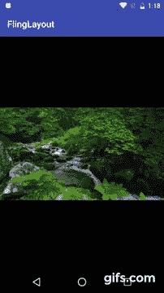

# 制作了一个点击 Twitter 这样的图像就可以关闭画面的库- FlingLayout

> 原文:[https://dev.to/chuross/twitter-弗林格拉尤-d4g](https://dev.to/chuross/twitter---flinglayout-d4g)

## 这次的成果

### FlingLayout

[https://github.com/chuross/flinglayout](https://github.com/chuross/flinglayout)

[T2】](https://res.cloudinary.com/practicaldev/image/fetch/s--U4lmbJUa--/c_limit%2Cf_auto%2Cfl_progressive%2Cq_66%2Cw_880/https://qiita-image-store.s3.amazonaws.com/0/20629/0e7cdaa6-6f9e-2bf6-bfb2-24a906c29bbb.gif)

## Special

就像在 Twitter 的图像和这里使用的那样，只要在布局中包含上下轻拂操作时关闭画面的行为就可以实现。

## import

1.  将 jitpack 添加到存储库

```
repositories {
    maven { url "https://jitpack.io" }
} 
```

1.  在 dependencies 中添加库的[](https://jitpack.io/#chuross/flinglayout)

```
dependencies {
    compile 'com.github.chuross:flinglayout:x.x.x'
} 
```

## 使用方法

在样例项目中使用[PhotoView](https://github.com/chrisbanes/PhotoView) 来实现。

具体怎么用才能像 Twitter 一样呢，想知道的话请看这里哦

[https://github.com/chuross/flinglayout/tree/master/app](https://github.com/chuross/flinglayout/tree/master/app)

### 在 XML 中记述布局

仅此一点，行动本身就完成了
，因为可以包含的 View 只有一个，所以要注意

```
<com.github.chuross.flinglayout.FlingLayout
    android:layout_width="match_parent"
    android:layout_height="wrap_content">

    <!-- something view parent -->

</com.github.chuross.flinglayout.FlingLayout> 
```

### 控制拖动操作

因为在 FlingLatout 中准备了使拖动无效的标志，所以适当设置

```
val flingLayout = findViewById<FlingLayout>(R.id.flinglayout)
flingLayout.isDragEnabled = false 
```

在示例项目中，我们看到了 PhotoView 的标尺，根据需要设置了标志。 (放大时 FlingLayout 不接受拖动操作)

### 捡起 Dismiss 的监听器关闭画面

因为可以设置平时的 Dismiss 用的监听器，所以用那个就可以了

```
val flingLayout = findViewById<FlingLayout>(R.id.flinglayout)
flingLayout.dismissListener = { /** something your code **/ } 
```

## XML attribute 1

| 键 | 类型 | 描述 | 等等 |
| --- | --- | --- | --- |
| fl_isDragEnabled | 布尔型 | 启用/禁用拖动 |  |
| fl_isDismissEnabled | 布尔型 | dismiss 的有无/无效 | 禁用时，即使滑动也会返回原来的位置 |

## 许可证

```
Copyright 2017 chuross

Licensed under the Apache License, Version 2.0 (the "License");
you may not use this file except in compliance with the License.
You may obtain a copy of the License at

   http://www.apache.org/licenses/LICENSE-2.0

Unless required by applicable law or agreed to in writing, software
distributed under the License is distributed on an "AS IS" BASIS,
WITHOUT WARRANTIES OR CONDITIONS OF ANY KIND, either express or implied.
See the License for the specific language governing permissions and
limitations under the License. 
```

## 后记

因为内部使用了 ViewDragHelper，所以安装非常简单。

虽然感觉好像有需求，但是因为粗略搜索的感觉没有被卡住，或者因为没有得到维护而无法建立，所以自己做了。