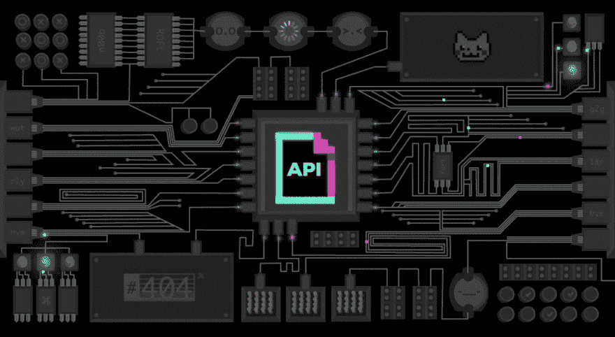

# API 到底是什么？

> 原文:[https://dev.to/devamaz/what-the-heck-is-api-31](https://dev.to/devamaz/what-the-heck-is-api-31)

 
您是否遇到过或听说过这个缩写词 API，但却不知道它是什么和/或它有什么用途？我记得第一次听说的时候。那是在一个新兵训练营，当我被告知要开发一个可以使用 API 的 web 应用程序时，我想，API 到底是什么？
在本文中，我们将解决以下问题

1.  什么是 API
2.  为什么选择 API

都准备好了吗？准备好了吗？走吧。

什么是 API？
API(应用编程接口)是一组用于构建应用软件的子程序定义、协议和工具。[-维基百科](https://en.wikipedia.org/wiki/Application_programming_interface)

这听起来是不是更令人困惑，好吧，让我们抛开花哨的开发术语——我指的是“维基百科标准”,想象一个 API 是一个接受请求和传递消息的信使。你在跟踪还是我们应该让它更有趣？

把 API 想象成必胜客(一家销售披萨并送货上门的公司)每个人都喜欢披萨🍕对吗？我们拿起手机，打电话给必胜客，按照我们想要的比萨饼类型、数量和地址下订单(即发送请求)。必胜客接受我们的订单，并把披萨送到那个地址。

你有没有想过必胜客是如何准备披萨并准时送达的？他们怎么做其实不关我们的事)。这就是 API 的基本工作方式。

API 允许软件(应用程序)在没有用户干预的情况下相互对话。当我们向必胜客下订单时，我们给了他们我们的地址，必胜客的送货员是如何找到地址的，这不是我们必须知道或担心的事情，我相信没有人想对这些细节感到厌烦。

为什么 API
让我们想象每个人都必须去必胜客(比萨饼店)买比萨饼，没有送货员，没有服务员，没有订单安排。你能想象那将是多么费时和不方便；排着长队，释放压力。

当我们想吃比萨时，我们可以让必胜客来找我们，而不是自己去必胜客。必胜客把我们想要的东西送到我们方便的地址，让我们更方便。这就是 API 如何使我们的工作在开发中变得更容易。

现在，假设我们想建立一个应用程序，显示天气报告，地区，湿度，温度，时间和日期。我们可以只分配一个静态数据，它永远不会改变，但我们都知道天气每次都在变化。所以问题是我们如何让数据改变？幸运的是，我们有很多网络服务(天气预报的提供商)，我们可以从这些服务中获取数据，而不必为了获取我们简单的应用程序的数据而在世界各地安装传感器。我们将通过 API 端点向他们的服务器发送 GET 请求，就像我们从必胜客订购比萨饼一样。服务器以“JSON”格式响应我们的请求。就像送披萨的给我们送披萨一样。我们可以用这个 API 做更多的事情，但是为了简单起见，这就是我们在本文中要讨论的全部内容。感谢阅读。

更多关于 API 的信息，请访问[材料如何工作](https://money.howstuffworks.com/business-communications/how-to-leverage-an-api-for-conferencing1.htm)或[Biodun Chris 的 API 简介](https://auth0.com/blog/api-less-scary-approach)。