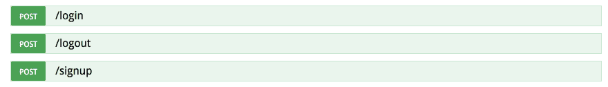

# 新的圣杯？第二部分

> 原文:[https://dev.to/solisoft/arangodb-新-graal - part-2-6mc](https://dev.to/solisoft/arangodb--the-new-graal--part-2-6mc)

在第一部分，我只是向你展示了一个非常基本的 foxx 服务。在第 2 部分中，我将展示如何使用 [JWT](https://jwt.io/) 创建一个管理认证的服务。

让我们开始创建一个新服务。首先，我们需要定义这项服务需要什么。

```
'use strict';
const db = require('@arangodb').db;
const joi = require('joi');
const createRouter = require('@arangodb/foxx/router');
const sessionsMiddleware = require('@arangodb/foxx/sessions');
const jwtStorage = require('@arangodb/foxx/sessions/storages/jwt');
const createAuth = require('@arangodb/foxx/auth');
const auth = createAuth();
const router = createRouter(); 
```

<svg width="20px" height="20px" viewBox="0 0 24 24" class="highlight-action crayons-icon highlight-action--fullscreen-on"><title>Enter fullscreen mode</title></svg> <svg width="20px" height="20px" viewBox="0 0 24 24" class="highlight-action crayons-icon highlight-action--fullscreen-off"><title>Exit fullscreen mode</title></svg>

好的，我们需要:

*   `db`用于访问数据库的对象
*   所有验证材料
*   `sessionsMiddleware`管理会话(见下文)
*   `jwtStorage`能够使用 JWT
*   哪个是路由器
*   `auth`验证工具(创建&验证方法)

现在是时候创建会话了

```
const sessions = sessionsMiddleware({
  storage: jwtStorage({ secret: "Secret", ttl: 60 * 60 * 24 * 7 }),
  ttl: 60 * 60 * 24 * 7, // one week in seconds
  transport: 'header'
}); 
```

<svg width="20px" height="20px" viewBox="0 0 24 24" class="highlight-action crayons-icon highlight-action--fullscreen-on"><title>Enter fullscreen mode</title></svg> <svg width="20px" height="20px" viewBox="0 0 24 24" class="highlight-action crayons-icon highlight-action--fullscreen-off"><title>Exit fullscreen mode</title></svg>

好简单，我们只是定义了存储、ttl 和传输。

我们的服务需要链接到这个`sessions`

```
module.context.use(sessions);
module.context.use(router); 
```

<svg width="20px" height="20px" viewBox="0 0 24 24" class="highlight-action crayons-icon highlight-action--fullscreen-on"><title>Enter fullscreen mode</title></svg> <svg width="20px" height="20px" viewBox="0 0 24 24" class="highlight-action crayons-icon highlight-action--fullscreen-off"><title>Exit fullscreen mode</title></svg>

我们的服务现在链接到我们的`sessions` & `router`

是时候创建端点了。让我们从注册开始吧。

```
router.post('/signup', function (req, res) {
  const user = req.body; // get the form defined in the body section below

  try {
    // Create an authentication hash
    user.authData = auth.create(user.password);

    // Delete plain password data
    delete user.password;
    delete user.password_confirmation;

    // Validate user (for demo purpose)
    user.a = true
    const meta = db.users.save(user);
    Object.assign(user, meta); // assign _key, _id to user
  } catch (e) {
    res.throw('bad request', 'Username already taken', e);
  }
  // Set the session uid
  req.session.uid = user._key;
  res.send({success: true});
})
.body(joi.object({
  "fn": joi.string().required(),
  "ln": joi.string().required(),
  "username": joi.string().required(),
  "password": joi.string().min(8).max(32).required(),
  "password_confirmation": joi.string().required(),
}), 'Credentials')
.description('Creates a new user and logs them in.'); 
```

<svg width="20px" height="20px" viewBox="0 0 24 24" class="highlight-action crayons-icon highlight-action--fullscreen-on"><title>Enter fullscreen mode</title></svg> <svg width="20px" height="20px" viewBox="0 0 24 24" class="highlight-action crayons-icon highlight-action--fullscreen-off"><title>Exit fullscreen mode</title></svg>

这里是登录端点

```
router.post('/login', function (req, res) {
  // This may return a user object or null
  const user = db.users.firstExample({
    username: req.body.username,
    a: true
  });
  const valid = auth.verify(
    user ? user.authData : {},
    req.body.password
  );
  // Log the user in
  if(valid) {
    req.session.uid = user._key;
  }
  // Corrs
  res.setHeader("Access-Control-Expose-Headers", "X-Session-Id");
  res.send({success: valid, uid: req.session});
})
.body(joi.object({
  username: joi.string().required(),
  password: joi.string().required()
}).required(), 'Credentials')
.description('Logs a registered user in.'); 
```

<svg width="20px" height="20px" viewBox="0 0 24 24" class="highlight-action crayons-icon highlight-action--fullscreen-on"><title>Enter fullscreen mode</title></svg> <svg width="20px" height="20px" viewBox="0 0 24 24" class="highlight-action crayons-icon highlight-action--fullscreen-off"><title>Exit fullscreen mode</title></svg>

最后，这里是注销端点

```
router.post('/logout', function (req, res) {
  if (req.session.uid) {
    req.session.uid = null;
  }
  res.send({success: true});
})
.description('Logs the current user out.'); 
```

<svg width="20px" height="20px" viewBox="0 0 24 24" class="highlight-action crayons-icon highlight-action--fullscreen-on"><title>Enter fullscreen mode</title></svg> <svg width="20px" height="20px" viewBox="0 0 24 24" class="highlight-action crayons-icon highlight-action--fullscreen-off"><title>Exit fullscreen mode</title></svg>

你可以在这个[要点](https://gist.github.com/solisoft/3000e44159571488b5f8ac64043f8ffc)中找到完整的代码

ArangoDB 将为您提供一个漂亮的大摇大摆的文档来检查一切是否正常。

[T2】](https://res.cloudinary.com/practicaldev/image/fetch/s--_k6ney2T--/c_limit%2Cf_auto%2Cfl_progressive%2Cq_auto%2Cw_880/https://thepracticaldev.s3.amazonaws.com/i/mdwdiasu2eawoislwcof.png)

在下一部分，我将向您展示一个完整的 CRUD 来管理您的集合。