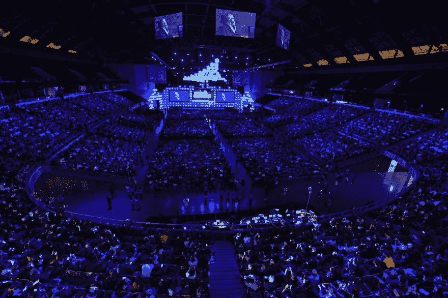
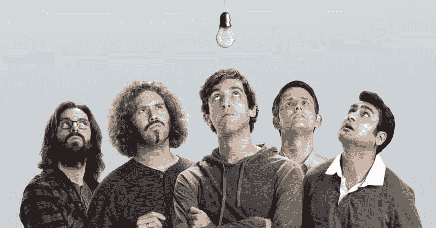
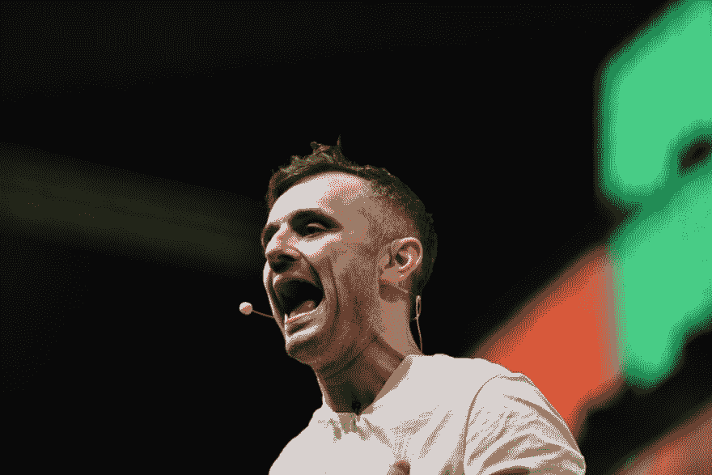
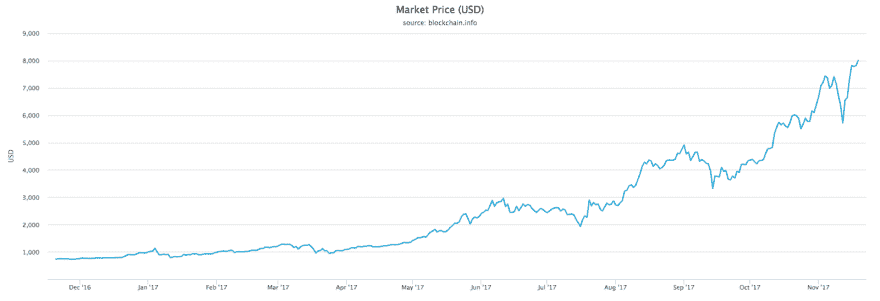
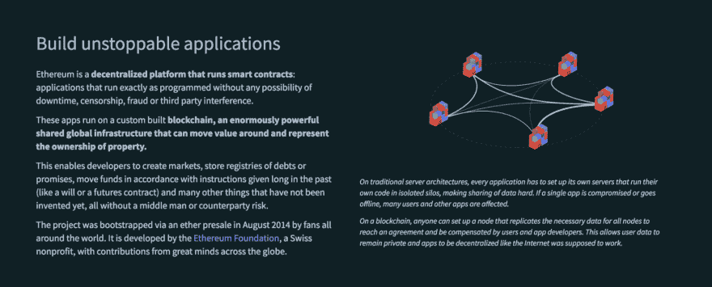
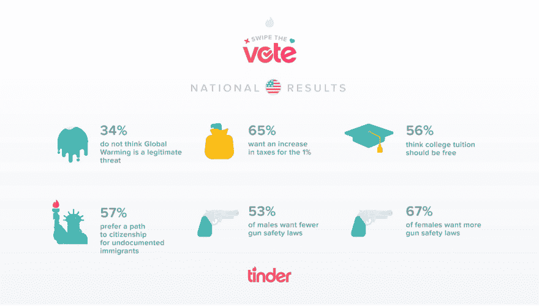
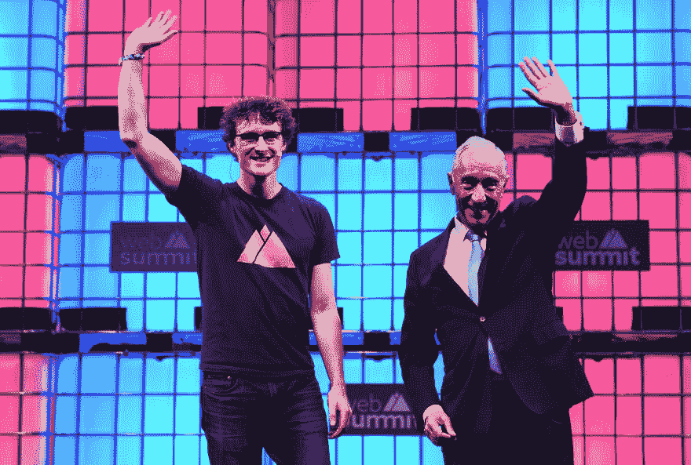
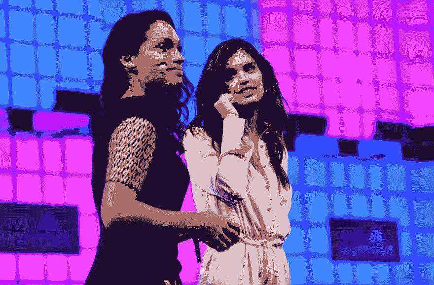

# 科技世界的朝圣

> 原文:[https://dev . to/_ didierfranc _/pilgrim of-the-tech-world-6ag](https://dev.to/_didierfranc_/pilgrimages-of-the-tech-world-6ag)

### 科技世界的朝圣

> 维基百科将朝圣定义为“一次道德之旅或探索”及其“圣地”。

在另一次飞行中，离开里斯本和最新一期的网络峰会，我想告诉你一些你正在阅读的屏幕背后发生的神奇事情。整个世界，每天从一个国家转移到另一个国家。

在数字行业工作的人类，当他*远离键盘*的时候，他在哪里？显然，离键盘不远，你可能会在这种地方找到他。你可能会在一些文章中读到网络峰会的好坏。他们可能都是对的。如果你想知道它是否对你有好处，那就一直读到最后。

 
史蒂芬·霍金 2017 年网络峰会开幕式

### 奶油的奶油

如果你有旅行的计划，这是我的候选名单，一个不完全的全世界最佳会议的名单。你可以把这些事件想象成有许多卫星围绕着它们运转的行星，一个事件只是冰山一角。

如果你在内容行业工作，你无法避免这一点，一些最好的独立艺术家会来开传奇演唱会。

CES 的商品，其有争议的展位宝贝，因为它是该领域的第一件大事。它从 1967 年就开始存在了，这是一个数字化时代的千年。

自 2010 年以来，镇上出现了一个新成员，网络峰会。它扰乱了既定的会议，仅在第一版之后几年，它已经随着[碰撞](https://collisionconf.com/)、[崛起](https://riseconf.com/)、[汹涌](https://surgeconf.com/)而风靡全球。每个事件是一个会议吨之一，但也超过 2000 个最好的创业公司暴露。

我们正在等待下一个帕迪·科斯格拉夫，他将再次使这一切革命化，这将很快到来，因为这个世界每天都需要一场革命。

 
*帕迪科斯格拉夫*

### 代码

代码是与机器对话的能力。今天，学习成千上万种机器语言中的一种可能比学习人类语言更有利可图。我们称自己为程序员、编码员、开发者…

> 我们还会有更多的会议。我经常听说我们是这十年的摇滚明星…我们中的一些人已经巡回演出多年了。

一些你不能错过的最好的开发者活动: [AgentConf](https://www.agent.sh/) ， [Smashing Conf](http://smashingconf.com/) 和 [DEF CON](https://www.defcon.org/) 当然。[谷歌](https://events.google.com/io/)、[苹果](https://developer.apple.com/wwdc/)、[亚马逊](https://aws.amazon.com/summits/)和 [Github](https://githubuniverse.com/) 事件也是不可错过的，因为它们定义了我们能做什么的未来。

### **创业文化**

 
*硅谷，电视剧*

如你所见，世界各地几乎每天都有会议。你认为极客永远不会离开他们的洞穴，或者他们的教派？我认为这种陈词滥调是组织大量活动和聚会的原因之一。害怕看起来像漫画。

> 俯仰，扰乱，支点，独角兽，你什么都懂。

**信念**是这个行业未来一切的中心。而且背后往往没有坚实的基础。只有能量和励志的谈话。

 
*[一次难忘的谈话](https://www.facebook.com/WebSummitHQ/videos/1203367773062598)来自**加里·维纳查克**，去年在网络峰会*

### 联网

世界上第一个联网的地方？彭博社将其定义为极客的达沃斯，彭博将其定义为地球上最好的科技会议。对你来说还不够吗？这里有一些数字。

*   60 000 人有很多共同点
*   2600 家世界领先媒体
*   1400 位全球最具影响力的科技投资者
*   1200 名世界级演讲者

#### 聚会

夜晚很重要，当然是为了社交，但不是唯一。在那个世界里，人们醒着的时候几乎每个小时都在工作，他们需要尽可能多的时间放松。为什么不在都柏林著名的酒吧里用纸巾签下价值数百万美元的合同呢？你知道优步吗？

### 金钱金钱金钱

[observator](http://observador.pt/2017/11/18/governo-estima-impacto-da-web-summit-de-300-milhoes-de-euros-mas-valor-pode-aumentar/)发布了政府估计的这次网络峰会的经济影响: **3 亿美元* *给葡萄牙，自去年以来超过 5 亿美元。对于一个只有三天的活动来说，这太大了。**

参加像网络峰会这样的会议的人代表了多少钱是不可能统计的。许多首席执行官来自科技行业最大的公司。数百名投资者、商业天使和风险投资。毫无疑问，数十亿美元正走在过道上。你不相信我吗？

只是一个例子来证明你应该。我有机会与哈萨克斯坦最大的电信运营商[哈萨克电信](https://en.wikipedia.org/wiki/Kazakhtelecom)**的代表讨论，你猜怎么着？他们在里斯本，带着哈萨克斯坦政府的 10 亿美元投资科技。🤑**

 **### 热门话题

#### **艾**

[https://www.youtube.com/embed/JuWOUEFB_IQ](https://www.youtube.com/embed/JuWOUEFB_IQ)

如果说去年是 ar 年，今年肯定是关于 AI 的，就一个字母变了，easy。 **Waymo** 展示了它的自动驾驶汽车，正如**优步**展示了 UberAir 自动飞行汽车一样。**亚马逊**展示了一些有前途的工具，比如[Lex](https://aws.amazon.com/fr/lex/)Alexa 背后的引擎，任何拥有 AWS 账户的人都可以使用。

斯蒂芬·霍金在开幕式上提出了一些人工智能时代的建议。

#### 区块链

*BTC/美元*

去年，比特币和区块链成为潮流。今年无疑是新的一步。今天，比特币被普通大众所接受。同时，以太坊促进了区块链之上新应用的开发。

 
*[以太坊](https://www.ethereum.org/)*

去中心化互联网的梦想似乎离现实越来越近。

### 政治

一年前，特朗普日复一日当选。那是在上一届网络峰会期间。最有趣的演讲之一来自 Tinder，里面有一些疯狂的数字。

[T2】](https://res.cloudinary.com/practicaldev/image/fetch/s--6PRz52Qb--/c_limit%2Cf_auto%2Cfl_progressive%2Cq_auto%2Cw_880/https://cdn-images-1.medium.com/max/2000/1%2A4bYDbtGAZnr_Hhkfnialcg.jpeg)

很明显，游说改变了立场。数字革命暴露了巨大(解除)监管问题，多年来，技术行为者一直在政治附近游说，以开放一些封闭的市场。一个新的时代即将到来，政治争相吸引最优秀的人和想法到他们的国家，他们的国家有很多优势，比如有吸引力的税收，工作的地方…

 
*帕迪科斯格拉夫和马塞洛雷贝洛德索萨*

### 朝圣者

简而言之，多穿西装，少穿乏味的 t 恤。几年前，展会上的大多数参展者都是年轻的极客，而现在展会上的休闲人士更多了。曝光者似乎更专业，梦想家和怪人今天更难找到。

对这一现象的解释之一是金融科技和加密货币的爆炸，21 世纪的**【大街】**？

另一个显著的变化是，越来越多的女性出现了。感谢组织为吸引更多女性参加科技活动所做的努力。妇女在舞台上 **(35.4%)** 和观众中 **(42%)** 的比例也很高。

 
*罗莎里奥·道森和萨拉·桑帕约*

### 迎接我们

如果你参加一些活动，我们可以见见我们，或者如果你只是想交流一下你的游牧经历，请在 twitter 上给我发短信。

* * *

*我要感谢我的雇主，[全称是](http://www.inextenso.digital/en)，支持我管理这个世界和这个事件。***