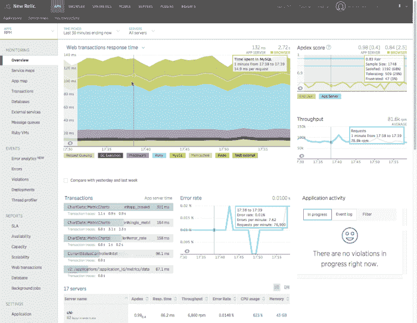
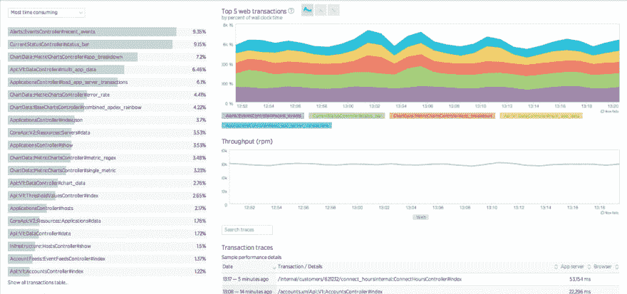
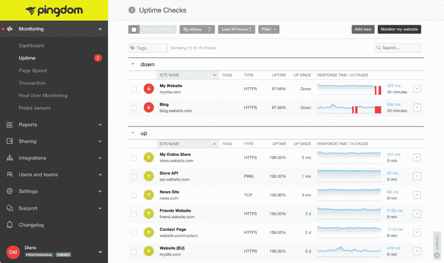
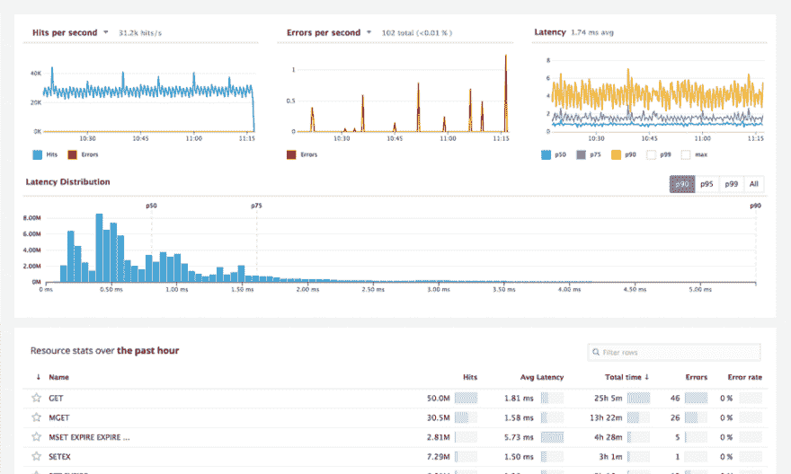
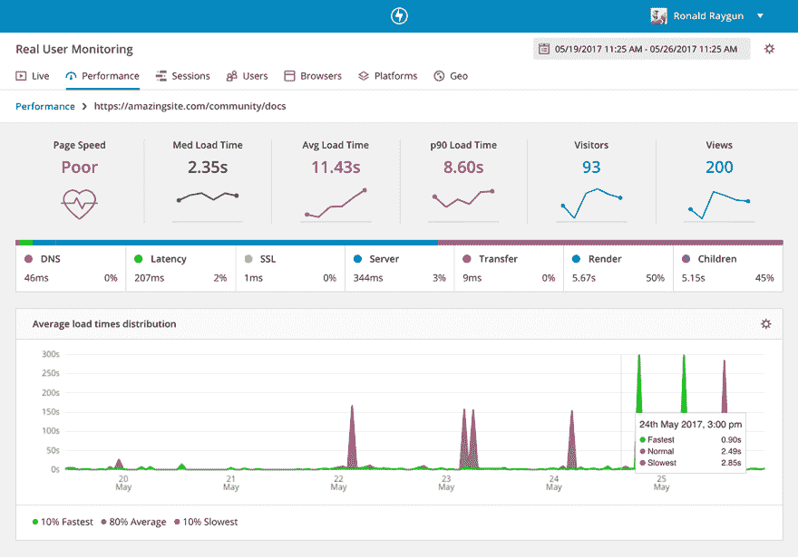
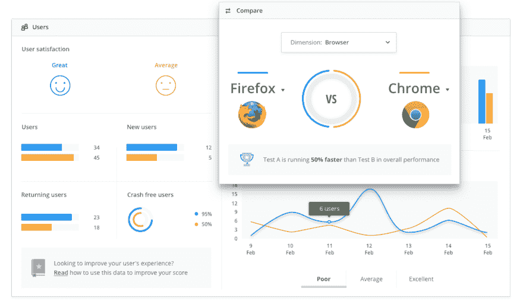
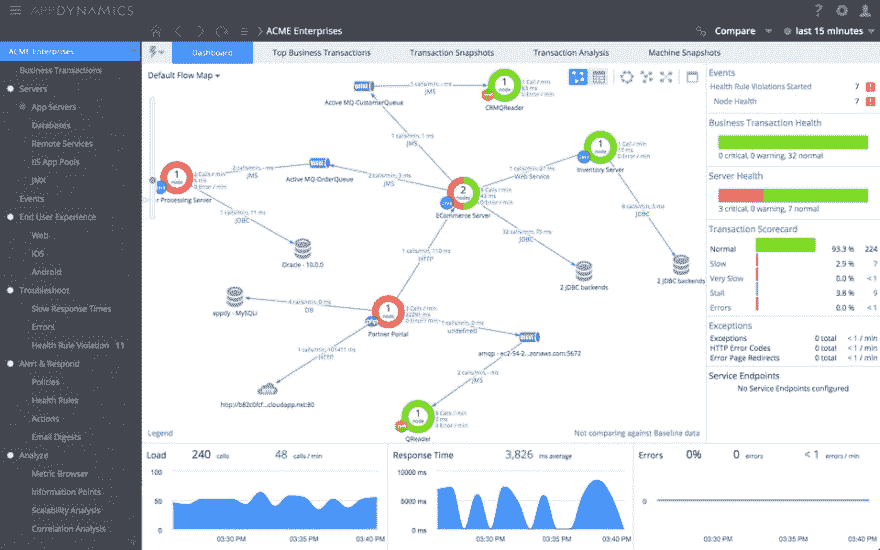

# 5 个用于改善用户体验的应用性能监控工具

> 原文:[https://dev . to/ray gun/5-application-performance-monitoring-tools-for-improving-user-experience-1649](https://dev.to/raygun/5-application-performance-monitoring-tools-for-improving-user-experiences-1649)

并非所有的用户体验都是一样的。即使使用完全相同的网站或移动应用程序，人们也可能有好有坏。

与此同时，开发人员编写代码并发布新功能，认为用户不会抱怨，一切都很好(如果不是这样)。

您上次提交软件错误报告是什么时候？当许多客户遇到登录页面加载缓慢时，他们不会花时间创建支持票证，他们只会关闭您的浏览器并离开。幸运的是，使用应用程序性能监控工具可以避免这些浪费的交互。在这篇文章中，我们比较了软件团队目前市场上的一些工具(包括我们自己的比较工具)。

## 为什么需要应用性能监控工具

部分问题在于不同的操作系统、浏览器、连接速度、设备和位置意味着任何数量的组合都可能与您的应用程序交互。

[T2】](https://res.cloudinary.com/practicaldev/image/fetch/s--r5Q8mTlu--/c_limit%2Cf_auto%2Cfl_progressive%2Cq_auto%2Cw_880/https://raygun.com/blog/wp-content/uploads/2017/11/browsers.png)

本地测试是有用的，但无法识别用户在尝试使用你的应用时可能遇到的大量变量。

合成测试也有不足之处。如何让数百万用户与您的应用程序交互，并准确了解部署到生产环境中时可能会发生的情况？

要获得最准确的视图，没有什么比在生产中与您的应用程序进行真实的用户交互更好的了。如果你有合适的工具，获得这个活动的窗口也比你想象的要容易得多。

在这里，我们来看看五个应用程序性能监控工具，它们将在生产中和生产之外监控您的应用程序。

## 1。新遗迹

New Relic 在软件工程团队中被广泛使用，尤其是他们的 APM(应用程序性能监控)工具，因为他们已经存在很多年了。

像用户交互跟踪这样的便利特性允许您通过提供代码级数据跟踪来跟踪应用程序中的单个用户交互。您可以获得应用中任何活动的可视化时间表，让您深入了解应用如何使用内存、数据库和 CPU。交互跟踪还可以让您深入了解如何在应用程序中的不同线程之间优化数据，以便您可以深入研究这些代码，确保没有效率低下的问题。

[T2】](https://res.cloudinary.com/practicaldev/image/fetch/s--DIOk14bX--/c_limit%2Cf_auto%2Cfl_progressive%2Cq_auto%2Cw_880/https://raygun.com/blog/wp-content/uploads/2017/11/new_relic.png)

凭借对我们的应用程序元素如何交互的大量见解，New Relic 有助于调整用户体验，并在潜在的灾难性问题变成问题之前识别它们。

虽然 New Relic 在错误和崩溃诊断方面不如其他专用的崩溃报告和错误跟踪解决方案强大，但您可以将其与类似[Raygun][1]的工具配对使用，从而让您两全其美。您将获得 APM 数据以及专门的错误诊断和用户会话跟踪。

[T2】](https://res.cloudinary.com/practicaldev/image/fetch/s--2YhUZHbn--/c_limit%2Cf_auto%2Cfl_progressive%2Cq_auto%2Cw_880/https://raygun.com/blog/wp-content/uploads/2017/11/apm.png)

#### **关键特性**

*   应用可用性监控、警报和通知
*   生产线程档案器功能
*   自动应用拓扑映射
*   平台插件
*   直方图和百分点
*   性能数据 API 访问
*   实时用户响应时间、吞吐量和按层细分
*   JVM 性能分析器
*   错误检测、警报和分析
*   数据库调用响应时间和吞吐量
*   代码级诊断、事务跟踪和堆栈跟踪
*   应用程序响应时间、吞吐量和组件细分
*   慢速 SQL 和 SQL 性能详细信息
*   Apdex 评分
*   按网页、浏览器、地理划分的真实用户细分
*   自定义仪表板
*   跟踪单个业务交易
*   商业交易的 x 射线会话
*   分布式应用的跨应用跟踪
*   可用性、可扩展性、部署报告

## 2。Pingdom

通常，世界上的某个特定地区对你的业务至关重要。因此，如果你的应用程序对那里的用户来说非常慢，你需要知道这一点。因此，真正的用户监控(RUM)工具对于识别性能问题及其环境至关重要。

使用 Pingdom，您可以过滤来自特定用户的数据，以便更好地了解网站的区域性能。通过设定您认为满意的绩效水平，您可以确保您最有价值的客户获得他们应得的网站体验。

Pingdom 还会监控你的网站的宕机时间，当灾难发生时会立即提醒你，并且它会离线。如果你的网站根本无法加载，你就无法为你的用户提供卓越的软件体验，而 Pingdom 的正常运行时间监控已经涵盖了这一点。

[T2】](https://res.cloudinary.com/practicaldev/image/fetch/s--92UUM8CL--/c_limit%2Cf_auto%2Cfl_progressive%2Cq_auto%2Cw_880/https://raygun.com/blog/wp-content/uploads/2017/11/pingdom.jpg)

#### **关键特性**

*   监控网站和服务器
*   详细报告
*   重要的互动
*   分析并提出解决方案来修复它
*   来自真实访问者的真实数据等于真实的性能数据
*   与他人分享您的数据
*   在您的移动设备上免费提供

## 3\. Datadog

Datadog 希望您在一个地方查看所有应用程序性能指标—；而且做得很好。有大量的集成，允许您连接各种其他工具以及 Datadog 提供的现成工具。

虽然其他性能监控工具具有协作功能，但 Datadog 将这一点放在产品的核心，并确保团队考虑一起监控其应用程序的各个部分。

DataDog 还在易于使用的仪表板上绘制各种各样的数据，并且不仅限于监控数据。New Relic 构建不同的代理来监控应用程序代码的各个方面，而 DataDog 在一个仪表板中提供这些信息。

[T2】](https://res.cloudinary.com/practicaldev/image/fetch/s--cDGlgrkw--/c_limit%2Cf_auto%2Cfl_progressive%2Cq_auto%2Cw_880/https://raygun.com/blog/wp-content/uploads/2017/11/datadog.png)

#### **关键特性**

*   不限主机数量的免费试用
*   120 多个用于数据聚合的交钥匙集成
*   StatsD 和其他集成的清晰图表
*   按标签、角色等划分图表和警报
*   异常主机的异常值检测
*   通过电子邮件和传呼机发送警报通知
*   针对单个主机或整个集群的任何指标发出警报
*   超过 15 种语言的完整 API 访问
*   跨不同来源覆盖指标和事件
*   现成的可定制监控仪表板
*   计算速率、比率、平均值或积分的简单方法
*   10 秒的采样间隔
*   在升级和维护过程中，只需一次点击即可静音所有警报
*   团队协作工具
*   易于使用的主机、指标和标记搜索

## 4。射线枪

Raygun 平台为您的开发团队提供了用户体验软件应用的独特视角。主要地，Raygun 关注于[错误监控](https://raygun.com/platform/crash-reporting)以及通过[真实用户监控](https://raygun.com/platform/real-user-monitoring)和[应用性能监控](https://raygun.com/platform/apm)识别用户遇到的性能问题。

最节省时间的功能之一是智能错误分组，它收集单一根本原因下的错误，这样您就不会收到大量通知。

为了帮助隔离和诊断性能问题，可以查看每个用户会话的页面性能分解，以了解哪些特定资产是导致页面或移动应用程序视图加载缓慢的原因。

[T2】](https://res.cloudinary.com/practicaldev/image/fetch/s--vwUZ911U--/c_limit%2Cf_auto%2Cfl_progressive%2Cq_auto%2Cw_880/https://raygun.com/blog/wp-content/uploads/2017/11/rum-interface.png)

Raygun 的另一个节省时间的特性是能够识别经过身份验证的用户，因此您可以查看哪些特定用户遇到了问题，以及问题的程度。这非常适合那些用户体验不好的 VIP 或企业客户。它的工作原理是让开发者搜索一个特定的电子邮件地址来生成一个用户配置文件。唯一的配置文件将列出用户遇到的每一个错误或崩溃，他们使用的浏览器，以及他们用来访问你的应用程序的所有设备。

部署跟踪特性对于暴露版本中的问题也很有用。当您发布新的更新或版本时，Raygun 可以识别每个版本中引入、解决或修复的问题。

在糟糕的发行版到达你的客户手中之前，立即发现它们是非常好的！

[T2】](https://res.cloudinary.com/practicaldev/image/fetch/s--oGWVokIA--/c_limit%2Cf_auto%2Cfl_progressive%2Cq_auto%2Cw_880/https://raygun.com/blog/wp-content/uploads/2017/11/compare.png)

虽然功能[与谷歌分析](https://raygun.com/blog/real-user-monitoring-google-analytics/)等工具提供的不同，但 Raygun 也整合了一些高级分析，包括哪些位置的加载时间最快和最慢。

#### **关键特性**

*   全文搜索和筛选
*   使用任何语言和框架跟踪多个应用程序
*   一个平台中的错误、崩溃和性能跟踪
*   无限最终用户
*   发现关键错误
*   添加评论并提及团队成员对问题的看法
*   版本/部署跟踪
*   附加标签、自定义数据对象和用户数据
*   JavaScript 源代码地图
*   自动错误报告
*   仅需几分钟的无缝集成
*   智能错误分组
*   通过电子邮件、Slack、HipChat 等发出错误通知
*   完整堆栈跟踪

## 5。应用动力学

AppDynamics 坚定地将其产品定位于市场的企业端，是在一个解决方案中提供 APM 和最终用户监控的性能监控工具之一。

如果应用程序使用受支持的语言，AppDynamics 具有处理应用程序数据收集的工具。(Java，。NET、PHP、Python、C++或 Node.js)他们还从移动设备、移动应用程序和浏览器收集数据。

通过应用程序中的所有组件跟踪来自用户的事务意味着 AppDynamics 可以将所有基础设施和日志消息关联到该单个事务。AppDynamics 自动发现并命名这些交换，使您能够关联数据并可视化应用程序的拓扑结构。

[T2】](https://res.cloudinary.com/practicaldev/image/fetch/s--jg-Giu_o--/c_limit%2Cf_auto%2Cfl_progressive%2Cq_auto%2Cw_880/https://raygun.com/blog/wp-content/uploads/2017/11/appdynamics.png)

#### **关键特性:**

*   最终用户监控
*   应用健康仪表板
*   实时业务交易监控
*   应用程序的报告和可见性
*   可视化和管理您的整个应用
*   运营仪表板
*   检测业务影响和性能峰值
*   分析敏捷发布的影响
*   隔离应用程序中的瓶颈
*   生产中的深层代码级诊断
*   通过完整的代码诊断确定根本原因
*   云中的动态扩展
*   自动商业交易发现
*   将问题的根本原因诊断速度提高 90%
*   发现并可视化您的应用拓扑和业务
*   性能和可用性问题疑难解答
*   设置主动警报以发现问题
*   全天候监控最重要的事情-您的关键业务交易
*   瓶颈故障排除速度提高 90%
*   用 Java 监控混合环境。NET、PHP 和 Node.js

### 概述

总之，上面的每个性能监控工具提供的东西略有不同，但都是围绕同一个目标构建的——查看用户遇到问题时在做什么。通常，开发人员不得不四处寻找线索来解释为什么他们的软件不能像预期的那样运行。[应用性能监控](https://raygun.com/platform/apm)工具以清晰直观的方式呈现问题症状，以帮助诊断和最终解决问题。

最终，性能问题是导致不满意的软件体验的一个巨大因素。因此，软件工程团队有责任积极主动地确保他们的应用程序按照预期的方式为用户执行。

缓慢采用这种可见性的团队可能会输给更具创新性的竞争对手，他们更关心用户如何体验他们的应用程序。