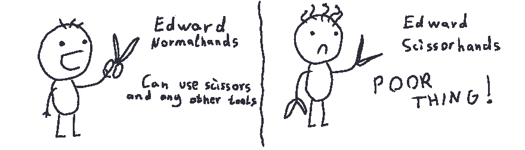

# 开/关原则

> 原文：<https://dev.to/satansdeer/openclosed-principle-86a>

*原贴于[maksimivanov.com](http://maksimivanov.com/posts/open-closed-principle)T3】*

OCP 声明软件实体(类、模块、函数)应该对扩展开放，但对修改关闭。让我们弄清楚它到底是什么意思…

这基本上意味着你应该以一种不需要你为了**扩展**它的行为而**修改**它的代码的方式来编写你的模块。

[T2】](https://res.cloudinary.com/practicaldev/image/fetch/s--XI1FFTvi--/c_limit%2Cf_auto%2Cfl_progressive%2Cq_auto%2Cw_880/http://d33wubrfki0l68.cloudfront.net/d1820d6c153e116bb211cc3e4499de8a8a40cf8e/b43f4/asseimg/open_closed_1.png)

## 让我们来看看现实世界的例子

我是说想象世界的例子。想象一下，你有一台可以制作巧克力脆片和 T2 幸运饼干的机器。

```
describe('CookieMachine', function(){
  describe('#makeCookie', function(){
    it('returns requested cookie when requested cookie with known recipy', function(){
      const cookieMachine = new CookieMachine();

      expect(cookieMachine.makeCookie('chocolate-chip-cookie')).toEqual('Chocolate chip cookie');
      expect(cookieMachine.makeCookie('fortune-cookie')).toEqual('Fortune cookie');
    });

    it('raises an error when requested cookie with unknown recipy', function(){
      const cookieMachine = new CookieMachine();

      expect(function(){ cookieMachine.makeCookie('unknown-cookie'); }).toThrow('Unknown cookie type.');
    })
  });
}); 
```

Enter fullscreen mode Exit fullscreen mode

这里是`CookieMachine`本身:

```
class CookieMachine{
  constructor(){
    // Sophisticated setup process
  }

  makeCookie(cookieType){
    switch(cookieType){
      case 'chocolate-chip-cookie':
        return 'Chocolate chip cookie';
      case 'fortune-cookie':
        return 'Fortune cookie';
      default:
        throw 'Unknown cookie type.';
    }
  }
} 
```

Enter fullscreen mode Exit fullscreen mode

让我们想象一下，现在是圣诞节，我们需要做胡椒饼干。看，我们违反了 OCP，现在我们必须更改`CookieMachine`代码并添加新的`case`块。

## 我们来搞定它

我们将引入一个抽象概念，`CookieRecipy` :

```
class CookieRecipy{
  constructor(){
    // Sophisticated setup process
  }

  cook(){
    // Abstract cooking process 
  }
}

class ChocolateChipCookieRecipy extends CookieRecipy{
  constructor(){
    super();
    this.cookieType = 'chocolate-chip-cookie'
    // Sophisticated setup process
  }

  cook(){
    return 'Chocolate chip cookie';
  }
}

class FortuneCookieRecipy extends CookieRecipy{
  constructor(){
    super();
    this.cookieType = 'fortune-cookie'
    // Sophisticated setup process
  }

  cook(){
    return 'Fortune cookie';
  }
}

class PepperCookieRecipy extends CookieRecipy{
  constructor(){
    super();
    this.cookieType = 'pepper-cookie'
    // Sophisticated setup process
  }

  cook(){
    return 'Pepper cookie';
  }
} 
```

Enter fullscreen mode Exit fullscreen mode

我们还将修改`CookieMachine`以在构造函数中接受这些配方。我们将使用`reduce`方法将菜谱列表缩减为一个对象，其中 cookie 类型作为键:

```
class CookieMachine{
  constructor(...recipes){
    this._recipes = recipes.reduce(function(accumulator, item){
      accumulator[item.cookieType] = item;
      return accumulator;
    }, {});
  }

  makeCookie(cookieType){
    if(this._recipes.hasOwnProperty(cookieType)){
      return this._recipes[cookieType].cook();
    }
    throw 'Unknown cookie type.'
  }
} 
```

Enter fullscreen mode Exit fullscreen mode

很好，现在如果我们想做一些新的饼干，我们只需要创建新的饼干副本。

## 让我们更新一下规格

现在我们必须在`CookieMachine`创建时传递 cookie 类型。

```
describe('CookieMachine', function(){
  describe('#makeCookie', function(){
    it('returns requested cookie when requested cookie with known recipy', function(){
      const cookieMachine = new CookieMachine(new ChocolateChipCookieRecipy(), new FortuneCookieRecipy(), new PepperCookieRecipy());

      expect(cookieMachine.makeCookie('chocolate-chip-cookie')).toEqual('Chocolate chip cookie');
      expect(cookieMachine.makeCookie('fortune-cookie')).toEqual('Fortune cookie');
      expect(cookieMachine.makeCookie('pepper-cookie')).toEqual('Pepper cookie');
    });

    it('raises an error when requested cookie with unknown recipy', function(){
      const cookieMachine = new CookieMachine();

      expect(function(){ cookieMachine.makeCookie('unknown-cookie'); }).toThrow('Unknown cookie type.');
    })
  });
}); 
```

Enter fullscreen mode Exit fullscreen mode

太好了，现在测试通过了，我们可以做任何我们想做的饼干了！