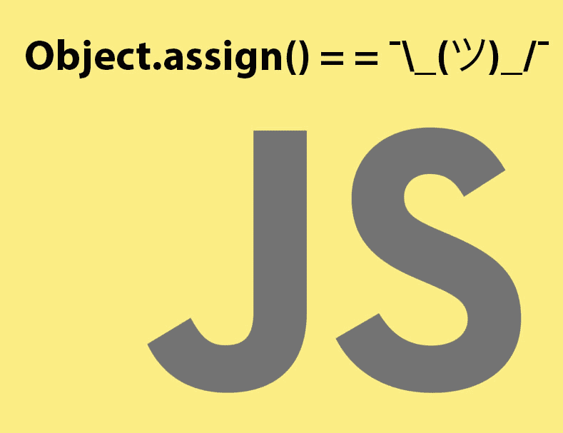

# 用 JavaScript 复制对象的最好方法是什么？

> 原文：<https://dev.to/ptasker/best-way-to-copy-an-object-in-javascript-827>

[T2】](https://res.cloudinary.com/practicaldev/image/fetch/s--_T2eECgn--/c_limit%2Cf_auto%2Cfl_progressive%2Cq_auto%2Cw_880/https://thepracticaldev.s3.amazonaws.com/i/5fl5k3opqfek6qtq9wxm.jpg)

所以这些天我一直在寻找一种尽可能使用 vanilla JS 的方法，我发现用 JavaScript 复制一个对象仍然很奇怪。

StackOverflow [让我想起了`JSON.parse( JSON.stringify( obj ) )`的把戏](https://stackoverflow.com/a/39736431/130596)，看起来 [`Object.assign`](https://developer.mozilla.org/en-US/docs/Web/JavaScript/Reference/Global_Objects/Object/assign) 还是不复制嵌套对象。

jQuery 的`$.extend()`作品。但这不再是普通的 JS 了。

你们用什么方法复制 JS 对象？

`¯\_(ツ)_/¯`