# 使用 GraphicsMagick 在命令行上编辑图像

> 原文:[https://dev . to/jorinvo/edit-images-on-the-command-line-with graphics magick-75j](https://dev.to/jorinvo/edit-images-on-the-command-line-with-graphicsmagick-75j)

*让我们探索如何在终端中满足您的图像编辑需求。*

您是一名软件开发人员，在终端中花费大量时间使用命令行程序。然后，偶尔你不得不离开舒适的文本世界，去煮咖啡，等待 Photoshop 加载，然后在一些图形上快速修改。如果能有一种简单快捷的方式，让您在自己的终端上就能做到这一点，岂不是很棒？无论如何，喝这么多咖啡对你的健康不利。

进入[graphics magick](http://www.graphicsmagick.org/)——“图像处理的瑞士军刀”。

你可能以前没有听说过 GraphicsMagick，但你可能听说过它的堂兄 [ImageMagick](https://www.imagemagick.org/) 。它知道更多的事情。或者只是不同的东西。此外，它通常速度较慢。在任何情况下，你都可以很容易地在它们之间切换，下面的所有命令应该仍然可以工作。

让我们开始吧。首先确保你已经安装了 GraphicsMagick。你可以通过运行`brew install graphicsmagick`或`apt-get install graphicsmagick`或类似的操作系统来轻松实现。

不要被这个项目陈旧的网站吓到。那里的[文档](//www.graphicsmagick.org/GraphicsMagick.html)实际上相当不错。当然，你也可以避免打开网络浏览器，而是在你的终端中使用`man gm`。将 GraphicsMagick 用于命令行的二进制文件被命名为`gm`。

对于所有示例，我们将使用来自 Unsplash 的这张图像:

[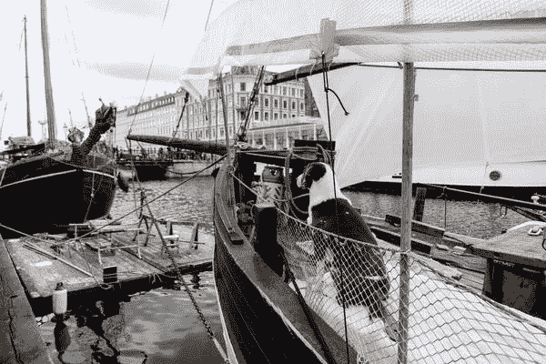T2】](https://res.cloudinary.com/practicaldev/image/fetch/s---YWGvXod--/c_limit%2Cf_auto%2Cfl_progressive%2Cq_auto%2Cw_880/https://jorin.img/gm/captain-dog.jpg)

### 调整大小

在我们开始之前，`gm`提供了不同的子命令，这些子命令带有用于配置的标志和参数。
为了调整大小，我们将使用`gm convert`命令。注意，您可以用基本相同的选项使用`gm mogrify`，但是`mogrify`会覆盖
给定的文件，而`convert`会将结果保存到一个新文件中，这对我们的实验来说绝对是一个节省。

正如@mudasobwa 指出的，GraphicsMagick 还提供了二进制文件来直接从命令行访问它的命令。所以在下面的例子中，我们将简单地使用`convert`而不是`gm convert`，但是它们做同样的事情。

接下来，你可以在[这个](https://github.com/jorinvo/me/tree/master/statimg/gm)文件夹中找到图片。

首先我们运行下面的代码，它告诉我们 600 乘 400 像素的尺寸:

```
$ file captain-dog.jpg
captain-dog.jpg: JPEG image data, JFIF standard 1.01, resolution (DPI), density 72x72, segment length 16, baseline, precision 8, 600x400, frames 3 
```

<svg width="20px" height="20px" viewBox="0 0 24 24" class="highlight-action crayons-icon highlight-action--fullscreen-on"><title>Enter fullscreen mode</title></svg> <svg width="20px" height="20px" viewBox="0 0 24 24" class="highlight-action crayons-icon highlight-action--fullscreen-off"><title>Exit fullscreen mode</title></svg>

调整图像大小最简单的方法是指定一个新的宽度。高度按比例缩放:

```
convert -resize 100 captain-dog.jpg dog-100.jpg 
```

<svg width="20px" height="20px" viewBox="0 0 24 24" class="highlight-action crayons-icon highlight-action--fullscreen-on"><title>Enter fullscreen mode</title></svg> <svg width="20px" height="20px" viewBox="0 0 24 24" class="highlight-action crayons-icon highlight-action--fullscreen-off"><title>Exit fullscreen mode</title></svg>

[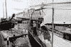T2】](https://res.cloudinary.com/practicaldev/image/fetch/s--KyFvv1Ny--/c_limit%2Cf_auto%2Cfl_progressive%2Cq_auto%2Cw_880/https://jorin.img/gm/dog-100.jpg)

或者，你可以指定一个宽度和一个高度，然后程序将调整图像的大小以适应新的尺寸，而不改变比例:

```
convert -resize 200x100 captain-dog.jpg dog-200-100.jpg 
```

<svg width="20px" height="20px" viewBox="0 0 24 24" class="highlight-action crayons-icon highlight-action--fullscreen-on"><title>Enter fullscreen mode</title></svg> <svg width="20px" height="20px" viewBox="0 0 24 24" class="highlight-action crayons-icon highlight-action--fullscreen-off"><title>Exit fullscreen mode</title></svg>

[](https://res.cloudinary.com/practicaldev/image/fetch/s--S5dBtKS1--/c_limit%2Cf_auto%2Cfl_progressive%2Cq_auto%2Cw_880/https://jorin.img/gm/dog-200-100.jpg)T3】

```
convert -resize 100x200 captain-dog.jpg dog-100-200.jpg 
```

<svg width="20px" height="20px" viewBox="0 0 24 24" class="highlight-action crayons-icon highlight-action--fullscreen-on"><title>Enter fullscreen mode</title></svg> <svg width="20px" height="20px" viewBox="0 0 24 24" class="highlight-action crayons-icon highlight-action--fullscreen-off"><title>Exit fullscreen mode</title></svg>

[T2】](https://res.cloudinary.com/practicaldev/image/fetch/s--8DQGQRJO--/c_limit%2Cf_auto%2Cfl_progressive%2Cq_auto%2Cw_880/https://jorin.img/gm/dog-100-200.jpg)

也可以用百分比代替:

```
convert -resize 50% captain-dog.jpg dog-half.jpg 
```

<svg width="20px" height="20px" viewBox="0 0 24 24" class="highlight-action crayons-icon highlight-action--fullscreen-on"><title>Enter fullscreen mode</title></svg> <svg width="20px" height="20px" viewBox="0 0 24 24" class="highlight-action crayons-icon highlight-action--fullscreen-off"><title>Exit fullscreen mode</title></svg>

[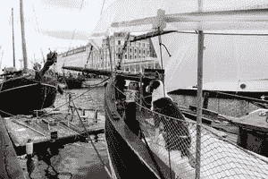T2】](https://res.cloudinary.com/practicaldev/image/fetch/s--KrnTAgJq--/c_limit%2Cf_auto%2Cfl_progressive%2Cq_auto%2Cw_880/https://jorin.img/gm/dog-half.jpg)

除了改变原始图像，你还可以扩展它来填充给定的尺寸:

```
convert -extent 100 -background red
  dog-100-200.jpg dog-extend-100.jpg 
```

<svg width="20px" height="20px" viewBox="0 0 24 24" class="highlight-action crayons-icon highlight-action--fullscreen-on"><title>Enter fullscreen mode</title></svg> <svg width="20px" height="20px" viewBox="0 0 24 24" class="highlight-action crayons-icon highlight-action--fullscreen-off"><title>Exit fullscreen mode</title></svg>

[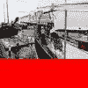T2】](https://res.cloudinary.com/practicaldev/image/fetch/s--_5eJ-R32--/c_limit%2Cf_auto%2Cfl_progressive%2Cq_auto%2Cw_880/https://jorin.img/gm/dog-extend-100.jpg)

请注意，我还指定了背景颜色。颜色格式与你可能已经从 CSS 或其他地方知道的方式非常相似。也可以设置为`transparent`。

如果你需要图像在中心，你可以通过设置重力来实现，但是一定要在设置`-extent`之前设置重力，因为 GraphicsMagick 会按顺序应用选项:

```
convert -gravity center -extent 100
  -background red dog-100-200.jpg dog-extend-center.jpg 
```

<svg width="20px" height="20px" viewBox="0 0 24 24" class="highlight-action crayons-icon highlight-action--fullscreen-on"><title>Enter fullscreen mode</title></svg> <svg width="20px" height="20px" viewBox="0 0 24 24" class="highlight-action crayons-icon highlight-action--fullscreen-off"><title>Exit fullscreen mode</title></svg>

[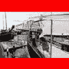T2】](https://res.cloudinary.com/practicaldev/image/fetch/s--19IgqRvt--/c_limit%2Cf_auto%2Cfl_progressive%2Cq_auto%2Cw_880/https://jorin.img/gm/dog-extend-center.jpg)

注意，如果你喜欢使用更快的调整大小算法，你可以用`-scale`代替`-resize`。

### 裁剪

与调整大小密切相关的是，我们经常需要剪切掉图像的某一部分。

让我们把图像裁剪成一个正方形:

```
convert -crop 400x400 captain-dog.jpg dog-square.jpg 
```

<svg width="20px" height="20px" viewBox="0 0 24 24" class="highlight-action crayons-icon highlight-action--fullscreen-on"><title>Enter fullscreen mode</title></svg> <svg width="20px" height="20px" viewBox="0 0 24 24" class="highlight-action crayons-icon highlight-action--fullscreen-off"><title>Exit fullscreen mode</title></svg>

[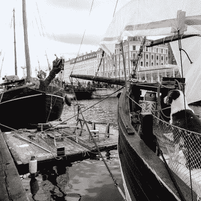T2】](https://res.cloudinary.com/practicaldev/image/fetch/s--vfwx7wtN--/c_limit%2Cf_auto%2Cfl_progressive%2Cq_auto%2Cw_880/https://jorin.img/gm/dog-square.jpg)

现在狗的右边被切断了。让我们把正方形放在中心。为此，我们需要自己进行计算，并在裁剪尺寸中指定偏移量:

```
convert -crop 400x400+150
  captain-dog.jpg dog-square-center.jpg 
```

<svg width="20px" height="20px" viewBox="0 0 24 24" class="highlight-action crayons-icon highlight-action--fullscreen-on"><title>Enter fullscreen mode</title></svg> <svg width="20px" height="20px" viewBox="0 0 24 24" class="highlight-action crayons-icon highlight-action--fullscreen-off"><title>Exit fullscreen mode</title></svg>

[T2】](https://res.cloudinary.com/practicaldev/image/fetch/s--YK73wQY1--/c_limit%2Cf_auto%2Cfl_progressive%2Cq_auto%2Cw_880/https://jorin.img/gm/dog-square-center.jpg)

这看起来差不多是对的。请注意，不同的选项可以组合甚至重复。顺序很重要:

```
convert -resize 200 -crop 400x400+150
  captain-dog.jpg dog-square-center-error.jpg 
```

<svg width="20px" height="20px" viewBox="0 0 24 24" class="highlight-action crayons-icon highlight-action--fullscreen-on"><title>Enter fullscreen mode</title></svg> <svg width="20px" height="20px" viewBox="0 0 24 24" class="highlight-action crayons-icon highlight-action--fullscreen-off"><title>Exit fullscreen mode</title></svg>

[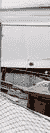T2】](https://res.cloudinary.com/practicaldev/image/fetch/s--uEXc9MDf--/c_limit%2Cf_auto%2Cfl_progressive%2Cq_auto%2Cw_880/https://jorin.img/gm/dog-square-center-error.jpg)

这不起作用，但是如果我们改变参数的顺序，它看起来是正确的:

```
convert -crop 400x400+150 -resize 200
  captain-dog.jpg dog-square-center-small.jpg 
```

<svg width="20px" height="20px" viewBox="0 0 24 24" class="highlight-action crayons-icon highlight-action--fullscreen-on"><title>Enter fullscreen mode</title></svg> <svg width="20px" height="20px" viewBox="0 0 24 24" class="highlight-action crayons-icon highlight-action--fullscreen-off"><title>Exit fullscreen mode</title></svg>

[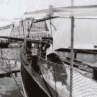T2】](https://res.cloudinary.com/practicaldev/image/fetch/s--pQajD9EB--/c_limit%2Cf_auto%2Cfl_progressive%2Cq_auto%2Cw_880/https://jorin.img/gm/dog-square-center-small.jpg)

或者，您可以保留订单并更改尺寸:

```
convert -resize x200 -crop 200x200+75
  captain-dog.jpg dog-square-center-small2.jpg 
```

<svg width="20px" height="20px" viewBox="0 0 24 24" class="highlight-action crayons-icon highlight-action--fullscreen-on"><title>Enter fullscreen mode</title></svg> <svg width="20px" height="20px" viewBox="0 0 24 24" class="highlight-action crayons-icon highlight-action--fullscreen-off"><title>Exit fullscreen mode</title></svg>

[T2】](https://res.cloudinary.com/practicaldev/image/fetch/s--lS6VAgJy--/c_limit%2Cf_auto%2Cfl_progressive%2Cq_auto%2Cw_880/https://jorin.img/gm/dog-square-center-small2.jpg)

### 镜像图像

您可以在两个轴上镜像图像:

```
convert -flop captain-dog.jpg dog-flop.jpg 
```

<svg width="20px" height="20px" viewBox="0 0 24 24" class="highlight-action crayons-icon highlight-action--fullscreen-on"><title>Enter fullscreen mode</title></svg> <svg width="20px" height="20px" viewBox="0 0 24 24" class="highlight-action crayons-icon highlight-action--fullscreen-off"><title>Exit fullscreen mode</title></svg>

[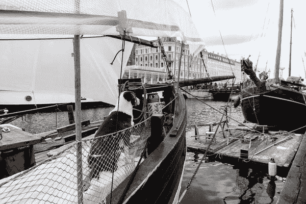](https://res.cloudinary.com/practicaldev/image/fetch/s--HUimDMHB--/c_limit%2Cf_auto%2Cfl_progressive%2Cq_auto%2Cw_880/https://jorin.img/gm/dog-flop.jpg)T3】

```
convert -flip captain-dog.jpg dog-flip.jpg 
```

<svg width="20px" height="20px" viewBox="0 0 24 24" class="highlight-action crayons-icon highlight-action--fullscreen-on"><title>Enter fullscreen mode</title></svg> <svg width="20px" height="20px" viewBox="0 0 24 24" class="highlight-action crayons-icon highlight-action--fullscreen-off"><title>Exit fullscreen mode</title></svg>

[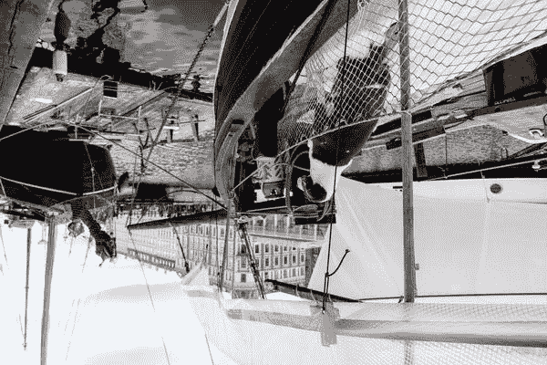T2】](https://res.cloudinary.com/practicaldev/image/fetch/s--V48ztZKG--/c_limit%2Cf_auto%2Cfl_progressive%2Cq_auto%2Cw_880/https://jorin.img/gm/dog-flip.jpg)

### 通过将多个图像组合成一个图像来创建蒙太奇

使用`montage`命令可以合并图像。您需要指定结果维度:

```
montage -geometry 600x400
  captain-dog.jpg dog-flop.jpg dog-montage.jpg 
```

<svg width="20px" height="20px" viewBox="0 0 24 24" class="highlight-action crayons-icon highlight-action--fullscreen-on"><title>Enter fullscreen mode</title></svg> <svg width="20px" height="20px" viewBox="0 0 24 24" class="highlight-action crayons-icon highlight-action--fullscreen-off"><title>Exit fullscreen mode</title></svg>

[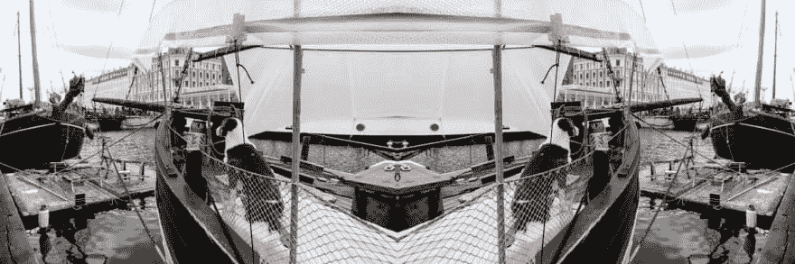T2】](https://res.cloudinary.com/practicaldev/image/fetch/s--Y3qP_mrt--/c_limit%2Cf_auto%2Cfl_progressive%2Cq_auto%2Cw_880/https://jorin.img/gm/dog-montage.jpg)

您也可以在图像周围留有空白:

```
montage -geometry 600x400+10+10 -background blue 
  captain-dog.jpg dog-flop.jpg dog-montage-margin.jpg 
```

<svg width="20px" height="20px" viewBox="0 0 24 24" class="highlight-action crayons-icon highlight-action--fullscreen-on"><title>Enter fullscreen mode</title></svg> <svg width="20px" height="20px" viewBox="0 0 24 24" class="highlight-action crayons-icon highlight-action--fullscreen-off"><title>Exit fullscreen mode</title></svg>

[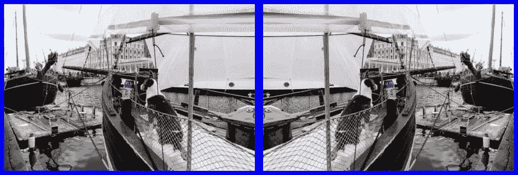T2】](https://res.cloudinary.com/practicaldev/image/fetch/s--NFeRj2WD--/c_limit%2Cf_auto%2Cfl_progressive%2Cq_auto%2Cw_880/https://jorin.img/gm/dog-montage-margin.jpg)

您可以修改图像所在的网格:

```
montage -tile 1x -geometry 300x200 
  captain-dog.jpg dog-flip.jpg dog-montage-vertical.jpg 
```

<svg width="20px" height="20px" viewBox="0 0 24 24" class="highlight-action crayons-icon highlight-action--fullscreen-on"><title>Enter fullscreen mode</title></svg> <svg width="20px" height="20px" viewBox="0 0 24 24" class="highlight-action crayons-icon highlight-action--fullscreen-off"><title>Exit fullscreen mode</title></svg>

[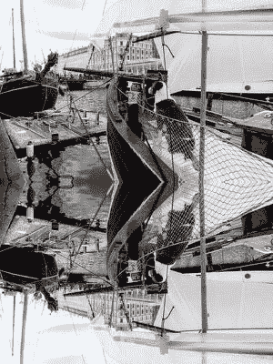T2】](https://res.cloudinary.com/practicaldev/image/fetch/s--DZBYvgzb--/c_limit%2Cf_auto%2Cfl_progressive%2Cq_auto%2Cw_880/https://jorin.img/gm/dog-montage-vertical.jpg)

### 将图片合并成一个 PDF

GraphicsMagick 为您提供了一种非常快速的方法来将一些图像合并成一个 PDF:

```
convert captain-dog.jpg dog-flop.jpg dog-flip.jpg 
  dog.pdf 
```

<svg width="20px" height="20px" viewBox="0 0 24 24" class="highlight-action crayons-icon highlight-action--fullscreen-on"><title>Enter fullscreen mode</title></svg> <svg width="20px" height="20px" viewBox="0 0 24 24" class="highlight-action crayons-icon highlight-action--fullscreen-off"><title>Exit fullscreen mode</title></svg>

[生成的 PDF](https://jorin.img/gm/dog.pdf)

不仅仅是 PDF，还有超过 88 种支持的格式，你可以很容易地转换你的图形文件。

### 将图像改为黑色&白色

作为最后一个例子，让我们将图像转换为黑白:

```
convert -monochrome captain-dog.jpg dog-bw.jpg 
```

<svg width="20px" height="20px" viewBox="0 0 24 24" class="highlight-action crayons-icon highlight-action--fullscreen-on"><title>Enter fullscreen mode</title></svg> <svg width="20px" height="20px" viewBox="0 0 24 24" class="highlight-action crayons-icon highlight-action--fullscreen-off"><title>Exit fullscreen mode</title></svg>

[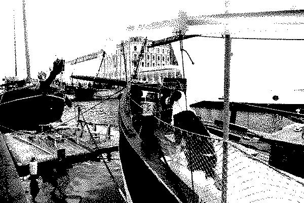T2】](https://res.cloudinary.com/practicaldev/image/fetch/s--n6E3vXV0--/c_limit%2Cf_auto%2Cfl_progressive%2Cq_auto%2Cw_880/https://jorin.img/gm/dog-bw.jpg)

我们也可以通过将饱和度设置为零来将其转换为灰度:

```
convert -modulate 100,0 captain-dog.jpg dog-grey.jpg 
```

<svg width="20px" height="20px" viewBox="0 0 24 24" class="highlight-action crayons-icon highlight-action--fullscreen-on"><title>Enter fullscreen mode</title></svg> <svg width="20px" height="20px" viewBox="0 0 24 24" class="highlight-action crayons-icon highlight-action--fullscreen-off"><title>Exit fullscreen mode</title></svg>

[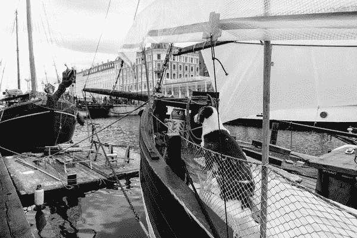T2】](https://res.cloudinary.com/practicaldev/image/fetch/s--JZO2KKks--/c_limit%2Cf_auto%2Cfl_progressive%2Cq_auto%2Cw_880/https://jorin.img/gm/dog-grey.jpg)

* * *

作为对 Mac 用户的奖励，将以下功能添加到[您的。bashrc 文件](https://github.com/jorinvo/dotfiles/blob/master/bashrc)，所以你可以简单地输入`ql captain-dog.jpg`来预览文件:

```
# View file with Quick Look
ql() {
  qlmanage -p "$1" &>/dev/null
} 
```

<svg width="20px" height="20px" viewBox="0 0 24 24" class="highlight-action crayons-icon highlight-action--fullscreen-on"><title>Enter fullscreen mode</title></svg> <svg width="20px" height="20px" viewBox="0 0 24 24" class="highlight-action crayons-icon highlight-action--fullscreen-off"><title>Exit fullscreen mode</title></svg>

* * *

这只是开始。您可以使用 GraphicsMagick 做更多的事情，例如旋转图像、[混合图像](http://www.graphicsmagick.org/composite.html)和许多选项，例如不透明度，根据您的喜好调整图像的颜色，例如`-blur`、`-sharpen`、`-gamma`和`-modulate`、[批处理](//www.graphicsmagick.org/batch.html)命令，以便一次运行许多编辑操作，甚至创建动画 GIF 图像。

当然，现在你也有能力自动化你所有的编辑需求。您可以编写可重用的 shell 脚本来一次编辑许多图像，或者您甚至可以使用 GraphicsMagick 来编辑所有生产图像。每种流行的编程语言都有绑定——例如在 [Node.js](https://github.com/aheckmann/gm) 中。

让我知道你最喜欢的工具和你编辑图像的设置，包括手动和自动！