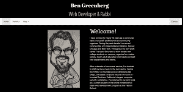
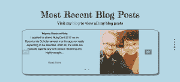
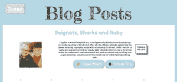
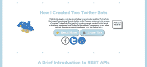

# 我如何重新设计我的投资组合网站

> 原文：<https://dev.to/bengreenberg/how-i-redesigned-my-portfolio-site-4p3>

当我还是熨斗学校的学生时，我第一次创建了我的作品集网站。当时我利用 Ruby、 [Sinatra](https://en.wikipedia.org/wiki/Sinatra_(software)) 和一个 PostgreSQL 数据库创建了它。我使用 Twitter Bootstrap 对其进行了样式化，并使用自定义域名将其部署到 Heroku。从那以后，除了向数据库中添加新项目和博客帖子，我基本上就不去管它了。

[T2】](https://res.cloudinary.com/practicaldev/image/fetch/s---w_g4_j5--/c_limit%2Cf_auto%2Cfl_progressive%2Cq_auto%2Cw_880/https://thepracticaldev.s3.amazonaws.com/i/53kxtt6zu3nto1qg30rd.png)

从 Flatiron 毕业后不久，我决定将网站的后端和前端分开。我将 Ruby 和 Sinatra 应用程序改造成一个 API 服务，以 JSON 的形式提供一些数据库查询的结果，并通过前端转换成一个 React with Redux 客户端，该客户端向后端 API 发出获取请求。最初，我完全按照以前的方式设计前端，但是我之所以进行这种转变，是因为我认为一旦前端从后端分离出来，更新前端会更简单。

在过去的几周里，我花时间更新了我的投资组合网站的外观。我仍然在努力解决一些小设备的响应问题，不过，总体来说，我对它的外观很满意。我决定这次不使用 Bootstrap，而是纯粹用 Flexbox 和定制 CSS 来设计它。当然，这被证明更具挑战性，我对这一挑战感到兴奋。我确实使用了一些节点包，比如 [react-fullpage](https://www.npmjs.com/package/react-fullpage) 、 [node-emoji](https://www.npmjs.com/package/node-emoji) 和 [nuka-carousel](https://www.npmjs.com/package/nuka-carousel) 。

react-fullpage 包是专门为更好地使用 react 框架而设计的 [fullPage.js](https://alvarotrigo.com/fullPage/) 包的一个版本。js 使得设计漂亮的单页应用程序变得简单而直观。我重新设计的目标之一是将我的新网站设计成一个页面。我喜欢很少需要转到不同页面的用户体验(即使它是用 react-router 等即时呈现的)。)并且我也想在我的作品集网站上实现它。

当访问者第一次来到我的网站时，他们会受到一个大大的“嗨！”一些友好的表情符号来问候他们:

[T2】](https://res.cloudinary.com/practicaldev/image/fetch/s--9a1KpMrr--/c_limit%2Cf_auto%2Cfl_progressive%2Cq_auto%2Cw_880/https://thepracticaldev.s3.amazonaws.com/i/dg759o76w732q0w8x7hl.png)

用户可以点击右侧非常简单的导航，用鼠标滚动或按键盘上的向下箭头来浏览网站的各个部分。内容本身清楚地分为介绍，投资组合项目，博客帖子和联系信息。访问者可以使用开发人员友好的 nuka-carousel 节点包提供的导航来滚动浏览投资组合项目和博客文章。

[T2】](https://res.cloudinary.com/practicaldev/image/fetch/s--FP4F9Vfn--/c_limit%2Cf_auto%2Cfl_progressive%2Cq_auto%2Cw_880/https://thepracticaldev.s3.amazonaws.com/i/ofmrt0p3qm5u2nqp4ion.png)

我最近添加了一个单独的页面来显示我所有的博客文章。我对我的单页应用程序规则做了这个例外，因为有太多的博客文章需要保存在转盘中，并且仍然保持用户友好的滚动体验。现在，我只在转盘中列出最近的两篇博客文章，用户可以访问博客页面查看其余内容。我也在考虑为投资组合项目做类似的事情。

[T2】](https://res.cloudinary.com/practicaldev/image/fetch/s--UH9UTFzw--/c_limit%2Cf_auto%2Cfl_progressive%2Cq_auto%2Cw_880/https://thepracticaldev.s3.amazonaws.com/i/7byyc34o9d5ss4psc7oj.png)

博客页面也是用 Flexbox 和一些定制的 CSS 和 Javascript 创建的。该页面向我的后端 API 发出一个获取请求，然后遍历文章数组，为每篇博客文章创建一个“博客卡”，由文章的图片、标题和片段组成。每个帖子有两个按钮，一个让用户在最初发布的位置查看整个博客帖子，另一个让用户在几个不同的社交媒体平台上分享帖子。“Share This”按钮控制一点 Javascript，显示或隐藏包含社交媒体共享图标和链接的 div。默认情况下，社交媒体共享 div 是隐藏的。

[T2】](https://res.cloudinary.com/practicaldev/image/fetch/s--TkFA5KpV--/c_limit%2Cf_auto%2Cfl_progressive%2Cq_auto%2Cw_880/https://thepracticaldev.s3.amazonaws.com/i/ory4a4885joz25ogig4d.png)

与我的第一个作品集网站相比，我的新网站看起来更现代、更明亮，并且提供了更友好的用户浏览体验。我对它有更多的计划，包括更多的响应，但我对这个新版本很满意。我最高兴的是不仅有机会设计我的投资组合网站的更新更好的版本，而且有机会使用 Flexbox 进一步完善我的前端技能，并学习一些伟大的新( *for me* )节点包。

你可以在[bengreenberg.org](http://www.bengreenberg.org/)查看我的作品集。