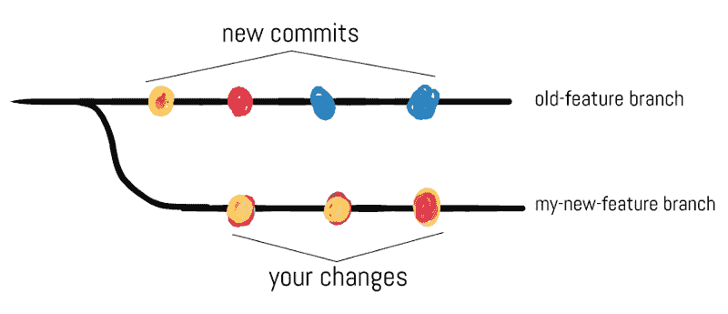
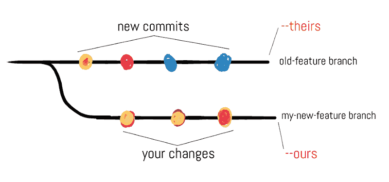
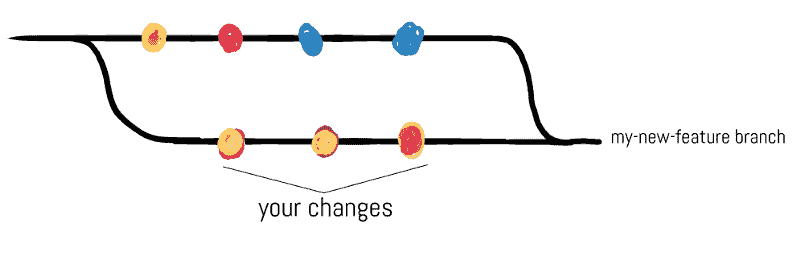

# 吉特:我们的还是他们的？(第一部分)

> 原文:[https://dev.to/willamesoares/git-ours-or-theirs-part1-agh](https://dev.to/willamesoares/git-ours-or-theirs-part1-agh)

[T2】](https://res.cloudinary.com/practicaldev/image/fetch/s--LkhuvetB--/c_limit%2Cf_auto%2Cfl_progressive%2Cq_auto%2Cw_880/https://thepracticaldev.s3.amazonaws.com/i/d7vb5nh75jemegr33b24.png)

###### 本帖最初发布于我的个人[博客](http://willamesoares.com)

在本文中，我将假设您已经对 Git 有了基本的了解，因此当您在团队中工作时，对共享代码的过程也很熟悉。如果你不知道这些，我建议你在阅读这篇文章之前，在这里和这里多读一些关于这些话题的内容。

如果您是故意来这里的，您可能知道这篇文章涉及到一个非常麻烦的情况，当您试图与在同一个存储库中工作的同事共享您的代码时，您经常会遇到这种情况。我们都知道，那些被称为冲突的情况，可能会变得更加困难或耗时，这取决于我们试图提交的变更的数量。

作为一名初级开发人员，我一直想知道我可以自动化哪些事情来提高我的工作效率。由于这个原因——也因为我曾经在一个文件中得到一堆冲突——我想出了这篇文章的主题。所以事不宜迟，让我们开始吧。

首先，让我们想象你必须开发一个你真正感兴趣的新特性。因此，您继续为它创建一个新的分支。

```
$ (old-feature) git checkout -b my-new-feature 
```

<svg width="20px" height="20px" viewBox="0 0 24 24" class="highlight-action crayons-icon highlight-action--fullscreen-on"><title>Enter fullscreen mode</title></svg> <svg width="20px" height="20px" viewBox="0 0 24 24" class="highlight-action crayons-icon highlight-action--fullscreen-off"><title>Exit fullscreen mode</title></svg>

完成任务所需的所有更改后，假设您现在需要将旧分支合并到当前分支中，您已从该分支创建了“我的新功能”分支。但是，在尝试这样做之前，您会注意到该分支上有新的提交，git 图现在如下所示:

[T2】](https://res.cloudinary.com/practicaldev/image/fetch/s--qPUvvsM1--/c_limit%2Cf_auto%2Cfl_progressive%2Cq_auto%2Cw_880/http://willamesoares.cimg/posts/git/part1/example1.png)

尽管您注意到了这一点，但您认为旧分支上的这些更改不会影响您的分支，因此在“我的新功能”分支中执行合并命令。

```
$ (my-new-feature) git merge old-feature 
```

<svg width="20px" height="20px" viewBox="0 0 24 24" class="highlight-action crayons-icon highlight-action--fullscreen-on"><title>Enter fullscreen mode</title></svg> <svg width="20px" height="20px" viewBox="0 0 24 24" class="highlight-action crayons-icon highlight-action--fullscreen-off"><title>Exit fullscreen mode</title></svg>

并且输出为:

```
Auto-merging index.html
CONFLICT (content): Merge conflict in index.html
Automatic merge failed; fix conflicts and then commit the result. 
```

<svg width="20px" height="20px" viewBox="0 0 24 24" class="highlight-action crayons-icon highlight-action--fullscreen-on"><title>Enter fullscreen mode</title></svg> <svg width="20px" height="20px" viewBox="0 0 24 24" class="highlight-action crayons-icon highlight-action--fullscreen-off"><title>Exit fullscreen mode</title></svg>

太糟糕了！您只是在 index.html 文件中遇到了一些应该手动解决的冲突。但是等等…这个文件很大，里面有很多冲突。如果你一次做一个，你可能要花很长时间来处理它们。

那么，我们如何实现自动化呢？这里我们看到了 Git 提供给我们的两个非常方便的选项:我们的和`theirs`。第一个选项表示在发生冲突之前执行命令的当前分支，第二个选项表示发生更改的分支。因此，在上述情况下，`my-new-feature`分支将是我们的，`old-feature`分支将是他们的。

[T2】](https://res.cloudinary.com/practicaldev/image/fetch/s--h_plRK7t--/c_limit%2Cf_auto%2Cfl_progressive%2Cq_auto%2Cw_880/http://willamesoares.cimg/posts/git/part1/example2.png)

为了更好地理解你什么时候想要使用这些选项，让我们想象你打开了 index.html 文件，你注意到所有来自老特征分支的改变都是不正确的，你可以简单地忽略它们。这样，您希望只保留您的分支中的变更，这是由 ours 选项引用的。因此，您可以简单地运行下面的命令，而不是一次处理一行。

```
$ (my-new-feature) git checkout --ours index.html 
```

<svg width="20px" height="20px" viewBox="0 0 24 24" class="highlight-action crayons-icon highlight-action--fullscreen-on"><title>Enter fullscreen mode</title></svg> <svg width="20px" height="20px" viewBox="0 0 24 24" class="highlight-action crayons-icon highlight-action--fullscreen-off"><title>Exit fullscreen mode</title></svg>

之后，您只需要明确地告诉 Git，您通过将该文件添加到索引中解决了该文件中的冲突，如下面的命令所示。

```
$ (my-new-feature) git add index.html 
```

<svg width="20px" height="20px" viewBox="0 0 24 24" class="highlight-action crayons-icon highlight-action--fullscreen-on"><title>Enter fullscreen mode</title></svg> <svg width="20px" height="20px" viewBox="0 0 24 24" class="highlight-action crayons-icon highlight-action--fullscreen-off"><title>Exit fullscreen mode</title></svg>

类似地，如果您想要保留来自旧特性分支的所有更改并忽略您的更改，您只需使用选项 theirs(当然，在上面描述的情况下)。

合并过程成功完成后，我们将得到如下分支图:

[T2】](https://res.cloudinary.com/practicaldev/image/fetch/s--rXsGcsNF--/c_limit%2Cf_auto%2Cfl_progressive%2Cq_auto%2Cw_880/http://willamesoares.cimg/posts/git/part1/example3.png)

至此，您已经使用了一种策略来解决在进行 git 合并时可能发生的冲突。这可以让你在面对这样的问题时节省相当多的时间。

需要注意的是，用这种方式解决冲突时必须小心。在自动进行更改之前，必须确定哪些更改应该保留，哪些应该忽略。此外，这些选项在不同的情况下可能会有点棘手。这里描述的一个是特定于合并过程的，不应该被误认为是重定基础的情况。但这将在另一篇文章中讨论。敬请期待！

...

与此同时，如果你想了解更多关于选项和讨论的其他命令，你可以看看这里的。

如果您有任何问题或意见，请告诉我！

非常感谢你的阅读！