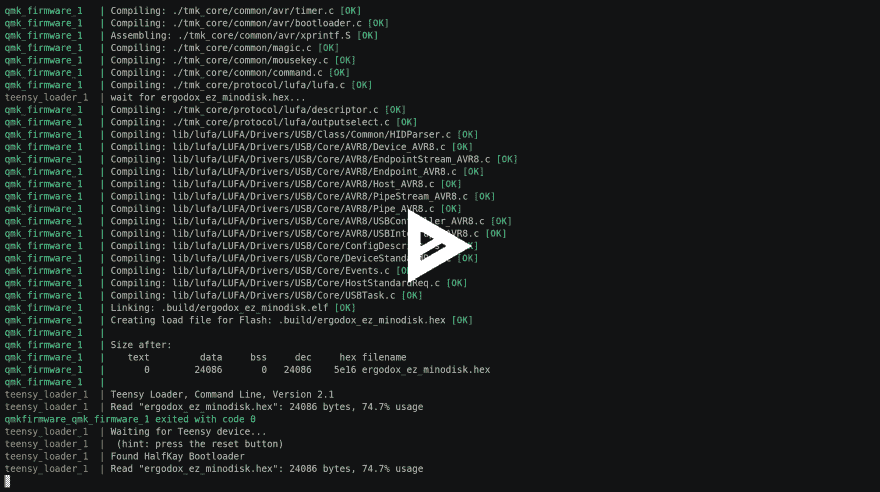

# 用 Docker 重写 Teensy

> 原文:[https://dev.to/minodisk/rewrite-teensy-with-docker-ai0](https://dev.to/minodisk/rewrite-teensy-with-docker-ai0)

使用 dockered[Teensy Loader CLI](https://www.pjrc.com/teensy/loader_cli.html)使得为 Teensy 重写程序变得更加容易。
[qmk/qmk_firmware](https://github.com/qmk/qmk_firmware) 已经对接。将 [minodisk/teensy_loader](https://hub.docker.com/r/minodisk/teensy_loader/) 一起使用，构建`.hex`，加载到 teensy，重启 Teensy 等所有过程都可以用 Docker 完成。

## 动机

我不想在我的本地机器上安装各种东西。

## 前提

*   [qmk/qmk_firmware](https://github.com/qmk/qmk_firmware) 已被拉取
*   Docker 已经安装在您的本地机器上
*   在 Linux 中(Docker for Mac 或 Win 可能很难或不能安装 USB)

## 演示

[T2】](https://asciinema.org/a/148756)

## 如何使用

### 第一步。让 YAML 为码头工人作曲做准备

添加`qmk_firmware/docker-compose.yml` :

```
version: '2'
services:
  qmk_firmware:
    build: .
    environment:
      keyboard: ergodox_ez
      subproject:
      keymap: <Your Keymap Name>
    volumes:
      - .:/qmk
      - /qmk/.build
  teensy_loader:
    image: minodisk/teensy_loader:0.0.1
    depends_on:
      - qmk_firmware
    privileged: true
    environment:
      hex: ergodox_ez_<Your Keymap Name>
    volumes:
      - /dev/bus/usb:/dev/bus/usb
    volumes_from:
      - qmk_firmware 
```

<svg width="20px" height="20px" viewBox="0 0 24 24" class="highlight-action crayons-icon highlight-action--fullscreen-on"><title>Enter fullscreen mode</title></svg> <svg width="20px" height="20px" viewBox="0 0 24 24" class="highlight-action crayons-icon highlight-action--fullscreen-off"><title>Exit fullscreen mode</title></svg>

### 第二步。建立和增强

```
docker-compose build
docker-compose up 
```

<svg width="20px" height="20px" viewBox="0 0 24 24" class="highlight-action crayons-icon highlight-action--fullscreen-on"><title>Enter fullscreen mode</title></svg> <svg width="20px" height="20px" viewBox="0 0 24 24" class="highlight-action crayons-icon highlight-action--fullscreen-off"><title>Exit fullscreen mode</title></svg>

### 第三步。按下重置按钮

当终端输出`Waiting for Teensy device...`时，按下 Teensy 上的复位按钮。

## 如何工作

1.  在`teensy_loader`容器中，等待在与`qmk_firmaware`容器共享的卷上生成`.hex`
2.  在`qmk_firmware`容器中，构建`.hex`
3.  在`teensy_loader`容器中，在与`qmk_firmware`容器共享的卷上找到`.hex`,并使用等待选项运行`teensy_loader_cli`
4.  在现实世界中，你按下 Teensy 上的重置按钮(如果它映射到一个键，则按下该键)
5.  在`teensy_loader`容器中，`teensy_loader_cli`将`.hex`写入 Teensy 并重启它