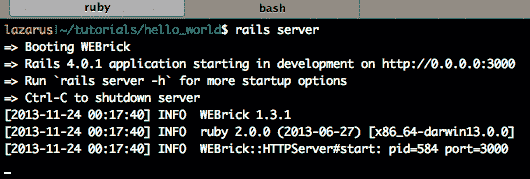
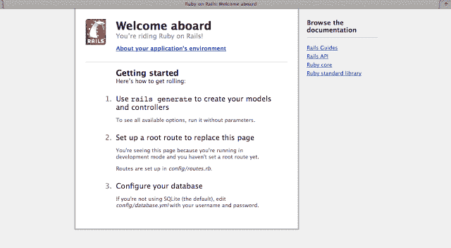
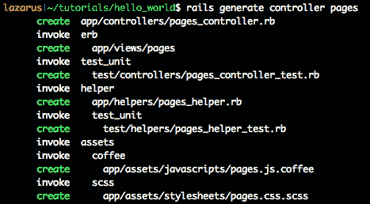
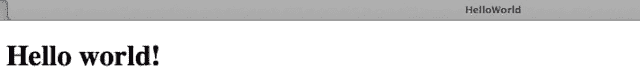
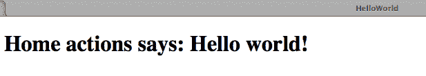

# 用 Ruby on Rails 向世界问好

> 原文:[https://dev . to/iridakos/saying-hello-world-with-ruby-on-rails-dek](https://dev.to/iridakos/saying-hello-world-with-ruby-on-rails-dek)

如果你是 Ruby 新手，我建议你首先阅读[这篇](http://iridakos.com/ruby/2013/11/08/dont-give-up-on-ruby.html)，它简单地解释了为什么你不应该放弃学习 Ruby。

在这篇文章中，我们将首先熟悉语言(Ruby)和框架(Ruby on Rails)。这篇文章是基于我当时的亲身经历，所以我希望任何新来的人都能很容易理解它们。

首先，在你的机器上安装 ruby 和 rails。有大量的安装教程，你可以从中挑选一个与你的机器操作系统相匹配的。我跟随[这个](http://railsapps.github.io/installrubyonrails-mac.html)是为了在 OS X Mavericks 上安装 Ruby 2.0 & Rails 4。

## 开发环境

您将需要:

*   文本编辑器:我更喜欢使用 GitHub 的 [Atom](https://atom.io/) ，这是一个优秀的 IDE 插件。有很多其他的选择，但这不是你现在必须决定的事情。试试看，你会找到你最喜欢的。

*   **控制台:**我用的是 [iTerm2](http://www.iterm2.com/) 它是 OS X 终端应用的强大替代品。为你的操作系统找一个终端应用程序，花些时间定制以符合你的喜好，你会在里面做很多工作。

*   **浏览器:**你最喜欢的。我使用 Chrome 或 Firefox 进行开发。嗯，我以前更喜欢 Chrome，但在 Firefox Quantum 发布后，我无法决定谁是最好的，所以我两个都用。

## 我们开始吧

创建一个放置教程代码的文件夹，从命令行导航到这个文件夹:

```
mkdir tutorials
cd tutorials 
```

<svg width="20px" height="20px" viewBox="0 0 24 24" class="highlight-action crayons-icon highlight-action--fullscreen-on"><title>Enter fullscreen mode</title></svg> <svg width="20px" height="20px" viewBox="0 0 24 24" class="highlight-action crayons-icon highlight-action--fullscreen-off"><title>Exit fullscreen mode</title></svg>

现在让我们创建名为`hello_world` :
的新应用程序

```
rails new hello_world 
```

<svg width="20px" height="20px" viewBox="0 0 24 24" class="highlight-action crayons-icon highlight-action--fullscreen-on"><title>Enter fullscreen mode</title></svg> <svg width="20px" height="20px" viewBox="0 0 24 24" class="highlight-action crayons-icon highlight-action--fullscreen-off"><title>Exit fullscreen mode</title></svg>

上面的命令将创建一个名为`hello_world`的文件夹。在这个文件夹中，你会发现不同的文件和子文件夹，它们实际上构成了一个 Rails 应用程序。

在这篇文章中，我将只解释我们将要改变的文件/文件夹(一个完整的解释将在下一篇文章中提供)。

您已经在系统中安装了一个与 Ruby 捆绑在一起的 web 服务器，它的名字是 WEBRick。让我们启动它，看看我们用最后一个命令创建了什么。

从命令行导航到创建的文件夹:

```
cd hello_world 
```

<svg width="20px" height="20px" viewBox="0 0 24 24" class="highlight-action crayons-icon highlight-action--fullscreen-on"><title>Enter fullscreen mode</title></svg> <svg width="20px" height="20px" viewBox="0 0 24 24" class="highlight-action crayons-icon highlight-action--fullscreen-off"><title>Exit fullscreen mode</title></svg>

使用以下命令启动 WEBrick:

```
rails server 
```

<svg width="20px" height="20px" viewBox="0 0 24 24" class="highlight-action crayons-icon highlight-action--fullscreen-on"><title>Enter fullscreen mode</title></svg> <svg width="20px" height="20px" viewBox="0 0 24 24" class="highlight-action crayons-icon highlight-action--fullscreen-off"><title>Exit fullscreen mode</title></svg>

你也可以在前面的命令中用`s`代替`server`，它只是一个别名，会做完全相同的事情:

```
rails s 
```

<svg width="20px" height="20px" viewBox="0 0 24 24" class="highlight-action crayons-icon highlight-action--fullscreen-on"><title>Enter fullscreen mode</title></svg> <svg width="20px" height="20px" viewBox="0 0 24 24" class="highlight-action crayons-icon highlight-action--fullscreen-off"><title>Exit fullscreen mode</title></svg>

您应该会看到类似这样的内容:

[T2】](https://res.cloudinary.com/practicaldev/image/fetch/s--FGcg1HVN--/c_limit%2Cf_auto%2Cfl_progressive%2Cq_auto%2Cw_880/http://2.bp.blogspot.com/-NwLVOAjtjag/UpEp1H01XKI/AAAAAAAAAcQ/vgwNU0ZVSgI/s1600/webrick.png)

默认情况下，服务器监听端口 3000，但是您可以使用`-p`选项:
更改为您想要的端口

```
rails server -p 8080 
```

<svg width="20px" height="20px" viewBox="0 0 24 24" class="highlight-action crayons-icon highlight-action--fullscreen-on"><title>Enter fullscreen mode</title></svg> <svg width="20px" height="20px" viewBox="0 0 24 24" class="highlight-action crayons-icon highlight-action--fullscreen-off"><title>Exit fullscreen mode</title></svg>

因此，web 服务器启动了，我们的应用程序成功部署了。打开浏览器，访问以下地址:

```
http://localhost:8080 
```

<svg width="20px" height="20px" viewBox="0 0 24 24" class="highlight-action crayons-icon highlight-action--fullscreen-on"><title>Enter fullscreen mode</title></svg> <svg width="20px" height="20px" viewBox="0 0 24 24" class="highlight-action crayons-icon highlight-action--fullscreen-off"><title>Exit fullscreen mode</title></svg>

Tadaaa...您应该会看到类似这样的内容:

[T2】](https://res.cloudinary.com/practicaldev/image/fetch/s--v-TIjDim--/c_limit%2Cf_auto%2Cfl_progressive%2Cq_auto%2Cw_880/http://4.bp.blogspot.com/-jXXwccMm_OI/UpEuGykbR8I/AAAAAAAAAcc/iKkofkL8UmY/s640/first-hit.png)

在我们继续之前，我将尝试以简单的方式解释 rails 应用程序是如何工作的。

*   应用程序的每个请求都由方法(称为`actions`)提供服务，这些方法在称为`controllers`的特殊文件中定义。
*   这些动作执行必须执行的内容，并定义响应(例如 html 页面、JSON 对象等)。响应(例如一个页面)是在一个叫做视图的特殊文件中定义的，但是在某些情况下(比如用一个 JSON 对象响应)，一个动作的视图不需要被“定义”(在这种情况下，我们说我们有 JSON 视图等等)。
*   定义哪个控制器的哪个动作将服务于每个请求的规则(`routes`)放在一个名为`routes.rb`的特殊文件中

这些暂时足够了。让我们创建第一个名为`pages`的控制器。
从命令行:

```
rails generate controller pages 
```

<svg width="20px" height="20px" viewBox="0 0 24 24" class="highlight-action crayons-icon highlight-action--fullscreen-on"><title>Enter fullscreen mode</title></svg> <svg width="20px" height="20px" viewBox="0 0 24 24" class="highlight-action crayons-icon highlight-action--fullscreen-off"><title>Exit fullscreen mode</title></svg>

您将看到该命令中出现了许多行，但请关注第一行:

[T2】](https://res.cloudinary.com/practicaldev/image/fetch/s--wMZEHtw5--/c_limit%2Cf_auto%2Cfl_progressive%2Cq_auto%2Cw_880/http://3.bp.blogspot.com/-ucr0i4t3rfk/UpE4sI-CjpI/AAAAAAAAAcs/BFFYthZjJng/s1600/generate-controller.png)

是的，`pages_controller.rb`是我们的控制者。
在这个文件中，我们将创建一个动作，为应用程序的“root”(home)请求提供服务。

所以，用你的文本编辑器打开这个文件。它的位置是:
`app/controllers/pages_controller.rb`

如你所见，控制器是空的。我们会给它添加一个动作，姑且称之为`home` :

```
def home
end 
```

<svg width="20px" height="20px" viewBox="0 0 24 24" class="highlight-action crayons-icon highlight-action--fullscreen-on"><title>Enter fullscreen mode</title></svg> <svg width="20px" height="20px" viewBox="0 0 24 24" class="highlight-action crayons-icon highlight-action--fullscreen-off"><title>Exit fullscreen mode</title></svg>

如你所见，我们的动作什么也没做，因为我们想要做的只是显示一个带有文本 *Hello world* 的静态页面。让我们添加一些东西来看看它是如何从服务器的日志中执行的:

```
class PagesController < ApplicationController
  def home
    puts "Hello console!"
  end
end 
```

<svg width="20px" height="20px" viewBox="0 0 24 24" class="highlight-action crayons-icon highlight-action--fullscreen-on"><title>Enter fullscreen mode</title></svg> <svg width="20px" height="20px" viewBox="0 0 24 24" class="highlight-action crayons-icon highlight-action--fullscreen-off"><title>Exit fullscreen mode</title></svg>

如果说 Java 的话，`puts`和 Java 的`System.out.println();`差不多

如果没有被告知(这就是我们的情况)，home action 也会尝试用一个名为`home`的视图来响应。
让我们在适当的文件夹中创建这个视图:
`app/views/pages/`

在该文件夹中创建一个名为`home.html.erb`的文件

`erb`扩展名意味着这个文件将由 Rails 处理，以便嵌入任何动态内容。

编辑该文件并添加:

```
<h1>Hello world!</h1> 
```

<svg width="20px" height="20px" viewBox="0 0 24 24" class="highlight-action crayons-icon highlight-action--fullscreen-on"><title>Enter fullscreen mode</title></svg> <svg width="20px" height="20px" viewBox="0 0 24 24" class="highlight-action crayons-icon highlight-action--fullscreen-off"><title>Exit fullscreen mode</title></svg>

还剩下什么？是的，我们必须将根请求路由到我们的控制器的动作。

用你的文本编辑器打开位于这里的`routes.rb`文件:
`config/routes.rb`

您会发现一堆帮助注释(以`#`开头的文本),您可以删除它们。

现在，添加下面的代码行，告诉我们根路径`/`将由我们的控制器的 home 动作服务:

```
root to: 'pages#home' 
```

<svg width="20px" height="20px" viewBox="0 0 24 24" class="highlight-action crayons-icon highlight-action--fullscreen-on"><title>Enter fullscreen mode</title></svg> <svg width="20px" height="20px" viewBox="0 0 24 24" class="highlight-action crayons-icon highlight-action--fullscreen-off"><title>Exit fullscreen mode</title></svg>

如果你刷新你的浏览器，你会看到我们刚刚创建的惊人的超级复杂的页面:

[T2】](https://res.cloudinary.com/practicaldev/image/fetch/s--L-etfimK--/c_limit%2Cf_auto%2Cfl_progressive%2Cq_auto%2Cw_880/http://4.bp.blogspot.com/-fN7Mf2u71nE/UpFE0NERslI/AAAAAAAAAdE/vVDxnUFlrFM/s640/static.png)

我们可以就此打住，但是如果我们有 *Hello world 就更好了！*文本从控制器的动作传递到视图，是吗？是的。

再次打开页面控制器，更改主页操作:

```
def home
  @greeting = "Home action says: Hello world!"
end 
```

<svg width="20px" height="20px" viewBox="0 0 24 24" class="highlight-action crayons-icon highlight-action--fullscreen-on"><title>Enter fullscreen mode</title></svg> <svg width="20px" height="20px" viewBox="0 0 24 24" class="highlight-action crayons-icon highlight-action--fullscreen-off"><title>Exit fullscreen mode</title></svg>

这里，我们向控制器声明了一个名为`greeting`和值为`Home action says: Hello world!.`的实例变量

该变量可在我们相应的视图中使用，因此打开`home.html.erb`视图，将其内容更改为:

```
<h1><%= @greeting %></h1> 
```

<svg width="20px" height="20px" viewBox="0 0 24 24" class="highlight-action crayons-icon highlight-action--fullscreen-on"><title>Enter fullscreen mode</title></svg> <svg width="20px" height="20px" viewBox="0 0 24 24" class="highlight-action crayons-icon highlight-action--fullscreen-off"><title>Exit fullscreen mode</title></svg>

在浏览器中刷新页面，就可以看到:

[T2】](https://res.cloudinary.com/practicaldev/image/fetch/s--rE2OsSWQ--/c_limit%2Cf_auto%2Cfl_progressive%2Cq_auto%2Cw_880/http://1.bp.blogspot.com/-z2SM6eyCAVc/UpFG9SrwaUI/AAAAAAAAAdQ/RHVlNsTm4o0/s640/home-hello.png)

至此，**您已经创建了您的第一个 Ruby on Rails 应用程序！**

* * *

这篇文章经过编辑，从我的博客转载到这里。