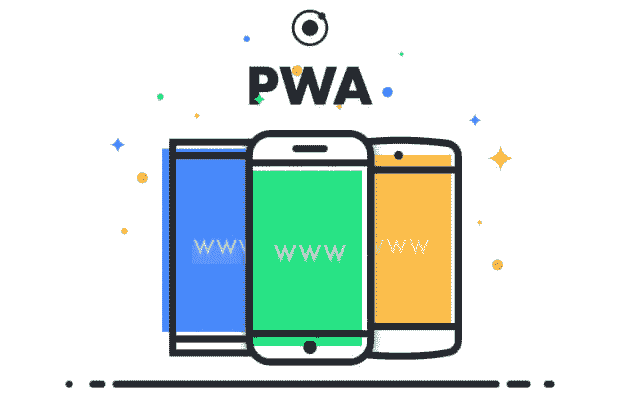
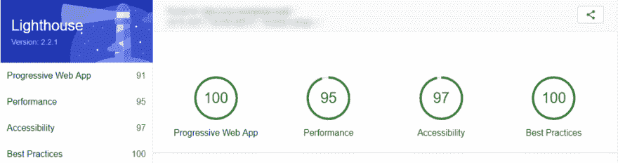

# 带有 Webpack 的渐进式 Web 应用程序

> 原文:[https://dev . to/reme Juan/progressive-web-app-with-web pack-ecj](https://dev.to/remejuan/progressive-web-app-with-webpack-ecj)

[T2】](https://res.cloudinary.com/practicaldev/image/fetch/s--2Pbn3LRj--/c_limit%2Cf_auto%2Cfl_progressive%2Cq_auto%2Cw_880/https://thepracticaldev.s3.amazonaws.com/i/3iyxw5l0u9h1hqki52rz.png)

根据您的 web 应用程序，渐进式 web 应用程序可能不是必需的，但它可能对您的一些用户有用。通过 PWA，你的用户可以将网站的一部分直接保存在他们的移动设备上，以便离线使用。

要做到这一点，你需要做的就是你的站点是 HTTPS，一个 manifest.json 文件，并注册一个在当前应用程序中工作的服务。只需一点时间，这些都可以很容易地手动创建，但是我将专注于使用 webpack 作为一种将其与您现有的构建过程集成的方法。类似的方法可以用于吞咽/咕噜声。

一旦设置完成，你的网站将注册为 PWA，并在支持的移动设备/浏览器上，用户甚至会被提示将你的应用程序保存到他们的主屏幕，有效地安装它。

我们将要配置的是 2 个小的 webpack 插件，它们将生成注册 PWA 所需的服务工人和清单。

服务人员将配置您的 PWA 如何运行，缓存哪些资产和 URL 等等。

manifest 文件为应用程序提供了额外的说明和主题，如果您希望用户被提示在他们的设备上保存您的应用程序，这是必不可少的一部分。

## 设置

要开始，只需安装`sw-precache-webpack-plugin`和`webpack-pwa-manifest`。

```
 npm i sw-precache-webpack-plugin webpack-pwa-manifest -D
    yarn add sw-precache-webpack-plugin webpack-pwa-manifest --dev 
```

在您的 webpack 产品/分销配置中，您只需要这些新模块:

```
 const SWPrecacheWebpackPlugin = require('sw-precache-webpack-plugin');
    const WebpackPwaManifest = require('webpack-pwa-manifest'); 
```

您还可以选择定义一个 PUBLIC_PATH 变量，该变量作为 ServiceWorker 配置的一部分，用于缓存您的域名以备后用。

```
 const PUBLIC_PATH = 'https://www.my-domain.com/'; 
```

## 服务人员配置

在当前 webpack 插件数组的末尾添加一个类似下面的配置:

```
 new SWPrecacheWebpackPlugin(
      {
        cacheId: 'my-domain-cache-id',
        dontCacheBustUrlsMatching: /\.\w{8}\./,
        filename: 'service-worker.js',
        minify: true,
        navigateFallback: PUBLIC_PATH + 'index.html',
        staticFileGlobsIgnorePatterns: [/\.map$/, /manifest\.json$/]
      }
    ), 
```

正如您所看到的，这是非常困难的，唯一真正受益于更新的是 cacheId。更多高级用法或额外信息的附加插件选项可以在 SW Precache Webpack Plugin Github 找到。

## 清单配置

就像服务工作一样，你在你的 webpack 插件数组的底部包含另一个插件配置，这将为你的离线应用程序提供你所有的美学选项。

```
 new WebpackPwaManifest({
      name: 'My Applications Friendly Name',
      short_name: 'Application',
      description: 'Description!',
      background_color: '#01579b',
      theme_color: '#01579b',
      'theme-color': '#01579b',
      start_url: '/',
      icons: [
        {
          src: path.resolve('simg/icon.png'),
          sizes: [96, 128, 192, 256, 384, 512],
          destination: path.join('assets', 'icons')
        }
      ]
    }); 
```

注意事项…

short_name:这是图标下面的名称，保持在 12 个字符以内。

背景颜色、主题颜色和主题颜色都是清单主题选项的一部分。2 个主题版本用于不同的浏览器支持，这些将是地址栏的样式。

图标:在这里你可以在数组中提供多个对象，如果你想为 iOS 和 Android 提供不同的图标，这很有用。关于 Webpack PWA Github 的更多详细信息。我简单地在一个集合中添加了 WPWA，它将在尺寸数组中提供的所有尺寸下生成图标，然后放置定义好的目标路径。

## 输出

在我们结束之前要做的最后一件事是，您需要向现有的输出对象添加一个 publicPath 键，并将其设置为前面定义的`PUBLIC_PATH`常量。

```
 output: {
      // Snip
      publicPath: PUBLIC_PATH
    }, 
```

## 登记您的员工

现在你的 webpack 已经设置好了，最后一段代码需要添加到你的项目中。

在应用程序的主 js 文件中，您需要添加这个立即调用的函数。

```
 (function () {
      if ('serviceWorker' in navigator) {
        navigator.serviceWorker.register('./service-worker.js', {scope: '/'})
        .then(() => console.log('Service Worker registered successfully.'))
        .catch(error => console.log('Service Worker registration failed:', error));
      }
    })(); 
```

这将检查你的访问者使用的浏览器是否支持服务工作者，如果支持，就注册你的 service-worker.js。

您的网站，至少在某种程度上，现在可以离线使用，并可以在用户下次访问后保存为 PWA。

如果您现在运行构建过程，您应该会看到几个图标以及 service-worker.js 和 amanifest。[哈希]。json 在您的 public/dist 文件夹中。

Google 开发了一个 Chrome 插件，你可以用来测试你的实现， [Lighthouse](https://chrome.google.com/webstore/detail/lighthouse/blipmdconlkpinefehnmjammfjpmpbjk?hl=en) 。

[T2】](https://res.cloudinary.com/practicaldev/image/fetch/s--gBq8sgsi--/c_limit%2Cf_auto%2Cfl_progressive%2Cq_auto%2Cw_880/https://steemitimages.com/DQmQKL3F6dvzReyNwwKsowxS6G49agT93QbRYfb8L82kbHN/1%2ASwvS9fcfHIaCrrELv1AFgg.png)

此外，在 chrome developers tools > Audit 中，您应该能够看到您的服务人员和清单在各自的应用程序菜单项中注册。

这是我自己的投资组合网站的初始屏幕的 PWA 的样子。正如你看到的蓝色主题。我的图标在中间，应用程序名称在底部。

[T2】](https://res.cloudinary.com/practicaldev/image/fetch/s--XuequqFi--/c_limit%2Cf_auto%2Cfl_progressive%2Cq_auto%2Cw_880/https://steemitimages.com/DQmSZwGex9U38F9PEufBQyAbHUwuAeaRKPBVMVzjQLsM74B/1%2ALBGKJsZ_JllM9eihTWf5sw.jpeg)

感谢阅读，我希望你觉得这是有用的。

[reme Juan/progressive-web-app-starter](https://github.com/RemeJuan/progressive-web-app-starter)

最初发布于[媒体](https://codeburst.io/progressive-web-app-with-webpack-198b073f6c74)